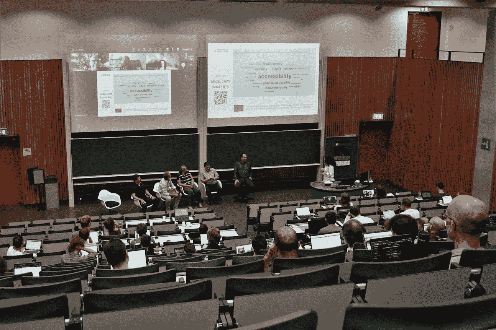
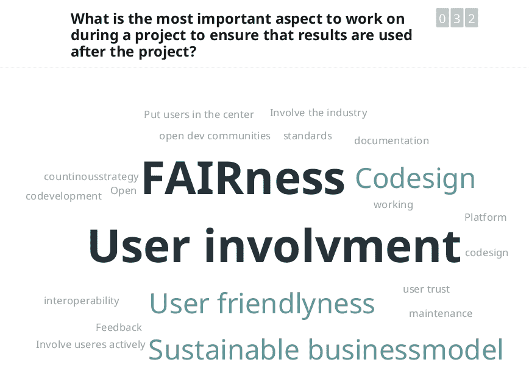
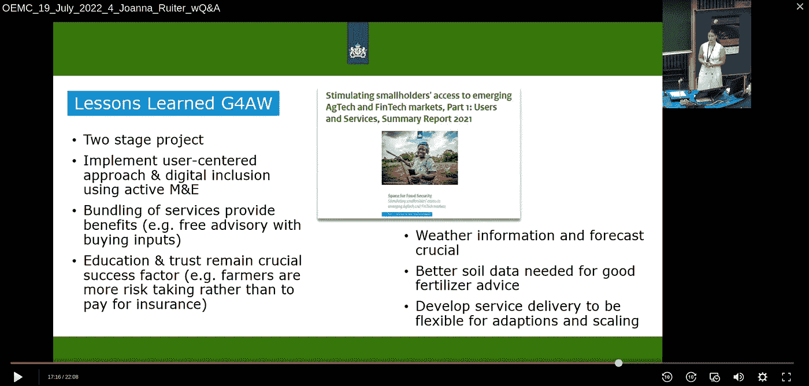
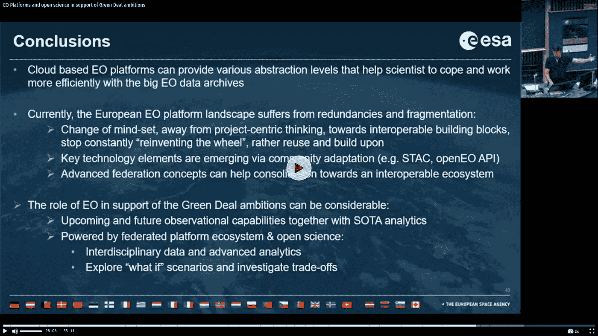
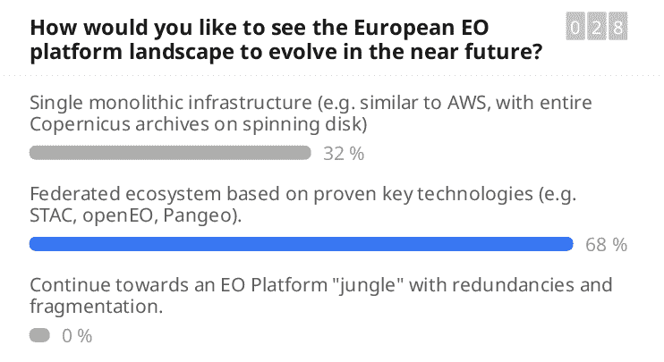
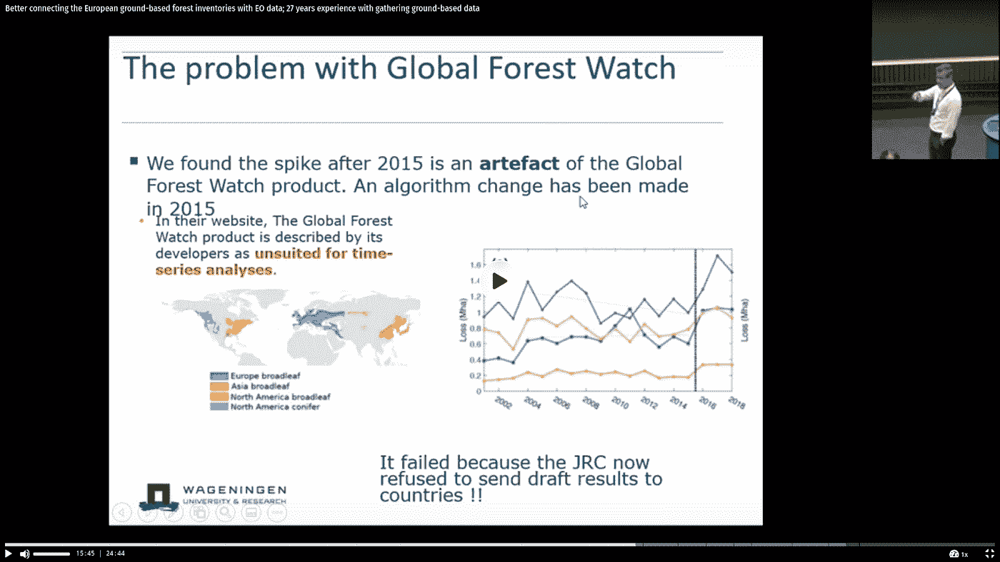
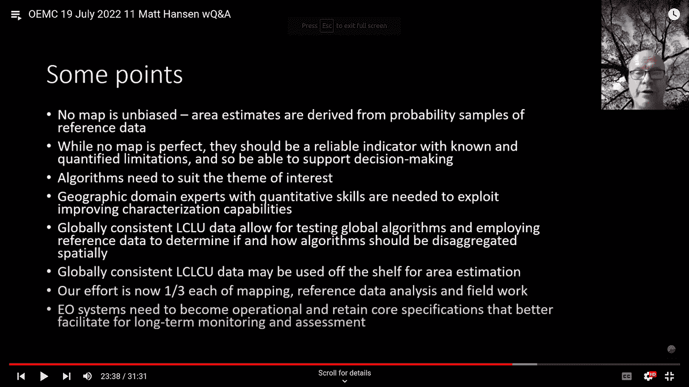
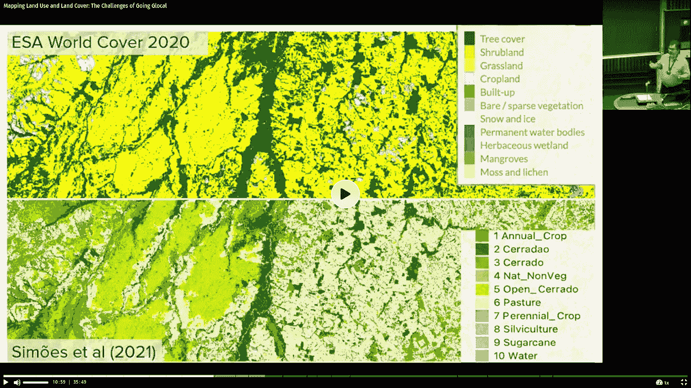
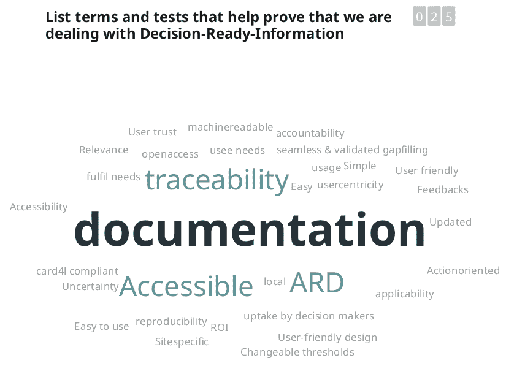

# 地球观测和机器学习作为跟踪绿色协议实施的关键技术:10 大要点

> 原文：<https://medium.com/nerd-for-tech/earth-observation-and-machine-learning-as-the-key-technologies-to-track-implementation-of-the-green-62ab22e9e1a8?source=collection_archive---------0----------------------->

*编写人:汤姆·亨格尔(OpenGeoHub)、卡森·罗斯(OpenGeoHub)和瓦伦蒂娜·德尔康特(OpenGeoHub)*

> 诸如[哥白尼欧洲](https://www.copernicus.eu/nl/over-copernicus)、[陆地卫星](https://landsat.gsfc.nasa.gov/)等最大的政府运营的地球观测任务的关键目标之一是提供参考科学信息，以便能够监测我们不断变化的跨境环境(以及可见光以外的环境！).基于 EO 的产品不仅对空间规划至关重要，而且对社会效益、税收和总体政治决策的经济计量评估也至关重要。我们邀请了一些主题演讲人，请他们分享他们对“地球观测(EO)和机器学习技术如何帮助实现绿色(新)交易以及什么可能是三赢局面”这一普遍问题的看法这里的三赢意味着:(1)环境数据用户(企业和组织)赢，(2)数据生产者赢，(3)社会赢。每一次谈话都有视频记录，可以在这里****。**这些是主要要点。**

# **监测气候变化的地球观测技术**

**近几十年来，世界经历了地球观测技术的快速发展，这使我们能够收集关于地球物理、化学和生物系统的大量信息。无论是陆地、海洋还是空中，EO 都是监测和评估自然和人工环境的状况和变化的最强有力的技术。尤其重要的是，它在极端天气事件或自然灾害期间快速评估情况，准确评估温室气体(GHG)排放方面发挥了作用，使得评价处在面对不可预测的气候变化时确保一致、长期的环境评估方面发挥了关键作用。**

**但这是有代价的:天基传感器和现场监测网络每天产生的大量数据需要转化为有意义的信息才能加以利用，而关键数据往往得不到充分利用，因为这需要高水平的技术专长和计算能力。许多企业家确实[还没有将 EO 图像和环境信息视为商品](https://mapscaping.com/podcast/the-problem-with-satellite-data-is-that-it-is-not-a-commodity/)，将环境信息纳入[经济评估](https://www.ft.com/content/0d0638da-9cf4-407d-aef1-28ce026772d4)被认为很不发达。[乔·莫瑞森](https://joemorrison.substack.com/p/nobody-wants-your-fancy-algorithm) : *“卫星图像行业仍然不知道客户真正想要什么”*。**

**[Wagemann 等人(2021)](https://www.tandfonline.com/doi/abs/10.1080/17538947.2021.1982031) 认识到查找、访问和互操作大地球数据面临以下五个关键挑战:(1)用户端处理能力有限，(2)数据量不断增长，(3)数据格式和传播工作流不标准化，(4)数据门户过多，(5)数据发现困难。因此，Wagemann 等人(2021 年)提出以下三种策略来解决这个问题:**

1.  ****将云服务瞄准中间用户**而不是政策制定者和决策者/避免过度设计具有高抽象级别的系统；**
2.  ****增加能力建设**以缩小云技术和应用方面的现有差距；**
3.  ****提供云认证机制**提高对云服务的整体信任度。**

**因此，尽管现在 EO 比以往任何时候都更能引起公众的兴趣，但要使这一技术易于获取和使用仍然存在障碍:*为什么 EO 技术和环境信息仍然只限于那些拥有高度发达的技术技能的人？使用哪个平台来生成和共享环境数据 Google Earth Engine 是我们处理 EO 数据所需的唯一云服务吗？我们如何建立监测系统来解释全球变暖对土地覆盖变化和极端天气(洪水、干旱等)的影响？)像谷歌地图或 AccuWeather 一样简单易用，一样受欢迎？***

****

**2022 年 7 月 19 日的论坛，有在线和现场参与者。**

**2022 年 7 月 19 日 [OpenGeoHub 基金会](https://opengeohub.org/)与瓦赫宁根大学共同组织了一场名为“*支持欧洲绿色协议*的创新治理、环境观测和数字解决方案”的公共研讨会。这是地平线-欧洲[开放地球监测项目](https://cordis.europa.eu/project/id/101059548)中一系列互动会议的第一次，旨在将来自商业、政策和学术界的地球观测和数据专家与实践社区聚集在一起，并与该项目开发的未来平台的潜在最终用户建立联系。**

****

**使用 Slido.com 生成的单词云示例。确保 Horizon Europe 项目可持续性的大多数投票要素似乎是:可再现性([公平科学](https://www.go-fair.org/fair-principles/))、用户参与、共同设计和可持续的商业模式。**

**每场会谈都有视频记录，可在此处**与讨论的主要内容一起获取。****

****为了收集观众的意见，我们使用了 Slido.com 的词汇云(见上文)和投票工具。****

****我们在这里重点介绍以下 10 个主要要点(主观选择，请随意突出自己的要点！)来自主题演讲，并在会议上进行了进一步讨论。****

# ****#1 跟踪环境投资的影响并不简单****

****对于荷兰航天局 (NSO)的 Joanna Ruiter 来说，由 NSO 和荷兰政府资助的项目的一个关键问题是，向各组织分配资金相对容易，但跟踪所花资金的效果相对困难，特别是在对地面的影响方面。****

********

****Joanna ruiter:2022 年以后的地球观测陆地数据与服务。支持欧洲绿色协议的创新治理、环境观测和数字解决方案——2022 年开放地球监测公共研讨会，OpenGeoHub 基金会，2022 年。[https://doi.org/10.5446/58278](https://doi.org/10.5446/58278)****

****Ruiter 总结了 NSO 的长期战略和最近的国家方案，特别关注农业和水的地理数据(G4AWEO 技术支持粮食安全和气候复原力)方案，该方案包括 15 个发展中国家的 25 个项目和创新。Joanna 在发言中强调，由于缺乏融资机制，在获得许多现有技术方面存在差距，而且新工具和 EO 信息必须伴有金融服务才能在低收入和中等收入国家产生影响。但她演讲中最重要的一点似乎是，缺少一个有效跟踪环境投资和相关影响的解决方案，即确保资金得到有效使用。****

# ****# 2 EO 数据预处理的重叠非常大(而且效率非常低)****

****[欧洲航天局的 Patrick Griffiths](https://it.linkedin.com/in/patrick-griffiths-30898194)在他的演讲*“支持绿色交易雄心的 EO 平台和开放科学”*中提到了 EO 领域的一些关键挑战，例如，影响科学家的数据管理负担，特别是在 EO 领域，他们花费 80–90%的时间“清理”数据。****

********

****Patrick，Griffiths:支持绿色交易雄心的 EO 平台和开放科学。支持欧洲绿色协议的创新治理、环境观测和数字解决方案——2022 年开放地球监测公共研讨会，OpenGeoHub 基金会，2022 年。[https://doi.org/10.5446/58301](https://doi.org/10.5446/58301)****

****科学界可以通过流程的简化和民主化、数据和技术的更多合作和共享以及减少平台的分散和冗余来解决这一负担；例如，一些项目正在开发新的解决方案:EuroData Cube(T8)、OpenEO 平台(T11)和 OpenEO API(T13)(施拉姆等人，2021)。但本质上，巨大的预算仍然花费在重叠的数据清理任务和重叠的功能上，这显然是低效的。****

# ****#3 欧洲 EO 平台饱受冗余和分散之苦****

****Patrick 还在他的演讲中总结道*“欧洲 EO 平台遭受冗余和碎片化之苦】*。在过去的十年中，欧盟委员会在 EO 和项目上投入了大量资金，以将 EO 技术引入实践，包括商业应用，但这也导致了高度冗余和许多太小的应用无法满足市场需求。根据 Patrick 的说法，如果我们*【停止重新发明轮子】*并专注于协作构建易于组合和分散的模块，会有什么更高的效率呢？这似乎也符合观众的反馈:****

********

****成熟开源技术的联合生态系统是欧洲未来 EO 的首选解决方案。****

# ****#4 实现土地退化中立要求在决策过程的每个阶段进行数据协同设计****

****[联合国防治荒漠化公约首席科学家 Barron Orr](https://www.unssc.org/about-unssc/speakers-and-collaborators/barron-joseph-orr) 介绍了在实现[土地退化中立](https://www.unccd.int/land-and-life/land-degradation-neutrality/overview)(LDN)[SDG 目标 nr 15.3](https://www.unccd.int/land-and-life/land-degradation-neutrality/overview) 背景下的数据和治理差距。126 个国家承诺(或至少目标是)阻止破坏性土地使用造成的快速土地退化，以确保粮食安全和健康的生态系统。****

****总的来说，EO、地理空间数据和衍生信息在监控 SDG 目标、规划、跟踪进展以及帮助国家和利益相关方做出有助于实现 SDG 的明智决策、计划和持续调整方面发挥着重要作用。****

********

****Barron Orr:实现土地退化中立背景下的数据和治理差距(可持续发展目标具体目标 15.3)。****

****[Orr 描述了](https://www.youtube.com/watch?v=PUTa7zzERfk&list=PLXUoTpMa_9s08pehTIe_MinrjhFJT4SXG&index=7)数据，尤其是开放数据，如何对实现 LDN 至关重要，因为它拓宽了我们对任何土地利用决策的潜在土地潜力的理解:因此，数据“*必须用于决策过程的每个阶段，在设计过程的开始阶段至关重要，而不仅仅是用于监测已经在进行的项目*”这位联合国科学家总结道。****

# ****#5 仅使用 EO 数据进行决策风险太大:高质量的地面数据有助于提高 EO，反之亦然****

****瓦赫宁根大学的 Gert-Jan Nabuurs 和 Research 讨论了更好地将[欧洲地面森林调查](https://forest.eea.europa.eu/)与 EO 数据联系起来的挑战和机遇。凭借他 27 年收集地面数据的经验，纳布尔回忆起自他职业生涯开始以来，我们的全球数据收集和共享能力是如何取得长足进步的(在他职业生涯开始时，*不得不打电话给政府机构，通过邮件索要软盘)*)****

****他演讲的关键要点是:使用 EO 数据进行森林调查和规划的决策风险太大了！Ceccherini 等人(2020 年)的例子说明了这一点，在该例子中，芬兰和瑞典检测到的突然采伐面积是由于陆地卫星任务的变化和[全球森林观察产品](https://www.globalforestwatch.org/)中的问题，而不是由于增加采伐。****

********

****Gert-Jan Nabuurs:更好地连接欧洲地面森林清单和 EO 数据；27 年收集地面数据的经验。支持欧洲绿色协议的创新治理、环境观测和数字解决方案——2022 年开放地球监测公共研讨会，OpenGeoHub 基金会，2022 年。[https://doi.org/10.5446/58267](https://doi.org/10.5446/58267)****

****总之，如 Breidenbach 等人(2022 年)以及 Ceccherini 等人(2022 年)所述，基于 EO 的监测项目应始终伴有严格的现场观测数据收集和适当的统计估计。****

****EO 的扩展将需要更多的参考表面数据。然而，许多障碍仍然阻止国家森林资源调查(NFI)数据和类似数据进入公众视线(尽管主要由公共资金资助)。Nabuurs 指出了一些有希望的新方法，如用于预测不同情景下森林资源的 [EFISCEN 模型](https://efi.int/knowledge/models/efiscen)，改进的陆地卫星算法，以及整个欧洲的开源数据政策，这些方法正在采取措施提高该领域的可靠性和透明度( [Nabuurs 等人，2022](https://doi.org/10.1038/s41558-022-01343-3) )。****

********

****全球土地覆盖和土地利用监测。支持欧洲绿色协议的创新治理、环境观测和数字解决方案——2022 年开放地球监测公共研讨会，OpenGeoHub 基金会，2022 年。****

****另一个主题发言人，【GLAD】[全球土地分析与发现【实验室】的联合主任](https://www.youtube.com/watch?v=E0AhLTTB674&list=PLXUoTpMa_9s08pehTIe_MinrjhFJT4SXG&index=12) [Matt Hansen](https://glad.umd.edu/team/matthew-hansen) 谈到了全球土地覆盖和土地利用监测，并同样强调了拥有高质量的地面数据以确保评估者的公正性是全球制图项目的首要关注。没有一张地图是不带偏见的，也没有一张地图是完美的:已知的和量化的限制应与制作的地图一起发布。****

# ****#6 公平信任数据原则有助于弥合数字鸿沟****

****[秘书处主任 Yana Gevorgyan](https://www.youtube.com/watch?v=esns4nrJPFE&list=PLXUoTpMa_9s08pehTIe_MinrjhFJT4SXG&index=9) 介绍了地球观测[小组](https://www.earthobservations.org/index.php) (GEO)，这是一个连接政府机构、学术和研究机构、数据提供商、企业、工程师、科学家和专家的全球网络，旨在基于开放式地球观测创建应对全球挑战的创新解决方案。****

****全球环境展望的首要任务是采取行动，通过促进和实施**公平信任保护**数据原则，降低个人和团体获取权威信息的障碍，特别是来自较少获取全球环境展望数据的国家的信息:****

*   ****[F.A.I.R.](https://www.go-fair.org/fair-principles/) :可查找、可访问、可互操作、可重用；(重新)使用数据的第一步是找到它们:元数据和数据对于人类和计算机都应该容易找到。一旦用户找到所需的数据，就必须知道如何访问这些数据，可能包括认证和授权。这些数据通常需要与其他数据集成在一起。此外，数据需要与应用程序或工作流进行互操作，以便进行分析、存储和处理。****
*   ****[T.R.U.S.T.](https://www.nature.com/articles/s41597-020-0486-7) :透明、责任、用户关注、可持续和技术；信任原则提供了一个共同的框架，以促进所有利益相关者讨论和实施数字保存的最佳做法。****
*   ****本地数据治理的'['关怀原则](https://www.gida-global.org/care)':集体利益、控制权、责任和道德；关爱原则以人为本，以目的为导向，反映了数据在推进自主创新和自决方面的重要作用。这些原则补充了现有的公平原则，鼓励开放和其他数据运动在宣传和追求中考虑人和目的。****

****这些一般原则在帮助弥合最发达国家和发展中国家之间的数字鸿沟方面发挥着重要作用。Gevorgyan 进一步讨论了 GEO 正在采取的一些行动，以将这些原则付诸行动，例如与[开放地球联盟](https://www.openearthalliance.org/)合作，通过使用开放技术解决方案来支持全球可持续发展(和理解)，以及支持向中低收入国家提供云技术信用的机构。****

# ****#7 名义上提供相同服务的全球和本地 EO 产品可能有很大不同****

****[巴西国家空间研究所前所长、地球观测组织秘书处前主任 Gilberto c amara](https://gilbertocamara.org/)探讨了绘制土地利用和土地覆盖图的挑战，强调必须有自洽的地图和术语的一致定义，如毁林，以创造既在全球值得信赖又与当地相关的产品。想想自然景观和人工景观之间微妙的视觉差异，比如热带草原和牧场。在 EO 产品中混合或遗漏这些类会完全改变它的可用性和适用性。****

********

****Câ mara，Gilberto:绘制土地使用和土地覆盖图:走向全球的挑战。支持欧洲绿色协议的创新治理、环境观测和数字解决方案——2022 年开放地球监测公共研讨会，OpenGeoHub 基金会，2022 年。[https://doi.org/10.5446/58268](https://doi.org/10.5446/58268)****

****Gilberto 举例说明了当各种最终用户在开发过程中没有通过他所称的*“自下而上的地图制作”*获得授权时，EO 工具如何无法对地方一级的决策者有用。卡马拉先生指出，基于 R 的 sits 库是一个商业上现成的云服务工具的例子，其核心是终端用户的可访问性。****

# ****#8 绘制土地覆盖和类似的一般类别将保持重要，即使我们今天也可以绘制详细的连续变量****

****在讨论期间，Patrick Griffiths 和 Tom Hengl 问 Gilberto，当我们现在也可以绘制各种连续变量(如 NDVI、FPAR、树种百分比、作物类型、冠层高度等)时，是否仍然需要土地覆盖图和类似的一般 EO 产品，这些变量基本上代表土地覆盖，但在数量尺度和多元空间中，因此更详细。Gilberto 认为，土地覆盖图将继续使用，因为我们需要对人们可以快速解释和联系的共同特征的简单解释:*“特别是政策制定者——他们需要一些他们可以联系的东西”*。****

****随着最近新的全球 10 米空间分辨率土地覆盖产品的出现(例如 [Venter 等人，2022](https://doi.org/10.3390/rs14164101) )，我们毫不怀疑土地覆盖制图仍将是一个充满活力的研究领域。****

# ****#9 总是有一种创造性的方法来确保获得基本的环境基础数据，然后可以帮助扩展研究****

****在 Gert-Jan Nabuurs 的[演讲中，我们特别关注了访问(至少出于数据挖掘的目的)例如 NFI 森林资源清查数据的问题，这些数据目前由国家组织保密，因此大多数研究机构无法获得。但是有很多创造性的方法来获取这些数据。与会者提到了建立信任等策略——签署合作协议或提供对双方都有利的联合产品。另一种选择是向政府施压，要求所有公共资助的数据最终都要公开，并且提供公平的数据集应该成为出版甚至工作推广的一项要求。](https://doi.org/10.5446/58267)****

****例如，在最近由 [Sabatini 等人(2022)](https://doi.org/10.1038/s41467-022-32063-z) 发表的论文中，作者使用 [sPlot 数据库](https://www.idiv.de/en/splot.html)制作了维管植物α多样性的地图。这些数据只有在向 sPlot 指导委员会提交项目提案的情况下才能获得，因此原则上不能复制或扩展这些结果。不去探究这些数据不公开的原因(这通常不由作者决定)，这只是许多高质量环境数据被禁止和研究结果不公平的例子之一。****

# ****#10 EO 行业需要客户日常使用的应用程序来采取行动和解决问题****

****回到本文开头的话题，在他的一篇博客中， [Joe Morrison](https://joemorrison.substack.com/p/nobody-wants-your-fancy-algorithm) (这位有争议的行业人物)质疑许多现代 EO 业务的可持续性:*“许多新的分析初创公司正在追求一种危险的诱人战略，即建立一种新型数据集，然后闭上眼睛，希望客户会神奇地出现并开始购买它”*。成功的企业应该代之以*“构建客户用来采取行动和解决问题的应用程序。如果你每天都在使用一个应用程序，你不介意为它支付订阅费。同样，我们在工作中也认识到，基于 EO 的服务需要(尽可能)提供决策就绪、相关且易于使用的信息。正如许多现代民主数字系统一样，**可用性**和**使用**(网络流量)将是我们成功的最终评判标准。*****

********

****与决策就绪信息联系最紧密的术语云。****

# ****开放式地球监测项目****

****为了支持欧洲绿色协议的民主和有效实施(并避免深刻的地缘政治动荡和气候变化带来的不确定性)，OpenGeoHub 与 21 个合作伙伴一起启动了一个由欧盟委员会资助的名为[“开放地球监测器”](https://earthmonitor.org/)的雄心勃勃的新欧洲地平线项目，旨在解决获取和有效使用环境数据(地面观测和测量以及 EO 数据)的瓶颈。****

****该项目的主要目的是直接支持欧洲和全球可持续发展框架，如雄心勃勃的****[**euro geo**](https://research-and-innovation.ec.europa.eu/knowledge-publications-tools-and-data/knowledge-centres-and-data-portals/eurogeo_en)(地球观测组织的欧洲部分)以及总体上的[**【SDGs】**](https://sdgs.un.org/goals)，方法是制作和整合一系列开源、基于数据和********

****简而言之，在未来 4 年内，该联盟将:(1)构建一个基于云的开源 EO 计算引擎，将地球观测与试点案例的实地数据相结合，(2)发布公平的数据门户，将现有和新的欧洲数据与全球数据无缝集成，(3)同时让最终用户、决策者、土地所有者、中小企业和学术界参与工具和测试应用的整个设计流程。最终，开放地球监测网络基础设施项目生成的工具旨在通过生成测试用例，为现实世界的目标和倡议做出贡献。****

****Open-Earth-Monitor 网络基础设施项目已经根据第 101059548 号拨款协议获得了欧盟地平线欧洲研究与创新计划的资助。****

****请引用为:****

> ****t .亨格尔、c .罗斯和 v .德尔康特(2022)。地球观测和机器学习作为跟踪绿色协议执行情况的关键技术:10 大要点。OpenGeoHub 基金会，[https://doi.org/10.5281/zenodo.7118980](https://doi.org/10.5281/zenodo.7118980)****

# ****引用的参考文献:****

1.  ****Breidenbach，j .，Ellison，d .，Petersson，h .，Korhonen，K. T .，Henttonen，H. M .，Wallerman，j .，…& n sset，E. (2022)。收获面积没有突然增加——基于卫星的测绘技术的进步如何导致错误的结论。森林科学年鉴，79(1)，1–9。[https://doi.org/10.1186/s13595-022-01120-4](https://doi.org/10.1186/s13595-022-01120-4)****
2.  ****塞切里尼、杜维勒、格拉西、莱莫因、阿维塔比尔、皮利、塞斯凯蒂(2020)。2015 年后欧洲森林采伐面积突然增加。自然 583(7814):72–77。[https://doi.org/10.1038/s41586-020-2438-y](https://doi.org/10.1038/s41586-020-2438-y)****
3.  ****塞切里尼、杜维勒、格拉西、莱莫因、阿维塔比尔、皮利和塞斯凯蒂(2022)。NFIs 和遥感在收获率评估中的潜力和局限性:对 Breidenbach 等人的答复。【https://doi.org/10.1186/s13595-022-01150-y 号****
4.  ****Nabuurs，G. J .，Harris，n .，Sheil，d .，Palahi，m .，Chirici，g .，Boissière，m .，… & Valbuena，R. (2022)。格拉斯哥森林宣言需要新的数据所有权模式。自然气候变化，12(5)，415–417。【https://doi.org/10.1038/s41558-022-01343-3 ****
5.  ****Sabatini，F. M .，Jiménez-Alfaro，b .，Jandt，u .，Chytr，m .，Field，r .，Kessler，m .，和 Bruelheide，H. (2022)。维管植物阿尔法多样性的全球模式。自然通讯，13(1)，4683。[https://doi.org/10.1038/s41467-022-32063-z](https://doi.org/10.1038/s41467-022-32063-z)****
6.  ****m .施拉姆、e .佩贝什马、m .米伦科维奇、l .弗雷斯塔、Dries、j .、Jacob、a .、……和 Reiche、J. (2021 年)。openeo API——使用虚拟数据立方体功能协调地球观测云服务的使用。遥感，13(6)，1125。[https://doi.org/10.3390/rs13061125](https://doi.org/10.3390/rs13061125)****
7.  ****西莫埃斯、卡马拉、奎罗斯、苏扎、安德拉德、桑多斯和费雷拉(2021 年)。大地球观测数据的卫星图像时间序列分析。遥感，13(13)，2428。[https://doi.org/10.3390/rs13132428](https://doi.org/10.3390/rs13132428)****
8.  ****文特尔、Z. S .、巴顿、D. N .、查克拉博蒂、t .西蒙森和辛格(2022)。全球 10 m 土地利用土地覆盖数据集:Dynamic World、World Cover 和 Esri 土地覆盖的比较。遥感，14(16)，4101。[https://doi.org/10.3390/rs14164101](https://doi.org/10.3390/rs14164101)****
9.  ****Wagemann，j .，Siemen，s .，Seeger，b .，& Bendix，J. (2021)。开放大地球数据的用户——现状分析。计算机与地球科学，157，104916。[https://doi.org/10.1016/j.cageo.2021.104916](https://doi.org/10.1016/j.cageo.2021.104916)****