# 使用 SageMaker 进行机器学习

> 原文：<https://medium.com/nerd-for-tech/ease-into-ml-with-aws-sagemaker-a74591cae19e?source=collection_archive---------6----------------------->

"创建和部署 ML 模型是一项繁琐的工作."—我最近进入数据科学领域的朋友阿努兰说。作为 AWS 平台上的云开发人员，我主动承担起帮助他的责任。这篇文章是关于如何使用 SageMaker 创建和部署 ML 模型的。

在我们开始之前，先简单介绍一下 SageMaker 是什么。 [**SageMaker**](https://aws.amazon.com/sagemaker/) **是一个托管的 ML 平台，允许您轻松地构建和部署模型。**一切由 AWS 打理。它提供了一个很好的 GUI 来端到端地管理工作流，从培训、模型创建&部署。如果即插即用是你做事的方式，那么 Sagemaker 也支持它。您也可以独立运行这些组件。

我们将在控制台中开始探索，每个术语将在必要时解释。下面是 SageMaker 的控制台。点击开始。

**托管 Jupyter 笔记本**

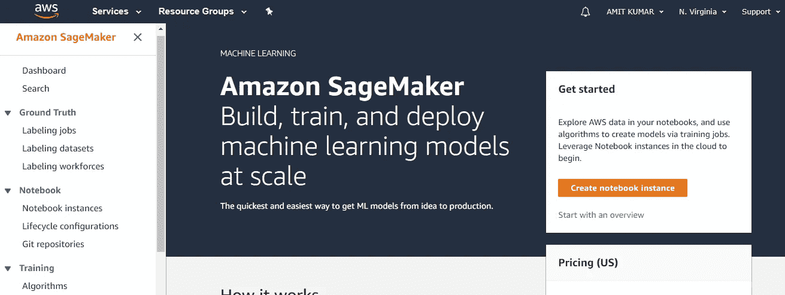

这将把我们带到笔记本实例页面。点击创建笔记本实例。将显示以下屏幕。在我们开始谈论笔记本实例的含义之前。基本上，我们在这里做的是启动一个 EC2(服务器),它将安装 Jupyter 笔记本应用程序及其依赖项(Python Anaconda 等)。我们来输入细节。

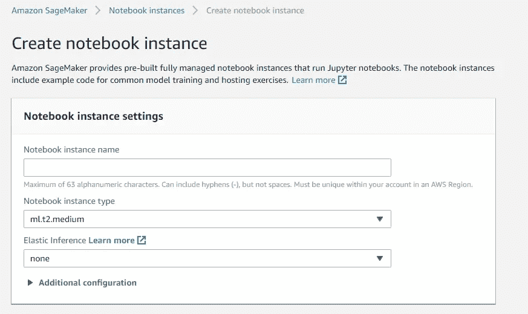

> *笔记本实例名称:用于识别您的笔记本的用户友好名称。笔记本电脑实例类型:这决定了内存，CPU 和服务器规格。*
> 
> *弹性推理:这是一个额外的 GPU 实例，可以在笔记本中创建模型时测试和评估模型的推理性能。我们不是在这里选择一个。*

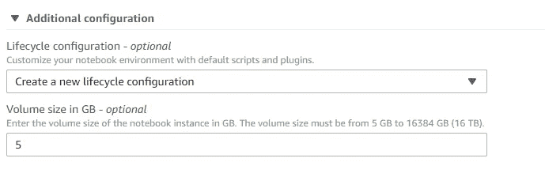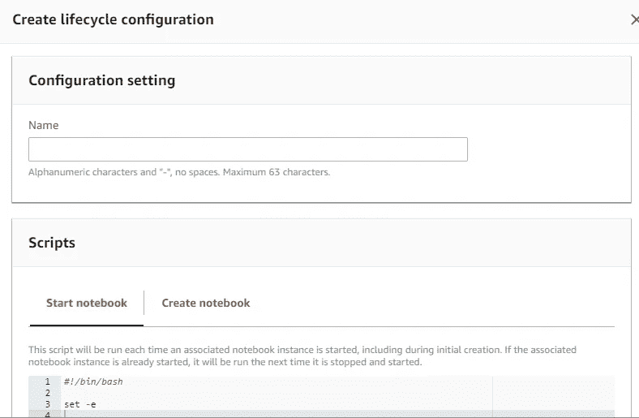

生命周期配置允许我们在创建或启动笔记本实例时运行某些脚本。这一点我们将留空。

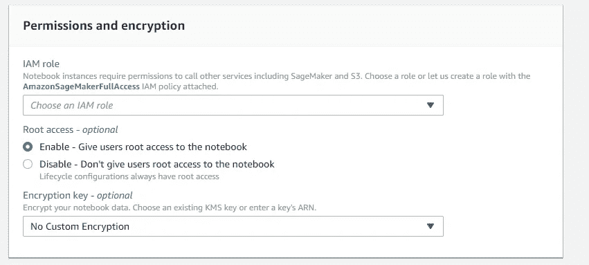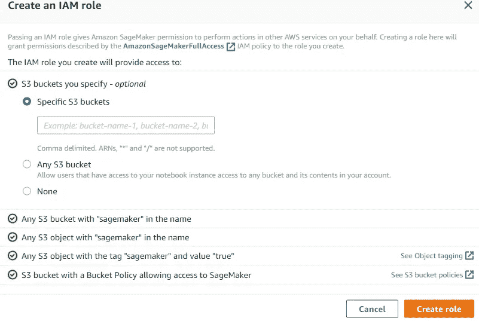

在“Permission”选项卡中，我们将选择创建一个新角色，该角色允许 EC2 上的笔记本应用程序访问 S3 存储桶，在那里它将获得培训测试和验证数据。此外，这个桶将用于存储模型。

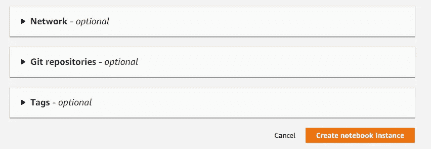

这些设置都是可选的，我们将使用默认值。点击创建笔记本实例。

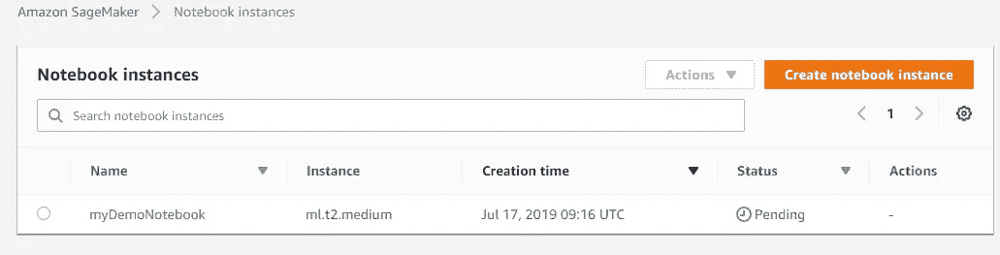

这将开始创建笔记本应用程序。一旦完成，我们将能够看到下面的屏幕。

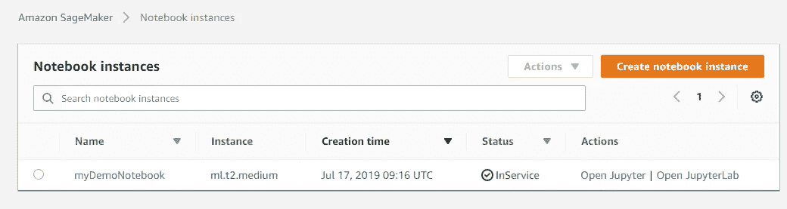

所以 SageMaker 给了我们一个完全配置/定制的 Jupyter 笔记本

这里我们看到了选项。“打开 Jupyter |打开 JupyterLab”。JupyterLab 是面向笔记本应用的下一代基于网络的用户界面。

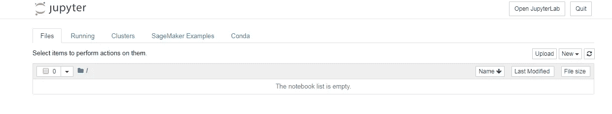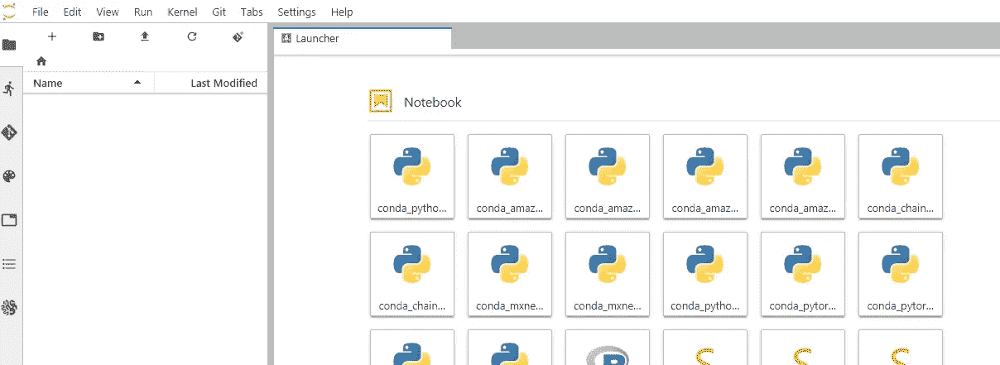

我们将使用 Jupyter 笔记本。在控制台上，我们可以看到 Conda 选项卡下的环境。这是我们可以看到已安装以及可用的软件包的地方。

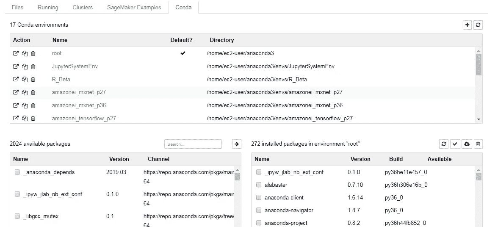

在 SageMaker 选项卡下，我们有 AWS 提供的示例笔记本。在演示中，我们将使用这些。

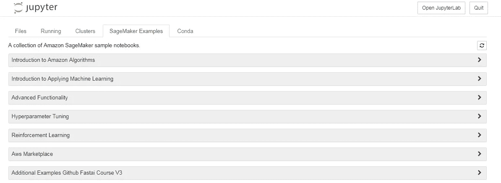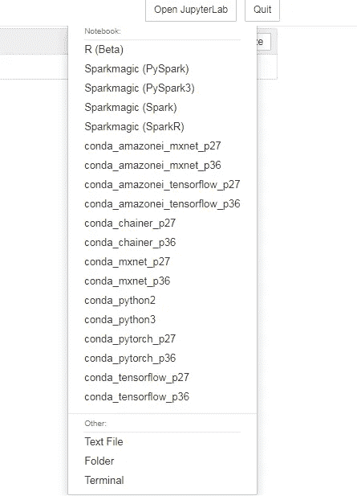

这也为我们提供了查看终端的选项。让登录到它并检查。

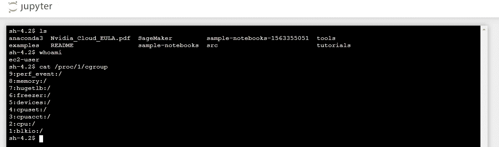

上述终端快照的输出表明笔记本应用程序正在 EC2 上运行，用户是 ec2-user。此外，我们可以看到所有的文件和样本算法文件夹。

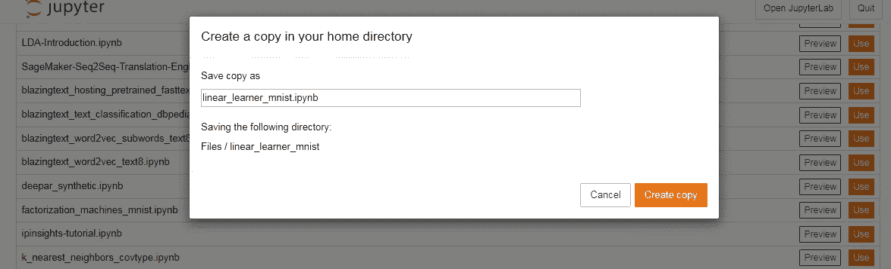

让我们选择一种算法。我选择了 **linear_learner_mnist** 。

**分布式培训岗位**

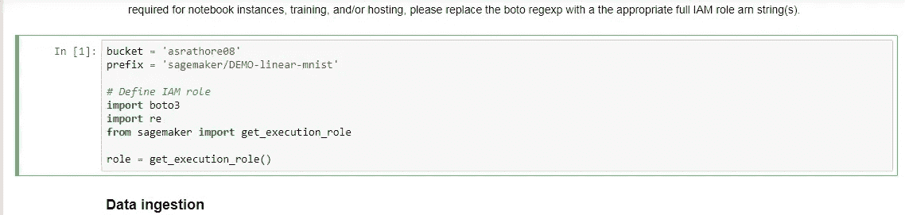

在 bucket 变量中，我提到了我的一个 bucket。

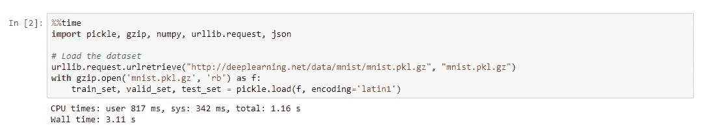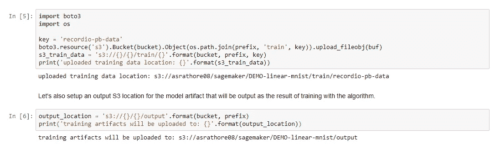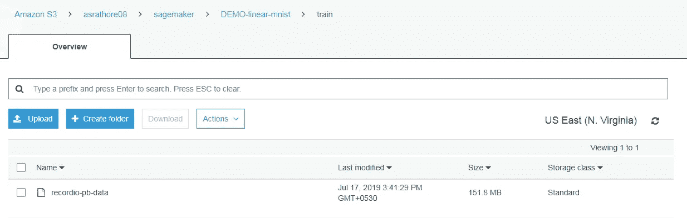

以上所有代码都使用了 boto3，它是 python 的 AWS 客户端。这里，我们将数据分为训练集、验证集和测试集。我的 S3 桶里也有同样的东西。这些将被下载到培训实例中。如果你不想承担与此下载相关的费用，你可以以 recordio-protobuf 格式存储数据，它将从 S3 流式传输。这称为管道模式。

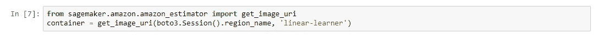

AWS 将预先构建的线性回归、逻辑回归、主成分分析、文本分类、对象检测等流行算法作为 docker 图像存储在 **ECR** 中。这些算法的方法和工程不同于开源版本。AWS 团队已经调整了算法，以利用分布式训练和 GPU 加速。由于调整，这些算法在性能方面比基本算法好 10 倍。AWS 还让我们可以选择自带算法。我们需要创建算法的容器映像，并将其推送到 ECR。如需列表，请访问[此处](https://docs.aws.amazon.com/sagemaker/latest/dg/sagemaker-algo-docker-registry-paths.html)。

在这里，我们找到了包含线性学习者代码的容器。其输出类似于`*<ecr_path>*`/线性学习者:`*<tag>.*`

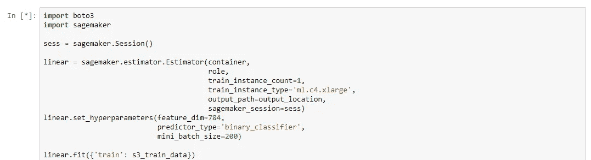

一旦我们有了容器，它就作为一个参数传递给 SageMaker 的估计器方法。这将创建一个**作业**，该作业又将创建一个模型并将其存储在 S3。

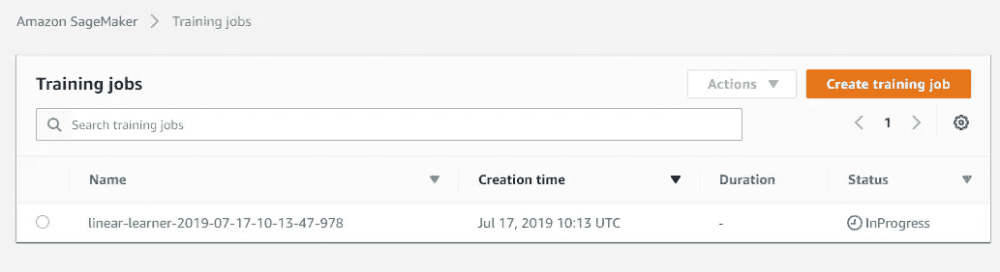

上面的图像是工作的。我们点击它，可以看到 CloudWatch 日志，看看幕后发生了什么。

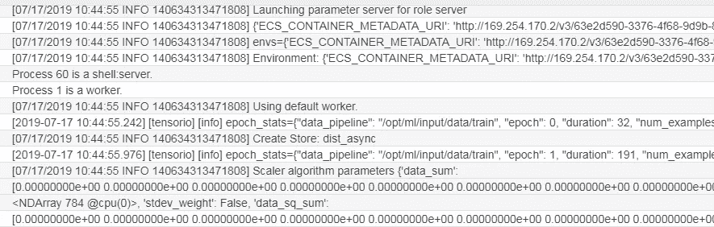

从控制台上，我们看到 amazon 启动了 **ECS** 集群，并在其上启动了容器来创建模型。

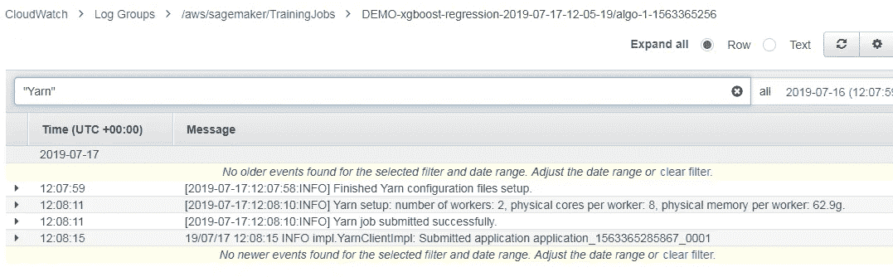

实际上，在不同的算法 xgboost _ 鲍鱼中，它创建了一个 Hadoop 集群，并使用 **YARN** 在多个实例之间分配模型创建任务。

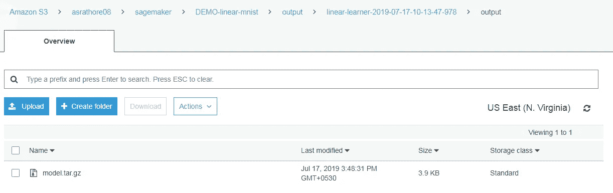

一旦作业完成，我们可以看到模型生成并存储在 S3 存储桶中。在 SageMaker 控制台中也可以看到同样的情况。见下文。

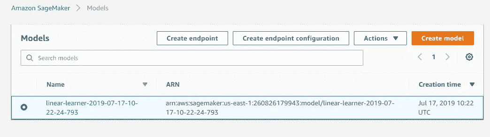

如果我们愿意，我们可以**下载/导出**这个模型，并在 AWS 之外使用它。或者，我们可以将在其他地方构建的模型上传到 S3，并根据该模型创建一个新的端点。

现在我们有了可以部署它的模型。下面是部署的命令。

**模型部署(** [**端点**](/@asrathore08/hosting-models-with-sagemaker-4f13fd7798fa) **)**

一旦我们准备好模型，我们就可以部署它了。为此，我们可以选择 AWS ECR 并使用创建的映像，这使我们能够更好地控制部署。我们可以直接使用 AWS 管理的端点。

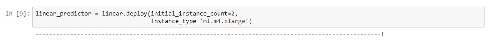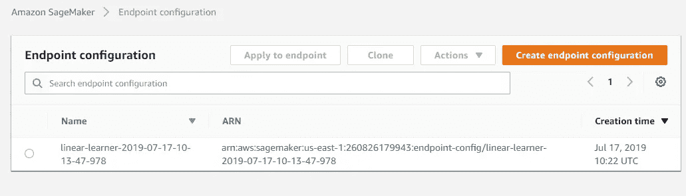

也可以从控制台创建相同的端点配置。

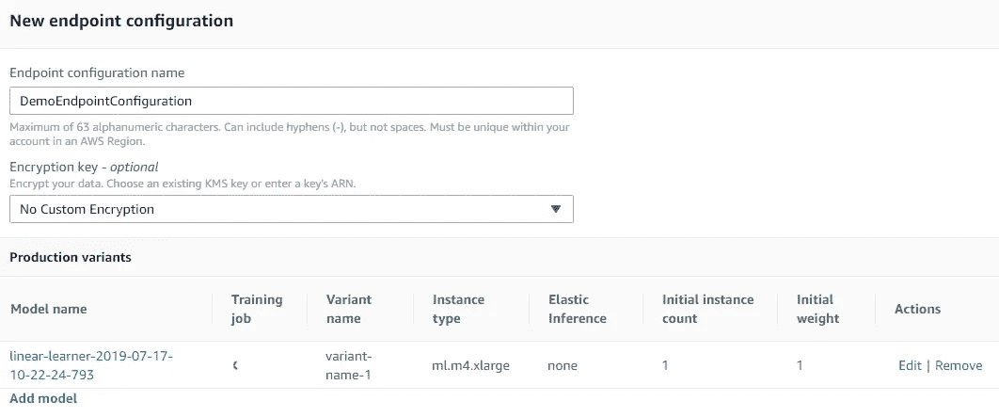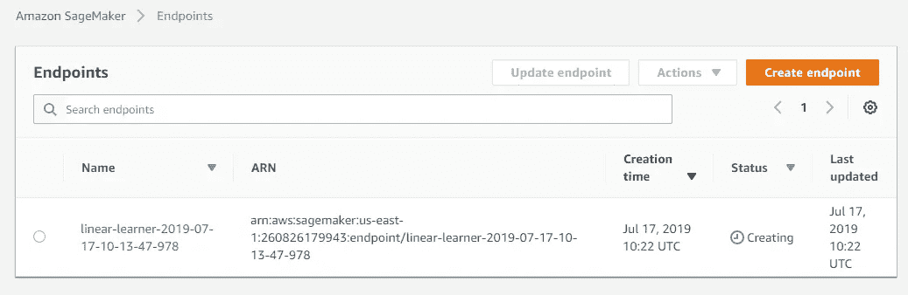

也可以在控制台中创建相同的端点。

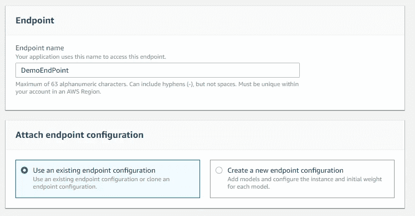

一旦命令成功，AWS 将创建一个端点配置，并从同一配置创建一个端点。

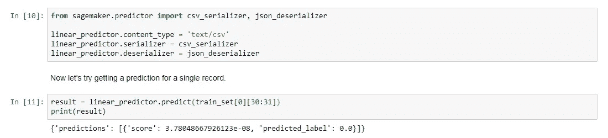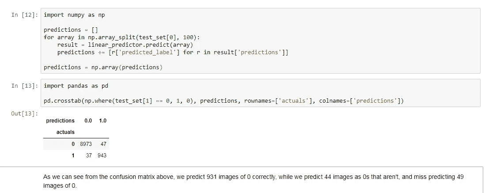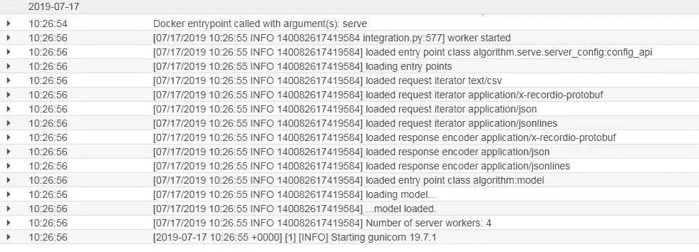

最后，我们通过用测试和批处理数据调用端点来验证它。我们看到它如何创建应用程序的四个实例(参见日志，它的工作线程数为 4)并返回结果。下图解释了整个过程(技术上的)。

希望这有帮助。