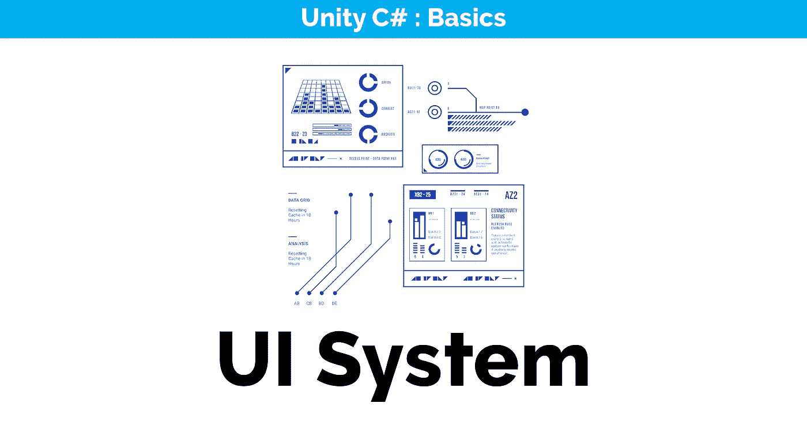
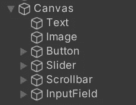
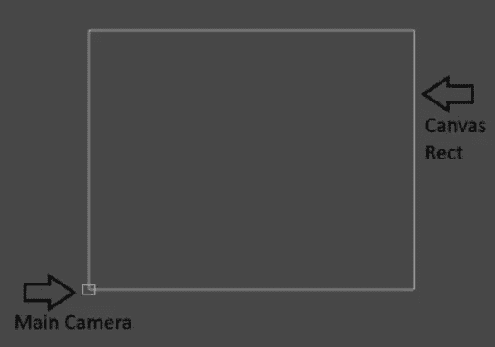
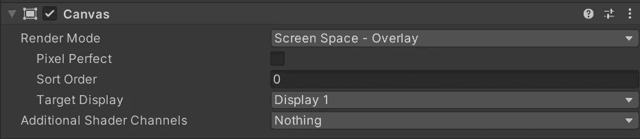
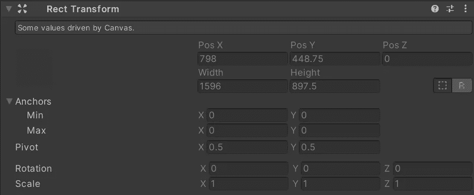
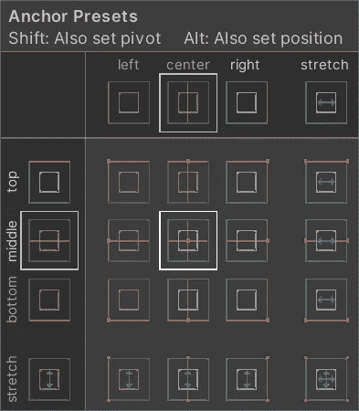

# 在 Unity 中构建 UI 元素的简易性

> 原文：<https://medium.com/nerd-for-tech/ease-of-building-ui-elements-in-unity-1466a2868623?source=collection_archive---------5----------------------->

Unity 用户界面(简称 UI)提供了一个为游戏和应用程序开发用户界面的工具包。该系统允许您控制 UI 元素，如文本、图像、按钮和其他将为用户添加功能的用户控件。与标准的游戏对象不同，UI 元素并不直接放置在场景本身中，而是显示在与摄像机视图重叠的“2D 区域”上。

> 基于游戏对象的系统，使用组件和游戏视图来安排、定位和设计用户界面。

## 帆布

> **画布**是所有 UI 元素都应该在里面的区域。画布是一个游戏对象，上面有一个画布组件，所有 UI 元素都必须是这样一个画布的子元素。

画布区域在场景视图中显示为矩形。这使得定位 UI 元素变得容易，而不需要游戏视图一直可见。它使用 EventSystem 对象来帮助消息传递系统。默认情况下，你将不能修改画布区域的形状，它将是一个相对**巨大的**矩形围绕着你的场景。

## **绘制 UI 元素的顺序**

画布中 UI 元素的绘制顺序与它们在层次结构中出现的顺序相同。首先绘制第一个孩子，然后是第二个孩子，依此类推。如果两个 UI 元素重叠，后一个将出现在前一个之上。该顺序也可以通过脚本控制。

## 渲染模式

画布允许我们设置渲染模式，这将改变 UI 的显示方式。有三种类型；

*   屏幕空间覆盖
    这种渲染模式将 UI 元素放置在屏幕上，渲染在场景的顶部。如果调整了屏幕大小或更改了分辨率，画布将自动改变大小以与之匹配。
*   **屏幕空间-摄像机**
    类似于*屏幕空间-覆盖*，但是在这种渲染模式下，画布被放置在指定*摄像机*前面的给定距离处。UI 元素由该相机呈现，影响 UI 的外观。
*   **世界空间**
    主要用于作为游戏世界一部分的 UI 元素。UI 元素将根据 3D 位置呈现在场景中其他对象的前面或后面，并表现为场景中的任何其他对象。

## 放置 UI 元素

出于布局的目的，每个 UI 元素都被表示为一个矩形，可以使用 **Rect 工具**在场景视图中移动、调整大小和旋转。

**Rect Transform** 类似于一个常规的 Transform 组件，它存储它的位置、旋转和缩放，但是除此之外它还存储一个宽度和高度，用来指定矩形的尺寸。它们还利用**枢轴**和**空间**，影响元素定向的结果。

**调整大小 vs 缩放** 在 2D 和 3D 模式下，当使用矩形工具改变对象的大小时，它将改变对象的**局部比例**。然而，当它用在一个有矩形变换的对象上时，它会改变宽度和高度，保持局部比例**不变**。

**锚点**
锚点是画布中其他实体可以“锁定”的点。这意味着如果一个 UI 元素(例如一个图像)被锚定到画布上，调整画布的大小将确保图像总是相对于画布上的指定位置**定向。**

您可以用各种方式锚定元素，并对其进行预设，有关锚定的更多信息，您可以点击[此处](http://docs.unity3d.com/Packages/com.unity.ugui@1.0/manual/UIBasicLayout.html)。

## 成分

UI 元素通常由*可视化*和*交互*功能组件组合而成，另外支持*动画集成*，增加*自动布局*和*富文本*。这是对 Unity UI 系统的一个介绍，随着我们在这个开发日记中的进展，我们将检查每个单独的组件。下面你可以找到一个快速概述。

**可视化组件** 帮助你创建 GUI 特定功能的基本组件，用户界面的构建模块。

*   文本
*   图像
*   原始图像
*   面具
*   效果

**交互组件** 交互组件处理用户交互，如鼠标或触摸事件，与键盘或控制器的交互。这些组件本身是不可见的，需要与可视组件结合才能正常工作。

*   通用功能
    大多数交互组件都有一些共同点。它们是*可选项*，具有共享的内置功能，用于*可视化* *在状态*(正常、高亮、按下、禁用)之间的转换，以及用于*使用键盘或控制器导航到其他可选项*。交互组件至少有一个在用户与组件交互时调用的 **UnityEvent** 。
*   纽扣
*   触发器
*   切换组
*   滑块
*   卷动条
*   下拉式
*   输入栏
*   滚动视图(滚动矩形)

有关每个组件的更多信息，您可以访问 [Unity 文档](http://docs.unity3d.com/Packages/com.unity.ugui@1.0/manual/index.html)。

← [上一张](https://gert-coppens.medium.com/using-a-boolean-logical-operator-20c8ea225b05) | [下一张](https://gert-coppens.medium.com/creating-ui-elements-6e8a16791d93) →