# 在 Unity 中构建 UI 元素的简易性

> 原文：<https://medium.com/nerd-for-tech/ease-of-building-ui-elements-in-unity-b32e72c318e2?source=collection_archive---------35----------------------->

现在我们已经有了游戏的结构，是时候为游戏创建一些 UI 了。有了 Unity，非常直观易用。首先，我们只需点击我们的层级系统并选择 UI:

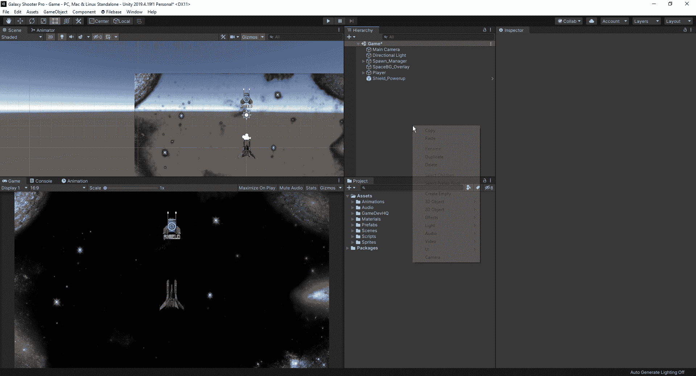

创建文本用户界面

正如我们所看到的，它在我们的层次结构中创建了两个新对象。第一个是画布，是场景视图中的白色屏幕，它是组成用户界面的一切。

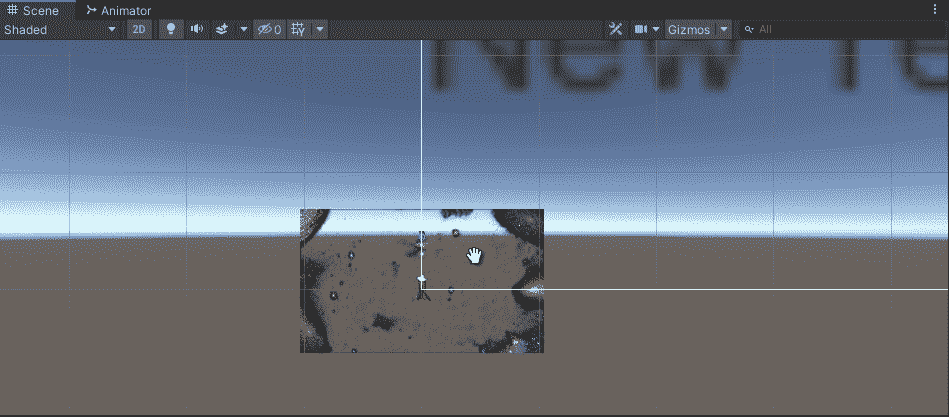

画布区域

创建的第二个项目是偶数系统。它让我们悬停在事物上，并与我们的用户界面进行交互。首先，让我们改变文字的颜色，使其在游戏中更加醒目。因为我们有一个黑暗的背景，让我们现在设置我们的文本为白色。

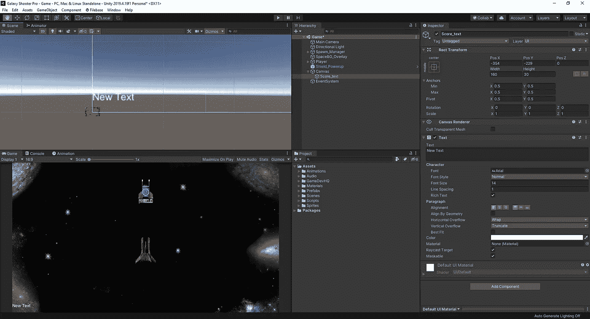

左下方的文本为白色

接下来，我们将把我们的文本移动到右上角。=如果我们只是移动它，文本不会停留在那个位置，所以我们可以使用 rect 变换将它固定在右上角，只需稍微调整它的位置，使它适合我们想要的位置。

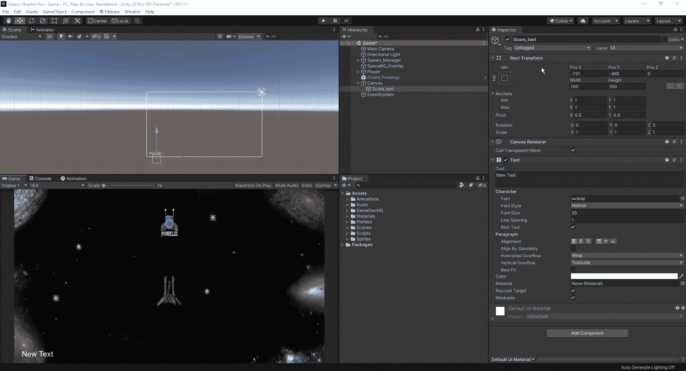

现在的问题是，如果我们有一个不同的游戏屏幕尺寸，它将不会像我们预期的那样。要解决这个问题，我们只需单击画布，转到画布缩放器组件，然后选择随屏幕大小缩放:

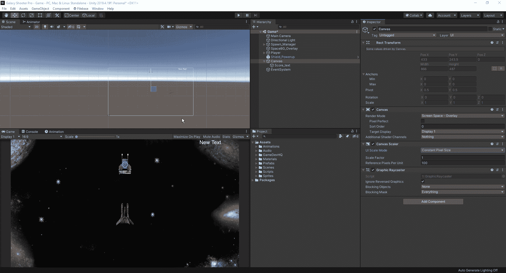

现在我们已经把文本固定在适当的位置，是时候让我们的脚本制作好了，这样无论何时我们杀死一个敌人，我们都在增加我们的分数。首先，让我们创建一个 UI 管理器脚本并将其附加到画布上。如果您愿意，您还可以创建一个空对象，将其标记为 UI manager，并以这种方式附加脚本。

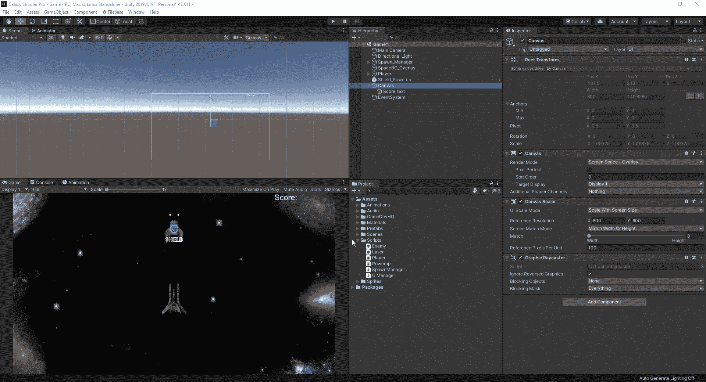

我们需要做的第一件事是创建一个链接到我们的文本，这样我们就有一些链接来更新我们的分数，因为我们杀死敌人。

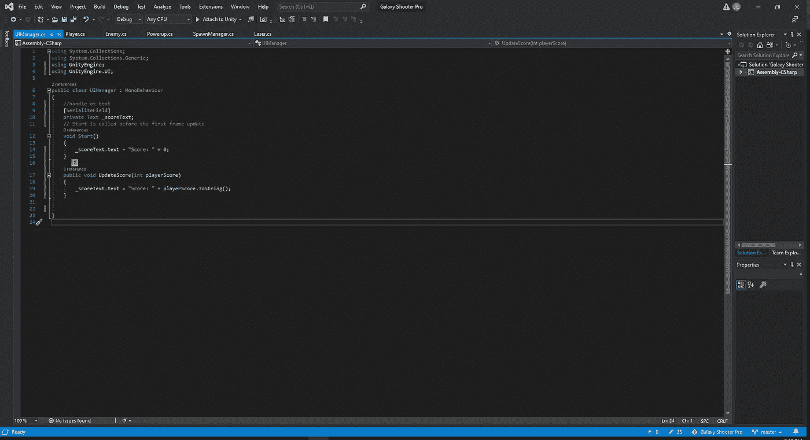

一旦我们在 void start 下输入 our _scoretext.text，我们就可以移动到我们的播放器并创建一个记录它的方法。因此，我们需要为我们的分数构建一个私有 int，并连接到我们的 UIManager。

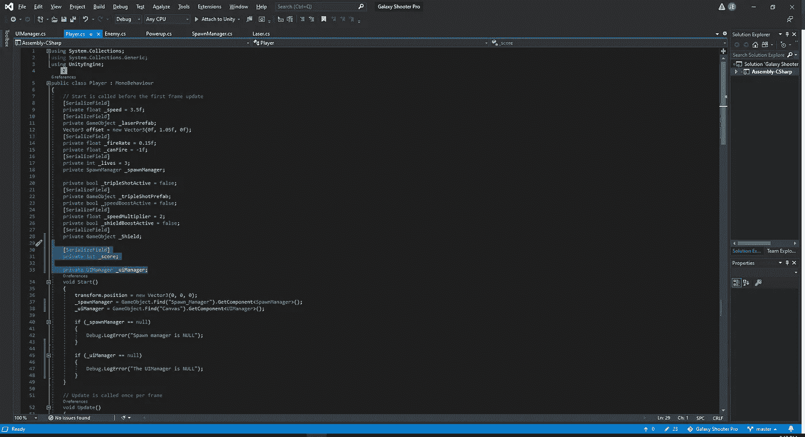

从这里，我们可以在玩家脚本的底部创建一个新的空白。

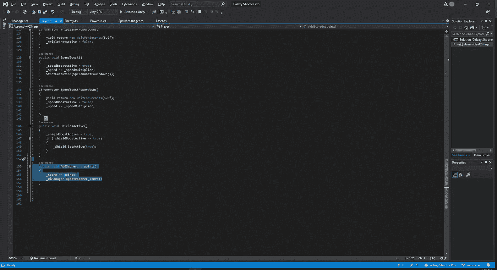

这样，我们就告诉 Unity 我们想要增加我们的分数并连接到我们的 UI 管理器。至于我们从哪里得到分数，我们会去看看我们的敌人剧本，并在那里做一些改动。

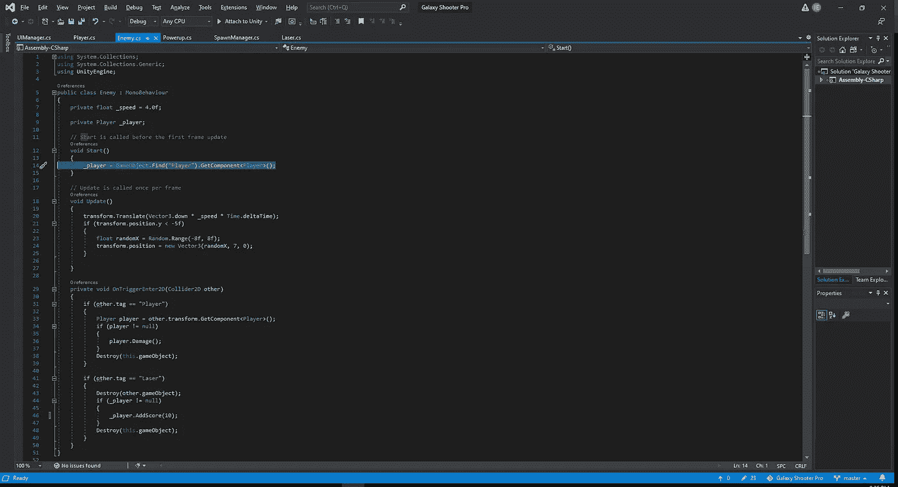

首先，我们想在开始时创建一个与 _player 的连接，这样我们就可以不断地让我们的敌人出现，并对我们的玩家脚本产生影响。然后，我们就加 _player。将分数(10)添加到脚本的 OnTrigger 部分的“从激光中销毁”部分。我们在()中放置的值完全取决于您希望积分系统如何工作。最后，我们回到 UIManager 脚本，完成播放器和 UIManager 之间的连接。

现在我们已经设置好了所有这些，我们将在我们的游戏中测试它，看看它是否正常工作，以及是否有我们需要做的任何调整。

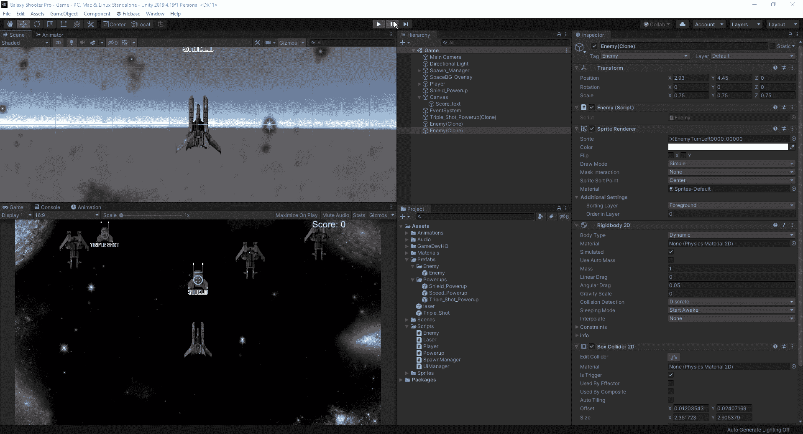

现在我们有了一个有效的评分系统，让我们添加一个生命计数器，这样我们就知道在游戏结束前我们还有多少命中。首先，我们必须在画布上创建一个空白图像组件:

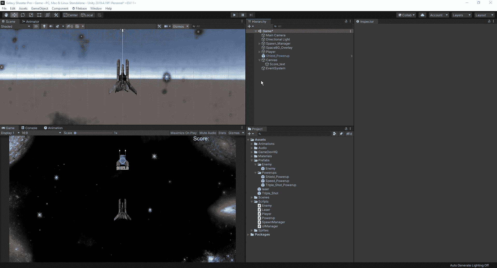

从这里，我们将锚定它到我们的左上角，然后在检查器中，我们将检查保留方面，使它看起来不那么伸展。

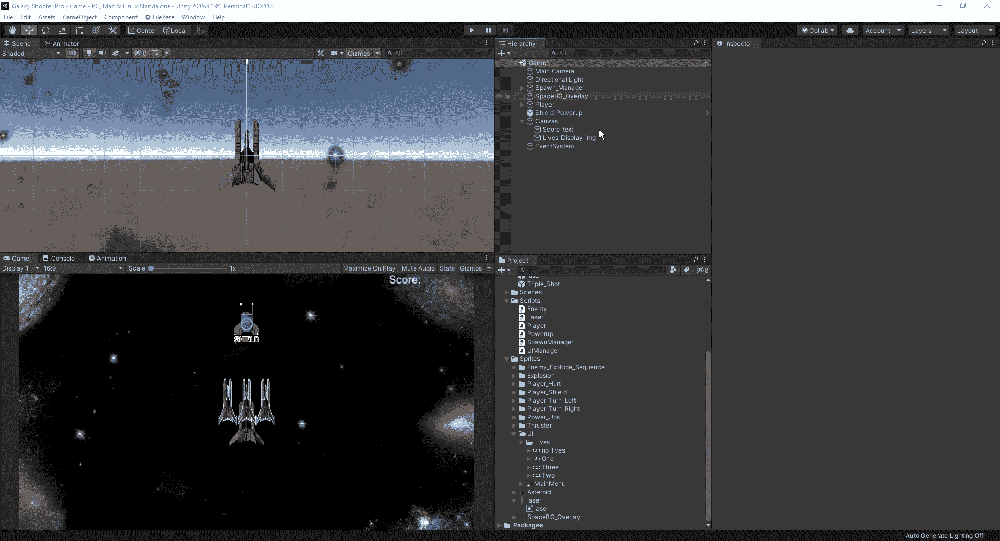

现在我们有了这个设置，我们必须想出如何得到它，这样我们的计数器在每次受到伤害时都会改变。现在，我们可以转到我们的脚本，为我们不同的生活创建一个数组

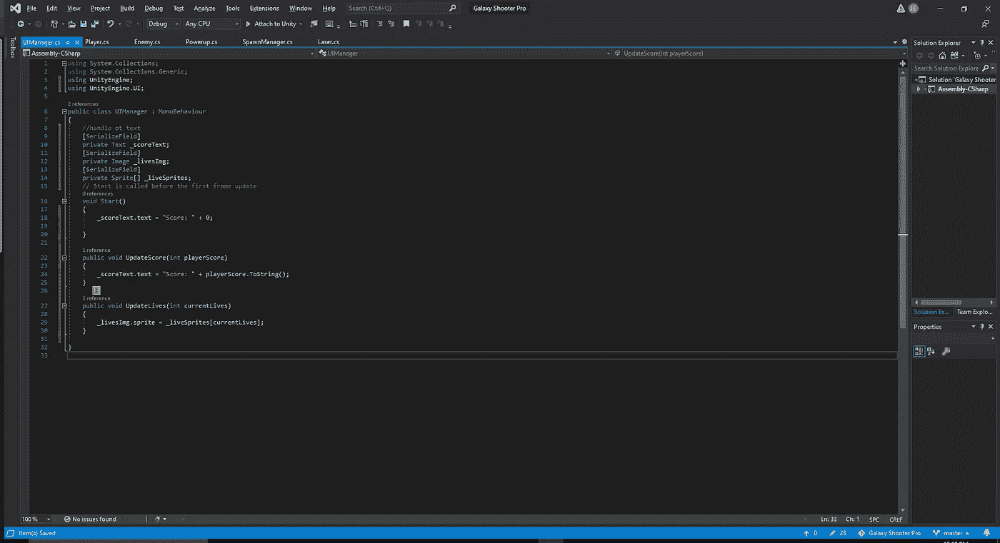

从这里，我们可以返回到我们的 Unity 编辑器，点击我们的画布并拖动数组中每个元素的图像。此外，我们可以将“3 次生命”起始图像放入我们的 _liveImg 字段，以参考我们希望生命计数器显示的位置。

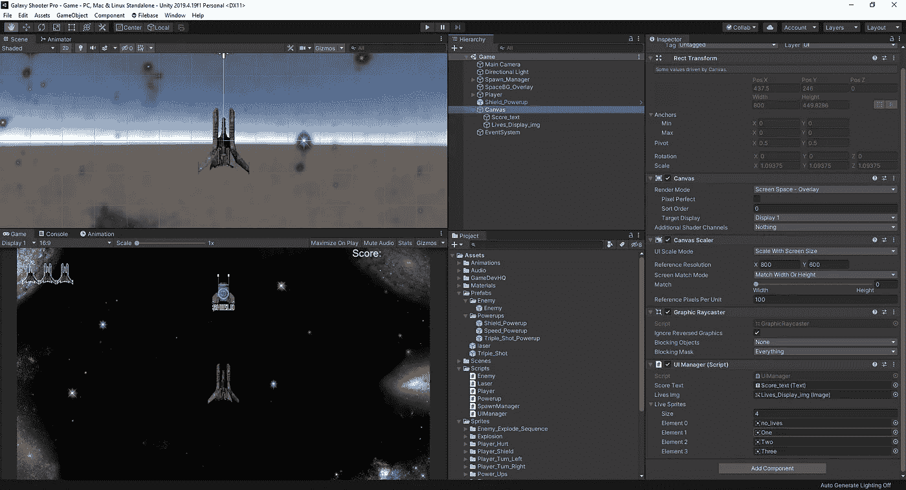

现在我们已经设置好了，我们需要将 UpdateLives 添加到我们的玩家脚本中，这样当我们失去一条生命时，Unity 就知道我们想要让我们的显示显示我们失去了一条生命。

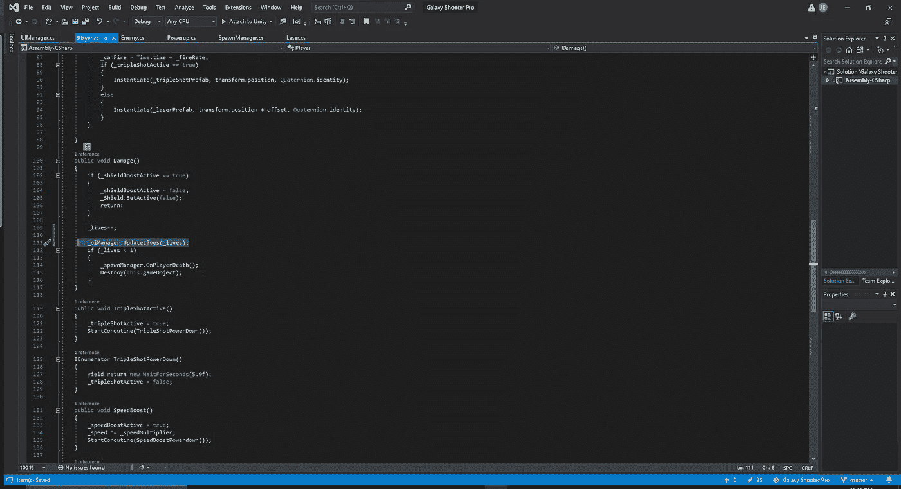

最后，我们可以在我们的游戏中测试它，看看计数器是否正常工作。

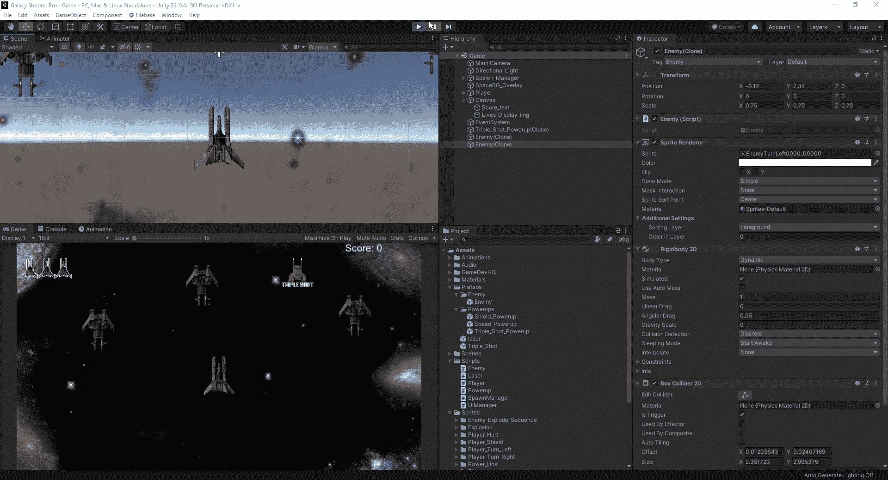

现在我们已经内置了一个基本的用户界面，下一次我们将研究如何在我们死后创建一个屏幕游戏。