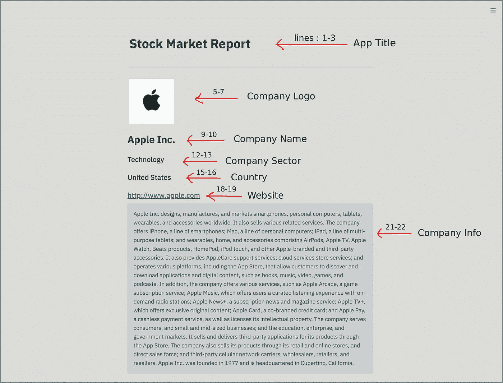
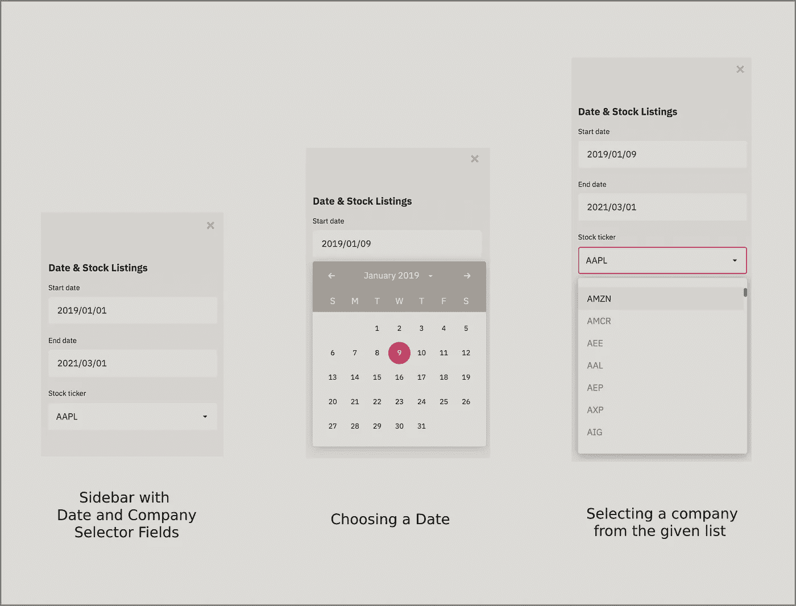
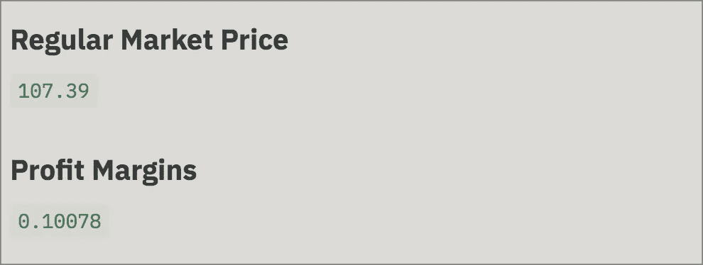
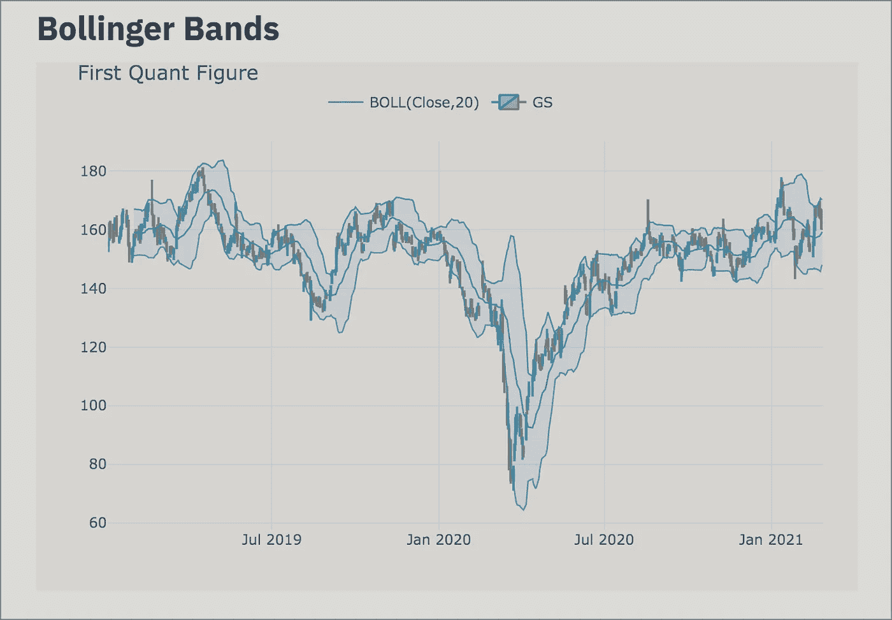
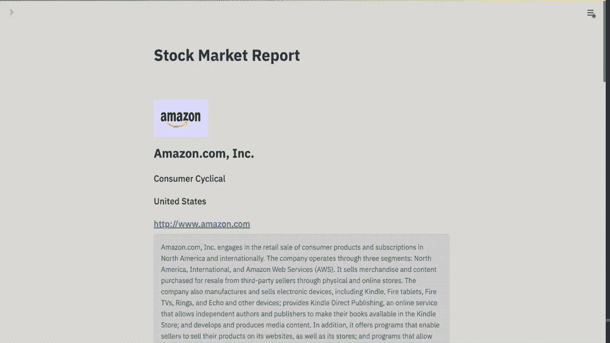

# 使用 Streamlit 和 AWS 轻松构建和部署数据科学 web 应用

> 原文：<https://medium.com/nerd-for-tech/easily-build-and-deploy-data-science-web-apps-using-streamlit-aws-78d82bae2f6e?source=collection_archive---------10----------------------->

**第 1 部分:使用 streamlit 库构建股票市场报告 web 应用**

使用 freepik 创建

您是否曾经想要为您的数据科学项目构建一个数据驱动的 web 应用程序，却被用 Django 或 Flask 编写代码的难度所吓倒？

如果你已经面临这样的困难，那么我会建议你遵循这篇文章，因为我将向你展示如何使用 *Streamlit* 库用几行代码构建一个股票价格 web 应用程序，并将其部署在 AWS 自由层 EC2 实例中。

我们将这个过程分为两个部分:构建和部署

## 构建应用程序:

允许你构建一个简单的数据驱动的 web 应用的 Python 库的名字叫做[***Streamlit***](https://streamlit.io/)***。这是一个开源的应用程序框架，可以在几分钟内将数据脚本转换成可共享的 web 应用程序，我们只需编写一些 python 代码，它就会处理一切。***

**安装必要的库:**

> pip 安装 streamlitpip 安装 yfinancepip 安装袖扣pip 安装熊猫

**导入库:**

我们使用 ***pandas*** 库来进行数据分析，使用 ***datetime*** 库来处理日期和时间间隔，还使用 ***袖扣*** 来创建布林线，以便在相对基础上直观地表示数据。为了在 web 应用程序中实现这一切，我们使用了 ***streamlit*** 库，所有这些股票数据和信息都是从 ***yfinance*** 包中获得的。

**App 信息:**

在上面的代码中，我们指定了应用程序名称和公司标志，名称，部门，国家，网站和关于该特定公司的信息。Streamlit 将上述代码输出呈现为，

使用 streamlit 库渲染的前端

**侧边栏面板:**

这里，我们将使用 *st.sidebar* 命令创建一个侧栏，查询参数将允许我们显示开始日期和结束日期。这两个变量基于用户输入。用户可以选择开始和结束日期，使用 *datetime* 库可以帮助我们指定显示特定公司股票详细信息的时间范围。上述代码的输出显示为:

侧边栏面板选项

**股票明细:**

在这里，我们从 yfinance 库中访问*市场价格*和*利润率*细节，并使用 streamlit *write* 方法呈现这些数据。上述代码的输出显示为:

从 yfinance 获取某公司的股票信息

**股票行情及其他推荐:**

在这里，我们展示股票报价器报告给定时间范围内的交易和价格数据。我们还介绍了主要持有人的数据和其他建议。上面的代码呈现如下，

股票数据和其他信息

**布林线:**

布林线是一种统计图表，描述了一种商品的价格和波动性。它们就像在简单均线上下的标准差水平上绘制的包络线。它们帮助我们确定相对价格是高还是低。我们使用*袖扣*是因为兜帽下的*袖扣*是基于*精心制作的*。因此*袖扣*将让我们更容易创造出如下美丽的布林线:

使用袖扣的布林线

**启动应用程序:**

正如我们讨论过的 web 应用程序的各个部分。现在我们将把上面所有的代码组合起来，放在名为“A *pp_Name.py* 的文件中。然后，我们将在 mac 中打开终端(或在 windows 中打开命令行)并执行以下命令:

> 简化运行 App_Name.py

现在它将显示以下消息。

> > streamlit run App_Name.py
> 您现在可以在浏览器中查看您的 streamlit 应用程序。本地网址:http://localhost:8501
> 网络网址:http://10.0.0.11:8501

现在，将会打开一个带有本地 URL 的浏览器，将我们带到我们已经构建的应用程序。我们的应用程序看起来会像这样，

股票市场报告应用程序演示

**宾果！我们现在已经创建了第一个数据驱动的 web 应用程序！下一步，我们将使用 AWS free tier EC2 实例继续部署该应用程序。**

**注:**创建优秀的应用程序只能解决一半的问题。分享这些应用也起到了很大的作用，让全世界都能体验到你的作品。最近，Streamlit 宣布了一个全新的共享平台。它允许您部署、管理和共享您的应用程序。为了庆祝发布，他们发布了 1，000 份 Streamlit 共享邀请，随着服务器容量的增长，还会有更多的邀请。如果您的收件箱中还没有邀请，请申请一个邀请，他们很快就会给您发送一个。我已收到我的分享邀请并部署了此应用。你可以在这里找到演示，

App 链接:[https://share . streamlit . io/saispr/AWS-stock-price-app/main/app . py](https://share.streamlit.io/saispr/aws-stock-price-app/main/app.py)

邀请链接:[https://streamlit.io/sharing](https://streamlit.io/sharing)

演职员表:Chanin Nantasenamat

谢谢你的阅读。你们觉得怎么样？我很想知道你对此的想法。我希望我已经向您简要介绍了如何使用 Streamlit 库快速构建数据驱动的 web 应用程序。给它一个💚，如果你喜欢这个帖子是为了额外的动力。我随时欢迎你的建议和疑问。