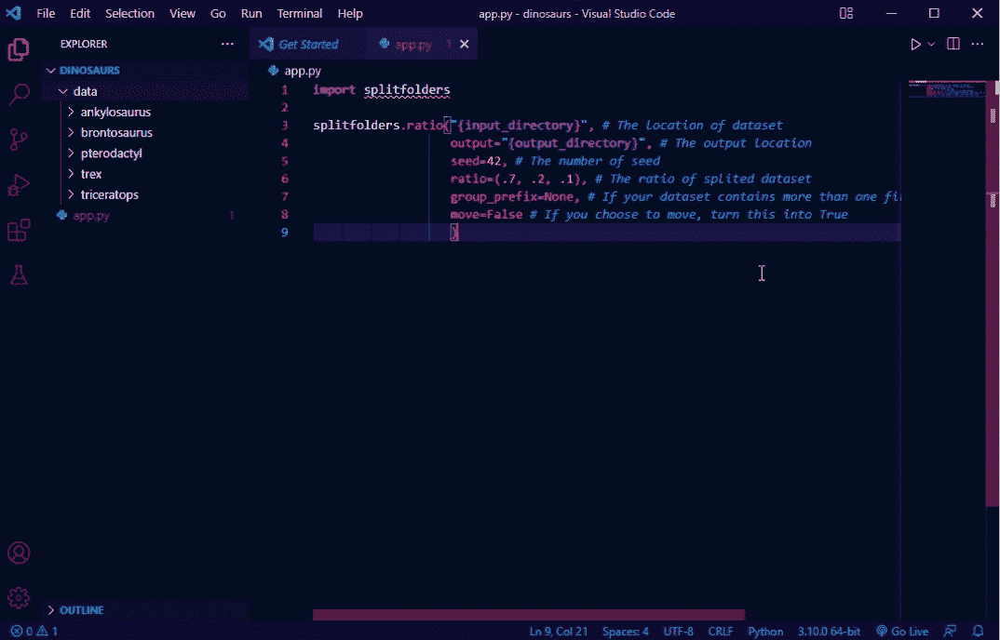

# 轻松地将您目录分成培训、验证和测试格式

> 原文：<https://medium.com/nerd-for-tech/easily-split-your-directory-into-train-validation-and-testing-format-f1359f34dd93?source=collection_archive---------0----------------------->


扎克·沃尔夫在 [Unsplash](https://unsplash.com/?utm_source=unsplash&utm_medium=referral&utm_content=creditCopyText) 上的照片

将数据集划分为数据训练、验证和测试是处理生产中部署的模型过拟合或欠拟合的常见方法。在[的这篇](https://towardsdatascience.com/how-to-split-data-into-three-sets-train-validation-and-test-and-why-e50d22d3e54c)文章中，Samarth Agrawal 先生向 great 讲述了分割由 CSV 文件中的数据帧组成的数据集。我意识到这篇文章不能在从几个目录构建的数据集中实现。

在我们进入这个问题之前，Samarth Agrawal 先生引用了 Jason Brownlee 的文章中关于训练、验证和测试数据集的描述。因为意思很好理解，所以我不会从中改变什么。

*   **训练数据集**:用于拟合模型的数据样本。
*   **验证数据集**:数据样本，用于在调整模型超参数时，对训练数据集上的模型拟合提供无偏评估。随着验证数据集的技能融入到模型配置中，评估变得更有偏差。
*   **测试数据集**:用于提供最终模型在训练数据集上的无偏评估的数据样本。

知道了为什么要把我们的数据集分成三类数据之后，我们再来深入问题。

# 问题是

在这篇文章中，我想分享关于分割从几个目录构建的数据集，就像这样的格式。

```
Class1/
    · File1
    · File2
    · …
Class2/
    · File1
    · File2
    · …
Class3/
    · File1
    · File2
    · …
```

因为这不是 CSV 格式，就像在[那篇](https://towardsdatascience.com/how-to-split-data-into-three-sets-train-validation-and-test-and-why-e50d22d3e54c)文章中，我们不能使用他的相同方法。但是，概念是一样的。我们想把它分成三个目录，就像这样。

```
Train/
  Class1/
    · File1
    · File2
    · …
  Class2/
    · File1
    · File2
    · … 
  Class3/
    · File1
    · File2
    · …
Test/
  Class1/
    · File1
    · File2
    · …
  Class2/
    · File1
    · File2
    · … 
  Class3/
    · File1
    · File2
    · …
Val/
  Class1/
    · File1
    · File2
    · …
  Class2/
    · File1
    · File2
    · … 
  Class3/
    · File1
    · File2
    · …```
```

# 答案

在不影响数据数量的情况下，我们可以将它分成三个目录，如上所示。好吧，魔术使用“分裂 _ 文件夹”,可以很容易地安装使用画中画。

```
pip install split-folders
```

之后，你只需要运行这段代码。

# 真实案例

好吧，如果我们不在真实数据集中实现，答案部分将只是理论。对于这种情况，我已经创建了简单的恐龙数据集，并将其发布在 Kaggle 上。点击此[链接](https://www.kaggle.com/datasets/cmglonly/simple-dinosurus-dataset)进入数据集。

我们需要对数据集中的五类恐龙进行分类。使用答案部分的代码，让我们在代码中实现它。目录格式和问题部分一样。让我们划分它以得到目标形式:训练、测试和 val。这张 gif 就很好解释了。



我鼓励你使用这个数据集自己创建一个模型。创建一个新的模型不会有任何回报，但是你可以使用一种新的数据集来练习创建一个新的模型，而不仅仅是猫和狗或者其他常见的数据集。

# 结论

恭喜您，您已经知道如何将目录分成培训、测试和验证格式。没有秘密；我们只需要一个分割文件夹包，分割目录不会成为我们的问题。如果你有任何问题，请在评论区或电子邮件中询问他们。感谢阅读。

# 参考

*   [如何将数据分成三组(训练、验证和测试)，为什么？作者 Samarth Agrawal |走向数据科学](https://towardsdatascience.com/how-to-split-data-into-three-sets-train-validation-and-test-and-why-e50d22d3e54c)
*   [测试数据集和验证数据集有什么区别？](https://machinelearningmastery.com/difference-test-validation-datasets/)(machinelearningmastery.com)
*   [简单的恐龙数据集| Kaggle](https://www.kaggle.com/datasets/cmglonly/simple-dinosurus-dataset)