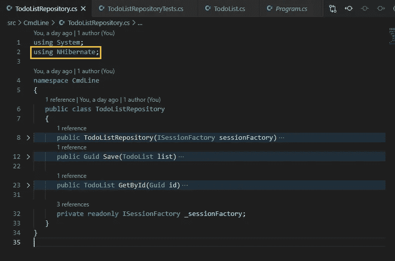

# 使用 NHibernate 轻松访问数据库。NET 5.0

> 原文：<https://medium.com/nerd-for-tech/easy-database-access-with-nhibernate-in-net-5-0-3cc7e36510c9?source=collection_archive---------0----------------------->

在关系数据库中存储和读取数据，而无需编写 SQL

使用 NHibernate 的存储库

在本文中:

*   一开始有一个测试:使用测试驱动开发(TDD)
*   一个简单的域类
*   使用对象关系映射器(ORM): NHibernate
*   使用 Fluent NHibernate 将类映射到表