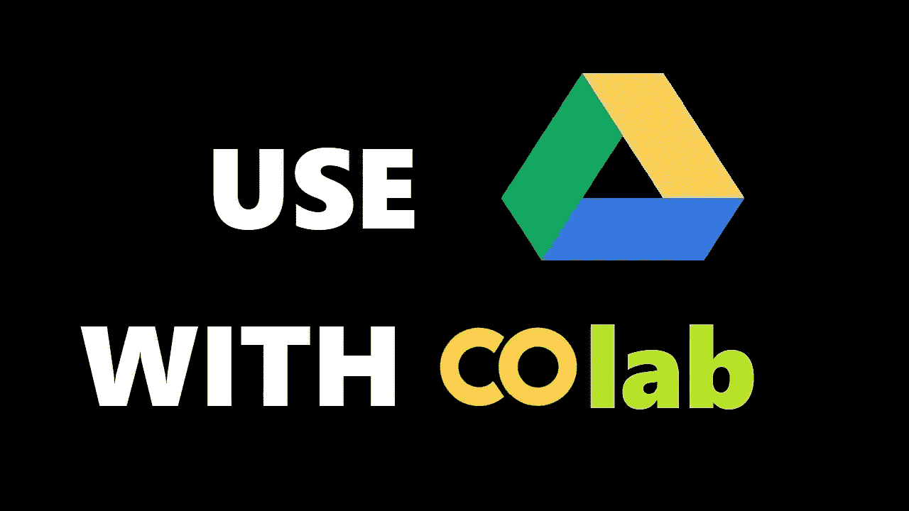
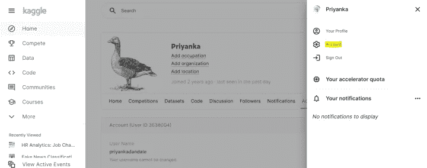
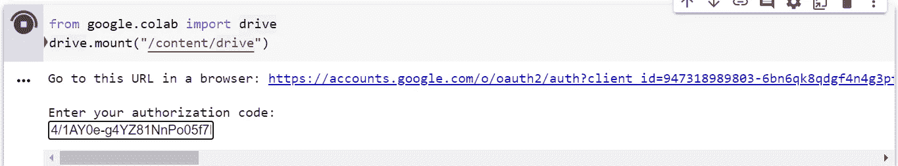
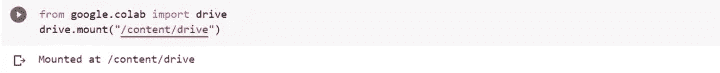
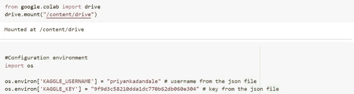
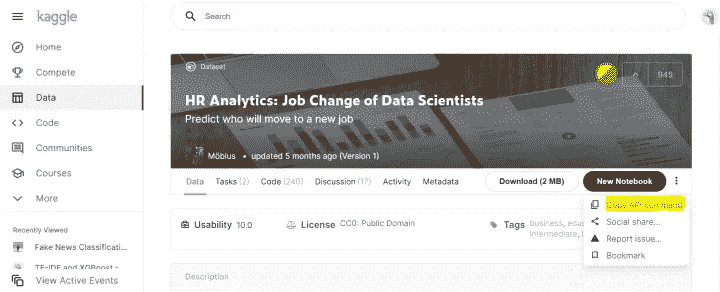
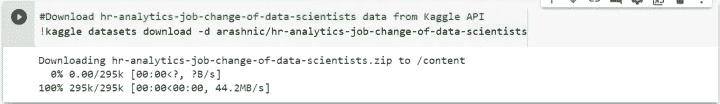
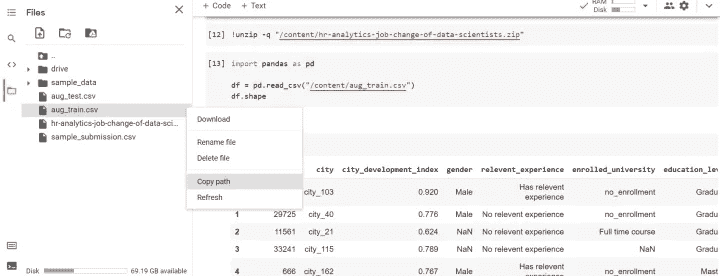

# 轻松下载 Kaggle 数据到 Google Drive！！

> 原文：<https://medium.com/nerd-for-tech/easy-downloading-kaggle-data-to-google-drive-1be0a8835baa?source=collection_archive---------10----------------------->

将 Kaggle 数据下载到 Google drive，并随时在 Google Colab 中使用它！

Kaggle 是世界上最大的数据科学社区，拥有强大的工具和资源来帮助您实现数据科学目标。

就拿机器学习，深度学习，NLP，或者 AI 来说，这些都需要相当认真的处理。许多人倾向于使用 Google Colab 进行模型训练，因为 GPU 和 TPU 是免费的。Colab 的一个缺点是退出笔记本时模型不再保留(除非你是 pro 用户)。解决方法是将工作区移到 Google Drive，因为离开笔记本后可以保存所有信息。下载和上传非常耗时。

# 如何将 Kaggle 数据集直接下载到 Google Drive？— —一切肯定都会在云上！

遵循以下 6 个简单的步骤:

1.  从 Kaggle 帐户创建新的 API 令牌
2.  将你的谷歌硬盘安装到谷歌实验室
3.  在 Google Colab 上配置环境
4.  获取 Kaggle API
5.  在 Colab 中使用复制的 API 命令
6.  解压缩文件以使用它！

# 1.从 Kaggle 帐户创建新的 API 令牌

去你的 Kaggle 网站。如果您没有 Kaggle 帐户，那么首先您需要创建它。完成后，打开您的帐户详细信息，向下滚动到 API 部分，单击“创建新的 API 令牌”。

您的 web 浏览器将要求您下载名为 kaggle.json 的 JSON 文件。该文件包含将用于配置 Google Colab 环境的用户名和密钥。下载成功后，你会得到下面的信息。

# 2.将你的谷歌硬盘安装到谷歌实验室

使用下面的代码来安装谷歌驱动器。您可以将目录更改为驱动器中的某个文件夹，但请记住数据集将被下载到该目录。

> 从 google.colab 导入驱动器
> 
> drive.mount("/content/drive ")

在执行上面两行代码后，它会要求你转到一个 URL，点击它并登录到你的 Google Drive 帐户并复制代码。

将复制的代码粘贴到“输入您的授权代码”下。

点击回车后，过一段时间你会得到如下消息:

别忘了安装谷歌硬盘。否则你的数据无论如何都会丢失！

# 3.在 Google Colab 上配置环境

现在为编码配置环境创建新的笔记本。插入一个新单元格，并键入以下代码来配置环境。

请注意，您将从 kaggle.json 获得的用户名和密钥是区分大小写的。您必须键入完全相同的用户名和密钥，否则，它会抛出一个错误。

> #配置环境
> 
> 导入操作系统
> 
> OS . environ[' ka ggle _ USERNAME ']= " priyankandadale "
> 
> json 文件中的用户名
> 
> OS . environ[' ka ggle _ KEY ']= " 9 F9 d3c 58210 DDA 1 DC 770 b 62 db 060 e 304 "
> 
> 来自 json 文件的# key

# 4.获取 Kaggle API

我们现在准备使用 Kaggle API。要使用它，请转到我们需要的链接，并在页面右侧的某处找到“三个点”。然后，选择复制 API 命令。

# 5.在 Colab 中使用复制的 API 命令

回到谷歌 Colab 笔记本。插入新单元格并键入“！”开头跟着 API 命令。

> #从 Kaggle API 下载人力资源-分析-工作-数据变化-科学家数据
> 
> ！kaggle 数据集下载-d arashnic/HR-分析-工作-数据变化-科学家

见下图，你会得到成功下载数据文件后的信息。你还会得到下载文件的大小。

# 6.解压缩文件以使用它！

在下一个单元格中使用下面的代码。

> ！unzip-q "/content/HR-analytics-job-change-of-data-scientists . zip "

将文件的路径复制到想要读取或执行的任何其他操作中。

# 搞定了。😊

感谢阅读！！

对于任何建议或疑问，请在下面留下您的评论，并关注更新。

如果你喜欢这篇文章，请点击👏图标来支持它。这将有助于其他媒体用户找到它。分享一下，让别人也能看！

快乐学习！😊