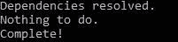
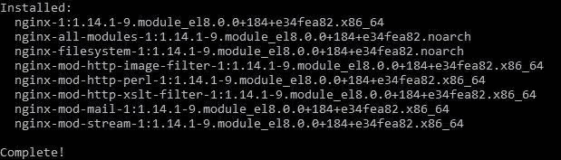
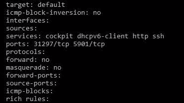
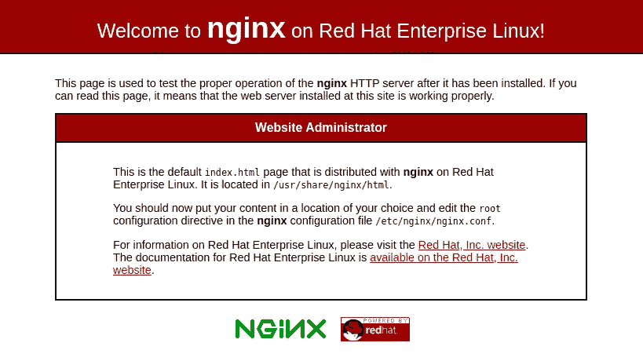

# 在 CentOS 8 上安装 NGINX Web 服务器的简单指南

> 原文：<https://medium.com/nerd-for-tech/easy-guide-on-installing-an-nginx-web-server-on-centos-8-ff89731ec996?source=collection_archive---------0----------------------->


我们将一步一步地介绍在 Linux CentOS 8 发行版上安装 NGINX web 服务器的最简单、最有效的方法。首先，这里简单介绍一下 NGINX 和 CentOS 8 到底是什么。

***CentOS*** 也称为 CentOS Linux，是一个 Linux 发行版，提供一个免费的开源社区支持的计算平台，功能上与其上游源代码红帽企业 Linux (RHEL)兼容。CentOS 版于 2019 年 9 月 24 日正式发布。([来源](https://en.wikipedia.org/wiki/CentOS))

***NGINX*** 是一款免费、开源、高性能的 HTTP 服务器和反向代理，以及 IMAP/POP3 代理服务器。NGINX 是世界上最受欢迎的 web 服务器之一，负责托管互联网上一些最大、最受欢迎的网站。在大多数情况下，它比 Apache 更加资源友好，可以用作 web 服务器或反向代理。([来源](https://www.nginx.com/resources/wiki/#:~:text=NGINX%20is%20a%20free%2C%20open,to%20address%20the%20C10K%20problem.))

**您需要什么来开始:**

*   通过 SSH(安全套接字 shell 端口 22)连接到您的云服务器。
*   拥有 sudo 权限的帐户。(这允许用户以根用户或不同用户的身份执行命令)。
*   安装了 CentOS 8 的服务器。

> **步骤 1: SSH 建立安全连接**

我们使用 SSH 来获得远程访问权，以便安全地与另一台计算机进行通信。它在两个网络端点之间提供加密连接。

***要使用 SSH，您需要在您的设备上启动命令终端并输入以下命令:***

```
ssh user_name@host_ip_address
```

*   ssh (secure shell)命令:指示系统与主机建立加密的安全连接。
*   user_name:表示用于连接到主机的帐户。
*   主机:指被访问的机器。这可以是域名或 IP 地址。

按照提示操作，输入密码以建立连接。

> **第二步:更新 CentOS 8 服务器上的所有软件包**

首先，我们想检查 CentOS 8 系统的更新。有了最新的系统，这将确保我们有更少的安全问题和增加系统的稳定性。

***使用以下命令检查可用的更新和软件包:***

```
$ sudo yum update
```

系统将显示可用更新的列表。在不指定任何软件包名称的情况下运行此命令将更新系统上的所有软件包。

***如果内核更新了，用下面的命令重新启动系统:***

```
$ sudo reboot
```

***您应该会看到以下或类似的消息，表明您的更新已经完成:***



一旦系统完成更新，我们就可以进入下一步了！现在没那么糟了吧？

> **第三步:安装 NGINX 网络服务器**

为了安装 Nginx，我们将使用 ***dnf*** 包管理器，这是 CentOS 8 上新的默认包管理器。

***使用以下命令安装 NGINX 包:***

```
$ sudo dnf install nginx
```

这需要一点时间，所以不要去碰任何东西，但 NGINX 完成后，你应该会得到安装完成的确认。它应该是这样的:



出现提示时，输入 ***y*** 确认要安装 ***NGINX*** 。之后， ***dnf*** 会把 Nginx 和任何需要的依赖项安装到你的服务器上。

***安装完成后，运行以下命令启用并启动服务器:***

```
$ sudo systemctl enable nginx
$ sudo systemctl start nginx
```

> **第四步:调整防火墙规则**

我们将需要调整防火墙设置，以允许您的 Nginx web 服务器上的外部连接，该服务器默认运行在端口 80 (HTTP)上。

***输入以下命令，永久启用端口 80 上的 HTTP 连接:***

```
sudo firewall-cmd --permanent --add-service=http
```

***要验证是否正确添加了 http 防火墙服务，请运行以下命令:***

```
sudo firewall-cmd --permanent --list-all
```

***你应该会看到这样一个输出:***



***要应用更改，您需要使用以下命令重新加载防火墙服务:***

```
sudo firewall-cmd --reload
```

我们做到了！现在你的 Nginx 服务器已经完全安装好了，可以被外部访问者访问了。

> **第五步:测试网页**

现在，您可以通过从 web 浏览器访问服务器的公共 IP 地址或域名来测试 Nginx web 服务器是否启动并运行。

***如果你没有指向你的服务器的域名或者你不知道你的服务器的公共 IP 地址，你可以通过运行下面的命令找到它:***

```
ip addr show eth0 | grep inet | awk '{ print $2; }' | sed 's/\/.*$//'
```

```
curl -4 icanhazip.com
```

*****输入您在网络浏览器中收到的地址，它会将您带到 Nginx 的默认登录页面:*****

****

**如果你已经做到了这一步，感谢你的阅读，请通过 LinkedIn 与我联系，获取更多有见地的帖子！**

**香奈儿·杰莫特**