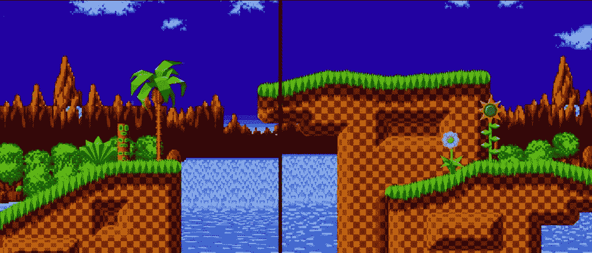

# 在 Unity 中轻松实现视差滚动

> 原文：<https://medium.com/nerd-for-tech/easy-parallax-scrolling-in-unity-515c5fff7d89?source=collection_archive---------6----------------------->

## 统一让视差变得容易！

//给你的 2D 游戏增加一些深度

影像视频游戏动画研究

让我们面对现实吧，上面两个样品中的一个看起来比另一个好。与另一个示例的平面 2D 背景相比，在场景中不同深度出现的滚动效果给场景带来了更广阔的感觉，使其感觉更真实。深度…