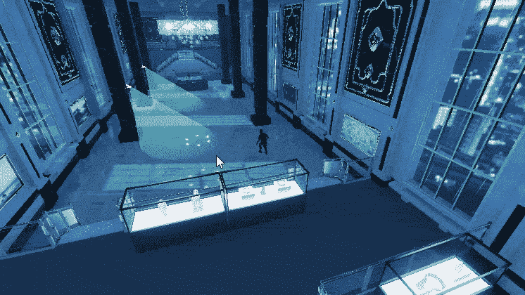
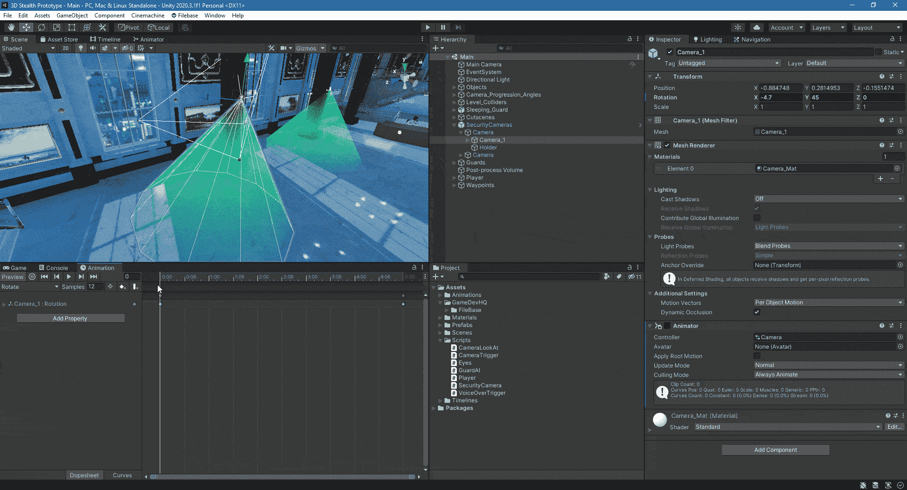
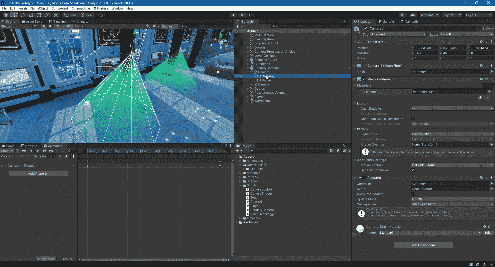
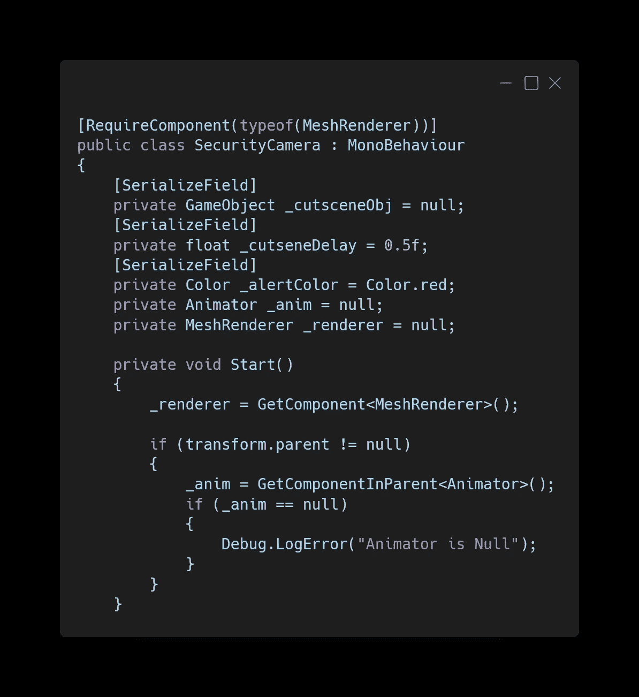
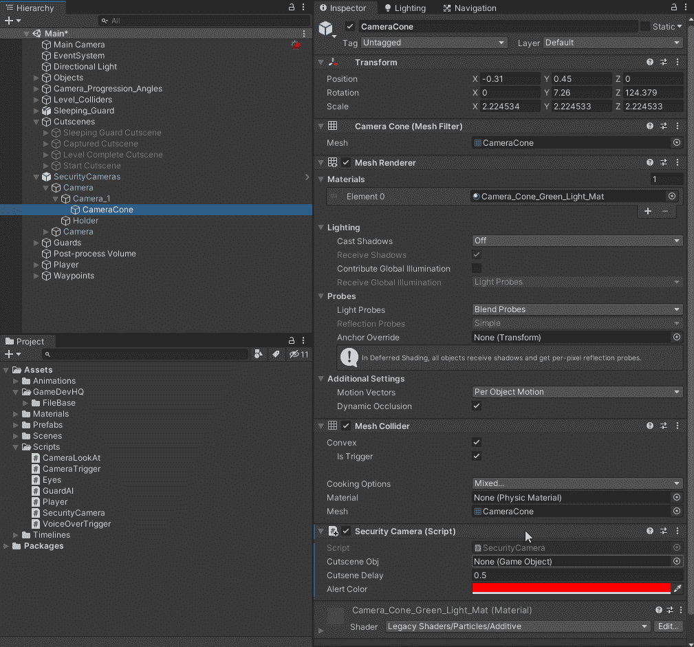
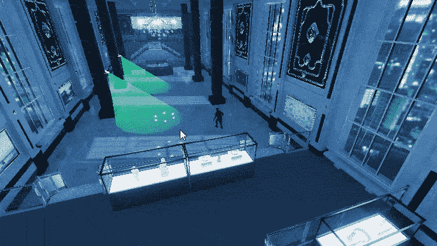

# Unity 中的简易安全摄像头

> 原文：<https://medium.com/nerd-for-tech/easy-security-cameras-in-unity-ffa02c26bcaa?source=collection_archive---------21----------------------->

这篇文章将展示如何制作一个安全摄像机，当玩家进入摄像机的视野时，它会停止动画并变成红色。

监控摄像头会左右摇摆。

视锥附有触发碰撞器和脚本。

SecurityCamera 脚本需要变量来激活过场动画游戏对象、过场动画之前的延迟时间、检测到玩家时要更改的颜色、对父动画制作人停止动画的引用以及对 MeshRenderer 的引用，以便我们可以更改视觉锥体的颜色。

当玩家进入安全摄像头的视觉碰撞器时，颜色会变成警示色。动画制作者被禁用以停止移动，并且为过场动画延迟启动协程。我们正在禁用过场动画的玩家游戏对象，所以它在背景中看不到。

在 Unity 中，我们连接过场动画并设置颜色为 alpha。

当安全摄像机发现玩家时，视锥变红并在短暂延迟后开始过场动画。

