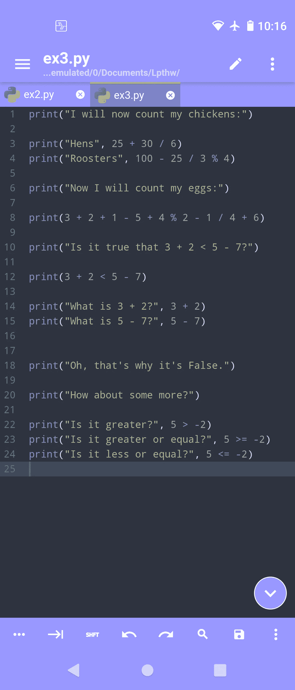

# 在 Android 上编写 Python 代码的简单方法

> 原文：<https://medium.com/nerd-for-tech/easy-way-to-code-python-on-android-4d72b8d99fab?source=collection_archive---------2----------------------->

学习 python 的方法太多了。一个简单的搜索将会给你提供很多学习 Python 的各种课程、教程或在线书籍的链接。网上不缺少帮助你开始的材料。

难的是找到一种简单的方法在手机上学习 python，而不必下载带有广告的应用程序。我理解开发者需要吃饭，我并不反对，但我更愿意为一个应用付费，或者捐款，然后被广告轰炸。此外，我不知道我是否只会看到广告，或者我的数据是否会被收集起来用于我将来看到的广告。从我的手机上可以收集到如此多的信息。我宁愿多付几块钱，然后让另一家公司收集我的数据。

幸运的是，我已经找到了几个应用程序，它们将帮助我在工作间隙学习一点 python。

## Acode

Acode 是一个强大的 Android 代码编辑器。你可以从 play store 获得或者从他们的[网站](http://acode.foxdebug.com)下载 apk 文件。

它支持 Python 语法高亮显示，并具有自动填充功能。我一直对这个在移动端写 Python 的 app 印象深刻。免费版唯一不提供的功能是启用黑暗模式。如果你想启用黑暗模式，你必须购买该应用程序。显然，如果你决定支持开发者并购买应用程序，这是一个小小的福利。要运行你用 Acode 编写的 Python，你需要下载 Termux。那么，让我们快速浏览一下。



我写 Python 的时候 Acode 是什么样子的。

## 泰尔穆克

[](/@seandreas/why-use-termux-bad137142f3e) [## 为什么使用 Termux？

### 智能手机，又名手机，因为绝大多数产品都是智能手机，已经成为事实上的…

medium.com](/@seandreas/why-use-termux-bad137142f3e) 

Termux 是一个 Android 终端模拟器。这是在 Android 上创建一个类似 Linux 的环境的最简单的方法，而不必让你的手机 root。在你[下载了](https://f-droid.org/en/packages/com.termux/)应用程序后，看看你是否安装了 python:

```
python --version
```

如果你做到了，那么你就可以走了。如果尚未安装，请键入以下内容来安装 python v3.x:

```
pkg install python
```

正如你从上面的图片中看到的，我把我的 python 文件保存在 Documents 的一个文件夹中。要在 Termux 中访问该文件夹，您必须使用 **cd** (更改目录)来运行代码。

```
cd storage/shared/Documents
```

我把我的文件夹命名为 Lpthw(艰难地学习 Python ),并在那里写我的练习。要运行您编写的 python，请键入以下内容:

```
python ex3.py
```

这将运行上面图片中显示的 ex3.py 文件。


在 Android 上运行 Termux 中的 python 程序。

网上有很多学习 python 的资源。在上面的例子中，我用[艰难地学习 Python](https://learnpythonthehardway.org/python3/)作为一种在旅途中温习一些 Python 知识的方法。如果有其他在线资源可以随时学习 Python，请在下面的评论中提出来。