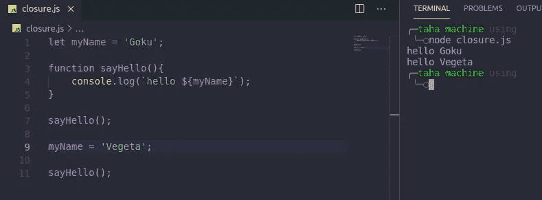
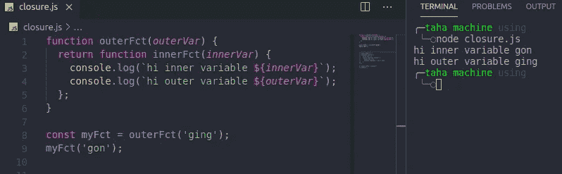
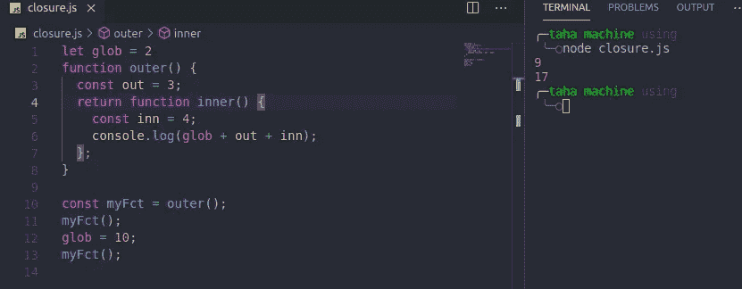

# 掌握 JavaScript 闭包的简单方法

> 原文：<https://medium.com/nerd-for-tech/easy-way-to-grasp-javascript-closures-7dc45fe998d9?source=collection_archive---------13----------------------->

# 什么是终结？

简而言之:**闭包是函数访问其外部作用域的能力。**

在 JavaScript 中，每次创建一个函数，都会有一个闭包与之关联。多亏了闭包，JavaScript 内部函数**可以访问:**

*   外部函数的变量
*   全局变量



函数`sayHello`有一个闭包，允许它访问全局范围变量`myName`。同样，如果`myName`改变了，`sayHello`将打印这个全局变量的新值。

## 闭包最有趣的部分



在大多数情况下，我们认为 JavaScript 闭包是其他函数内部的函数，如示例所示。

*   函数`outerFct`返回函数`innerFct`
*   首先我们调用`outerFct('ging')`并将其传递给`myFct`变量
*   然后我们调用`myFct('gon')`来记录 **hi 内变量 gon** 和 **hi 外变量 ging**

那么`myFct('gon')`怎么可能在外部变量中记录*呢？*

现在是**关闭**

当我们调用`const myFct = outerFct('ging');` **closure** 时，让我们的内部函数在外部函数`outerFct`中，外部函数有参数`'ging'` 将其保存为一个外部变量，它将在执行的所有时间里记住这个变量。

所以当我们调用函数`myFct('gon')`时，我们实际上是在调用内部函数，这个函数在其闭包中仍然有`outerVar`的值，也就是`ging`。

请注意，如果我们直接调用:

```
outer('ging')('gon');           | results:
                                | hi inner variable gon
                                | hi outer variable ging 
```



总之，每当一个函数被创建时，这个函数的一个**闭包**也被创建。这个闭包可以访问三种作用域:

*   全球范围
*   创建内部函数的外部函数范围
*   内部函数的内部范围