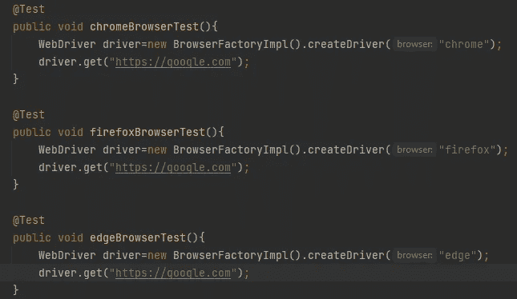

# 在自动化框架中实现跨浏览器支持的简单方法

> 原文：<https://medium.com/nerd-for-tech/easy-way-to-implement-cross-browser-support-in-your-automation-framework-fcd0eb387710?source=collection_archive---------5----------------------->

# 如何在您的测试框架中支持多种浏览器—第二部分

欢迎阅读另一篇关于跨浏览器支持的文章！！！

使用 Sajitha 简化工厂的交叉浏览器

在本文中，我们将讨论如何以较少的可维护性开销实现跨浏览器。