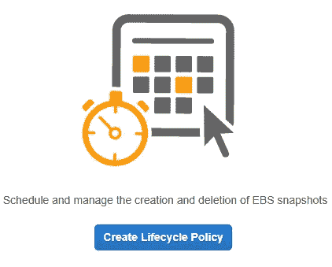

# 使用 Amazon 数据生命周期管理器的 EBS 快照管理

> 原文：<https://medium.com/nerd-for-tech/ebs-snapshot-management-using-amazon-data-lifecycle-manager-9c33bb5bc71b?source=collection_archive---------0----------------------->

**用例:**
你是大量 EC2 实例的管理员。您需要确保拥有可用于灾难恢复的 EBS 快照。为了节省时间，您需要自动执行此操作，同时删除超过 1 天的 EBS 快照。这项任务的自动化将帮助您的公司节省宝贵的劳动时间，这些时间可以更好地用在其他地方，为公司节省…