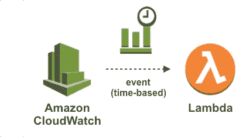

# 使用 AWS Lambda 和 CloudWatch 的 EBS 快照管理

> 原文：<https://medium.com/nerd-for-tech/ebs-snapshot-management-using-aws-lambda-and-cloudwatch-d961fdbe3772?source=collection_archive---------0----------------------->

## 使用案例:

您是大量 EC2 实例的管理员。您需要确保拥有可用于灾难恢复的 EBS 快照。为了节省时间，您希望自动执行此操作，同时删除超过 10 天的 EBS 快照。此任务的自动化将帮助您的公司节省宝贵的工时，这些工时可以更好地利用…