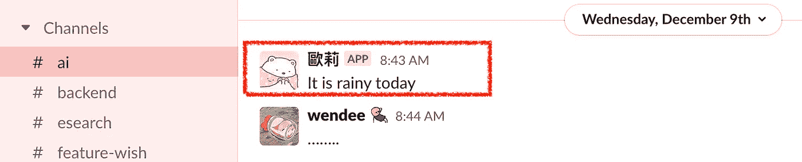
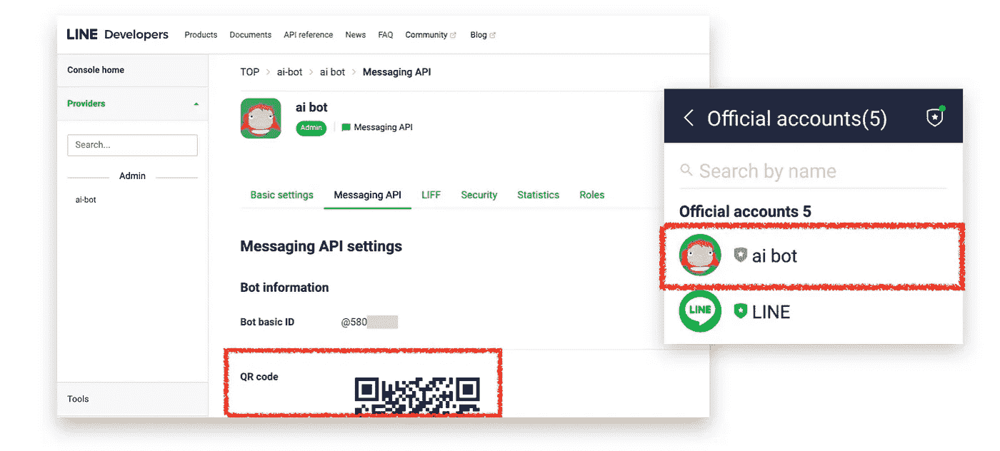
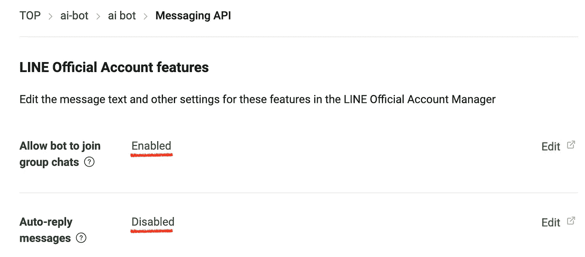
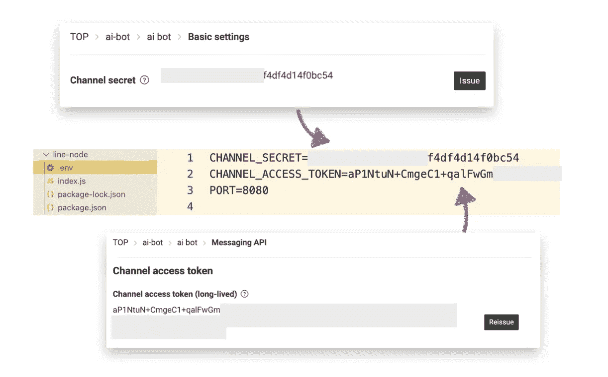
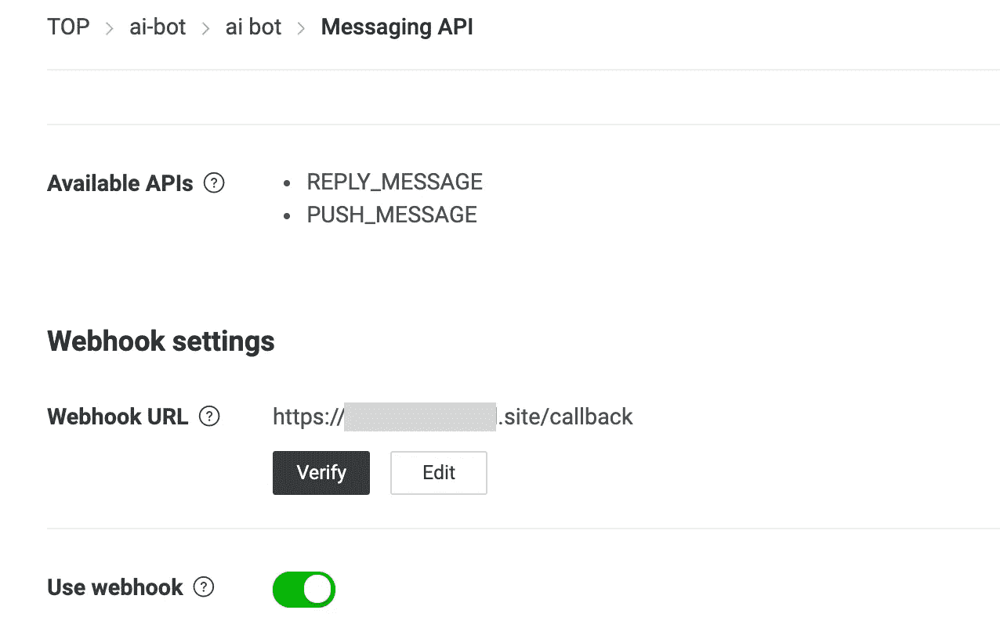
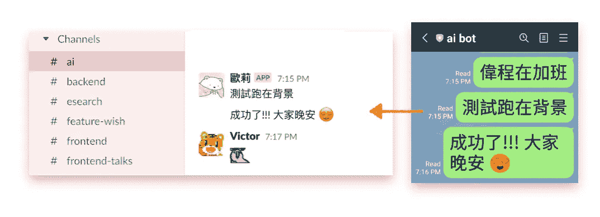

# 将来自在线聊天的消息回显到 Slack

> 原文：<https://medium.com/nerd-for-tech/echo-messages-from-line-chat-to-slack-e12f5d929b81?source=collection_archive---------2----------------------->

在我们的例子中，我们有一个线组和一个松弛通道。他们都在讨论类似的事情，但是讨论的对象不同。为了减少在两端发送相同消息的工作量，我们计划利用 LINE 的消息传递 API，将其与 Slack 的传入 webhook 连接起来。


整个过程可以分为以下几个步骤:

1.  在空闲时间创建一个传入的 Webhook
2.  创建一个线路回声机器人
3.  每当 bot 收到消息时，将消息传递到 Slack 通道

# 在空闲时间创建一个传入的 Webhook

Youtube 上有很多很好的教程指导我们设置传入的网页钩子。这里的主要目标是导出一个 **Webhook Url** 。

我们可以稍后打开终端并使用 curl 来查看 url 是否有效:

```
$ curl -X POST -H 'Content-type: application/json' --data '{"text":"It is rainy today"}'  https://hooks.slack.com/your-webhook-url
```



slack 截图

# 创建一个线路回声机器人

为了使用 LINE 的消息传递 API，需要将我们自己注册为 LINE 开发者并创建一个提供者。[下面是一步一步的说明。](https://developers.line.biz/en/docs/messaging-api/getting-started/)最后我们可以通过二维码添加 bot:



拥有一个机器人后，请编辑设置并**邀请机器人到聊天室**我们想让它❌间谍✅转发消息。



# 每当 bot 收到消息时，将消息传递到 Slack 通道

现在，我们将使用 Node.js 来编写消息传递部分。创建一个新文件夹，并从以下 github 链接下载 index.js、package-lock.json 和 package.json:

[](https://github.com/line/line-bot-sdk-nodejs/tree/next/examples/echo-bot) [## line/line-bot-sdk-nodejs

### LINE Messaging API SDK for Node.js。通过在……上创建帐户，为 line/line-bot-sdk-nodejs 开发做出贡献

github.com](https://github.com/line/line-bot-sdk-nodejs/tree/next/examples/echo-bot) 

为了方便设置配置，我们将在同一个文件夹中创建一个名为`.env`的文件。然后，我们声明我们的 channel_secret、channel_access_token 和目标端口。



我们还需要安装一些软件包。我们可以在终端中键入以下命令:

```
npm install              # download line-sdk listed in package.json
npm install dotenv       # for enabling the file .env
npm install node-fetch   # for posting api
```

伟大的👊让我们在`index.js`中重写代码，以便每当线路机器人接收到消息时向 slack 发布消息:

最后一步是在我们可以获得一个**公共 url** 的地方运行这个 Node.js 服务器(它必须使用 **https** )。LINE 的 webhook 不接受 **http** 😧)您可以选择:

*   使用 [ngrok](https://ngrok.com/) 导出您的本地主机 ip。
*   使用 firebase 函数，强烈建议使用它，因为它可以轻松快速地为生产进行设置。

在我的例子中，我在 Google 云平台上运行它，在那里我已经设置了一个 apache 服务器来托管另一个网站。(是的，在同一台机器上运行 node.js 服务器和 apache 服务器是一项艰巨的工作🙀我在这篇文章中分享了我的经历👉[在 Apache 服务器上运行 Node.js 应用程序](https://wendeehsu.medium.com/run-node-js-application-on-apache-server-c79985014869)

在任一方法中，您都可以通过在终端中键入以下命令来启动 node.js 服务器:

```
node .
```

然后在 LINE 的开发者控制台中用你的公共 url 验证你的 webhook(我的是 GCP 机器):



TADA！就这样🎊🎊🎊现在，你的 LINE bot 收到的所有消息，无论是你直接发送给它的文本，还是它在群组聊天室窃听到的文本，都将被发送到我们的 slack 频道🙌

