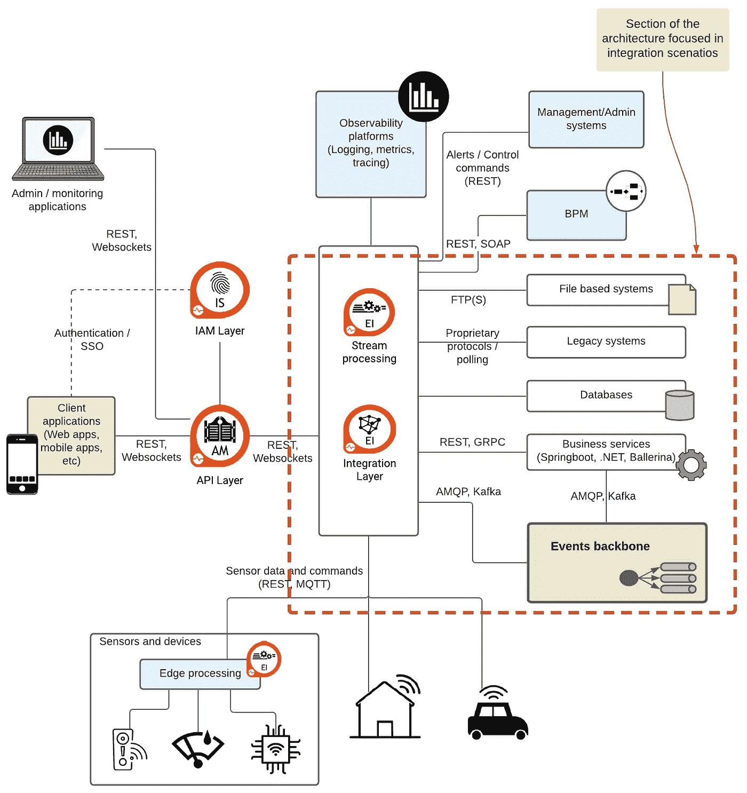
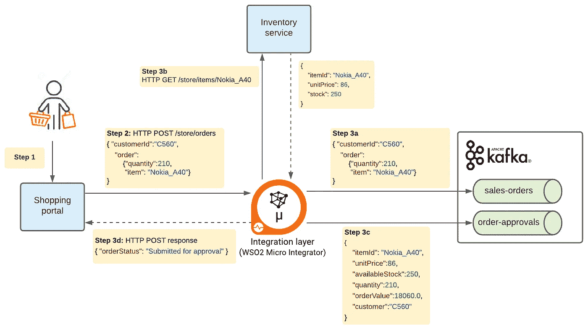
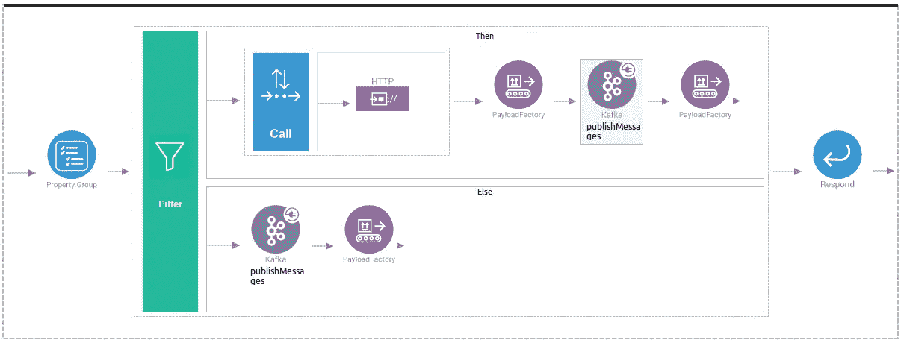
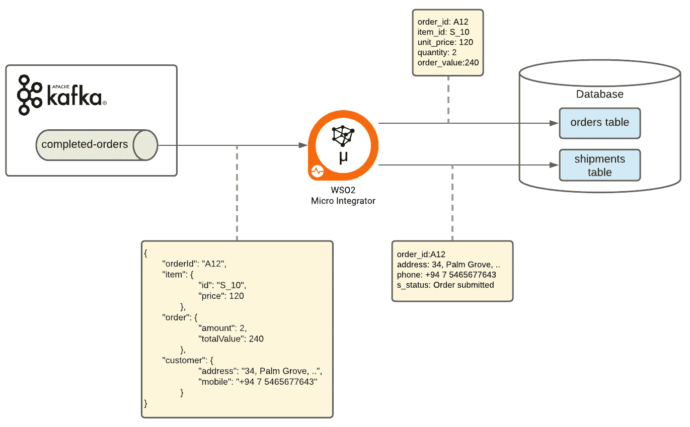
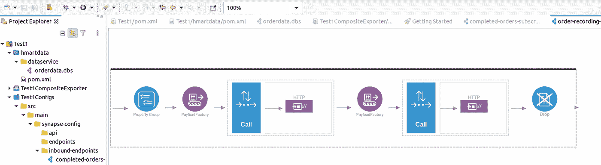
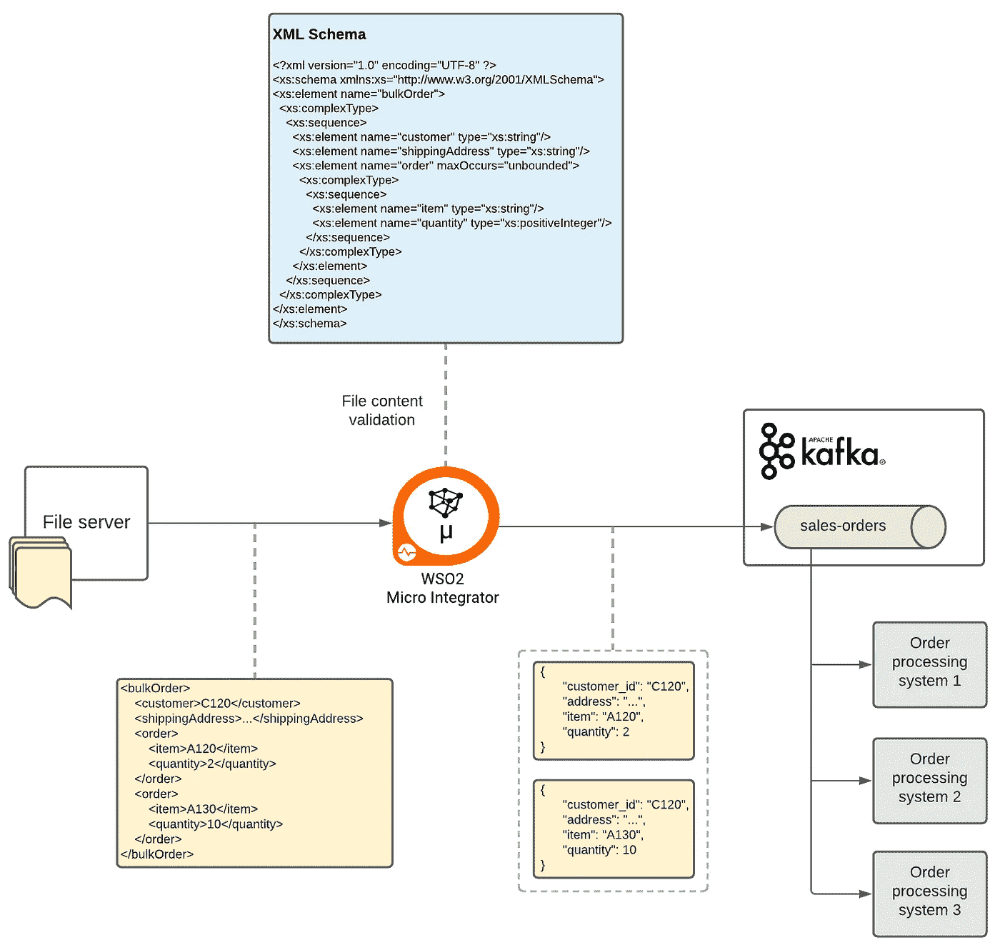
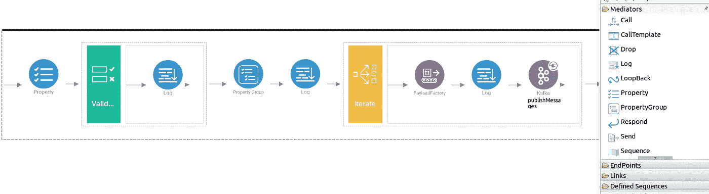

# EDA 实施—集成场景

> 原文：<https://medium.com/nerd-for-tech/eda-implementation-integration-scenarios-66895923439?source=collection_archive---------4----------------------->

## 将业务系统与 events backbone 集成的用例及方法

在[之前的一篇文章](https://chathura-ekanayake.medium.com/applying-event-driven-architecture-in-digital-transformation-projects-acbcb27440af)中，我们讨论了基于事件驱动架构(EDA)系统的通用架构。在本文中，我们将通过关注特定的产品及其交互来探索这种事件驱动系统的实现方法。

图 1 描述了一个基于 EDA 的系统的通用架构(关于这个的细节在这里[讨论过](https://chathura-ekanayake.medium.com/applying-event-driven-architecture-in-digital-transformation-projects-acbcb27440af))。在这里，我们将缩小到该架构的几个有趣的部分(在下图中突出显示),并探索可能的实现方法。

图 1:基于 EDA 的系统的通用架构，突出了本文关注的部分

本文的重点主要是事件主干，特别是它与系统其余部分的交互。events backbone 有多种选择，商业和开源都有，包括 [RabbitMQ](https://www.rabbitmq.com/) 、 [Kafka](https://kafka.apache.org/) 、 [ActiveMQ](https://activemq.apache.org/) 、 [NATS](https://nats.io/) 和 [IBM MQ](https://www.ibm.com/products/mq) 。

> Events backbone 促进了服务之间的松散耦合，并提供了可靠的消息传递。此外，它支持发布/订阅模式，这允许多个服务接收从其他服务发布的事件。

从实现的角度来看，我们需要考虑连接事件主干和相关服务的集成方法。许多事件代理支持多种消息协议，如 AMQP、MQTT 和 STOMP。如果业务服务可以通过这些协议进行通信，它就可以直接连接事件代理来发布和使用消息。

但是，如果业务服务只通过 HTTP 等协议进行通信，或者如果需要将文件服务器或数据库集成到事件驱动的系统中，则有必要使用集成层。此外，在许多场景中，在发布到 events backbone 之前或从 events backbone 消费之后，有必要处理事件。在这种情况下，集成层成为执行这种中间消息处理操作的重要组件。在本文中，我们将使用 Kafka 作为事件主干，使用 [WSO2 Micro Integrator](https://wso2.com/integration/micro-integrator/) 作为集成层来说明其中的一些实现方法。

# 将基于 HTTP 的业务服务与事件主干网集成

让我们考虑图 2 中描绘的场景:

图 2:通过 HTTP 将事件主干与业务系统集成

1.  客户在购物门户中下订单
2.  购物门户通过 HTTP 将销售订单作为 JSON 请求发送到集成层
3.  集成层根据给定的策略处理请求，如下:
    3a。如果数量小于 100，则将其发送到 Kafka
    中的“销售-订单”主题 3b:如果数量大于 100，则通过 HTTP 调用库存服务以获取订购商品的单价和可用库存
    3c:计算订单总价值，通过组合订单审批的所有相关信息来准备消息，并将其发送到 Kafka
    3d 中的“订单-审批”主题:构造适当的 JSON 响应消息并通过 HTTP 回复购物门户

在这个场景中，多个基于 HTTP 的服务(即购物门户和库存服务)和事件中枢(即 Kafka)参与到业务流程中。此外，除了使用 Kafka events broker 桥接 HTTP 服务之外，集成层还执行消息处理活动，如条件路由(3a)、服务编排(3b)和消息丰富(3c)。

图 3 显示了在 [WSO2 Integration Studio](https://wso2.com/integration/integration-studio/) 中建模的集成流(这是一个为 [WSO2 微集成器](https://wso2.com/integration/micro-integrator/)创建集成流的图形编辑器)。

图 3:将 HTTP 服务与 Kafka 集成的可视化集成

相同流程的基于 XML 的集成代码如图 4 所示(见下图)。它首先使用[属性组中介器](https://ei.docs.wso2.com/en/latest/micro-integrator/references/mediators/property-Group-Mediator/)从传入的消息中提取必要的数据。然后使用[过滤中介](https://ei.docs.wso2.com/en/latest/micro-integrator/references/mediators/filter-Mediator/)根据订单数量执行条件路由。如果订单数量大于 100，它使用[调用中介](https://ei.docs.wso2.com/en/latest/micro-integrator/references/mediators/call-Mediator/)调用库存服务。然后使用[有效负载工厂中介](https://ei.docs.wso2.com/en/latest/micro-integrator/references/mediators/payloadFactory-Mediator/)通过组合必要的信息来构建新的 JSON 有效负载。使用 [Kafka 连接器](https://ei.docs.wso2.com/en/latest/micro-integrator/references/connectors/kafka-connector/kafka-connector-overview/)将此丰富的消息发布到“订单批准”Kafka 主题。

如果订单数量少于 100，则使用 Kafka 连接器将消息直接发布到“销售订单”主题。在这两种情况下，它都使用有效负载工厂中介来构造适当的响应消息，并将其发送到购物门户。

图 4:将 HTTP 服务与 Kafka 集成的集成代码(DSL)

# 将处理过的事件保存在数据库中

现在让我们考虑一个场景，我们需要在数据库中记录完成的订单。我们在 Kafka 中创建了一个名为“completed-orders”的主题，以 JSON 格式接收已完成订单的详细信息。多个部门的订单处理系统可能会将完整的订单信息发布到此主题。现在，我们可以配置集成层来监听这个主题，并根据需要将接收到的事件保存在数据库表中。在这个场景中，我们假设需要从 JSON 消息中分别提取订单细节和与发货相关的细节，并将它们存储在两个名为“orders”和“shipments”的表中。这个用例如图 5 所示。

图 5:从 Kafka 事件中提取细节，并将这些细节保存在多个表中

当我们需要访问数据库时，我们在这个集成场景中使用了 [WSO2 MI 数据服务](https://ei.docs.wso2.com/en/latest/micro-integrator/use-cases/tutorials/sending-a-simple-message-to-a-datasource/)。可以通过数据服务将 SQL 支持的数据库操作公开为 REST 服务。因此，当调用这种 REST 数据服务方法时，通过使用 REST 有效负载作为 SQL 参数，对数据执行基于 SQL 的底层操作。图 6 显示了两个 REST 方法“/hmartdata/orders”和“/hmartdata/shipments”的数据服务配置，以及它们相关的 SQL 操作。

图 6:用于插入订单和发货数据的 WSO2 MI 数据服务配置

现在，我们需要一种方法来订阅 Kafka 中的“已完成订单”主题。为此，我们使用了一个名为[的入站端点](https://ei.docs.wso2.com/en/latest/micro-integrator/references/synapse-properties/inbound-endpoints/about-inbound-endpoints/)，它可以监听来自各种来源的消息/事件，包括 Kafka、RabbitMQ、MQTT 和 websockets。下面是 Kafka 入站端点的配置，它指定了要监听的 Kafka 主题以及每个入站事件要触发的集成流。

图 7: Kafka 入站端点配置

现在我们可以考虑实际的集成流，它将被每个传入的消息触发(图 8)。首先，它从传入的 Kafka 消息中提取与订单相关的信息，并调用“/hmartdata/orders”数据服务方法将其保存在“orders”表中。然后，它提取与发货相关的信息，并调用“/hmartdata/shipments”方法将发货数据存储在“shipments”表中。

图 8:从已完成的订单消息中提取信息并通过数据服务将这些信息保存在数据库表中的集成流程

上述基于 DSL 的集成流程的图形化集成流程如图 9 所示。

图 9:在 WSO2 Integration studio 中为持久化订单设计的图形化集成流程

# 将文件系统与事件主干集成

作为第三个用例，让我们假设一个合作伙伴组织想要向一个仓库下批量订单。为此，他们将所有单个订单放在一个 XML 文件中，并将其发送到仓库托管的文件服务器。现在，仓库系统必须挑选这样的批量订单文件并处理单个订单。另外，让我们假设仓库系统只能处理 JSON 消息。

我们可以使用 events backbone(即 Kafka)来保存这样的单个订单，直到它们被处理。然后每个需要处理订单请求的仓库系统都可以订阅 Kafka 主题并消费订单。在这种情况下，我们可以通过执行以下任务，使用集成层来弥合文件服务器和 Kafka 之间的差距:

1.  从文件服务器获取批量订单文件
2.  通过检查所有必要的部分是否可用(使用 XML 模式)来验证批量订单内容
3.  将批量订单拆分成单个订单，并将它们转换成 JSON
4.  将每个订单发布到名为“销售订单”的 Kafka 主题

这个场景如图 10 所示。

图 10:将文件服务器与 Kafka 集成

与前面的场景类似，我们使用入站端点将文件提取到集成层。下面是文件入站端点的配置，该端点包含要从中获取文件的文件夹以及要为每个传入文件触发的集成流(请注意，在本例中，我们从本地文件系统而不是文件服务器获取文件):

图 11:获取文件和触发相关集成流的 WSO2 MI 入站端点

现在，我们可以考虑处理从文件系统获取的每个文件的集成流程。它根据给定的 XML 模式验证传入的文件(使用[验证中介](https://ei.docs.wso2.com/en/latest/micro-integrator/references/mediators/validate-Mediator/)),将文件内容分成单独的订单(使用[迭代中介](https://ei.docs.wso2.com/en/latest/micro-integrator/references/mediators/iterate-Mediator/)),并将每个订单发布到 Kafka 主题。这个集成流程的图形视图和集成代码分别如图 12 和图 13 所示。

图 12:文件处理集成流程的图形视图

图 13:文件处理流程的集成代码

正如我们在本文中所讨论的，企业系统可以以各种方式与事件主干集成，以满足 EDA 相关的业务用例。在接下来的文章中，我们将看到如何在 EDA 中应用[流处理技术](https://chathura-ekanayake.medium.com/eda-implementation-processing-and-integrating-event-streams-4eeb1a083743)，以及如何将事件作为托管 API 向外部消费者公开。