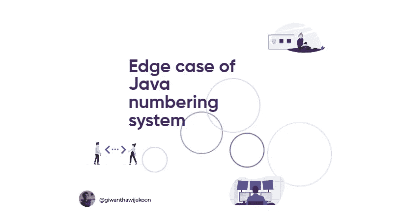
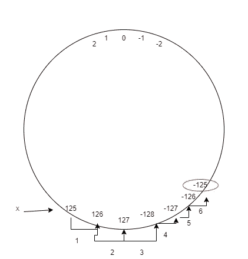

# Java 编号系统的边缘情况

> 原文：<https://medium.com/nerd-for-tech/edge-case-of-java-numbering-system-b6553de2b8b0?source=collection_archive---------4----------------------->



作为 java 开发人员，在开发 java 程序时，我们必须处理许多整型数据类型。所以我们应该更好地理解 java 编码系统是如何工作的，以及 java 编码系统的边缘情况。

## Java 的整数数据类型

*   字节—从-128 到 127
*   短-从-32768 到 32767
*   龙—从-2⁶到 2⁶—1
*   Int —从-2147483648 到 2147483647

以下是 Java 整型数据类型的范围。但是，让我们假设如果我们试图超过每个数据类型可以容纳的值。

例如，假设我们有字节类型变量 x 和 y。x = 125，y = 6，如果我们把它们加在一起，输出会是什么。

```
byte x = 125;
byte y = 6;
System.out.println(x+y);
```

众所周知，字节的范围是从-128 到 127。因此，当我们把 x 和 y 加在一起时，得出 127 没有任何问题。但是 127 之后它将走向何方。为此，让我们看看下面的插图。



根据图示，如果我们把这个范围看作一个圆，一旦超过最大限制，它就变成-128。所以最后的答案是-125。

如果我们对 int，long 或 short 这样做，过程是相同的，但是范围更广。

希望这篇文章对你理解 java 编号系统有所帮助。

谢谢你..