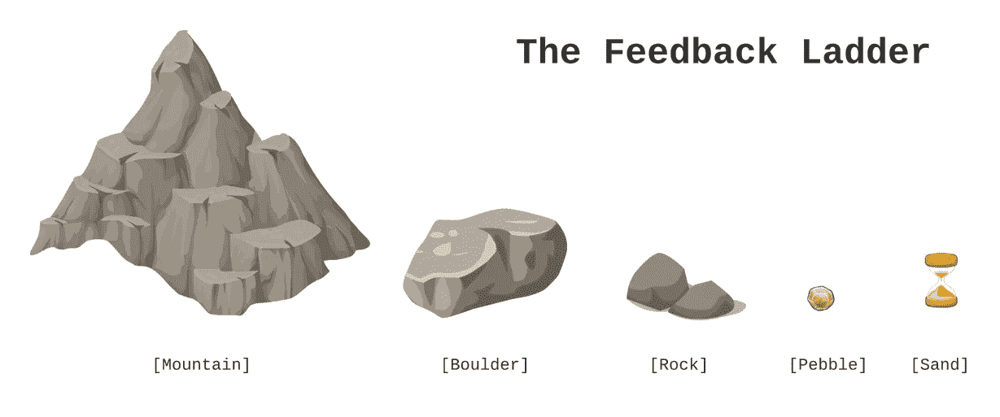
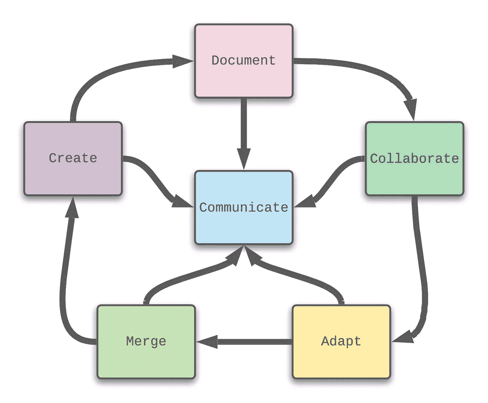
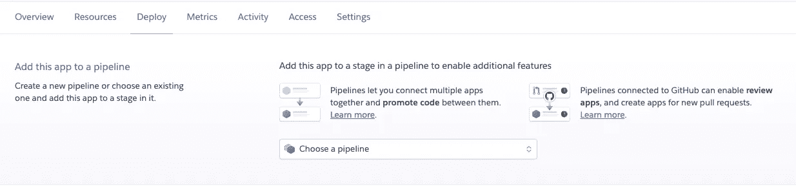
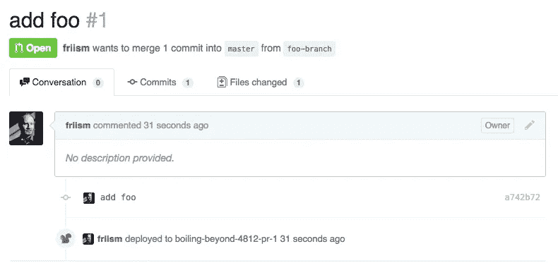
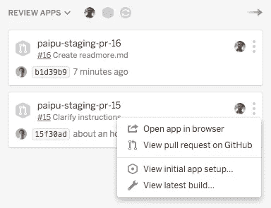

# 远程团队的有效代码评审

> 原文：<https://medium.com/nerd-for-tech/effective-code-reviews-for-remote-teams-a15a8574debf?source=collection_archive---------10----------------------->


2020 年，现代应用程序开发的大环境发生了变化。意外的疫情迫使实体办公室关门，并要求员工远程执行日常任务。这包括专注于创建、构建和增强他们雇主的技术需求的软件工程师团队。

要求团队成员短时间甚至一周的一部分时间远程工作是一回事。另一种方法是立即改变思路，要求每个人都计划无限期地远程工作。事实上，这一新需求的下游效应一直困扰着任何团队最大的需求……团队内部的沟通。

就本文的目的而言，我将把我的关注点缩小到同行评审的社会方面，并关注如何在 100%远程的情况下进行有效的代码评审。

# 代码审查说明

那么什么是代码审查呢？根据维基百科，代码审查是:

> [*“代码审查*](https://en.wikipedia.org/wiki/Code_review) *是一种软件质量保证活动，一个或几个人主要通过查看和阅读程序的部分源代码来检查程序，他们在程序实现后或中断实现时进行检查。”*

代码评审通常被称为同行评审、拉请求(PRs)，甚至是合并请求。无论使用什么术语来定义过程，最终结果都是一样的——在将变更推进到开发生命周期的下一步之前，要求另一个有能力的团队成员审查代码库的更新。

# 水平设置代码审查

不要混淆，所有代码评审的目标都应该是**保持被评审的底层应用或服务的质量**。几年前，福特汽车公司提出了“质量是工作 1”的营销口号，这可以应用于代码审查。毕竟，没有一个产品所有者希望收到没有经过质量检查的特性代码。

使用代码评审还有三个额外的好处:

*   学习机会
*   反馈阶梯
*   软件工程师分析

# 学习机会

代码审查应该始终被认为是每个相关人员的一个学习机会。在大多数情况下，更高级的评审者会提供备选方案或建议，从而改进源代码，并向提交者传达一个教训。然而，作为过程的一部分，评审者获得知识也是常见的。事实上，正是在一次代码审查中，我了解到在 Java 中允许使用下划线来设置静态变量:

```
private static final long FIFTEEN_MILLION = 15_000_000;
```

# 反馈阶梯

“反馈阶梯”是由[丹尼尔·克拉尔](http://www.pz.harvard.edu/who-we-are/people/daniel-wilson) ( [哈佛零项目](https://twitter.com/ProjectZeroHGSE))开发的，是一种协议或结构，通过按建设性的顺序排列反馈来建立信任和支持的文化。 [Netlify](https://www.netlify.com/) 将这种认知方法应用于代码评审，并建立了反馈阶梯:



理解没有两个开发人员解决的问题是完全相同的，代码评审可能很快充满了与代码质量和代码偏好无关的建议。虽然这些建议可能是有效的，但是它们不能解决代码被评审的负面情况。

反馈阶梯方法允许审核者在建议前添加以下类别之一:

*   [mountain] —代码审查被阻止，直到注释被处理
*   [巨石] —阻塞，但可以被允许向前移动(通过补救计划)
*   [rock] —未阻塞，但需要未来的工作(代码中对 ARM 票证的引用)
*   [pebble] —不阻塞，需要进一步考虑
*   [沙子] —不阻挡，“要么接受，要么放弃”

注意:Leslie Cohn-Wein 最初的 Netlify 设计使用了山、巨石、卵石、沙子和灰尘类别，但是我使用上面提供的类别取得了更好的成功。

# 软件工程师分析

代码评审过程本身提供了一个机会来获得参与生命周期事件的软件工程师的分析信息。此类信息有助于证明定期绩效评估后需要做出的决策的合理性。

对于始终专注于遵循设计标准和交付质量的代码评审者来说，经理可以举出许多例子来证明给上层管理人员增加奖励是合理的。

相反，随着时间的推移，通过代码评审过程，可能会暴露出不是团队最佳人选的个人。虽然没有人希望出现这种情况，但拥有可用的文档确实有助于管理层为他们的组织做出最佳决策——而无需要求同事花时间整理他们的想法。

# 远程驱动世界中的代码评审

自从远程工作以来，我已经看到下面的流程在代码审查方面产生了积极的结果:



*   创建——利用基于 git 的工具来建立新的代码审查
*   文档——更进一步包括详细的信息来补充代码评审(包括图表和视频链接)
*   协作——使用屏幕共享或基于团队的工具，浏览代码评审的细节
*   适应—根据反馈进行必要的更新(反馈阶梯)
*   合并—完成代码审查过程(在批准后)

沟通是这个流程的核心，这意味着每一步都采用一种沟通策略，不仅保持代码审查的活跃，而且作为一种机制来提醒从事同一应用程序或组件的其他团队。一些例子包括:

1.  发送代码评审的直接链接(而不是电子邮件)
2.  当代码审查已被批准并且更新可用时宣布
3.  提供关于已批准的代码的信息

# Heroku 查看应用程序功能

[Heroku](https://www.heroku.com) 生态系统包括一个名为“ [Heroku Review apps](https://devcenter.heroku.com/articles/github-integration-review-apps) 的功能，它将在一个完整的、一次性的 Heroku 应用中执行任何 GitHub pull 请求(一种代码审查形式)中的代码。每个 Review 应用程序都有一个唯一的可以共享的 URL，这使它们成为提议、测试和合并代码库更改的好方法。

这种方法的好处是，被分配到代码审查的审查者可以将他们的精力集中在 Heroku Review 应用程序的运行上——使他们不必为了查看提议的源代码的工作版本而隐藏正在进行的更改。

要使用 Heroku 点评应用，只需导航至 Heroku 仪表盘的部署选项卡:



按照此处[记录的步骤](https://devcenter.heroku.com/articles/github-integration-review-apps)，GitHub pull 请求中的对话选项卡将显示 Heroku Review 应用程序已经部署:



此信息也可在 Heroku 仪表盘的应用程序管道页面的“查看应用程序”部分获得:



# 结论

对我来说，2020 年和过去四年没什么不同。我一直完全在 100%远程模式下工作，甚至在 DZone 上发表了以下文章:

*   代码评审——真正重要的是什么？
*   [你的拉动式需求如何？](https://dzone.com/articles/how-are-your-pull-requests)

我目前的项目是我从 1992 年初开始的 IT 生涯中最复杂的项目。除了正在满足的复杂需求之外，还有八个敏捷团队在这个项目上工作，他们的工作人员不仅分布在北美，还分布在欧洲和亚洲。

考虑到在创建原始应用程序所需的一小部分时间内所取得的进展，我强烈认为我们的成功与远程工作的自由以及能够在广阔的地理区域内进行有效通信直接相关。这转化为使用上面提供的许多建议的非常成功的代码评审。

代码审查过程只根据个人的愿望进行隔离——2020 年引入的技术可以缩小任何差距。我真的相信代码审查仅仅是由于 100%远程场景的结果而得到改进。

祝你今天过得愉快！