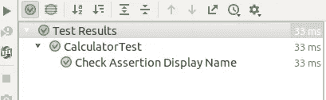
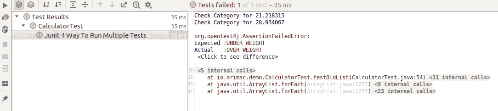
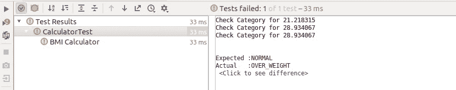
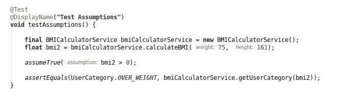
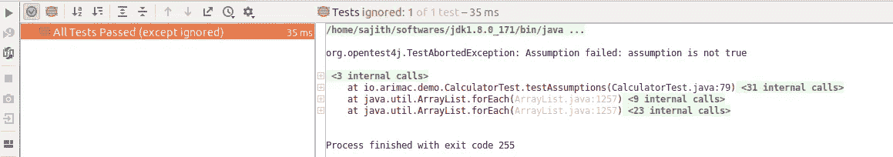
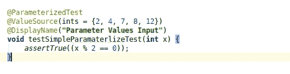
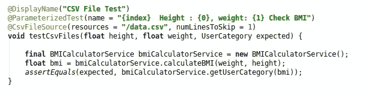
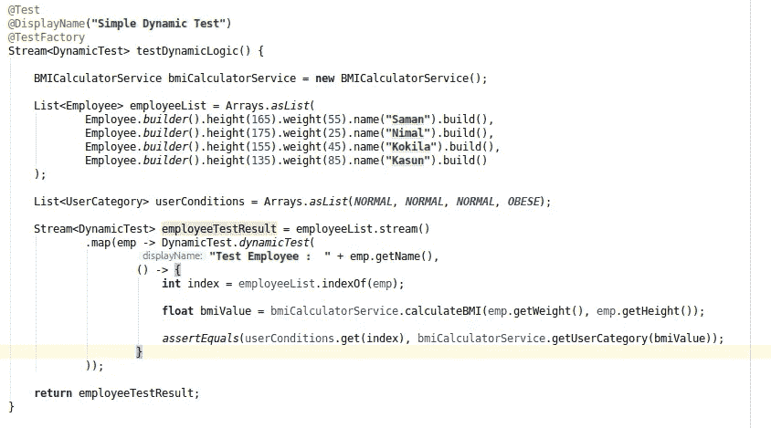
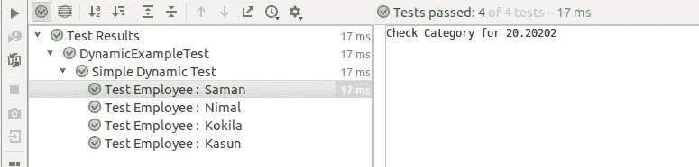
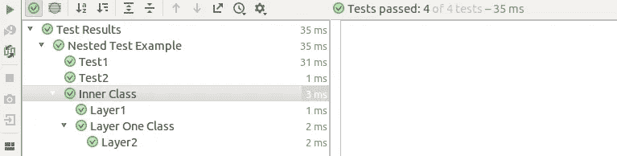

# 用 Junit5 进行有效且可读的单元测试

> 原文：<https://medium.com/nerd-for-tech/effective-readable-unit-testing-with-junit5-c8e5d9579af5?source=collection_archive---------14----------------------->


如何用 junit5 编写可读的单元测试

上周我不得不在 Arimac 做技术演讲，我想用书面媒体分享内容。

这些就是我要在这里讨论的新特性。

*   显示名称
*   组断言
*   条件测试
*   参数化测试(更新)
*   动态测试
*   嵌套测试

在这里，我们将讨论一些如何在 Junit 中编写有效测试的特性&我们将讨论的另一个方面是可读性。

## 设置

要在 java 项目中设置 Junit5，您需要 [**java 1.8**](https://www.oracle.com/java/technologies/javase/javase-jdk8-downloads.html) &以上版本

对于我的设置，我已经创建了[示例项目](https://github.com/sajith4u/junit5-demo)。首先，我们必须添加 junit-jupiter-engine 作为依赖项。

```
<**dependency**>
    <**groupId**>org.junit.jupiter</**groupId**>
    <**artifactId**>junit-jupiter-engine</**artifactId**>
    <**version**>5.7.1</**version**>
    <**scope**>test</**scope**>
</**dependency**>
```

## 显示名称

在运行时，显示名称有助于提高测试用例的可读性。

使用的注释

```
@DisplayName
```

示例:

```
@Test
@DisplayName(**"Check Assertion Display Name"**)
**void** testSimpleAssertion() {
    *assertEquals*(1, 1);
}
```

视角



## 组断言

组断言的主要优点是它有助于一次运行多个检查，如果出现一个错误，它不会阻塞。

让我们先看看我们在六月的表现。

```
@Test
@DisplayName(**"Junit 4 Way To Run Multiple Tests"**)
**void** testOldList() {

    **final** BMICalculatorService bmiCalculatorService = **new** BMICalculatorService();

    **float** bmi1 = bmiCalculatorService.calculateBMI(55, 161);
    **float** bmi2 = bmiCalculatorService.calculateBMI(75, 161);
    **float** bmi3 = bmiCalculatorService.calculateBMI(65, 135);

    *assertEquals*(UserCategory.***NORMAL***, bmiCalculatorService.getUserCategory(bmi1));
    *assertEquals*(UserCategory.***OVER_WEIGHT***, bmiCalculatorService.getUserCategory(bmi2));
    *assertEquals*(UserCategory.***OBESE***, bmiCalculatorService.getUserCategory(bmi3));
}
```

这里的问题是，如果第二个断言失败，它将不会继续检查第三种情况。



然后我们在 6 月 5 日做同样的事情

```
@Test
@DisplayName(**"BMI Calculator"**)
**void** testMBICalculator() {

    **final** BMICalculatorService bmiCalculatorService = **new** BMICalculatorService();
    **final float** bmi1 = bmiCalculatorService.calculateBMI(55, 161);
    **float** bmi2 = bmiCalculatorService.calculateBMI(75, 161);

    Assertions.*assertAll*(() -> *assertEquals*(UserCategory.***NORMAL***, bmiCalculatorService.getUserCategory(bmi1)),
            () -> *assertEquals*(UserCategory.***NORMAL***, bmiCalculatorService.getUserCategory(bmi2)), 
            () -> *assertEquals*(UserCategory.***OVER_WEIGHT***, bmiCalculatorService.getUserCategory(bmi2)));
}
```

这是第二次断言失败时的结果。如果断言中途失败，它将执行第三次。



## 条件测试

当我们编写单元测试时，我们必须根据条件运行一些逻辑。因此，我们可以由 junit 自己来做，而不是在程序级别检查条件。



如果条件失败，它将不会执行测试用例。



## 参数化测试

junit 4 中出现了参数化测试，但是在 junit 5 中，在编写测试用例时有很多改进。***@ parameterized Test***是 **@ *Test*** 注释的子测试，因此不需要同时放置两个注释。



以上两个测试案例解释了我们如何使用多个参数来检查断言。最大的好处是那些参数值给对象类型。读取支持的参数转换[类型](https://junit.org/junit5/docs/current/user-guide/#writing-tests-parameterized-tests-argument-conversion)

## 动态测试

这是我认为 junit5 将提供的最好的特性。原因是我们可以动态地创建测试用例，这有助于在流中进行测试。



在这里，当员工的流列表，它将创建动态测试，并给出结果。我们必须确保测试结果需要返回 DynamicTest 的 Stream、Collection、Iterable、Iterator。



## 嵌套测试

Netsted 测试有助于以更可读的方式编写单元测试。如果我们的类包含大量的测试用例，那么我们可以使用嵌套测试来组织测试。

例如:

```
@DisplayName(**"Nested Test Example"**)
**class** NetstedExampleTest {

    @Test
    @DisplayName(**"Test1"**)
    **void** testDemo() {
        *assertEquals*(1, 1);
    }

    @Test
    @DisplayName(**"Test2"**)
    **void** testLogic2() {
        *assertEquals*(1, 1);
    }

    @Nested
    @DisplayName(**"Inner Class"**)
    **class** InnerLogicTest {

        @Test
        @DisplayName(**"Layer1"**)
        **void** testLogic2() {
            *assertEquals*(1, 1);
        }

        @Nested
        @DisplayName(**"Layer One Class"**)
        **class** LayerOneTest {

            @Test
            @DisplayName(**"Layer2"**)
            **void** testLogic2() {
                *assertEquals*(1, 1);
            }
        }
    }

}
```

像这种方式很容易阅读。



仅此而已。这些代码示例可在[这里](https://github.com/sajith4u/junit5-demo)获得