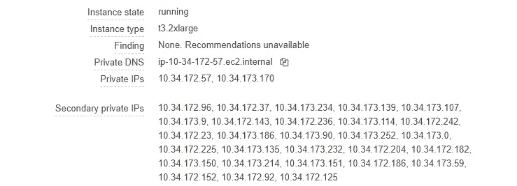
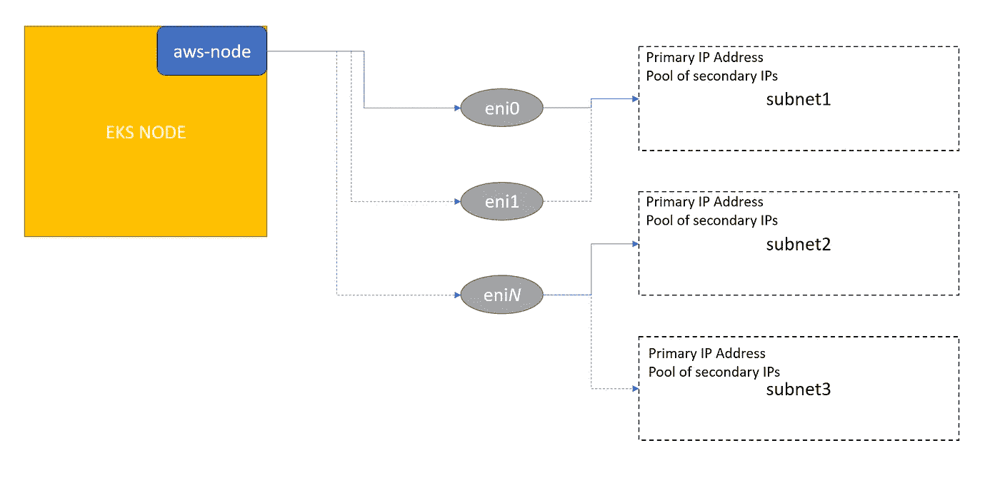

# EKS 网络— CNI

> 原文：<https://medium.com/nerd-for-tech/eks-networking-cni-457ae298b9e6?source=collection_archive---------0----------------------->


[丹尼·布](https://unsplash.com/@dennyisrael?utm_source=unsplash&utm_medium=referral&utm_content=creditCopyText)在 [Unsplash](https://unsplash.com/s/photos/network?utm_source=unsplash&utm_medium=referral&utm_content=creditCopyText) 拍摄的照片

AWS EKS 提供托管 Kubernetes 服务。该服务加快了生产级 K8 群集所需的基础架构的部署、管理和扩展。

上周，我们利用 EKS 自动气象站部署了一个天文学家集群。这是一个开发环境，因此我们从现有的开发 VPC 中选择子网。开始很好，但是当我们在天文学家上创建了 4-5 个部署后，我们开始得到错误。使用这些子网的其他开发人员也开始抱怨他们看到了错误。同时，我打开 CloudTrail 查看错误事件，发现如下:

```
"eventSource": "ec2.amazonaws.com",
"eventName": "CreateNetworkInterface",
"userAgent": "aws-sdk-go/1.33.14 amazon-vpc-cni-k8s"
"errorMessage": "insufficient free address to allocate 1 address"
```

看到这一点后，我查看了各个节点，发现每个节点都分配了许多辅助 IP，这导致了子网中的 IP 耗尽。



在上图中，两个私有 IP 是创建的两个 Eni 的主 IP。IP 的总数是 2+28 = 30。

为了快速释放空间，我们将 EKS 集群的自动扩展组中的子网更改为一个新的独立子网。并逐一终止了现有的节点，它们由 ASG 在新的子网中启动。问题已解决。但是为了对 EKS 的设置进行微调，我开始探索 EKS 的网络。下图描述了[集装箱网络接口](https://github.com/aws/amazon-vpc-cni-k8s)如何在 VPC 联网。



在上图中，我们看到每个 EKS 节点运行一个名为`aws-node`的 Deamonset。它负责创建 ENI、分配 IP 以及将 ENI 连接到 EC2。

> L-IPAM 守护进程在每个节点上维护一个热 IP 地址池，以便在调度时分配给 Kubernetes pods。

在进一步阅读后，我发现同一个守护程序将提供一个辅助接口来满足更多的 pod 需求(上限为实例可以支持的最大 IP 和最大 ENI)。例如，一个 t 3.2x 大型实例类型可以有 4 个 ENI，每个 ENI 最多可以有 15 个私有 IP 地址。因此，在默认设置中，它将保留 30 个 IP。15 个用于主接口，15 个用于辅助接口。如果我们部署 16 个 pod，那么它将创建另一个 ENI，并分配 15 个 IP。因此，到那时，我们将保留 3 个 ENI 和 45 个 IP。

AWS CNI 公开了三种配置来控制上述设置`WARM_ENI_TARGET`、`WARM_IP_TARGET`和`MINIMUM_IP_TARGET`的行为。通过更改这些参数，我们可以调整保留 IP 的数量。但这将增加旋转吊舱的延迟，因为 ENI 的创建和连接可能需要几秒钟。此外，由于对 EC2 API 的调用会更频繁(用于 ENI 创建和附加到节点)，我们可能会看到节流。

但是这个设置释放了 IP 地址，否则这个地址会被 CNI 插件保留。

## 温暖 _ ENI _ 目标

> 指定守护程序应准备好的 Eni 数量
> 默认值为 1。

通过将值设置为 0，意味着从一开始就没有第二 ENI。因此，对于 t3.2xlarge，我们在开始时将只保留 15 个 IPs。如果我们部署第 16 个吊舱，那么我们将为第二个 ENI 预留另外 15 个。

## WARM_IP_TARGET

> 指定将为节点-ENI 对保留的 IP 数量

将此值设置为 10 并将 WARM_ENI_TARGET 设置为 0 将仅保留 10 个 IPs。一旦我们达到了 10 个吊舱，它将从主 ENI 再消耗 5 个吊舱，并为辅助 ENI 提供 10 个预留的 IPs。

## 最小 _IP_TARGET

> 指定每个节点周围要保留的最小 IPs 数量。

最佳做法是对大型集群使用默认设置。将 K8s 集群保留在单独的 VPC。对于较小且可预测的集群，我们可以将最小 IP_TARGET =节点上的吊舱数+3/4，并将 WARM_ENI_TARGET = 0 和 WARM_IP_TARGET 设置为 2 或 3。

对于现有集群，我们可以通过首先创建一个 YAML 文件来更新，如下所示:

```
spec:
  template:
    spec:
      containers:
        - name: aws-node
          env:
            - name: WARM_IP_TARGET
              value: 2
            - name: WARM_ENI_TARGET
              value: 0
            - name: MINIMUM_IP_TARGET
              value: 10
```

然后运行以下命令:

```
kubectl patch daemonset -n kube-system aws-node "$(cat patch.yaml)"
```

谢谢，快乐学习！！