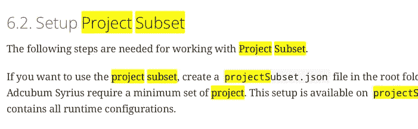

# 使用 Kotlin 突出显示弹性搜索

> 原文：<https://medium.com/nerd-for-tech/elasticsearch-highlighting-with-kotlin-e4b35ee1780e?source=collection_archive---------2----------------------->

本周，我不得不在我的项目的搜索栏中添加高亮显示功能。目前，每当我在前端点击一个搜索结果，它就会打开相应的文档。这些文档非常长，因此要花很长时间才能找到文档中您要找的部分。为了解决这个问题，我需要在文档中突出显示最佳匹配，这样您就可以一目了然了。

# 使用 KT-Search 突出显示

KT-Search 是一个很棒的 Kotlin 客户端，用于弹性搜索。即使没有得到官方支持，它也提供了官方 Java 客户端的大部分特性。[遗憾的是，kt-search 不支持高亮显示](https://www.elastic.co/guide/en/elasticsearch/reference/current/highlighting.html#highlighting)。因此，我们需要自己编写功能。

本教程的最终结果将是一个包含突出显示的术语信息的 ElasticSearch。

这个问题的解决方案由三部分组成:

1.  创建查询
2.  接收响应
3.  反序列化 SearchResponse

## 创建查询

首先，我们需要找到一种方法向 ElasticSearch 发送一个包含带高亮显示的查询的请求。由于没有突出显示自身的功能，我们必须使用 kt-search 的 rawBody 特性。

因为这个查询可能会很长，所以我为它创建了一个单独的函数。

请用`highlight`块注意下部:

*   前后标签环绕匹配的术语。如果你不定义它们，ElasticSearch 会用`<em>`和`</em>`来表示它们。
*   `fields`块定义了应该从哪个字段返回最佳匹配。
    ElasticDocument 是一个数据类，其值称为`content`。我使用它，因为我可以通过 IntelliJ 重构，而不必在每次更改这个属性的名称时手动更改字符串。
*   `fragment_size`定义了片段的最大长度。片段是匹配的术语与其周围的一些上下文的组合。
*   `number_of_fragments`定义在一个请求中返回多少这样的片段字符串。
*   应基于此[信息](https://www.elastic.co/guide/en/elasticsearch/reference/current/highlighting.html#set-highlighter-type)选择`fragmenter`和`type`。

## 接收响应

既然我们现在有了高亮显示的查询，我们可以使用库的`search()`函数，对吗？号码

搜索功能的 SearchResponse 不包含高亮显示。这意味着我们必须自己去做。

这个函数只返回字符串形式的 JSON。它使用 SearchClient 的 restClient 创建一个新的 post 请求。路径由索引的名称和我们希望在 ElasticSearch 上执行的功能一起设置。在我们这里是`_search`。

`rawBody`使用我们在`createQuery()`函数中定义的 JSON 字符串。

## 反序列化 SearchResponse

最后，我们需要将带有搜索结果的字符串反序列化为一个命中列表。通常这将由 kt-search 处理，但由于 kt-search 的默认搜索响应不包含高亮信息，我们需要自己编写它。

这些是反序列化所需的可序列化类。

请注意，Hit 类过滤掉了突出显示的术语，因此您的搜索结果中没有`<highlighted>`包装器。

现在我们可以将所有这些步骤合并到我们自己的搜索函数中，这样我们就可以像平常一样调用它。

既然我们用`@Serializable`注释了上面的所有类，现在我们可以调用 kt-search 提供的`DEFAULT_JSON`对象的`decodeFromString`方法。

这将返回包含嵌套命中的 SearchResponse。我们可以通过调用`searchResult.hits`来访问它们。

最后，我们有包含突出显示信息的点击。

# 反射

## 什么进展顺利

在我看来，检索突出显示信息的自写逻辑的实际实现非常好。我没有那么多问题，因为我可以用单元测试来测试行为。

## 什么需要改进

我遇到的最大问题是理解 kt-search 的 SearchResponse 确实不包含任何关于高亮显示的信息。我很困惑，因为我发送了一个带有突出显示请求的查询，但是没有得到任何结果。当我通过 curl 发送一个请求时，我终于明白了，这与 kt-search 的 SearchResponse 有关。下一次，我将首先读取响应对象的 JavaDoc，这样我就可以一眼看出我正在寻找的字段不包含在其中。