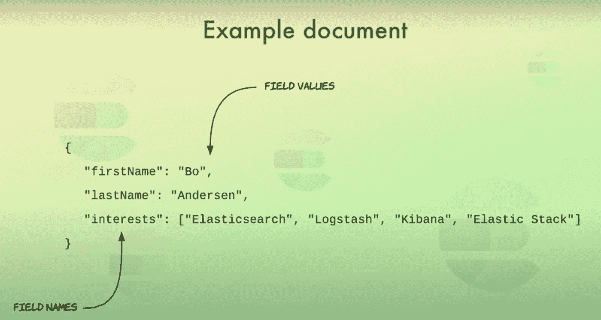
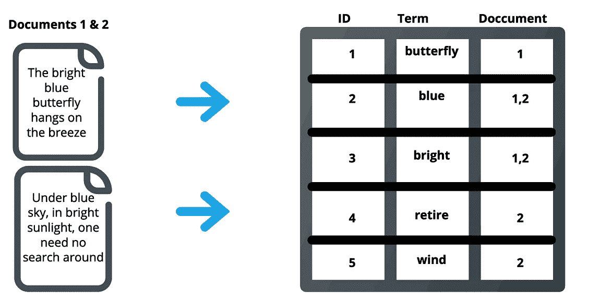
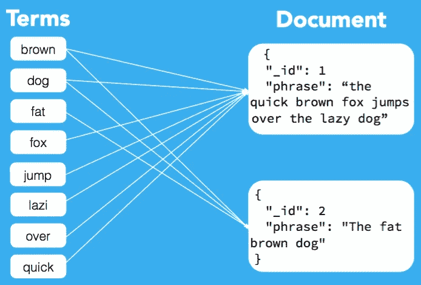
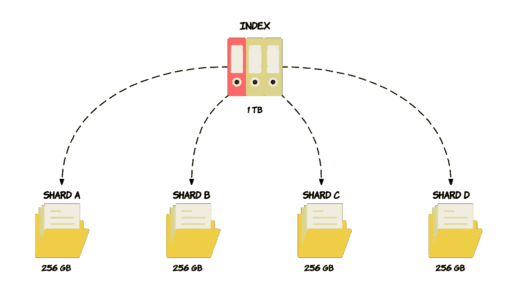
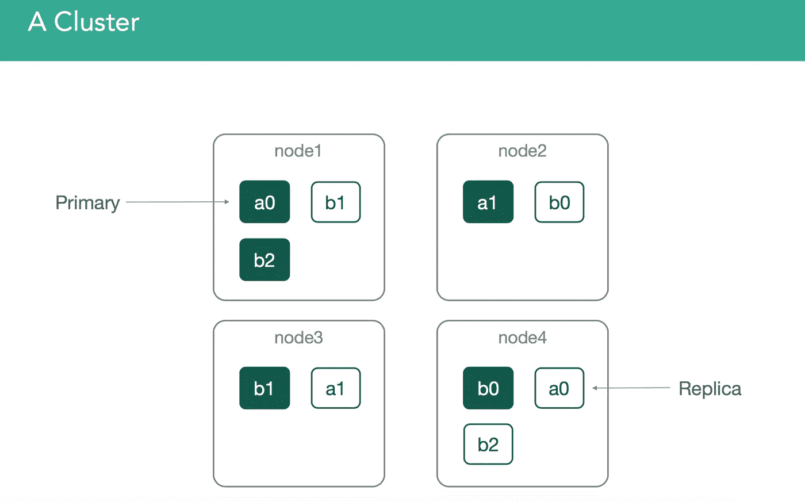
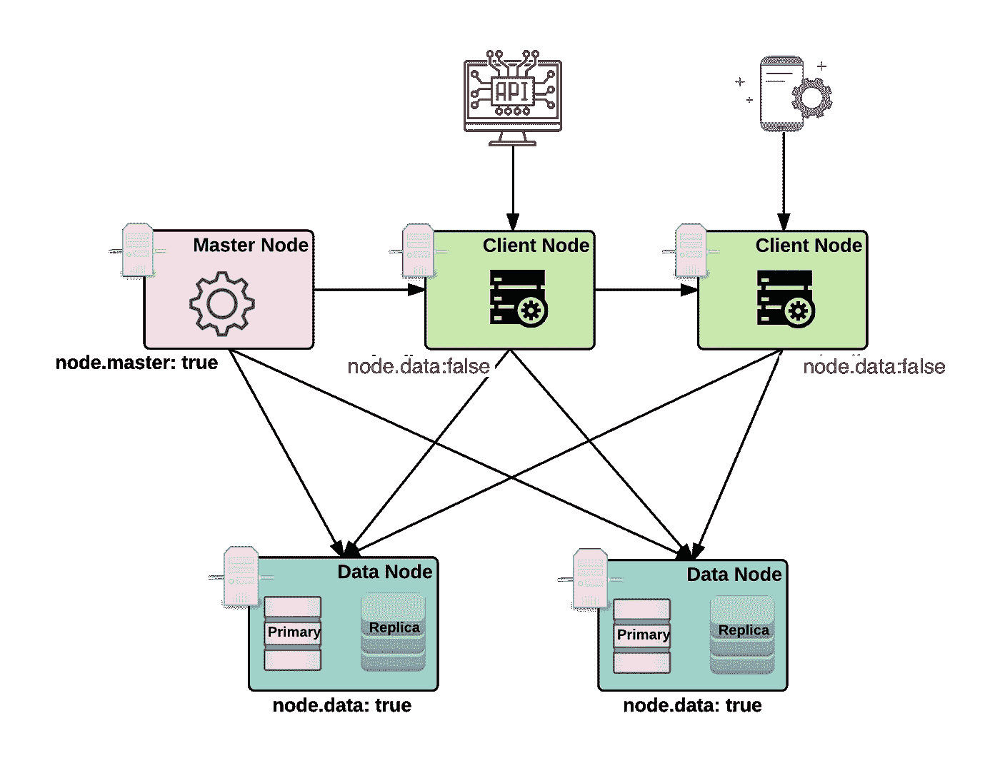

# 弹性研究第一部分:温和的介绍

> 原文：<https://medium.com/nerd-for-tech/elasticsearch-part-1-5ba00a04cf8a?source=collection_archive---------5----------------------->

# 什么是 Elasticsearch？

*   Elasticsearch 是一个分布式、开源的搜索和分析引擎，适用于所有类型的数据，包括文本、数字、地理空间、结构化和非结构化数据。
*   基于 Apache Lucene 构建，用 Java 开发
*   它允许你存储，搜索和分析大量的数据快速和接近实时，并在几毫秒内给出答案。它能够实现快速搜索响应，因为它不是直接搜索文本，而是搜索索引。
*   它使用基于文档的结构，而不是表和模式，并附带了大量 REST APIs 来存储和搜索数据。
*   数据以无模式 JSON 文档的形式存储。

# Elasticsearch 是用来做什么的？

Elasticsearch 的速度和可伸缩性及其索引多种类型内容的能力意味着它可以用于许多用例:

*   应用程序搜索
*   网站搜索
*   企业搜索
*   日志记录和日志分析
*   基础设施指标和容器监控
*   应用程序性能监控
*   地理空间数据分析和可视化
*   安全分析
*   商业分析

## 很少有公司使用 Elasticsearch..

# Elasticsearch(ES)是如何工作的？

为了理解工作流程，我们将首先研究 ES 的关键概念

## 文档

*   在专家系统中，数据以文档的形式存储，文档是信息的基本单位
*   这个文档只是一个 JSON 对象
*   类似于关系数据库中的行(例如:MySQL)
*   文档可以包含类似于关系数据库中的列的字段

## 指数

*   索引是具有相似特征的文档的集合。
*   索引是在 Elasticsearch 中可以查询的最高级别的实体。
*   类似于关系数据库中的数据库。
*   索引中的任何文档通常都是逻辑相关的。

## 倒排索引

*   Elasticsearch 中的索引实际上是所谓的倒排索引，这是所有搜索引擎工作的机制。它是一种数据结构，存储从内容(如单词或数字)到其在一个文档或一组文档中的位置的映射。
*   它是一种类似 hashmap 的数据结构，将您从一个单词引导到一个文档。倒排索引不直接存储字符串，而是将每个文档拆分成单独的搜索词(即每个单词)，然后将每个搜索词映射到这些搜索词所在的文档。
*   例如，在下图中(图:倒排索引-1)，术语“retire”出现在文档 2 中，因此它被映射到该文档，类似地，术语“blue”出现在这两个文档中，因此被映射到这两个文档。这可以作为在给定文档中查找搜索词的快速查找。

倒排索引 1 倒排索引 2

*   通过使用分布式倒排索引，Elasticsearch 可以从非常大的数据集中快速找到全文搜索的最佳匹配。
*   **倒排索引的优点有:**
*   倒排索引允许快速全文搜索，但代价是当文档被添加到数据库中时，处理时间会增加。
*   很容易开发。
*   它是在文档检索系统中使用的最流行的数据结构，例如在搜索引擎中大规模使用。
*   **倒排指数也有缺点:**
*   更新、删除和插入的存储开销大，维护成本高。

## **映射**

*   它主要用于指定索引的模式。它定义了索引中的字段、每个字段的数据类型以及 Elasticsearch 应该如何处理该字段。映射还用于配置与类型关联的元数据。

## 陶瓷或玻璃碎片

*   Elasticsearch 提供了将索引细分为多个片段(称为碎片)的能力。
*   每个碎片本身就是一个全功能的独立“索引”，可以托管在集群中的任何节点上。
*   通过将索引中的文档分布在多个分片上，并将这些分片分布在多个节点上，Elasticsearch 可以确保冗余，这既可以防止硬件故障，又可以在节点添加到集群时提高查询能力。

## 复制品

*   Elasticsearch 允许您制作一个或多个索引碎片的副本，这些碎片被称为“副本碎片”或简称为“复制品”。基本上，副本碎片是主碎片的副本。索引中的每个文档都属于一个主碎片。副本提供了数据的冗余拷贝以防止硬件故障，并增加了处理读取请求(如搜索或检索文档)的能力。

## 串

*   集群是由一个或多个连接在一起的节点实例组成的组。集群的性能取决于任务、搜索和索引在集群中所有节点之间的分布。

## 结节

*   节点是作为群集一部分的单个服务器。节点存储数据并参与集群的索引和搜索功能。Elasticsearch 节点可以不同方式配置:
*   **主节点** —控制 Elasticsearch 集群，并负责所有集群范围的操作，如创建/删除索引和添加/删除节点。`node.data: false`和`node.master: true`
*   **数据节点** —存储数据并执行数据相关操作，如搜索和聚集。`node.data: true`
*   **客户端节点** —向主节点转发集群请求，向数据节点转发与数据相关的请求。`node.data: false`
*   ES 允许将节点配置为允许或不允许在本地存储数据。本地存储数据基本上意味着允许在该节点上分配不同索引的碎片。默认情况下，每个节点都被认为是一个数据节点，可以通过将`node.data`设置为`false`来关闭。

# 弹性堆栈(ELK)

*   Elasticsearch 是 Elastic Stack 的核心组件，是一套用于数据摄取、丰富、存储、分析和可视化的开源工具。
*   根据其组件，它通常被称为“ELK”堆栈

E —弹性搜索，

L — Logstash，

基巴纳

现在还包括节拍

## 基巴纳

*   [Kibana](https://www.knowi.com/blog/grafana-vs-kibana/) 是一款用于弹性搜索的数据可视化和管理工具，提供实时直方图、折线图、饼图和地图。它可以让您可视化您的 Elasticsearch 数据并浏览 Elastic 堆栈。

## Logstash

*   Logstash 用于聚合和处理数据，并发送给 Elasticsearch。它是一个开源的服务器端数据处理管道，可以同时从多个来源获取数据，对其进行转换，然后将其发送到 collect。它还通过识别命名字段来构建结构，转换和准备数据，而不考虑数据的格式，并将它们转换为通用格式。

## 搜索

*   Beats 是一个轻量级、单一用途的数据传输代理集合，用于将来自成百上千个机器和系统的数据发送到 Logstash 或 Elasticsearch。Beats 非常适合收集数据，因为它们可以放在你的服务器上，放在你的容器中，或者作为功能部署，然后在 Elasticsearch 中集中数据。

这让我们走到了尽头👀….

这只是对 ES 的一个友好的介绍，希望这篇文章能让你对 ES 有一个基本的概念

> 未知的未知作为已知的未知..

希望我有动力发布一个深入的弹性研究第二部分的故事

正如**总是…..**

