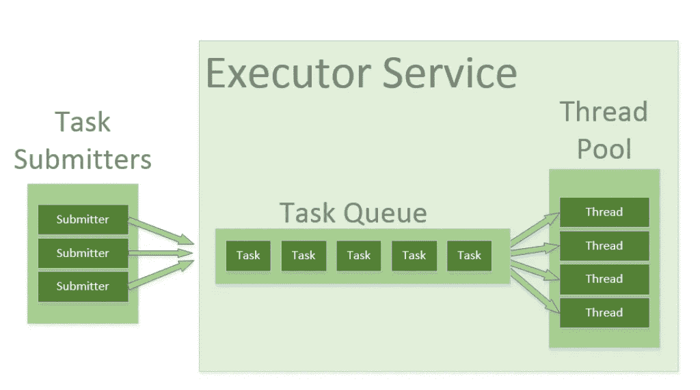
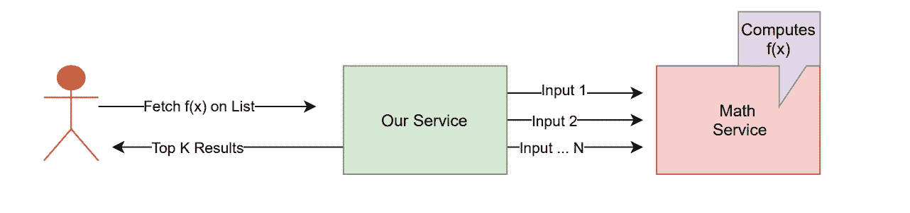
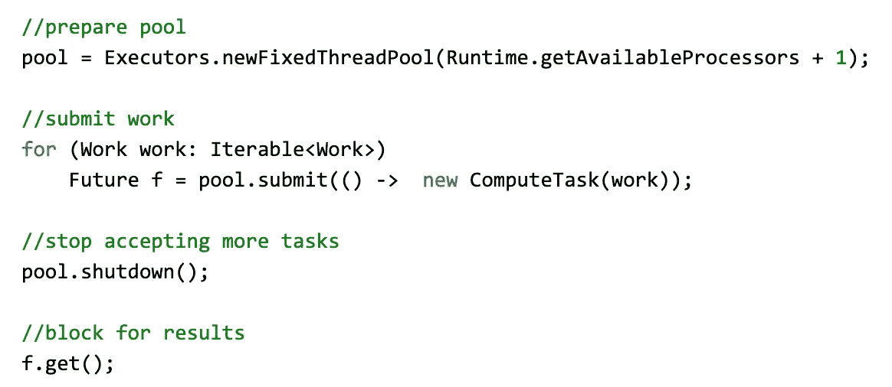
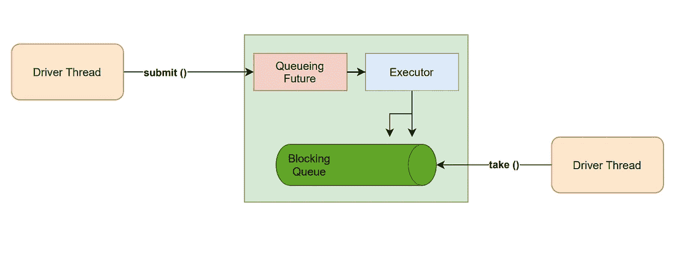
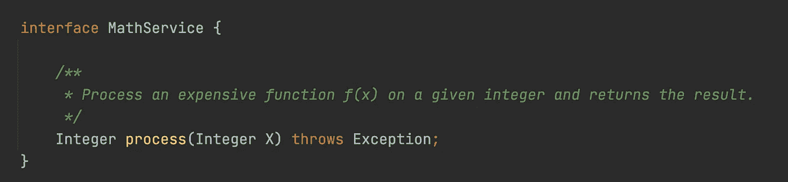
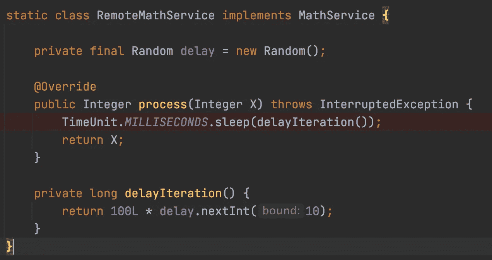
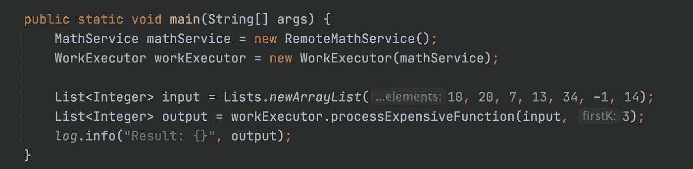
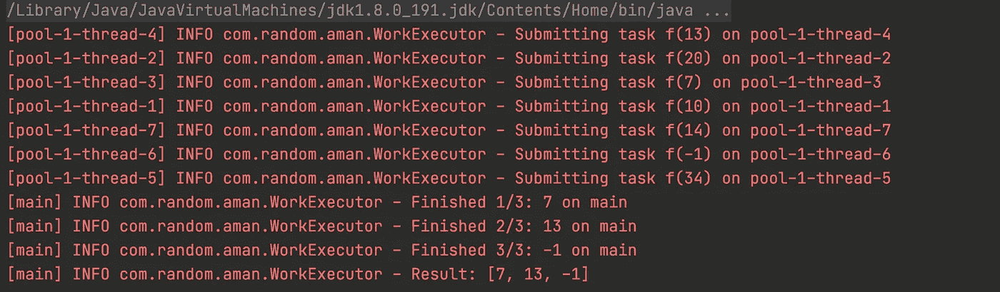
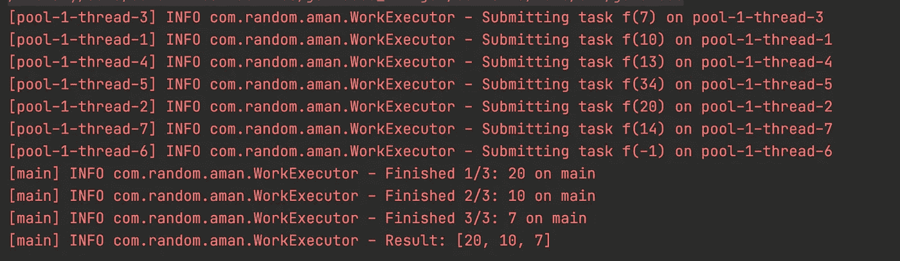
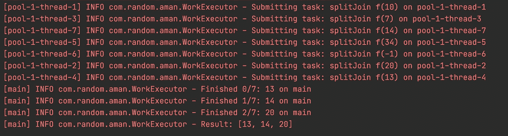

# 使用完成服务并发执行工作的优雅模式[Java]

> 原文：<https://medium.com/nerd-for-tech/elegant-patterns-to-execute-work-concurrently-using-completion-service-java-1bee26f186b9?source=collection_archive---------11----------------------->

礼貌:[https://www.baeldung.com/](https://www.baeldung.com/)

# 用例分析

假设您有一个用例，其中有一个来自用户的`input of N numbers`，您需要获取一个*昂贵的数学函数* `*f(x)*` 对这些数字进行计算的结果，并返回任何首先完成的`first K`。

此外，计算昂贵函数结果的逻辑是通过与远程服务的 HTTP 交互获得的，比如说`Math Service`

**的目标**就是用 `minimal latency overhead`来解决这个问题。

高级用例

我们如何着手解决这个问题？先从提问开始。

## 描述我们的工作量

在我们提出任何解决方案之前，分析我们正在处理的工作量是很重要的。

*   工作受 I/O 限制，不受计算限制。
*   输入将是一个数字列表，可以建模为`Iterable<Work>`
*   我们最有可能使用 HTTP 进行远程服务通信。
*   结果的无序执行/完成是完全可以接受的。
*   需要一组有限的结果`K ≤ N`。

## 利用域服务。

现在是了解该领域更多信息的好时机。我们需要与`Math Service`的维护者和利益相关者进行一次引人入胜的讨论。

*   有什么类型的输入可以用来计算吗？
*   我们能否`pre filter`较慢的输入，以便输入大小`N = K`
*   `Math Service`可靠吗？如果*是*，那又如何？如果*没有*，有何不可。
*   在某个输入之后， `Math Service`是否降级/速率限制请求？
*   我们是否知道用户将给出什么样的输入，以便`Math Service`或我们的服务能够`precompute / cache`得到结果？

让我们假设以上所有问题的答案都是`No`。上面的任何`Yes`都会使问题变得更简单，并增加更多优化的空间。

## 积木

*   我们知道工作负载可以并行化。因此，多线程。
*   我们知道我们需要一个**线程池执行器**的实现来有效地管理线程。让我们从固定线程池开始。

伪代码。在固定的执行者中提交工作。不是最有效的方法。

这个管用。但是，有一些明显的**问题**:

*   我们需要`block`获取订单中每个调用的结果。这意味着如果用户想要一批`20`的任何`10`结果，并且如果第一个请求是最慢的，那么计算整批的时间就会受到影响。
*   我们没有利用我们不需要按顺序获得结果这一事实。任何订单都可以。

是否有一个`Executor`的实现，当任务被提供给它时，结果按照它们完成的顺序**放置在队列中**和**而不是按照它们被提交的顺序**放置在队列中**？**

有没有一个实现可以在任务完成时将结果放到一个队列中，这样我们就可以获取`first K`并完成任务了？

理想的执行者服务按照“完成”顺序而不是“提交”顺序排队“完成”任务

## 遗嘱执行人完成服务

[执行人完成服务](https://docs.oracle.com/javase/7/docs/api/java/util/concurrent/ExecutorCompletionService.html)正是如此。

它没有试图找出哪个任务已经完成(以获得结果)，而是要求`CompletionService`实例在结果可用时返回结果。

这就是我们想要的。让我们把积木编码出来。

## 数学服务:

我们不必太担心这里的底层细节。为了模拟远程交互上的调用，让我们在输入上添加一个随机延迟。

我们的数学服务接口。简单。太美了。

我们只是在随机延迟后返回相同的数字。模拟真实呼叫中的网络延迟。

## 工作执行者

这是完成实际工作的地方。这里，我们有一个对`Math Service`的依赖注入，并向该方法公开一个`API`。

## 驱动程序

*   初始化驱动程序中的依赖项和被依赖项。
*   输出给定输入的结果。

我们的司机。我们想要给定列表中的前 3 个。

让我们看看**输出**。注意按顺序提交给**的第一个任务是**而不是**第一个完成的。这是因为每个都有随机延迟，我们处理`first available results.`**

我们想要达到的目标。返回最先完成的 top K。

如果我们再次运行，我们可能会注意到不同的结果。

## 一般化

这很好。如果现在有一个类似的需求，但是是针对`User Service`而不是`Math Service`呢？比方说，我们想要用户的`first K payment methods`，并在 UI *(结账页面)*上显示结果

你注意到这里有一个**图案吗？我们将工作分成块并提交给执行程序，然后循环查找第一个 **K** 。我们不应该担心 executor 服务的低水平的`take`/`submit`API。**

> 确实有。

*   `Define an iterable / stream of input`在其上工作将被分割并提交给执行者。
*   为 iterable 中的每个元素创建一个任务。这指定了实际工作。
*   `Specifying the count of results`那是意料之中的。并非所有方法都要求完成所有子事件。这将是参数 **K**
*   `Implement a collector`用于收集中间结果并返回最终响应。它可能是一个*列表，一个*集合或者其他什么。

让我们定义一个整个代码库都能受益的**接口**。

有了上面的接口，我们可以像下面这样优雅地为我们以前的数学服务解决方案建模。

使用界面解决我们的问题。

仅此而已。使用由`Concurrent Work Executor`支持的`splitJoin`抽象，我们的应用程序可以从不知道底层细节中获益。这又是输出。

我们得到类似的输出。但是现在我们有了一个很好的抽象。

获取`top K Payment methods`现在变得容易了。

我们如何获取前 K 个付款方式的详细信息

## 接口实现:无序并发工作执行器

难题的最后一部分是实现并发工作执行器接口。我们可以有多种实现。一个可以无序处理结果*一个可以有序处理结果*等等。

*   该执行器将其任务提交到一个`newCachedThreadPool`中，这可以进一步参数化。有些可能需要固定的线程池。
*   `Shuts down the pool`立即避免更多的工作。
*   使用完成服务(阻塞完成队列)处理到达的`non null events of completion results`
*   它等待尽可能多的需要完成的任务。
*   当任何一个`future#get`失效时

> 如果你不要第一个 K 而是要整个结果呢？
> 你只需将 K 设为整个输入的大小。

这应该很容易实现。我在必要的地方添加了相关的评论。请随意跳过这一步或自行实现。

# 结论

*   确定工作量
*   尽可能地利用这个领域。
*   选择正确的执行者服务实现和正确的执行者。
*   围绕它建立一个有意义的抽象。
*   记录接口以及它们如何提供价值。

> 完整的要点和单元测试可以在这里看到[。
> 就这么定了。希望这一块增值。欢迎建设性的反馈:)](https://gist.github.com/isopropylcyanide/b345af36179ee522d4b2152a502e174c)