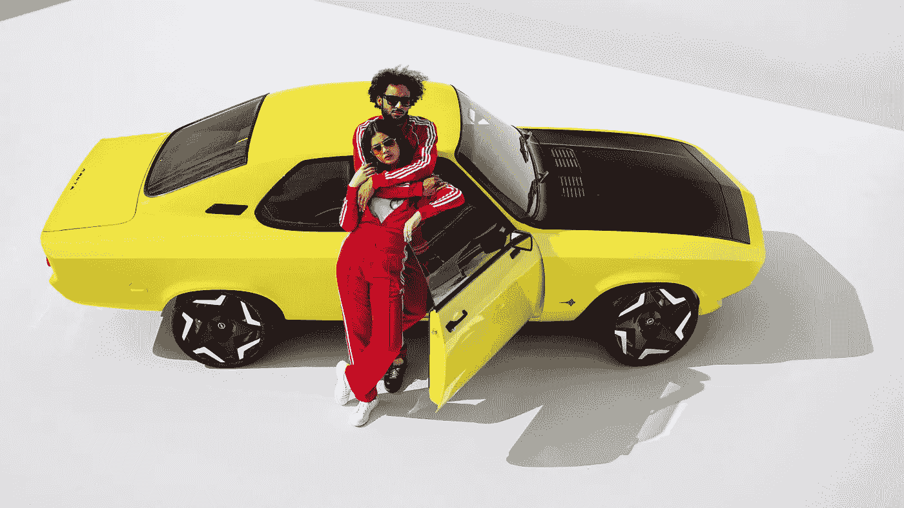
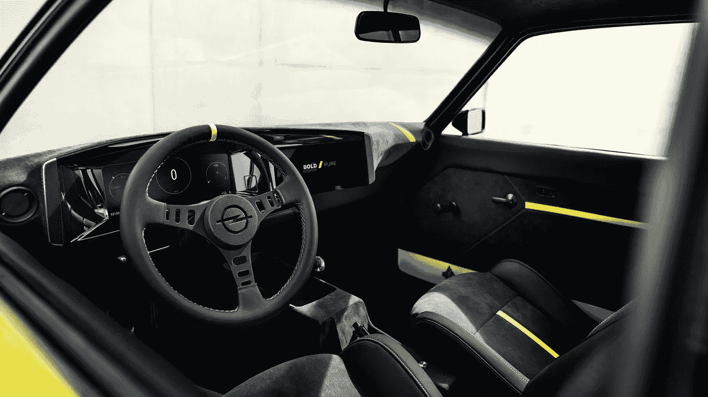
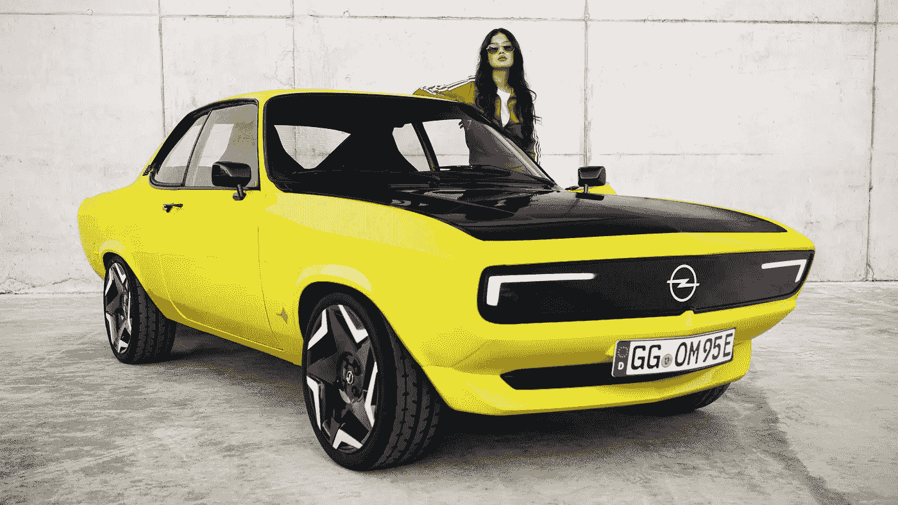
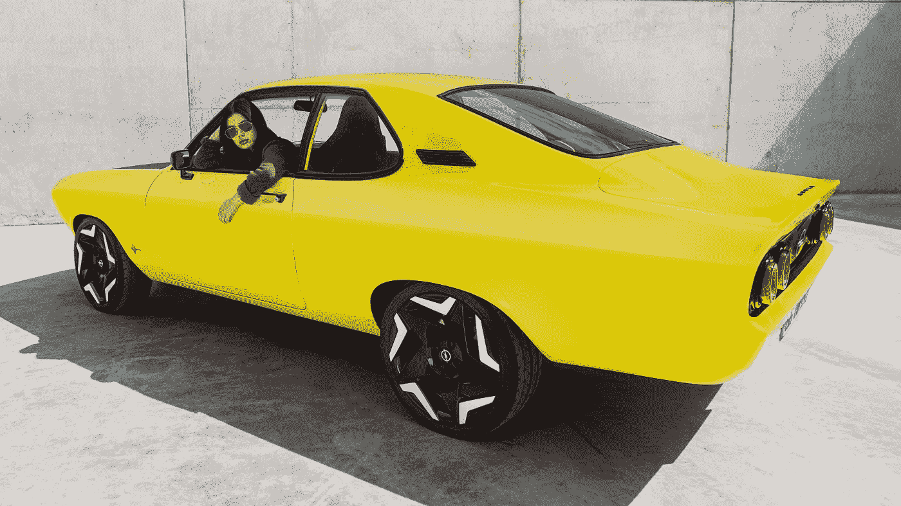

# 欧宝将 Restomod 趋势提升到了一个全新的水平

> 原文：<https://medium.com/nerd-for-tech/elektromod-cf175801286b?source=collection_archive---------34----------------------->

## 四轮趋势

## Manta coupé周年纪念日以一个一次性的概念来庆祝，这个概念用过去来预测未来的冒险

欧宝 Manta GSe ElektroMOD

R estoration 是汽车世界的一部分，一直吸引着无数车迷的注意力和热情。简而言之，这是一门艺术，在寻找或生产必要的新部件的同时，对旧车的原始部件进行加工，以使其尽可能接近其过去的状况。

调谐是*汽车世界的另一个*领域，一直吸引着无数车迷的注意力和热情。简而言之，它是一门艺术，在研究或生产必要的新部件的同时，对任何车型的原始部件进行加工，以尽可能发挥其潜力。

这两种趋势过去被认为是截然相反的，因为一种是保持汽车的原始状态，另一种是对其进行修改。然而，一旦发烧友意识到，最终，两者都旨在改善汽车，一切都突然改变了:“restomod”趋势出现在几年前，而且没有计划结束。

# restomod 到底是什么？

我们可以认为它介于简单恢复和典型调优之间；这是一种从所有磨损迹象中恢复旧车，用新部件更换安全相关部件，并根据其用途(如越野或赛道动力)提高其性能的做法。它包括在现代重新诠释汽车。

除了世界各地独立车主返工的众多汽车之外，一些汽车制造商也加入了这场派对。两年前，讴歌以其最新的全轮驱动系统为中心，对 [SLX](https://s36.wheelsage.org/picture/a/acura/super_handling_slx/acura_super_handling_slx_81.jpeg) 进行了改造。捷豹早些时候在标志性的 [E 型](https://s36.wheelsage.org/picture/j/jaguar/e-type_zero/jaguar_e-type_zero_79.jpeg)上做了类似的工作，但重点是电动动力系统。现在我们有了欧宝。

本文照片中的 20 世纪 70 年代跑车[通过了 ElektroMOD，它包括一个 145 马力、166 磅英尺的电动机，一个 31 千瓦时的电池组，再生制动系统和一个 9 千瓦的车载充电器。一个剧情转折是，原来的四速手动变速箱被保留了下来，虽然你可以在自动模式下使用它。](https://s36.wheelsage.org/picture/o/opel/manta_sr/opel_manta_sr_1.jpeg)

# 电动摩托在那里停吗？

一点也不。该名称的“MOD”部分涉及对 20 世纪 70 年代设计的颇具品味的改造，以适应欧宝的最新趋势。闪亮的黄色和黑色油漆与类似原版的三维 LED 尾灯、形状类似最新欧宝汽车的 drl 以及特别设计的 17 英寸合金车轮搭配在一起。

在内部，有运动座椅，重新加工的方向盘，黑色和黄色的新配色方案，Alcantara 内饰，高端 Marshall 音响系统和纯面板系统:12 英寸和 10 英寸的高清显示屏，作为仪表盘和信息娱乐系统，面向这款运动型汽车的驾驶员。

然而，说到屏幕，我们看到了最令人印象深刻的消息:Pixel-Vizor 是一个数字屏幕，它取代了 Manta GSe 的整个宽度上的上格栅。根据宣传视频，它显示了高清的有趣信息，如“我的德国心已经通电”，以及一条蝠鲼的剪影。

# 接下来会发生什么？

讴歌和捷豹可能已经使用 restomodding 分别专注于过去和现在，但欧宝正在暗示其未来——顺便说一下，这与其英国同行沃克斯豪尔相同。正如本文的[所述，这些品牌必须密切关注形象管理，因为它们是 Stellantis 庞大产品组合的一部分。](https://danilloalmeida.medium.com/stellantis-ee93fcf117c4)

[*AutoExpress*](https://www.autoexpress.co.uk/vauxhall/mokka-x/353997/new-hot-vauxhall-mokka-get-vxr-badge-and-electric-power) 已经报道了两人正在考虑转向电动汽车的性能部门工作，因此这款 Manta 可能只是 GSe 名称的第一次实际使用。另一方面，Pixel-Vizor 预计不会上市:似乎太贵了，而日常实用性又太少。

说实话，欧宝本可以用许多其他方式庆祝曼塔 50 周年；ElektroMOD 概念是一个计划，利用经典汽车的强大形象来吸引聚光灯，并实际上利用它们来展示其即将推出的一些想法和技术。幸运的是，一切都以一种非常漂亮的方式完成了。

restomod 趋势已经持续；越来越多的爱好者每天都参与其中，甚至汽车制造商也加入了这个派对。你如何看待欧宝对 ElektroMOD 的解释？更重要的是，你对这款概念车的趋势有何看法？使用下面的评论按钮说出你的想法！