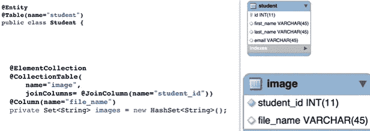
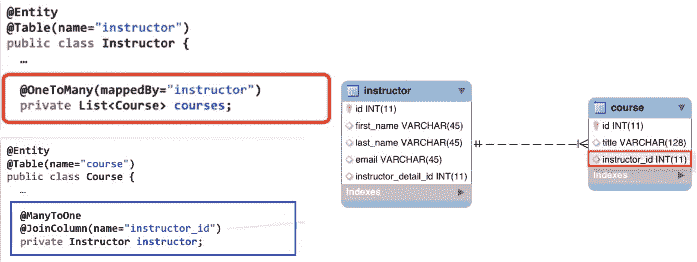

# @ElementCollection VS @OneToMany 在 Hibernate 中

> 原文：<https://medium.com/nerd-for-tech/elementcollection-vs-onetomany-in-hibernate-7fb7d2ac00ea?source=collection_archive---------0----------------------->

这对你意味着什么？

首先，我们要逐一理解每个概念。

# @元素集合

用最简单的术语来说，@ElementCollection 告诉编译器我们正在映射一个集合，其中，@CollectionTable 给出目标表的名称，然后@JoinColumn 指定我们实际连接的列，如下所示:

1`

它以下列方式定义关系:

*   与@ Embeddable 对象的一对多关系
*   一对多关系基本对象，如 Java 原语、包装器、日期、字符串等。

# @ OneToMany

It 定义了当目标对象只是一个实体时的一对多关系。如下例所示，一名教师可以有多门课程。

# **对比:**

1.  另一方面，@ElementCollection 与@ OneToMany 非常相似，只是目标对象是 ***而不是*** 一个实体。
2.  使用@ElementCollection，我们不能独立于父对象来查询、持久化或合并目标对象。
3.  它不支持级联操作。这意味着目标对象 ***总是与它们的父对象*** 保持、合并、删除。
4.  所以， *@ElementCollection 是一个用简单/基本对象定义集合的简单方法。@ OneToMany 最适合需要细粒度控制的复杂用例。*

希望你喜欢。

关注我关于 AWS、Java、Spring、Hibernate 的新文章

保持联系:)

## 如果你喜欢这篇文章，请为它鼓掌。对我来说，这将是真正的升值。

## 推特:[https://twitter.com/SakshiKhandlwl](https://twitter.com/SakshiKhandlwl)
领英:[www.linkedin.com/in/sakshikhandelwal276](http://www.linkedin.com/in/sakshikhandelwal276)