# 电梯拼图:向上移动！

> 原文：<https://medium.com/nerd-for-tech/elevator-puzzle-movin-on-up-bd44a4fa2a97?source=collection_archive---------19----------------------->

我们已经到了电梯拼图的最后阶段了！

那么现在我们的电梯已经下来了，我们已经跳上去了，接下来做什么呢？首先，如果我们进入电梯，我们将离开电梯面板的触发区域，所以让我们将它扩展一点，这样当我们再次按 E 键向上时，我们仍然可以控制。选择电梯，进入盒子碰撞器组件，点击有 3 个点的小三角形，这将允许你修改碰撞器盒子。继续把它向右延伸到电梯墙的位置。

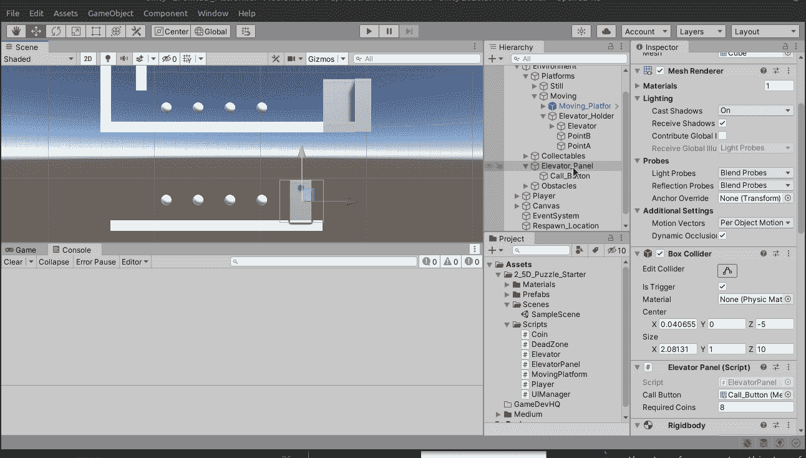

太好了！现在，在电梯代码中，让我们复制下行代码并稍作修改，使其成为上行代码！

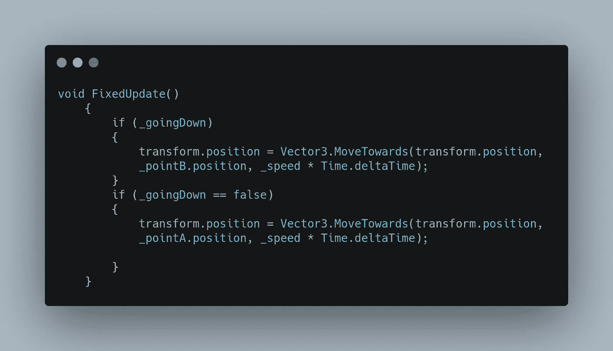

有道理，不是吗？之前我们检查下行是否为真，现在我们检查 _goingDown 是否为假，当它为假时，我们将移动到点 a 或者电梯更高的原始位置！

所以如果玩家按 E，我们希望电梯上升。现在它已经连接好了，所以我们真正需要做的就是“切换”我们的布尔值。

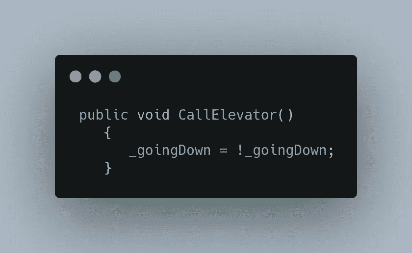

这真是一个令人敬畏的把戏！每次 CallElevator 被激活，_goingDown 就会变成它的反面！假的就是真的。真的就变成假的了！让我们试一试！

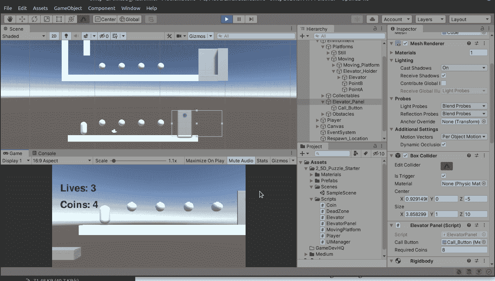

厉害！

现在剩下的只是一点调整，比如关闭电梯面板灯，修复玩家在电梯上移动时的一点抖动。

让我们先处理灯光，让我们创建一个在 ElevatorPanel 脚本中称为 _ elevator 的布尔值。

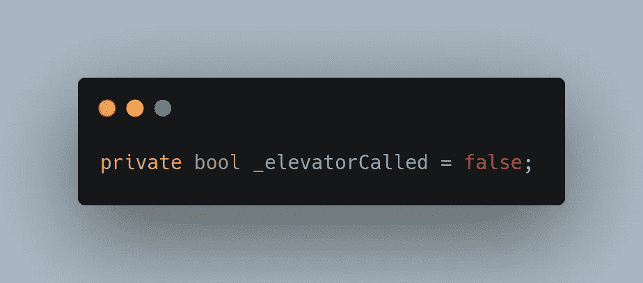

然后在 getKeyDown 中，我们将对它进行编码，如果它为真，则灯为红色，否则灯为绿色:

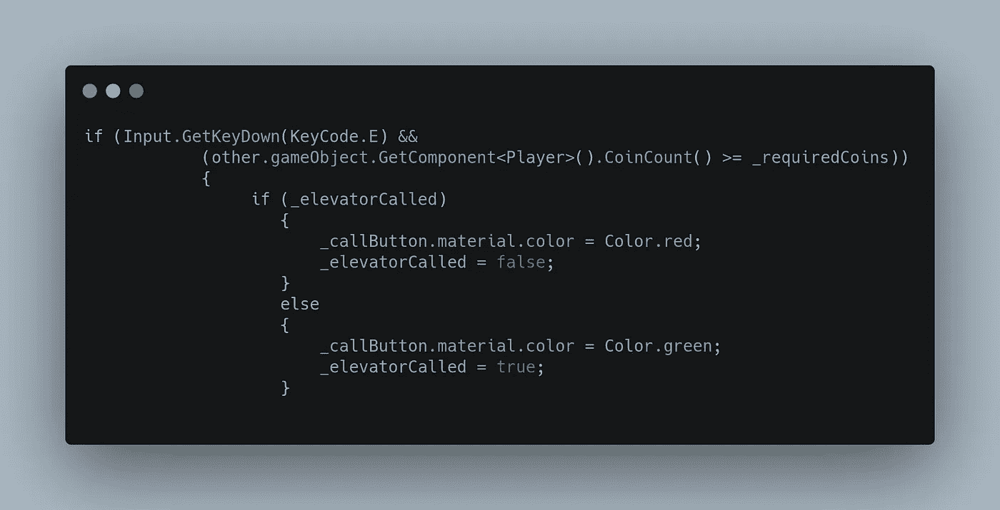

让我们看看它的实际效果吧！

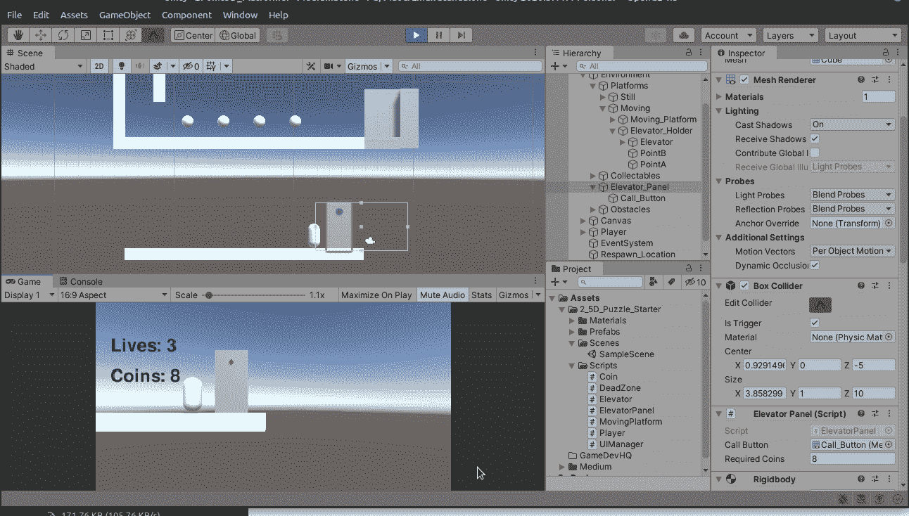

太棒了。最后，让我们来解决这个神经过敏的问题。发生这种情况是因为玩家需要成为电梯的父级，就像移动平台一样，只需将这些 OnTriggerEnter 和 OnTriggerExit 方法添加到电梯方法中，但首先让我们将另一个 colliderbox 添加到电梯中，并将其设置为 trigger。还要确保它占据了电梯的整个空间。

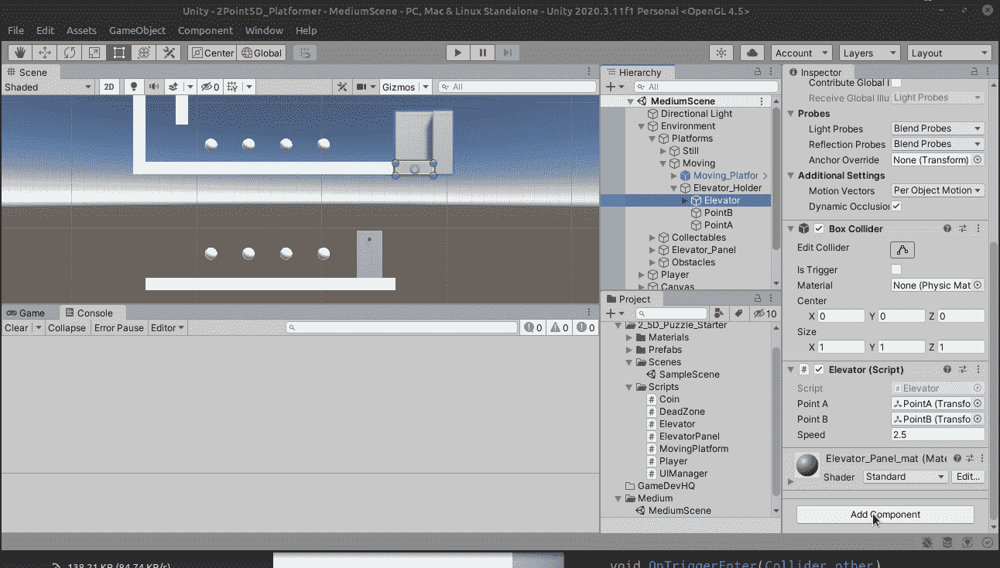

因为我们正在使用触发器，如果没有刚体，记得添加它。关闭重力并使其运动是安全的，为了更加安全，关闭旋转。

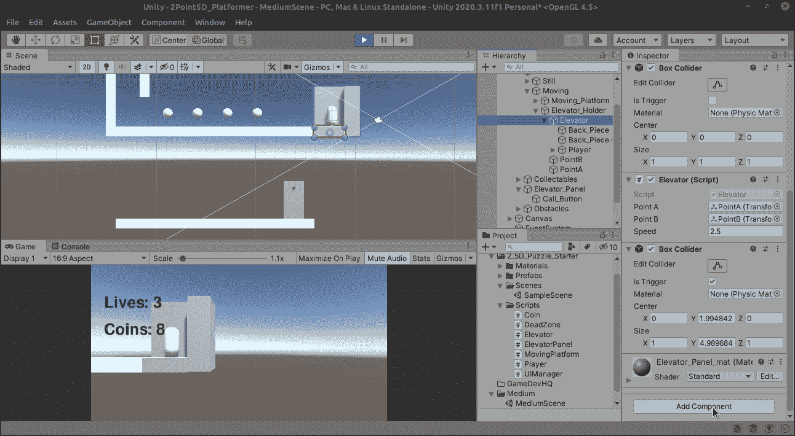

下一次写入控制输入/退出代码:

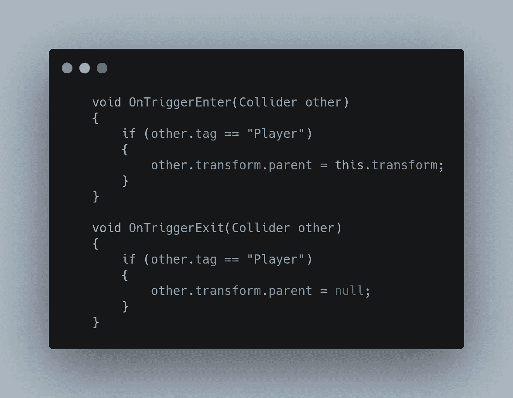

享受丝绸般的平稳驾驶！

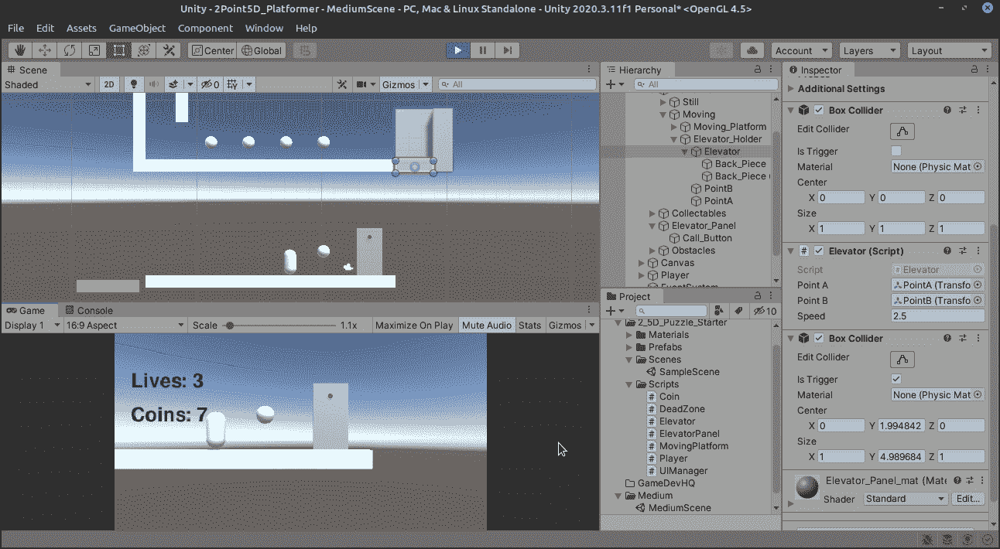

厉害！明天我们将以跳墙开始新的一个月！