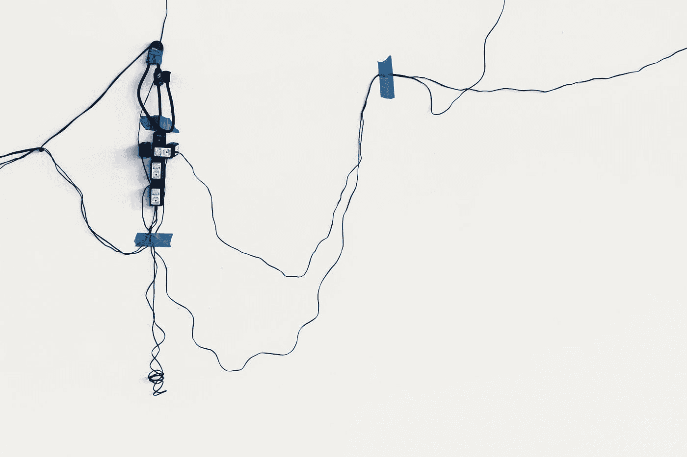

# 精英增加了复杂性。现在，他们无法管理它。

> 原文：<https://medium.com/nerd-for-tech/elites-added-layers-of-complexity-now-they-are-unable-to-manage-it-297f87dfb5b0?source=collection_archive---------25----------------------->

蒂姆·莫斯霍尔德在 [Unsplash](https://unsplash.com?utm_source=medium&utm_medium=referral) 上的照片

复杂性正在杀死我们。从管理我们的法律到执行它们的机构和裁决它们的法院，我们的世界已经变得如此复杂，以至于几乎(字面上和比喻上)不可能理解和管理我们生活中如此普遍的令人难以置信的复杂性。此外，即使是那些声称理解复杂性并掌握如何管理复杂性的人，在面临解决复杂系统产生的问题时也会手足无措。

事实上，如果没有什么的话，世界不再是线性的和可预测的，主要是由于在过去几十年中增加了复杂的层次。否则，为什么整个全球金融体系会在 2008 年大衰退的余波中崩溃？大衰退是由美国投资银行雷曼兄弟(Lehman Brothers)的倒闭引发的，它引发了全球股票市场的雪崩，并导致货币体系几近崩溃。如果有人在控制局面，那么在 2008 年至 2009 年的黑暗日子里，席卷全球所有主要经济体的混乱是什么原因造成的？

不一定非要这样。没有技术进步，我们的生活要简单得多，讽刺的是，技术进步意味着把我们从复杂中解放出来，让我们的生活更简单。然而，现在管理我们网络和虚拟生活的所有多层次和无数的规则和条例却发生了相反的情况。此外，摩尔定律定义了半导体技术的进步如何确保指数级加速，支配着我们的生活，并导致令人眼花缭乱的变化步伐，这些变化淹没了我们，威胁着我们脆弱而易错的世界。

技术未能解放我们的原因是因为它被控制我们经济和金融生活的新自由主义资本主义机器所同化。自 20 世纪 70 年代以来，新自由主义作为主导意识形态扎根以来，它确保了不断扩大的不平等和激烈的底层竞争，这种竞争正在使富人越来越富，穷人越来越穷。事实上，我们生活的几乎每一个领域现在都是新自由主义泛滥的沼泽，在这里，适者生存，在毁灭和野蛮的食人狂欢中。难怪我们的精英和外行人一样无知，因为他们创造的世界不再在他们的控制之下，已经成为一个弗兰肯斯坦一样的怪物，不愿意被驯服。

当前 Covid 引发的噩梦是复杂系统如何被微小的扰动压垮的又一个例子，就像不时出现的许多黑天鹅事件一样。事实上，就像 2008 年危机期间一样，目前的疫情已经表明，系统性崩溃只是一个事件，因此，这是我们如何无法管理或使用一个更好的术语，管理不善的复杂性的另一个表现。因此，从本质上说，我们拥有的是一个无视逻辑的世界，纯粹的复杂性正把我们引向毁灭和毁灭。

虽然我并不是说我们没有希望，但至少现在精英们必须清醒过来，简化一些管理我们的制度和流程。现在挽回局面还为时不晚，我们所需要的只是我们的救世主多一些谦逊，少一些傲慢。是时候让我们的系统退回一些错综复杂的迷宫，用简约的设计和生活方式让我们的生活更简单。否则，我们永无止境的过山车将不会停止，直到它碾压我们所有人，除了少数人，如果这是自始至终的意图。