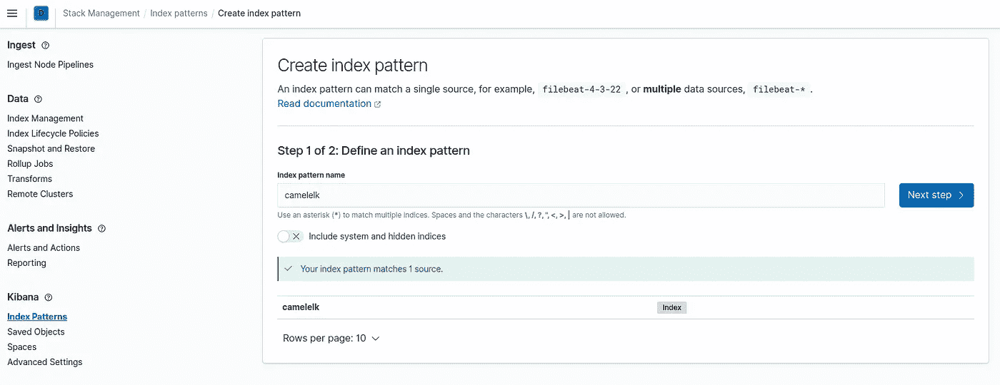
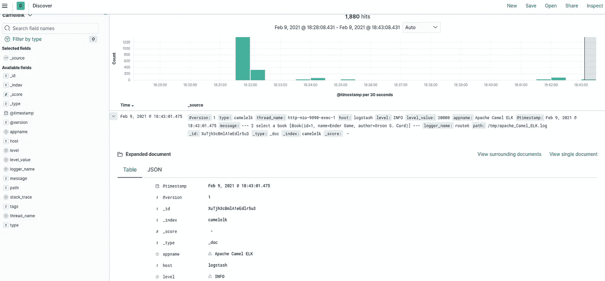

# 麋鹿:启蒙

> 原文：<https://medium.com/nerd-for-tech/elk-initiation-3f9cdd814b6a?source=collection_archive---------7----------------------->


在这篇文章中，我们将看到在 Java 应用程序中面向日志管理的 ELK 操作，为此，我们将使用 Apache Camel 应用程序，这是我们以前见过的。

ELK 是一系列应用程序所熟知的，特别是:Elasticsearch、Logstash 和 Kibana。都是 Elastics 开发的开源工具。它们允许您从任何类型的来源以任何格式收集数据，以便实时搜索、分析和可视化数据。

*   Logstash 是一个服务器端数据处理管道，它同时使用来自多个不同来源的数据。这些数据被转换并发送到数据存储库。
*   Elasticsearch 是一个搜索和分析你存储的数据的引擎。
*   Kibana 允许我们根据 Elasticsearch 拥有的信息为用户创建图表和仪表盘。

目前，这一堆应用程序也是由 Beat 组成的。但是我们不会在这篇文章中谈论它。

在整篇文章中，我们将看到如何组装它，如何配置它，以及如何利用 Java 应用程序的信息。让栈可用的最简单的方法是通过 Docker Compose。

我们从弹性搜索开始。它是最重要的组件，也是需要更多资源的组件。在生产环境中，建议创建一个集群来保持高可用性和完整的性能。但是在我们的例子中，作为主要特性，它只有一个节点。否则，这将是一个常见的 Docker 配置:

*   我们将指定一个本地文件夹作为容器卷，这将允许我们即使删除容器也能保留信息。
*   容器使用的公共网络。
*   暴露的端口:9200 和 9300。
*   检查实例是否仍正常工作的运行状况检查。为此，我们将简单地检查公开的端口在被调用时是否得到响应。

下一部分是 Kibana 容器的创建。这个工具会读取存储在 Elasticsearch 中的信息，所以它必须知道它的位置。但是这不会在 Docker Compose 中指出，对于这个工具来说，Docker Compose 有一个非常基本的配置。但是它将在 YAML 配置文件中指出，我们称之为输入卷。

在配置文件中，我们必须指出服务的名称、IP 地址，最重要的是，Elasticsearch 的位置。

```
server.name: kibana
server.host: 0.0.0.0
elasticsearch.hosts: [ "http://elasticsearch:9200" ]
monitoring.ui.container.elasticsearch.enabled: true
## X-Pack security credentials
elasticsearch.username: elastic
elasticsearch.password: changeme
```

要完成 Docker Compose 的配置，我们只需要配置 Logstash。此配置会稍微复杂一些，由以下几部分组成:

*   一个卷，指示我们将在其中配置 Logstash 的文件。
*   在这个卷中，我们将配置不同的管道，这些管道将作为由 Logstash 发送到 Elasticsearch 的数据的输入。
*   Logstash 可以访问应用程序创建的日志的卷。
*   服务公开的端口。
*   要使用的 JVM 的内存配置。

logstash.yml 文件将允许我们配置该工具。在这个例子中，它不会包含很多值。至于 Kibana，我们将设置我们的 IP 和 Elasticsearch 的位置:

```
http.host: 0.0.0.0
xpack.monitoring.elasticsearch.hosts: ["http://elasticsearch:9200"]
## X-Pack security credentials
xpack.monitoring.enabled: true
xpack.monitoring.elasticsearch.username: elastic
xpack.monitoring.elasticsearch.password: changeme
```

pipeline 文件夹将存储不同的配置文件，这些文件将允许 Logstash 管理不同的信息源，并将它们发送到 Elasticsearch。这些文件分为三个部分:

*   输入:指明数据来源的地方。在我们的例子中，它将是应用程序生成的日志文件。那些安装在卷上的。
*   Filter:我们可以对数据执行任何过滤操作。对于我们的例子，我们不会执行任何。
*   输出:在这里，我们指明要将它发送到哪个存储库。在这种情况下，弹性搜索。

一旦我们配置了 Docker Compose，我们就可以通过访问路径 [http://localhost:9200](http://localhost:9200) 来启动它并检查它是否正常工作。

下一步将是我们的应用程序的配置。最重要的是，我们将使用 logback。并且通过 LogstashEncoder 类，我们将被允许指示某些特征。例如输出格式、添加自定义字段或排除某些包。

我们将启动应用程序并执行几个查询，例如对[http://localhost:9090/book/1](http://localhost:9090/book/1)的查询。

下一步将是配置 Kibana，使其能够可视化所有数据。为此，我们访问[http://localhost:5601/app/home](http://localhost:5601/app/home)。一旦进入，我们必须执行两个步骤。

*   创建索引

我们创建一个索引，首先访问“管理空间”菜单选项，然后在左侧菜单中访问“索引管理”选项。在这个屏幕中，我们创建了与我们在 logstash 管道中指示的标识符相关联的索引。



*   查看信息

从主菜单的 Discover 选项，我们可以访问 Logstash 发送给 Elasticsearch 的日志。



这样，我们就已经通过日志监控了我们的应用程序。我们将能够通过 Kibana 更好地利用它们。我们可以根据向我们发送信息的应用程序、消息内容或日期和时间范围进行搜索。当您的应用程序具有一定的规模或产生大量消息时，这是非常重要的。

如果你想看完整的例子，这里有[和](https://github.com/deesebc/PostExamples/tree/master/ApacheCamel/ApacheCamelRestELK)。