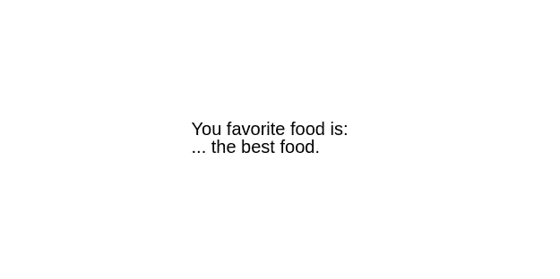
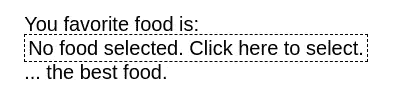
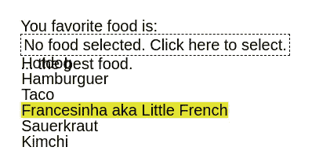
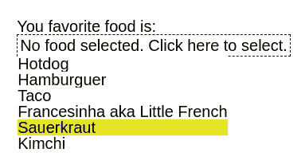
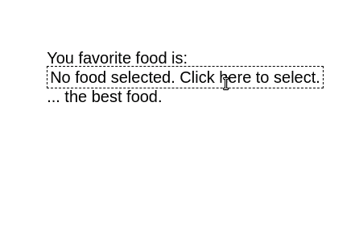

# Elm、elm-ui 和下拉菜单的构建——第一部分

> 原文：<https://medium.com/nerd-for-tech/elm-elm-ui-and-the-building-of-a-dropdown-part-i-8aff2ed079b2?source=collection_archive---------3----------------------->

如果你已经进入 Elm 并且还在处理 CSS 文件，那就彻底处理它们。真的。去做吧，因为在 Elm，我们有漂亮的 Elm-UI。你可以用一种实际上可以理解的语言来写设计。然而，Elm-UI 可能仍然没有您可能需要的一切。它没有内置的一个简单的东西是下拉菜单，一个随处可见的东西。

继续学习如何用 Elm 和 elm-ui 构建一个准系统下拉列表。在第二部分中，我们将使用 Elm 的强大类型制作一个参数化版本。更具体地说，您将掌握参数化类型！*你可以在这里找到:*

[](/nerd-for-tech/reusable-dropdown-in-elm-with-parameterized-types-part-ii-77f58515a662) [## 带有参数化类型的 Elm 中的可重用下拉列表—第二部分

### 利润和乐趣的参数化类型

medium.com](/nerd-for-tech/reusable-dropdown-in-elm-with-parameterized-types-part-ii-77f58515a662) 

# 设置

用`elm init`开始一个新的 Elm 项目，并在`src`文件夹中创建一个`Main.elm`文件。你也可以在第一部分使用 [Ellie](https://ellie-app.com/new) (当我们开始使用参数化类型时，我们将为可重用的下拉菜单创建一个新模块)。

用`elm install mdgriffith/elm-ui`安装`elm-ui`。

从以下准系统结构开始:

```
module Main exposing (main)import Browser
import Htmlimport Element as E
import Element.Background as Background
import Element.Border as Border
import Element.Events as Eventstype alias Model =
    { } initialModel : Model
initialModel =
    { 
    }type Msg
    = NoAction update : Msg -> Model -> Model
update msg model =
    case msg of
        NoAction ->
            modelview : Model -> Html.Html Msg
view model =
    E.layout
        []
        (
        E.column
            [ E.centerX
            , E.centerY
        ]
            [ E.text "You favorite food is:"
            , E.text "... the best food."
            ]
        )main : Program () Model Msg
main =
    Browser.sandbox
        { init = initialModel
        , view = view
        , update = update
        }
```

`elm make src/main.elm`并转到项目文件夹中创建的`index.html`文件。一开始，你会得到一个很好的居中布局，就像这样:



Uau，看代码把列居中。生活不是很美好吗？我永远不会厌倦这个。

# 下拉菜单

好了，集中注意力。到底什么是下拉菜单？下拉菜单允许用户从预定义的列表中选择一个选项。让我们构建一个简单的下拉列表来选择我们最喜欢的食物。我们需要一些选项来选择。我们将创建一个具有`id`、`name`和`foodType`的`Food`类型，它们可以是`FastFood`或`Regional`。

```
type FoodType
    = FastFood
    | Regional

type alias Food =
    { id : Int
    , name : String
    , foodType : FoodType
    }foodList : List Food
foodList =
    [ Food 0 "Hotdog" FastFood
    , Food 1 "Hamburguer" FastFood
    , Food 2 "Taco" FastFood
    , Food 3 "Francesinha aka Little French" Regional
    , Food 4 "Sauerkraut" Regional
    , Food 5 "Kimchi" Regional
    ]
```

在进口之后加上。我们的模型需要知道当前选择的最喜欢的食物是什么，以及我们当前是否从下拉菜单中选择了任何食物。

```
type alias Model =
    { favoriteFood : Maybe Food
    , status : Status}type Status
    = Normal
    | SelectFoodinitialModel : Model
initialModel =
    { favoriteFood = Nothing
    , status = Normal
    }
```

`favoriteFood`可能有一个被选中的`Food`，或者没有，在这种情况下它将是`Nothing`(这也是起始值，因为用户还没有选择任何东西)。`Status`只是告诉我们当前是否正在从列表中选择食物。当用户点击下拉菜单时，状态变为`SelectFood`。当用户点击其中一个下拉选项时，它会回到正常状态(这也是开始状态)。

现在，让我们开始实际设计`view`中的下拉菜单。让我们创建一个包含所有可能选项的专栏。

```
view : Model -> Html.Html Msg
view model =
    let
        selectedFoodName = 
            case model.favoriteFood of
                Nothing -> "No food selected. Click here to select."
                Just food -> food.name
        dropdown = 
            E.el
                [ Border.width 1
                , Border.dashed
                , E.padding 3
                , Events.onClick ClickedSelectFood
                ]
                (E.text selectedFoodName)
    in
    E.layout
        []
        (
        E.column
            [ E.centerX
            , E.centerY
        ]
            [ E.text "You favorite food is:"
            , dropdown
            , E.text "... the best food."
            ]
        )
```

我们刚刚为我们最喜欢的食物创建了一个占位符。当没有选择食物时，它已经管理了案例。如果我们点击这个框，我们将发送`ClickedSelectFood`消息。我们需要创建这个消息，并在更新中处理它。

```
type Msg
    = NoAction
    | ClickedSelectFood update : Msg -> Model -> Model
update msg model =
    case msg of
        NoAction ->
            model
        ClickedSelectFood ->
            { model | status = SelectFood }
```

当我们点击下拉菜单时，会发送一个`ClickedSelectFood`，我们的状态会变为`SelectFood`。有道理，对吧？我们需要对该状态做些什么，但是现在，您将得到类似这样的内容:



这是一个小小的进步。重要的部分在视图中的 let 块内。如果`status`是`SelectFood`，那么我们将有一个`Element.text`列表，其中的食物名称被附加到`below`属性。否则，我们不会使用该属性。另请注意，`onClick`属性仅在状态为`Normal`时出现。这是因为我们在这两种情况下都保留了它，当单击其中一个选项时会触发该事件，因为该列表位于 dropdown 元素中。我们不想那样。只有在状态为`Normal`时，才应发送`ClickedSelectFood`消息。如果我们已经从食物列表中选择了一个选项，那么发送一条消息来触发逻辑打开下拉菜单(它已经打开了)是没有意义的。现在，当我们单击下拉菜单时，我们将获得所需的列表。



在`viewFood`中，我们已经添加了一些漂亮的视觉糖来改变鼠标所在选项的背景颜色。

正如您所看到的，列表被绘制在其余内容之上。这就是为什么在这个过程中不改变布局。但这也意味着我们现在看到了下面的内容。我们需要填充所有选项的背景。

```
white : E.Color
white = E.rgb 1 1 1viewFood : Food -> E.Element Msg
viewFood food =
    E.el
        [ E.width E.fill
        , E.mouseOver [Background.color overColor]
        , Background.color white
        ]
        (E.text food.name)
```



我们添加了`ClickedDropdownFood`消息，当我们点击列表中的一种食物时就会发送这个消息(参见`viewFood`中的`onClick`事件)。当`update`收到这条消息时，状态恢复到`Normal`，新的`favoriteFood`就是我们点击的那个。然后将一切渲染成应有的样子。



现在你知道如何创建一个简单的下拉列表。如果需要多次下拉怎么办？如果他们选择了不同的东西呢？这就是我们将在第 2 部分讨论的内容，我们将创建一个可重用的组件，它将接收任何类型并像我们在这里做的那样显示它。