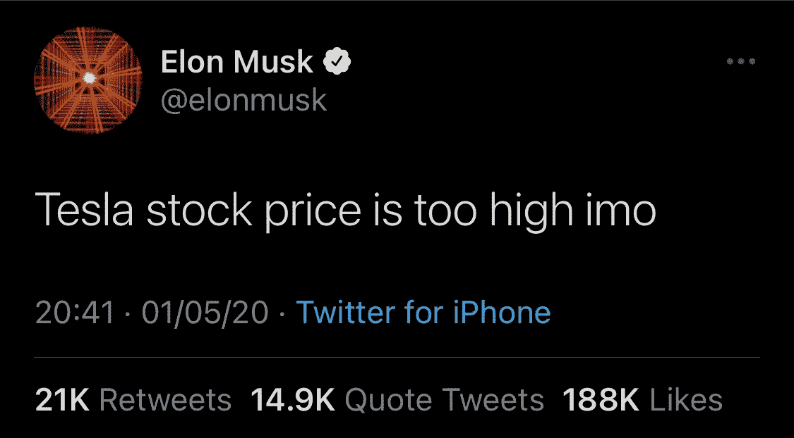

# 埃隆·马斯克——比特币和加密货币之父

> 原文：<https://medium.com/nerd-for-tech/elon-musk-the-father-of-bitcoin-and-cryptocurrency-68b71f989eed?source=collection_archive---------14----------------------->

知道如何卷入争议和操纵股价的埃隆在这方面要么惨败，要么有时成功。他选择用来操纵任何事情的最喜欢的武器是——推特。

他应该被禁止使用 Twitter，因为它被滥用了。在他开始推动加密货币和比特币的热潮之前，他用自己的股票价格预告片测试了这一点，后来被 SEC 起诉。

我们要去哪里？而比特币和其他密码真的是去中心化的吗？

# 前奏——埃隆的抽水和倾倒

## 开始

2018 年 8 月，埃隆·马斯克(Elon Musk)在推特上发布了关于以每股 420 美元的价格将特斯拉私有化的消息，并告知资金是安全的——但事实上，他根本不在附近。

他给出的将特斯拉私有化的理由是，获得不受限制的创新自由，不用担心股价或股东——这是他经常打出的典型超级英雄牌。

2019 年 4 月，埃隆·马斯克(Elon Musk)在与美国证券交易委员会(SEC)和股东进行了一场紧张的斗争后，被美国证券交易委员会(SEC)限制不得在 Twitter 上以任何方式就销售预测进行任何沟通或讨论股价。有了这个条件，他才被允许使用这个平台。他似乎再次违反了协议，并被投资者起诉，因为他在推特上发布了*“特斯拉股票在我看来太高了。”导致股价在短短 30 分钟内暴跌 12%。*

## 礼物

众所周知，埃隆·马斯克是最敏锐、最聪明的家伙，他有大量的成功案例可以展示，这让我们可以盲目地信任他。但问题是，虽然他的智慧对他有利，但为什么所有人都让他成为他们血汗钱的大师？

在 2019 年的封锁期间，埃隆·马斯克开始展示他对加密货币的热爱和感情。因为他以他的“智慧”而闻名，我们把他视为救世主，他把我们从天然气汽车制造商的魔掌中解救出来，拯救世界免受全球变暖的影响，人们已经把他当成了上帝。

整个 2020 年，比特币一直在上涨和下跌，直到埃隆跳了起来。一旦埃隆开始再次强调这项技术的能力，并让我们梦想一个去中心化的加密货币货币世界将会是什么样子的超现实世界——我们再次屈服于他的超级英雄把戏。

埃隆一直掌控着加密市场。

他让每个投资者、天使投资者、大公司的所有者和所有人都投资比特币。价格前所未有地持续飙升——他真是个迷人的人。

在去年宣布汽车购买者可以用比特币购买他们的新特斯拉汽车后。三周前，他宣布特斯拉将不再接受比特币购买，理由是环境原因。

这导致比特币价格暴跌，两周内贬值 50%。

继 twee t. — MINT 之后不到两个小时，世界上最大的加密货币价格从大约 54819 美元跌至 45700 美元，为 3 月 1 日以来的最低水平

虽然加密货币本来是要去中心化的，而且很大程度上是去中心化的，直到我们亲手把许可证交给他，带领我们走向“伟大”这最后的封锁。

# 埃隆说，我们跟着做

除了特斯拉，SpaceX，the boring company，open AI 和 neural ink——特斯拉也在管理加密市场——有点像。

事实上，由于埃隆对这个市场的兴趣，这个稳步上升和缓慢下降的市场是如此不稳定——一切要么变大，要么破产。

# 埃隆的新宠物——狗狗

特斯拉拒绝接受比特币作为购买车辆的支付形式的原因是，比特币采矿使用了大量的化石燃料，因此他正在停止并试图将可能发生的环境破坏降至最低。

但埃隆是 Dogecoin 的忠实粉丝，并且长期以来一直在推广这种货币——事实上，它最初是一种迷因，现在是继比特币之后的第二种受欢迎的货币——甚至不是以太币或莱特币。

问题是，密码市场真的分散了吗？安全吗？是不是没有人气？

如果埃隆可以建立一支可以盲目听从他指挥的军队——为什么其他人不行？

虽然加密价格取决于各种因素，如需求、供应、开采、数量等，但它是我们永远无法掌握在手中的东西，直到我们将其兑换为法定货币或购买现实生活中的产品——它就像一朵云，我们可以看到，但永远无法掌握，甚至触摸它而不感觉它是灰尘或水。追求这个市场安全吗？

虽然，加密货币被称为金融系统的进化，可能会给法定货币带来死亡，但自从比特币诞生以来，它一直被视为一种资产，一直被兑换为法定货币。现在的问题是，法定货币是永恒的王者，而加密货币只是另一种时尚吗？

# 与埃隆的孩子的谈话

这是一个去中心化的市场——不要把管理我们投资的权力集中给已经确立的人物。

最近有消息称，埃隆·马斯克(Elon Musk)会见了比特币采矿委员会(Bitcoin Mining council)，并讨论了以更加生态和环境安全的方式运行比特币采矿过程的计划，以及使用可再生能源的计划。比特币价格再次开始上涨。

埃隆·马斯克是一名投资者，也是比特币和加密货币的爱好者，就像我们一样——埃隆·马斯克说或不说不应该影响我们。如果我们继续授权给一个既定的人物来控制一个分散的市场——我们是不是更应该奴役他？或任何其他个人或公司？还是一个去中心化的市场真的去中心化了？