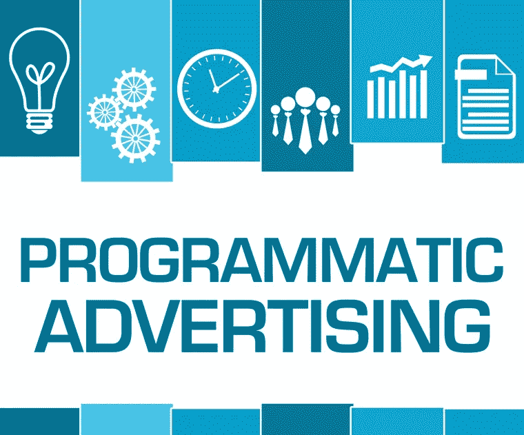
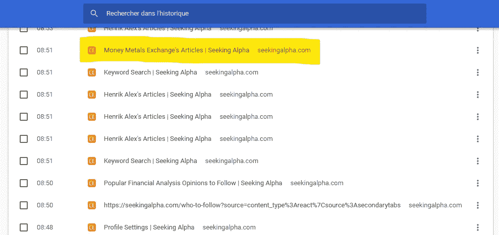
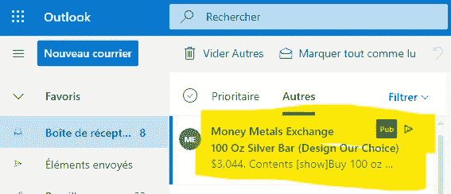

# 电子邮件程序化广告平台理念

> 原文：<https://medium.com/nerd-for-tech/email-programmatic-ads-platform-idea-72c58aa253f8?source=collection_archive---------12----------------------->

为了尝试了解如何更好地营销这本书，我访问了关于交易和金融的网站和平台，比如 SeekingAlpha。在 seeking alpha 中浏览了一些分析师的个人资料，比如下面的浏览历史中突出显示的这个

浏览历史搜索 Alpha

SeekingAlpha 阿尔法金属交易所

访问了此个人资料，并点击了描述的链接

货币金属交易所

我对交易所感兴趣，但对[交易所匹配引擎](https://mkrdiop.medium.com/built-for-speed-and-fix-b11d5a1582a7)的兴趣大于对金属交易所的兴趣，但我很想更多地了解这个网站，并与联系。有一次在网站上，我被发现并放进了这个广告桶，这将导致下面的事件

outlook 中的广告

几个小时后，这封邮件广告出现在我的邮箱里。程序化广告只是试图适应我们的在线行为，但它很难猜测我们这些行为的潜在事实，因为我的行为导致系统认为我对购买金属投资感兴趣，而我对图书出版感兴趣。试图向我出售我不感兴趣的东西又损失了 1 美分，但这则广告提醒我，有机会建立一个平台，跟踪和发现公司发送的电子邮件广告和活动电子邮件通信。有一些平台可以跟踪谷歌关键词广告、Youtube 广告和网络展示中的广告，但据我所知，似乎还没有专注于跟踪电子邮件广告和沟通的平台(如果你知道的话，请告诉我)。

所以你有机会建立它并提供给这些程序化广告用户，因为他们都想知道他们的竞争对手是如何做的。

**去建立这个电子邮件广告跟踪平台吧！**

我正在编辑这本关于金融的书，这本书对美国股市经历的 Gamestop 泡沫进行了数据驱动的分析，你可以通过使用这个[链接](http://clickmetertracking.com/nglj)获得早期读者访问

