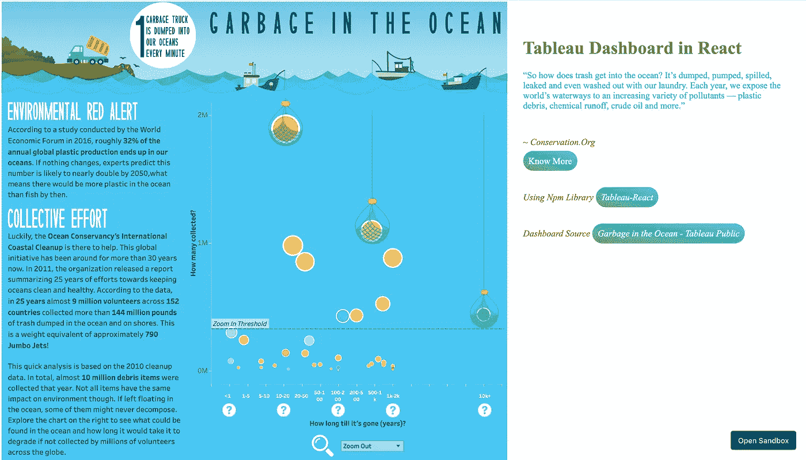

# 在 React 应用程序中嵌入 Tableau 仪表板📑

> 原文：<https://medium.com/nerd-for-tech/embed-tableau-dashboard-in-react-application-5fc572e3962e?source=collection_archive---------2----------------------->


凯尔西·奈特在 [Unsplash](https://unsplash.com?utm_source=medium&utm_medium=referral) 上的照片

# **什么是画面？**

Tableau 是一个可视化分析平台，改变了我们使用数据解决问题的方式，使人们和组织能够充分利用他们的数据。它是一个无需任何技术技能和编码知识就可以将原始数据集转换成易于理解的格式的平台。

> 下面是 tableau gallery 中的一个例子，说明如何将一组原始数据转换为有趣且易于理解的可视化数据:


[https://public . tableau . com/en-us/gallery/mapping-trees-London？tab =即时新闻&type =即时新闻](https://public.tableau.com/en-us/gallery/mapping-trees-london?tab=viz-of-the-day&type=viz-of-the-day)

# 为什么有人会在 React 应用程序中嵌入 Tableau Dashboard？

让我们假设您正在构建一些静态或动态的 web 应用程序，以教育用户关注海洋中日益增长的垃圾。因此，为了支持这一论点，你必须展示数据，包括海洋下的垃圾分类(塑料、金属、纸、布等)，有一些时间线，还允许用户与可视化互动。

> 那不是很酷吗？

下面是我创建的一个简单的 react 应用程序，用来嵌入**一个 tableau 仪表板**(可以在 Tableau 公共图库上找到)。



有三种方法可以将仪表板嵌入到任何 JavaScript 应用程序中。

1.  + Tableau 分享链接
2.  Tableau 嵌入代码
3.  Tableau JavaScript API

# 方法一: + Tableau 分享链接:

将 Tableau 仪表板嵌入简单网页的第一种方法是通过<[iframe](https://developer.mozilla.org/en-US/docs/Web/HTML/Element/iframe)。在 Tableau Server / Tableau Public 上，转到您要嵌入的仪表板，然后单击“共享”图标/按钮。将打开一个弹出窗口并复制链接。

将 Tableau 仪表板嵌入简单网页的第一种方法是通过一个 iframe。在 Tableau Server / Tableau Public 上，转到您要嵌入的仪表板，然后单击“共享”图标/按钮。将打开一个弹出窗口并复制链接。

# 方法 2: Tableau 嵌入代码:

将 Tableau 嵌入网页的第二种方法是嵌入代码。在 Tableau Tool 上，转到您要嵌入的仪表板，然后单击“**共享**”图标/按钮。点击**/</>嵌入代码链接**。

在 HTML 文件中，将复制的 Tableau 嵌入代码添加到 body 标记之间。保存文件并刷新浏览器。

# 方法三:Tableau JavaScript API:

所以 Tableau 有这个[**Tableau-JavaScript API**](https://help.tableau.com/current/api/js_api/en-us/JavaScriptAPI/js_api.htm)允许你在 React/ JavaScript 应用中嵌入你的 Tableau 仪表盘。

我更喜欢这种方法，因为它让开发人员对可视化有更多的控制。以下是您可以使用 JavaScript API 做的一些事情:

*   动态加载和调整可视化。
*   使用页面上的 HTML 控件筛选可视化效果中显示的数据。
*   选择可视化效果中的标记。
*   响应可视化中的事件。
*   导出可视化图像，PDF，CSV 和 PPT。

> **第一种方式:**

为此，您需要拥有 tableau 仪表板的公共 URL(比如这个[*http://public . tableau . com/views/RegionalSampleWorkbook/Storms*](http://public.tableau.com/views/RegionalSampleWorkbook/Storms))。

在 react 应用程序的**index.html**中粘贴以下内容:

```
<script type=”text/javascript” src=”https://public.tableau.com/javascripts/api/tableau-2.min.js"></script>
```

创建一个组件来呈现 dashboard **Tableau.js** (你可以给它起任何名字)。

```
***Tableau.js***import React, { useEffect, useRef } from 'react';const {**tableau**} = window;export const **Tableau** =()=> { const **ref** = useRef(null); const **url** =  "*http://public.tableau.com/views/RegionalSampleWorkbook/Storms*"; function **initViz**(){ newtableau.Viz(**ref**.current,**url**); } return ( <div **ref**={ref} **style**={{width:'70%', margin:'auto'}}> </div> );}
```

在 App.js 中:

```
import "./App.css";
import React from 'react';
import Tableau from './Tableau';export default function **App**() {return ( <div className="App"> <h1>Tableau Dashboard in React </h1> <Tableau/> </div>);}
```

> **第二种方式**

使用 NPM[**Tableau-React**](https://www.npmjs.com/package/tableau-react)库。这个 NPM 模块利用了幕后的 JavaScript API。

继续玩代码 [**这里**](https://codesandbox.io/embed/wandering-paper-5lgre?fontsize=14&hidenavigation=1&theme=dark) 。

**更新**:也可以用[**tableau-API**](https://www.npmjs.com/package/tableau-api)**NPM 库代替上面提到的。这个版本更新了最新版本的 Tableau JavaScript API，并且支持所有最新的特性，比如导出功能。**

**如果你喜欢这篇文章，请点击掌声👏图标下面还有关注我 [*这里*](http://tanyas27.medium.com/) *了解更多！🎃***

**[](https://www.tableau.com/why-tableau/what-is-tableau) [## 什么是 Tableau？

### 作为现代商业智能的市场领先选择，我们的分析平台使人们更容易…

www.tableau.com](https://www.tableau.com/why-tableau/what-is-tableau)  [## 画廊|公共舞台

### 绘制伦敦的树木

public.tableau.com](https://public.tableau.com/en-us/gallery/mapping-trees-london?tab=viz-of-the-day&type=viz-of-the-day) [](https://help.tableau.com/current/api/js_api/en-us/JavaScriptAPI/js_api.htm) [## Tableau JavaScript API

### 使用 Tableau JavaScript API 将 Tableau 可视化集成到您自己的 web 应用程序中。以下是一些…

help.tableau.com](https://help.tableau.com/current/api/js_api/en-us/JavaScriptAPI/js_api.htm)**