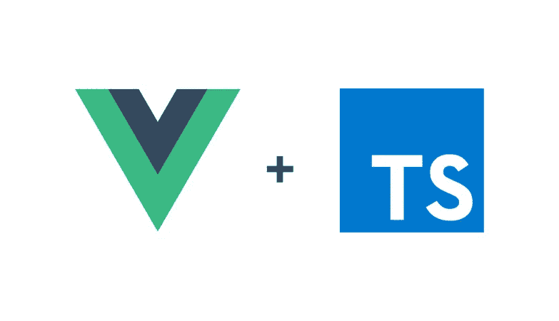

# 在 Typescript 中发出 Vue.js 事件

> 原文：<https://medium.com/nerd-for-tech/emitting-vue-js-events-in-typescript-d99d5ec9d15f?source=collection_archive---------3----------------------->

如何在**类型脚本**中发出一个事件并在 **Vue.js** 中监听它

**Vue.js** 允许用户`emit`与子组件的事件，并通过`this.$emit('event-name')`在父组件中对其做出反应。虽然这在组件中直接使用时很有魅力，但在使用 **TypeScript** 时确实产生了一个问题。

## **了解问题**

让我们假设(基于我的私有代码)

*   有一个`UserController.ts`类(前面的是*，它有一个方法`invalidateTokenAndRedirectUser`*
*   `VueRouterGuard.ts`处理`onRouteChange`逻辑的类，这是失效发生的地方，

现在—用户在大约 1 小时内不会做任何事情，最终令牌将失效。如果令牌已经过期，`VueRouterGuard`就地检查(*在转到下一路线*之前)。

现在，如果用户 get 无效，我想:

*   将用户移至`login`页面，
*   隐藏`logout`菜单元素——这就是问题所在，因为导航是由 **Vue.js** 控制的，而 DOM 应该是**而不是**被直接用于此目的，

在这个解决方案中`VueRouterGuard`使用户无效，没有一个 **Vue.js** 组件/视图会收到发生了什么的信息。

## **从类型脚本中发出事件**

通过检查 **Vue.js** 的源代码来更好地理解事件发射是如何工作的，我发现:

而这看起来就像是来自 **Js** 的标准`Event`。

所以我个人想出了这个解决方案:

`emitEventOnRouterView`方法将接受一个`RouterView` DOM 元素和一个`emit`事件。这样，提供的事件可以像标准的`$emit('name')`一样被监听