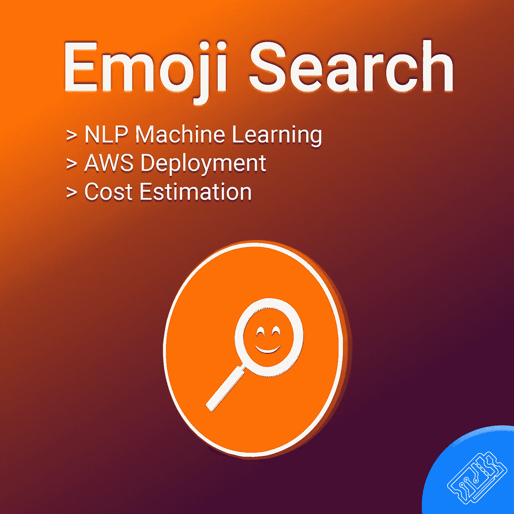
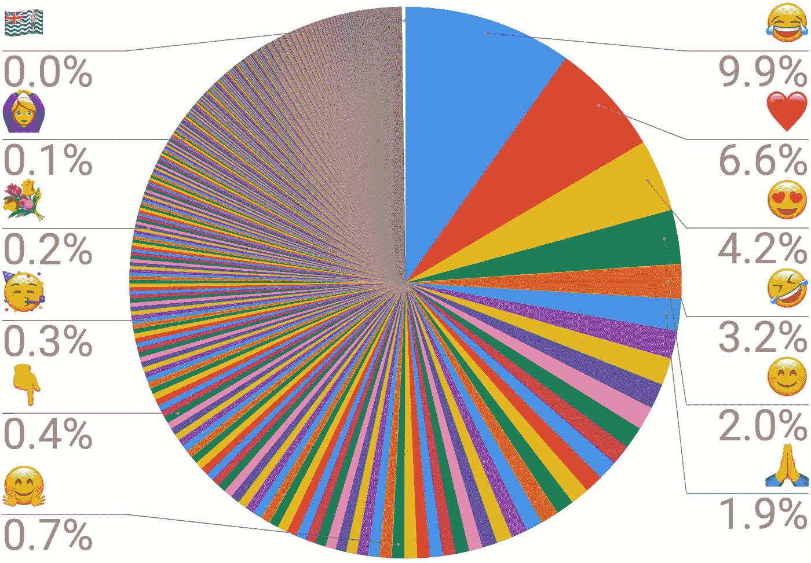
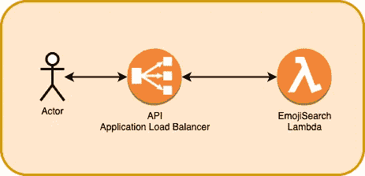
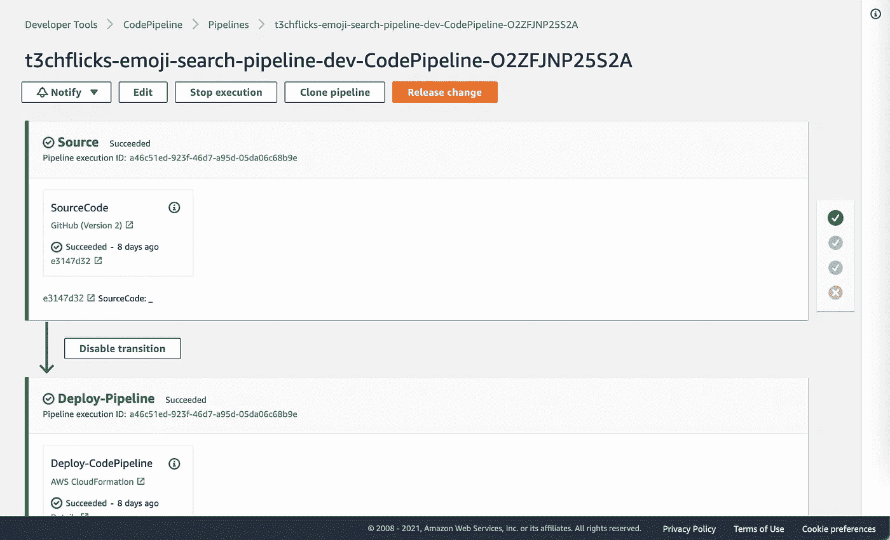
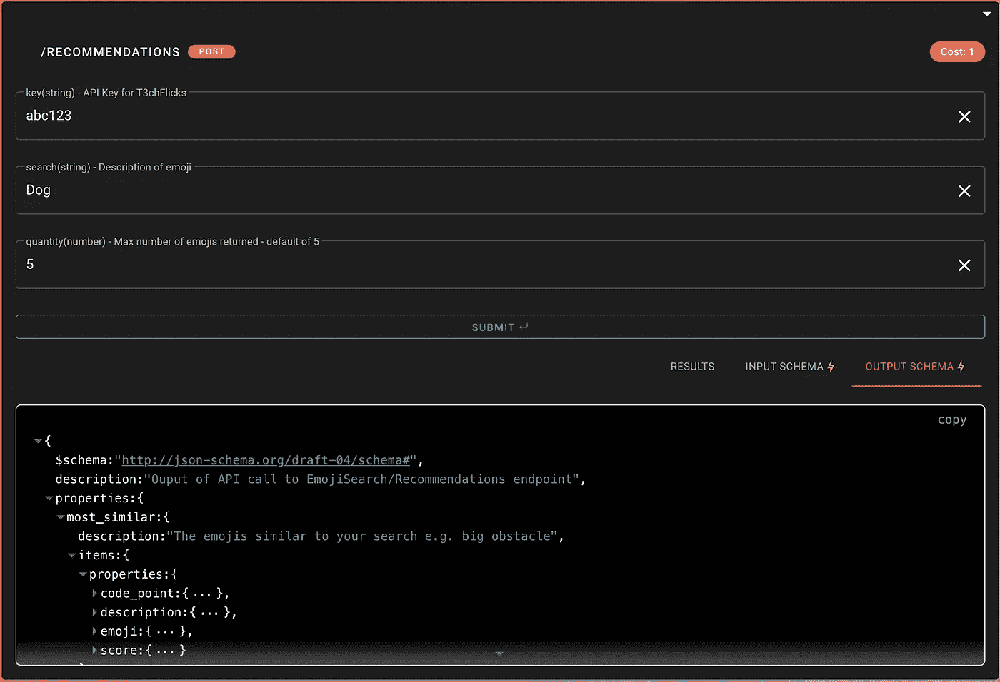
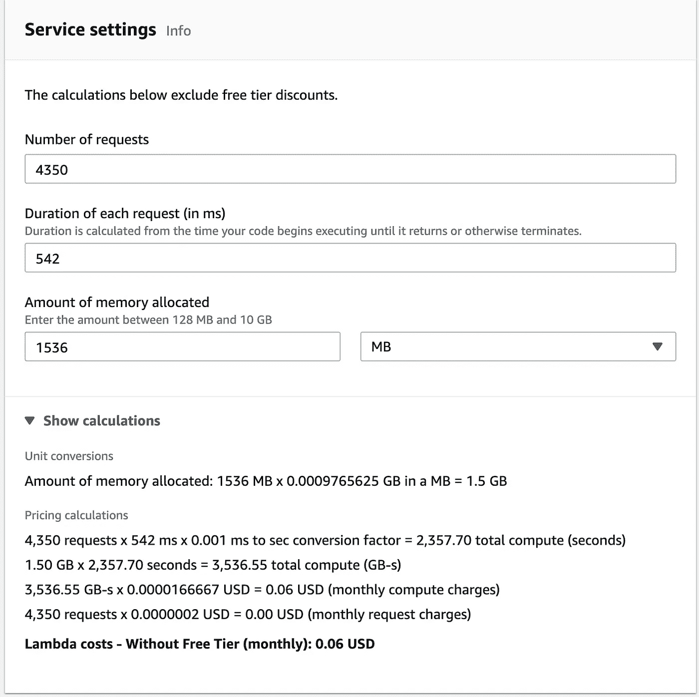
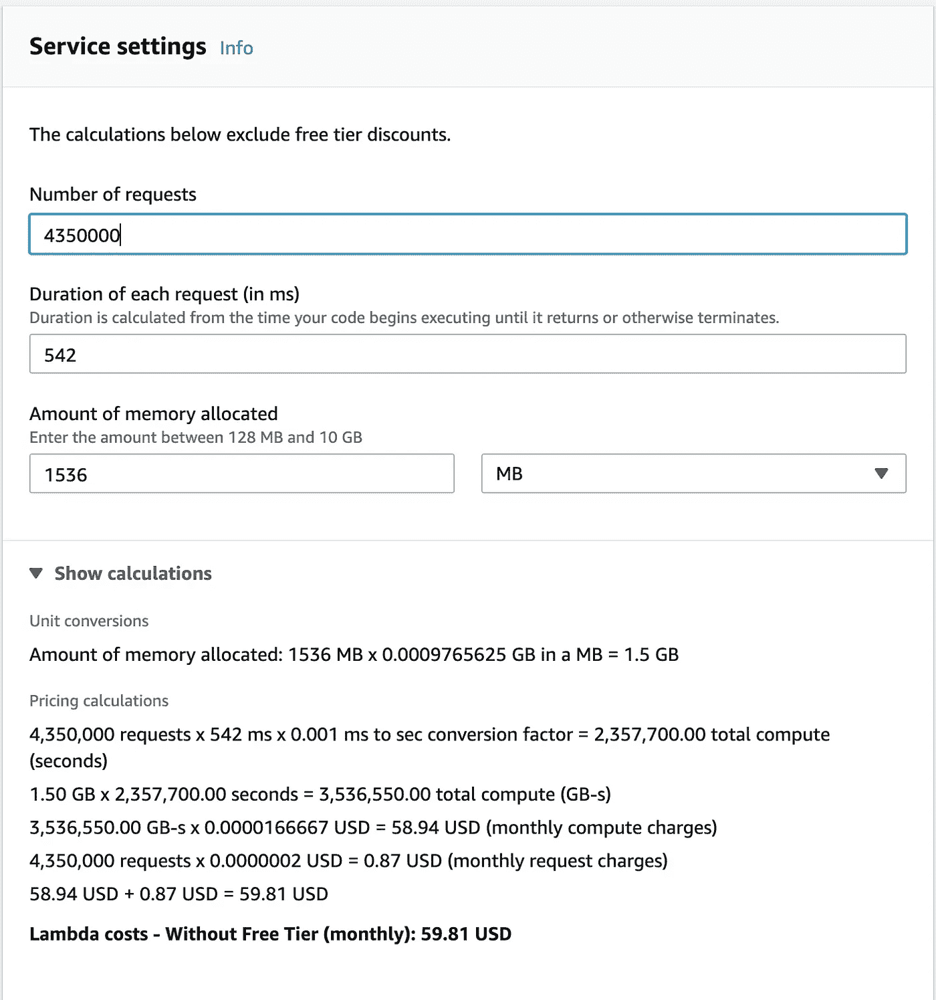
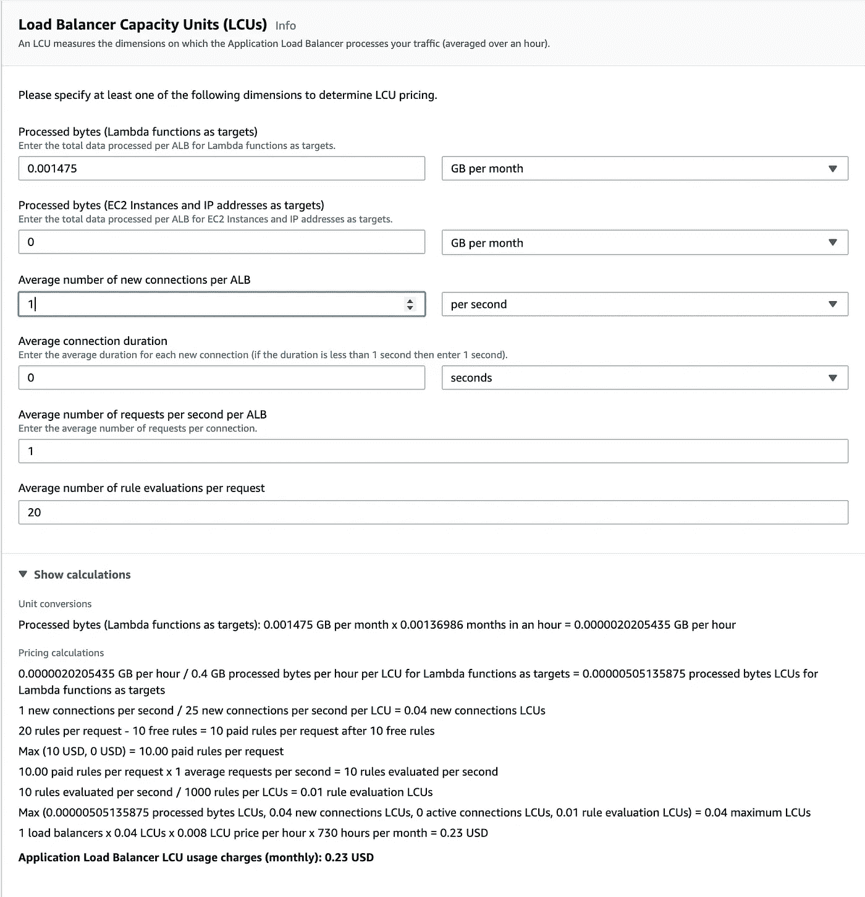

# 表情符号搜索🔮创建、部署和评估机器学习服务

> 原文：<https://medium.com/nerd-for-tech/emoji-search-creating-deploying-and-evaluating-a-machine-learning-service-f97c29976d6d?source=collection_archive---------8----------------------->

计算机可以以这样一种方式模拟语言，即它们可以很好地执行诸如文本相似性之类的任务。在这篇文章中，我试图创建一个表情符号建议工具，它使用矢量单词嵌入来确定相关的表情符号推荐。我还将机器学习模型作为服务部署在 AWS 上，并进行成本估算。在 [T3chFlicks 网站](https://t3chflicks.org/Services/emoji-search)上可以找到这项服务的一个实例；[所有代码都是开源的](https://github.com/sk-t3ch/emoji-search)。



> [🔗在 Github 上找到所有表情符号搜索代码📔](https://github.com/sk-t3ch/emoji-search/blob/master/Emoji_Text_Search_Notebook.ipynb)

# 表情符号😂 ❤️

表情符号在互联网交流中很常见，微小复杂的象形文字为快速拇指敲击总结打开了大门。

电脑使用 Unicode 标准[表示表情符号](https://home.unicode.org/):

```
Code: U+1F600 (Unicode)
      \xF0\x9F\x98\x83 (UTF-8 Bytes) 
Emoji: 😀           
Description: grinning face
```

表情符号的受欢迎程度在不同的社会和文化中差异很大，但 Unicode 公布了一些关于它们的使用比例的统计数据:



[https://home.unicode.org/emoji/emoji-frequency/](https://home.unicode.org/emoji/emoji-frequency/)

# 我们想要什么？

在项目构思过程中，我们决定要做到以下几点:

*   输入搜索文本，得到相似表情列表
*   在 [AWS Lambda](https://aws.amazon.com/lambda/) 中运行机器学习模型
*   使用此服务来提高向我们的文章添加表情符号的效率。

# 构建-表情符号搜索

为了能够搜索文本并得到最相似的表情符号，我们需要找到搜索文本与表情符号的相似性。

首先，我们必须尝试比较苹果和苹果，幸运的是，Unicode 标准中的表情符号有一个简短的图像描述，使用这些我们可以比较两个字符串`search_text vs. emoji_description`。

一种当前的语言建模技术是使用单词嵌入——一种向量空间，其中维度和关系表示单词之间的意义。

为了理解嵌入的概念，我们强烈推荐以下视频:

## 使用单词嵌入搜索表情符号

我们使用 2019 年的[谷歌新闻向量](https://code.google.com/archive/p/word2vec/)作为语言模型，这不一定是最佳选择(存在更新的模型，如[伯特](https://github.com/google-research/bert))，但它肯定会完成任务。该模型的精简版可以在[这里](https://github.com/eyaler/word2vec-slim)找到。

> 一种简单的研究学习表示的方法是找到与用户指定的单词最接近的单词。[ [来源](https://code.google.com/archive/p/word2vec/) ]

我们首先以 [*word2vec*](https://en.wikipedia.org/wiki/Word2vec) 格式加载模型:

```
import os
import gensim
GOOGLE_NEWS = os.path.join(FIXTURES_FOLDER, "GoogleNews-vectors-negative300-SLIM.bin.gz")model = gensim.models.KeyedVectors.load_word2vec_format(GOOGLE_NEWS, binary=True)
```

这个模型是用来处理表情数据的。幸运的是，我们需要的所有信息都可以在名为 [emoji_data](https://pypi.org/project/emoji-data/) 的 Python 库中找到。我们首先将表情文字提取到一个[熊猫数据帧](https://pandas.pydata.org/docs/reference/api/pandas.DataFrame.html)中。为了简单起见，我们只保留标准的黄色表情集合。

```
from emoji_data import EmojiSequence
d = {'emoji': [], 'description': []}
for (emoji, emoji_meta) in EmojiSequence:
    d['emoji'].append(emoji)
    d['description'].append(emoji_meta.description)
df = pd.DataFrame(d)
df['description'] = df['description'].str.split(' skin tone').str[0].str.replace(':', '').str.replace(',', '')
df = df.drop_duplicates(subset=['description'])---------------------------------emoji   description
👨‍❤️‍👨      [couple with heart man man]
```

表情符号的描述文本中的每个单词的向量被平均为该表情符号的向量:

```
def process_words(text):
    words = text.split(" ")
    word_vectors = [ model.syn0norm[model.vocab[word].index] for word in words if word in model.vocab]
    if len(word_vectors) > 0:
        mean_vector = np.array(word_vectors).mean(axis=0)
        unit_vector = gensim.matutils.unitvec(mean_vector).astype(np.float32).tolist()
    else:
        unit_vector = np.zeros(model.vector_size, ).tolist()
    return unit_vectordf['vector'] = df['description'].apply(process_words)
```

例如，使用搜索文本“狗”和`emoji_vector vs. search_vector`的[余弦相似度](https://en.wikipedia.org/wiki/Cosine_similarity)，我们可以建立所有表情符号的相似度。然后我们可以选择前两个。

```
from sklearn.metrics.pairwise import cosine_similaritydef find_similarity_to_search(search_vector):
    def func(emoji_vector):
        b_emoji = np.array(emoji_vector)
        cos_sim = dot(search_vector, b_emoji) / (norm(search_vector) * norm(b_emoji))
        return cos_sim
    return funcsearch_text = "dog"
search_vector = np.array(process_words(search_text))
find_similarity_to_search = find_similarity_to_search(search_vector)
df['similarity'] = df['vector'].apply(find_similarity_to_search)
df.nlargest(2, 'similarity')--------------------

emoji similarity description
🐕 1.000000 dog
🌭 0.775372 hot dog
```

虽然这个例子相当简单，但还有一个例子让我们忍俊不禁，认为这项服务运行良好:

```
search: "giant obstacle"-------------------
emoji similarity description
🦣 0.416749 mammoth
🤘🏽 0.352729 sign of the horns medium
🧗🏽‍♂️ 0.351723 man climbing medium
🐉 0.330775 dragon
🗺️ 0.330681 world map
```

## 表情搜索 API 的架构

上面的 Python 脚本可以在云上运行，并作为 API 通过互联网访问。我们使用 AWS 作为我们的云提供商，使用 [CloudFormation](https://aws.amazon.com/cloudformation/) 来编写代码形式的基础设施。



该架构使用一个带有[λ](https://aws.amazon.com/lambda/)的[应用负载平衡器](https://docs.aws.amazon.com/elasticloadbalancing/latest/application/introduction.html)作为 API，我们在之前的文章中已经讨论过这一点:

[](https://t3chflicks.medium.com/cheaper-than-api-gateway-alb-with-lambda-using-cloudformation-b32b126bbddc) [## 比 API 网关便宜— ALB 和 Lambda 使用 CloudFormation

### API gateway 的替代产品是应用程序负载平衡器。ALB 可以和 Lambda 连接产生一个高度…

t3chflicks.medium.com](https://t3chflicks.medium.com/cheaper-than-api-gateway-alb-with-lambda-using-cloudformation-b32b126bbddc) 

AWS Lambda 支持使用 [docker 容器](https://www.docker.com/resources/what-container)，这允许我们在本地运行 Lambda 进行开发和测试。该脚本与谷歌新闻向量一起打包到 docker 容器中，因为这使得它可以在运行时访问，而不需要从 [S3](https://aws.amazon.com/s3/) 或 [EFS](https://aws.amazon.com/efs/) 下载。Lambda 需要 1.5GB 内存来运行该模型。

## 服务的部署

可以使用 [CodePipeline](https://aws.amazon.com/codepipeline/) 在 AWS 上创建部署管道。这个过程由 Github 存储库的提交触发。它遵循一系列已定义的步骤，从为服务提供基础设施开始，然后测试代码，构建 docker 容器，最后更新 Lambda:



感谢超级开发者 [James Turner](https://james-turner.medium.com/) 向我们展示了如何在 AWS 上创建由 Github 提交触发的 CI/CD 管道:

[](https://aws.plainenglish.io/from-github-to-continuous-deployment-in-5-minutes-7f9c1c7702b1) [## 从 GitHub 到持续部署 5 分钟

### 如何从 Github 仓库到 AWS 中的 CD 管道，在那里你可以运行测试，并不断地…

aws .平原英语. io](https://aws.plainenglish.io/from-github-to-continuous-deployment-in-5-minutes-7f9c1c7702b1) 

## 界面

我们制作了一个小部件，允许用户轻松地使用 API 并查看定义输入和输出的 [JSON 模式](https://json-schema.org/):



这个小部件允许您与 API 交互。参观[https://t3chflicks.org/services/emoji-search](https://t3chflicks.org/services/emoji-search)游玩！

API 的编程用法如下:

```
url '[https://api.t3chflicks.org./emoji-search/recommendations'](https://api.t3chflicks.org./emoji-search/recommendations') \
  -H 'content-type: application/json' \
  --data-raw '{"key":"4aac6db6d8dfc3fa7693b8b5918b3d548e3c92ebd70832447bab247a1c0b0b477d9107ecfe05f8153ef6d3d848614de3cb8bcf42e256aac1444eb828be1f4083","search":"Dog","quantity":5}' \
  --compressed>>> {"most_similar": [{"score": 0.6978708999734073, "emoji": "\ud83d\udc15", "description": "dog"}, {"score": 0.5574100960192504, "emoji": "\ud83c\udf2d", "description": "hot dog"}, {"score": 0.5498123048808492, "emoji": "\ud83e\uddae", "description": "guide dog"}, {"score": 0.5273177453464898, "emoji": "\ud83d\udc08", "description": "cat"}, {"score": 0.4822364083781162, "emoji": "\ud83d\udc15\u200d\ud83e\uddba", "description": "service dog"}]}
```

> [*🤖这个小工具可以在我们的网站上找到🤖*](https://t3chflicks.org/services/emoji-search)

# 成本估算

确定运行表情符号搜索服务的成本与我们在上一篇文章中所做的类似:

[](https://t3chflicks.medium.com/giving-away-free-apis-without-going-broke-cd87a7dc78a5) [## 免费提供 API 而不会破产。

### 我喜欢在媒体上写文章。我也想在我们自己的网站上分享相同的文章，而不必重写…

t3chflicks.medium.com](https://t3chflicks.medium.com/giving-away-free-apis-without-going-broke-cd87a7dc78a5) 

对于所描述的架构，成本等式为:

```
***Total cost = Application Load Balancer cost + Lambda cost***
```

我们将继续假设 100 个用户使用他们的 100 个免费积分。

## λ成本

表情符号搜索 Lambda 有以下响应统计:

```
***542 ms on average @ 1536 MB memory (cold start 1362ms)***
```

这些数字可以插入[λ成本计算器](https://aws.amazon.com/lambda/pricing/):



在`***$0.06 / Month***`几乎可以忽略不计的成本。然而，当扩展到数百万个请求时，服务确实开始变得相当昂贵:



在我们确实收到这种请求率的情况下，我们无疑将不得不重新架构。

## 应用程序负载平衡器成本

负载平衡器将处理以下大小的请求:

```
***Processed bytes = (167B request + 172B response) * 4350 requests = 1,474,650B*** *=* ***1.475MB = 0.001475GB***
```

这些数字可以插入[应用负载平衡器成本计算器](https://aws.amazon.com/elasticloadbalancing/pricing/):



```
***Total ALB Cost = (ALB/month) + (LCU/month)
Total ALB Cost = $0.23 +(730hours/month * $0.0252/hour) = $18.63***
```

## 总成本

以每月 4350 的请求率计算，该服务的成本估计为:

```
***Total Cost = Application Load Balancer cost + Lambda cost
Total Cost =*** ***$18.63 + $0.06 = $18.69***
```

由于许多服务可以共享同一个 ALB，它们的成本将在项目间分摊。一个更便宜的选择是使用 [API 网关](https://aws.amazon.com/api-gateway/)。

我们并不期望有这么多的流量，只是为了好玩而公开服务。

我们已经创建了一个[成本预算](https://aws.amazon.com/getting-started/hands-on/control-your-costs-free-tier-budgets/)，当服务将超出预期成本时，就会触发警报。

# 结论

在 T3chFlicks **我们想要分享**，这就是为什么你会发现创建这个项目的代码是开源的。我们很想听听有经验的开发商/企业主是如何成功经营 SaaS 的，请联系我们！

# 感谢阅读

我希望你喜欢这篇文章。如果你喜欢这种风格，可以去看看[T3chFlicks.org](https://t3chflicks.org/)了解更多科技教育内容( [YouTube](https://www.youtube.com/channel/UC0eSD-tdiJMI5GQTkMmZ-6w) 、 [Instagram](https://www.instagram.com/t3chflicks/) 、[脸书](https://www.facebook.com/t3chflicks)、 [Twitter](https://twitter.com/t3chflicks) 、 [Patreon](https://www.patreon.com/bePatron?u=14761480) )。