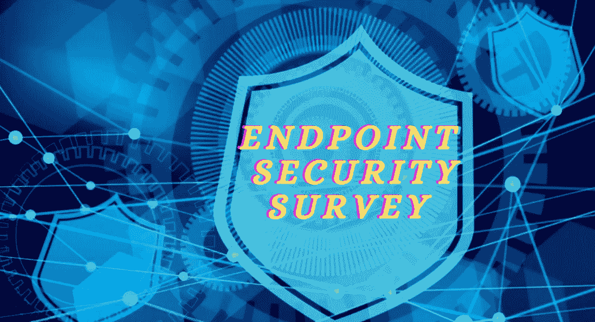

# 如何在您的组织中执行有效的终端安全调查

> 原文：<https://medium.com/nerd-for-tech/employees-endpoint-security-internal-survey-template-61a16480a08?source=collection_archive---------0----------------------->

员工终端安全内部调查-模板

我设计了一份关于终端安全性的内部员工调查，此外，还可以将其视为调查模板，您甚至可以定制该调查，并添加针对您组织的需求和目标的问题。

该终端安全调查有助于单个组织确定与 IT 安全政策、方法的当前状态最相关的结论，以及对 IT 安全成熟度的逻辑洞察，重点关注网络安全发展。

**调查简介:**

我们正在进行一项关于终端安全性的内部员工调查，从现在开始将在线进行。感谢您的参与，并希望收到您的来信。网络安全团队正在调查员工的终端保护和安全解决方案。我们邀请所有员工参与调查，员工的积极参与将为团队提供理想的结果。

调查本身包含 40 个问题，需要大约 5-10 分钟完成。为了确保您对公司的所有回复的隐私和保密性，我们只询问您在哪个部门工作，这将有助于我们收集和分析数据。

请注意，这是一项匿名调查。我们不会看到您的个人回答:自动程序将汇总并提供一份没有姓名或电子邮件地址的调查。

注意:我们必须回答所有问题。请不要在阅读问题之前点击是/否。谢谢你的理解。

请花点时间完成以下快速调查。

***必选**

**1。你在哪个部门工作？请从以下列表中选择适用的部门*。**

☐高管

☐导演

☐高级副总裁

☐副总裁

☐会计和金融

☐人力资源

☐营销与传播

☐商业战略

☐法律

☐商业部

☐产品部

☐研发部

☐销售

☐售前解决方案部

☐客户服务部

☐网络部

☐运行维护部

☐物理安全

☐接待处

添加替代文本

**2。您目前使用的是什么类型的设备*？**

☐Windows

☐·麦克

☐ Unix 发行版(所有)

**3。如果您是 Windows 用户，计算机上安装了哪个版本的 Windows 操作系统*？**

**提示:**在 windows 搜索框中键入 **winver** 并按回车键，将显示操作系统名称

☐视窗 10

☐视窗 8.1

☐视窗 8

☐视窗 7

☐ Windows Vista

☐视窗 XP

☐我不知道

**4。如果你使用的是 windows 10，你能从你的设备中选择正确的更新版本吗？**

**提示:**在 windows 搜索框中键入 **winver** 并按回车键，将显示操作系统版本。

☐版本 1709

☐版本 1803

☐版本 1809

☐版本 1903

☐版本 1909

☐版本 2004

☐不适用

**5。如果你是 MAC 用户，目前，你有哪个版本的 MAC *？**

**提示:**点击屏幕左上角的苹果菜单图标，然后选择“关于本机”命令。

☐·马科斯 10.15:卡特琳娜(爵士)

☐马科斯 10.14:莫哈韦

☐马科斯 10.13:高塞拉

☐马科斯 10.12:塞拉

☐操作系统 X 10.11:埃尔卡皮坦

☐操作系统 X 10.10:约塞米蒂

☐ OS X 10.9 小牛

☐不适用

**6。您上次更新 Windows 操作系统*是在什么时候？**

**提示:**点击 Windows“设置”——>点击“更新安全”——>点击“Windows 更新”——>点击“更新历史”。

☐:我把它设置成自动更新了

这个月去☐

上个月在☐

☐有时当我想起

☐延迟/忽略通知

☐:我不知道什么是视窗更新

☐从不

☐不适用

**7。您上次更新 MAC 操作系统*是在什么时候？**

☐:我把它设置成自动更新了

这个月去☐

上个月在☐

☐有时当我想起

☐延迟/忽略通知

☐:我不知道什么是视窗更新

☐从不

☐不适用

**8。你带几台笔记本电脑去上班*？**

☐一号

☐二号

☐三号

☐没有

**9。你带了多少智能设备去上班*？**

**示例:智能手机、iPhone、iPad、智能手表、蓝牙耳机/耳麦*？**

☐ 1

☐ 2

☐ 3

☐ 4

☐ 5

**10。您的 PC/MAC*上安装了防病毒软件吗？**

☐是的

☐没有

☐我不知道

**11。您的手机*上安装了防病毒软件吗？**

☐是的

☐没有

☐我不知道

12。您正在使用哪种电脑防病毒应用程序*？如果适用，选择多选*？

☐ 360 安全

☐移动腾讯保护

☐趋势科技

☐·阿瓦斯特

☐微软(Windows Defender 防病毒软件)

☐分野

☐·赛门铁克

☐平均值

☐·阿维拉

☐·卡巴斯基

☐·迈克菲

☐·比特 defender

其他人键入它:

13。你是安卓或 iPhone 用户吗*？

☐安卓

☐ iPhone

☐ Windows phone

☐黑莓操作系统

☐其他人:

14。如果您的回答是肯定的，您能告诉我们您执行自动或手动病毒扫描的次数吗？

☐自动

这个月去☐

上个月在☐

☐有时当我想起

☐延迟/忽略通知

☐当我的电脑变慢的时候

☐从不

15。在过去的工作中，您是否在您的电脑上发现过病毒或木马*？

☐:是的，我的电脑以前被感染过。

☐:没有，我的电脑从来没有被感染过。

☐不知道，什么是病毒或特洛伊木马*？

16。你离开办公桌时会锁电脑吗？

☐是的，我愿意(是的；我愿意)

☐不，我不做

☐没人能碰我的电脑

17。您的 PC/MAC 屏幕在闲置* 10 分钟后会自动锁定吗？

☐是的

☐没有

18。您通常使用哪种网络浏览器*？如果适用，选择多个。

☐ Internet Explorer

☐ Q360

☐谷歌浏览器

☐ Mozilla Firefox

☐歌剧院

☐野生动物园(苹果公司)

其他人键入它:

**19。您是否对您的数据进行分类，区分敏感数据和非敏感数据*？**

☐:是的，我喜欢

☐:不，我不知道

☐不适用

**20。您是否正在采取任何措施来保护您控制下的敏感数据(文档*？**

☐:是的，我喜欢

☐部分地照顾它

☐:不，我不知道

☐不适用

**21。是否使用加密*来保护最有价值的数据或公司的敏感数据？**

☐是的，我愿意(是的；我做加密)

☐:是的，但是没有任何加密协议

☐:不，我不知道

☐从未听说过加密

☐不适用

**22。您是否或能否使用自己的个人设备(如手机、u 盘)来存储或传输公司机密信息*？**

☐:是的，我喜欢

☐:不，我不知道

☐不适用

**23。您是否遵循任何程序来创建公司关键信息的可检索备份和存档副本*？**

☐:是的，我喜欢

☐无手续，店铺随机

☐:不，我不知道

☐，我不需要备份

☐不适用

**24。你有处理文件的程序吗？**

☐:是的，我喜欢

☐:不，我不知道

☐没有任何手续，直接处置

☐不适用

**25。你的办公桌上有任何敏感文件吗？**

☐:是的，我喜欢

☐:不，我不知道

☐不适用

**26。你把公司的机密文件*放在哪里？**

书桌上的☐

☐安全柜

☐个人内阁

无人看管的☐

**27。您多久从办公室获取一次信息，然后在家里用电脑处理一次*？**

几乎每天都去☐

☐每周至少一次

☐每周至少两次

☐每月至少一次

☐不适用

☐从不

28。几天后你会更改你的电脑密码？

☐每周

☐ 30 天一次

☐ 60 天一次

☐ 90 天一次

☐一年一次

☐从不

29。您使用的安全密码是否超过 8 个字符*？

☐是(8 个或更多字符)

☐编号(少于 8 个字符)

☐没有密码

三十岁。您能否确保只有经过授权的人员才能访问您的计算机*？

☐只有我自己

☐与同事/团队分享

☐:我不确定

31。工作 PC 的密码是否已被授权或告知他人，密码是否已被更改*？

☐变了

☐没有变

☐我不知道

☐不适用

其他人键入它:

32。您使用的是 windows 防火墙吗，它是打开的还是关闭的*？

☐:是的，启用了

☐:不，它没有启用

☐:我不知道什么是防火墙

**33。在过去 3 个月内，您是否在您的电脑中发现过任何病毒*？**

☐是的

☐没有

☐我不知道

34。您是否打开过任何来源不明的广告、电子商务、活动邀请电子邮件*？

☐是的

☐没有

☐从他们那里打开一个附件没有错

**35。在过去 3 个月内，您是否在工作电脑上下载并安装了任何未知的第三方软件*？**

☐是的

☐没有

☐:嗯，我不记得了

**36。你知道什么是电子邮件诈骗以及如何识别电子邮件诈骗吗？**

☐:是的，我喜欢

☐:不，我不知道

☐:我不在乎

37。我的电脑对黑客没有价值；他们没有针对我)你认为呢？

☐真实

☐假

**38。你知道当你的电脑被恶意软件感染或锁定时应该联系谁吗？**

☐:是的，我知道该联系谁

☐:不，我不知道该联系谁

**39。如果您从计算机、闪存盘或硬盘上删除了一个文件，该信息将无法再恢复*？**

☐真实

☐假

**四十。您认为您的计算机有多安全*？**

☐非常安全

☐安全

☐不安全

☐不知道

**— — — — —调查结束！👏 👏 👏— — — — —**

**非常感谢您花时间完成我们的调查！**

要下载该调查，[单击此处](https://dl.orangedox.com/7MNo9blOb31uIhcU2I)

密钥:B*%EnD_$20 秒-！总产量

> **别忘了查看这些文章的** *⬇️最好的小镇*😉
> 
> [***如何在浏览器上禁用你的谷歌搜索数据活动、广告个性化、搜索历史、搜索设置？***](/faun/how-to-disable-your-google-search-data-activity-ad-personalization-search-history-search-e713948cf1ae)
> 
> [***微软针对软件开发人员的 12 大安全软件开发生命周期(SSDL)实践&安全团队？*T34**](/faun/microsofts-top-12-secure-software-development-lifecycle-ssdl-practices-for-software-developers-f54176667fb5)
> 
> [***如何永久关闭或禁用导致高 CPU 使用率的 Microsoft 兼容性遥测服务？***](/faun/how-can-i-permanently-turn-off-or-disable-the-microsoft-compatibility-telemetry-task-to-prevent-aa9f0a264295)
> 
> [***如何创建一个漏洞管理安全团队，在您的组织中扮演&角色职责？***](/faun/how-to-create-a-vulnerability-management-team-work-flow-chart-process-roles-and-be3eb1bad0d3)
> 
> [***软件开发人员 14 大 OWASP 安全编码实践***](/faun/top-14-owasp-secure-coding-practices-for-software-developers-5daef14734eb)
> 
> [***国土安全部(DHS)如何收集、使用、保护美国公民、B1 居民/B2 游客的个人数据？***](https://gtmars.medium.com/how-the-department-of-homeland-security-dhs-collect-use-protect-the-pii-data-of-u-s-7776e99e2611)
> 
> [什么是密码学中的 HMAC 消息认证系统？如何在 cryptool2.1 开源软件上部署？](/faun/what-is-hmac-message-authentication-system-in-cryptography-f385d1480642)
> 
> [风险管理概述&将风险管理整合到 SDLC 中](/@gtmars/risk-management-overview-integration-of-risk-management-into-sdlc-ae48de24b743)
> 
> [员工终端安全内部调查-模板](/@gtmars/employees-endpoint-security-internal-survey-template-61a16480a08)