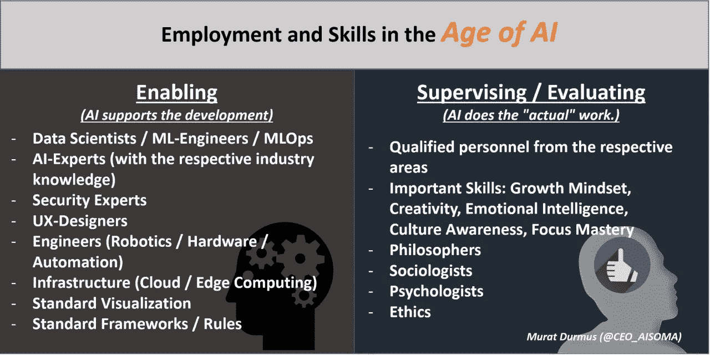
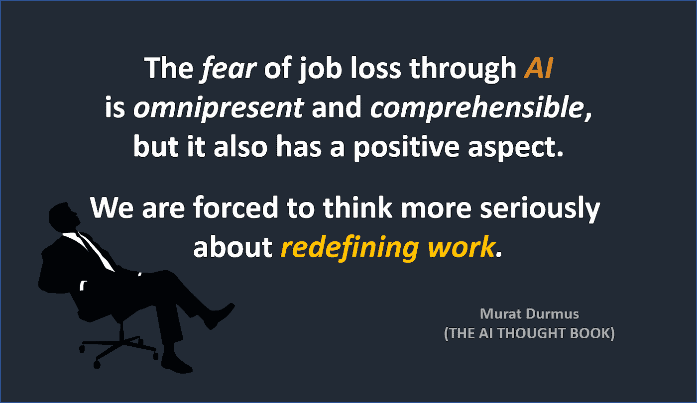
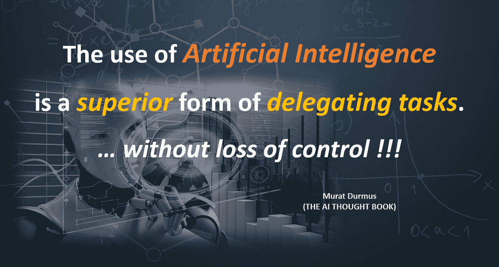
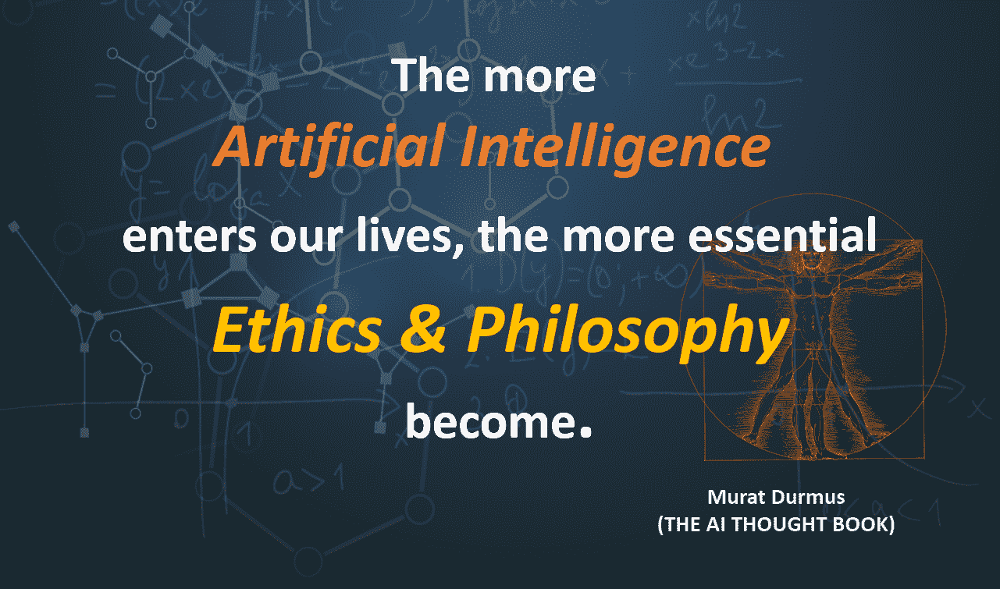
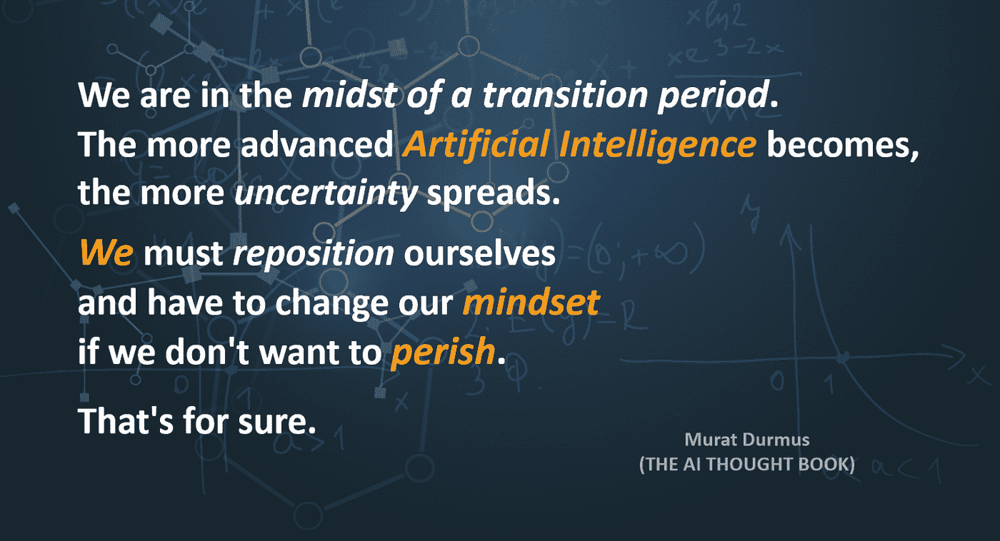
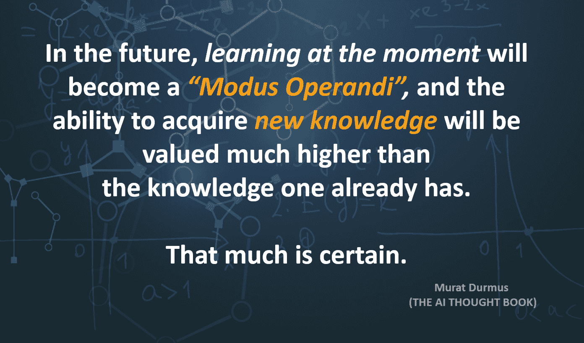

# 人工智能时代的就业与技能

> 原文：<https://medium.com/nerd-for-tech/employment-and-skills-in-the-age-of-ai-5dccfcf5a295?source=collection_archive---------3----------------------->

人工智能时代的就业与技能

关于未来就业的一些基本(可能过于肤浅)想法:

毫无疑问，我们目前正处于向人工智能时代过渡的阶段。整个事情的发展速度一天比一天快。我们一定不能陷入思考的信念:这都需要一些时间，我们有足够的时间来思考 AI 对我们人类和社会的影响。现在，没有人能准确地估计人工智能领域的发展。看到这一点最好的方法是，即使是所谓的专家也有不同的看法。

在我看来，人工智能时代的未来就业类型可以大致分为两个领域:

**1。人工智能使能**

**2。人工智能-监督/评估。**

**AI 使能**

这个领域已经发生了很多事情。例如，越来越多的物联网设备进入市场，还不能产生数据或具有接口的机器正在翻新。

纵观近年来的就业市场，你可以看到越来越多的数据科学家、ML/数据工程师和人工智能专家受到追捧。因此，几乎每所大学都提供人工智能课程/学位。甚至有纯人工智能大学，一切都是围绕人工智能设计的。

在硬件开发和技术进步方面也有很多进展。像神经形态芯片和量子计算这样的新方法越来越成熟。

由于对人工智能的关注不断增加，社区和“专家”的数量也在增加。因此，算法/网络拓扑不断得到改进和优化。

**最大挑战:**

*   让算法更高效、更透明、更易解释、更公平
*   标准
*   安全性
*   稳健性

**人工智能-监督/评估**

这里看起来还不太好，但我们慢慢意识到人工智能对我们的生活和社会的重大影响。人类不得不重新定位自己，重新思考自己在某些领域的思维方式。

这并不容易，所以我们需要更多的哲学家、社会学家和心理学家来帮助我们应对所有这些变化，并将它们转化为我们的优势。

我们需要成为更多真正的思想家，更不用说哲学家了。像成长心态、创造力、情商、文化意识和专注度这样的软技能成为“重要素质”，因为单调和基于规则的理想状态对我们人类来说将不再存在。

甚至约翰·麦卡锡教授也意识到了哲学的重要性。不幸的是，我们经常迷失在技术细节中，而忽略了主题领域的整体观点。总和比它的组成部分更多更不同。

**最大挑战:**

*   **我们必须改变/适应我们的心态。**

> *人工智能必须面向人类，应该仅仅具有补充功能。*

最后，关于未来学习和知识的另一个想法:

木拉提

(摘自该书:“[有意识的人工智能:对人工智能的反思](https://www.amazon.com/dp/B0BKLCKM22)”)

亚马逊上有售:[正念 AI](https://www.amazon.com/dp/B0BKLCKM22)

[正念 AI](https://www.amazon.com/dp/B0BKLCKM22)