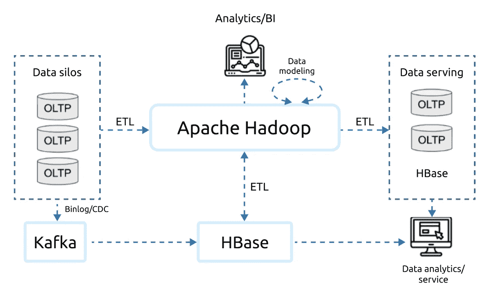
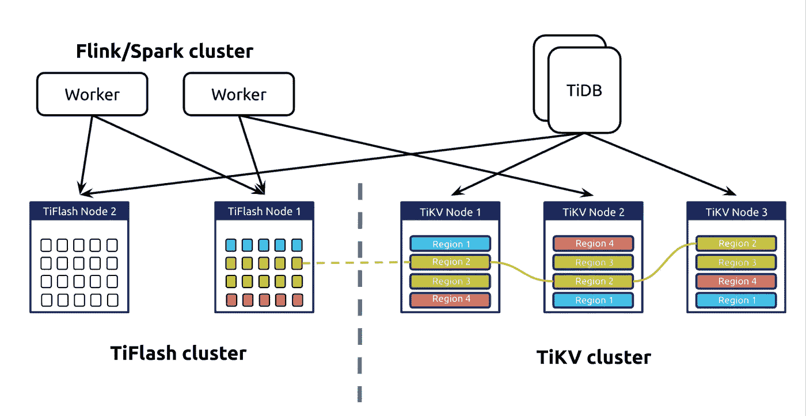
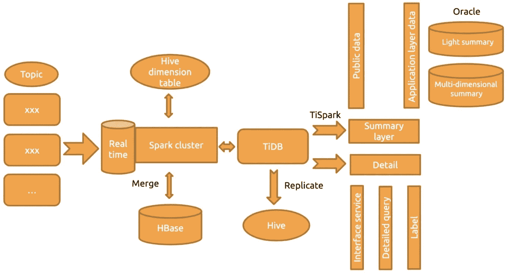

# 利用 TiDB 中的大数据+实时分析为您的企业助力

> 原文：<https://medium.com/nerd-for-tech/empower-your-business-with-big-data-real-time-analytics-in-tidb-61e12645939b?source=collection_archive---------23----------------------->

作者:

*   粥悦悦(平盖产品专家)
*   苏丹(平盖产品专家)

Transcreator: [黄然](https://github.com/ran-huang)；编辑:汤姆·万德

近年来，大数据不仅仅是一个时髦词，也是雄心勃勃的公司日益增长的需求。随着数据规模的激增和对数据新鲜度的严格要求，大数据相关场景正变得复杂和多维。因此，许多公司使用实时数据仓库来满足他们的业务需求。

但是数据仓库并不是唯一的选择。一个新兴的数据库类别，[混合分析/事务处理](https://en.wikipedia.org/wiki/Hybrid_transactional/analytical_processing) (HTAP)数据库，可以为您提供与数据仓库一样好的服务，如果不是更好的话。HTAP 数据库可以处理在线事务处理(OLTP)工作负载，并实时快速响应大数据分析请求。

在本帖中，**我们将分享实时大数据分析的用途、成本和技术选择。**我们还将介绍 [TiDB](https://docs.pingcap.com/) ，一个为海量数据设计的开源 HTAP 数据库。我们希望这将有助于您为您的组织寻找大数据架构。

# 为什么选择实时分析+大数据

对于组织中的不同角色，实时数据分析在其决策过程中扮演着不同的角色:

*   高管需要了解公司的现状，并为未来几年制定计划。他们希望通过查询过去几年的实时报告和损益表来分析公司的财务状况，根据现有的数据模型预测未来几年的收入，并确定公司的未来计划。在这个过程中，他们可能需要以细粒度的方式查询数据，例如每月、每天甚至每小时。
*   **特定业务线的经理需要了解其业务的收入、流量峰值和健康状况。**他们可能希望看到过去几年中任何时间点的可视化业务数据、实时报告和收入预测。
*   **安全总监需要持续关注任何信息安全问题。**他们可能还需要查询过去一周或一个月内给定时间段的风险数据。

这三个角色通常需要实时数据分析来做出决策。此外，因为它们查询的时间跨度长，所以必须考虑数据规模。基础架构软件在大数据规模上提供实时数据分析具有挑战性。

# 当前的大数据解决方案

随着业务的发展，用户不再满足于仅对离线数据进行数据分析。他们希望他们的分析基于更新的数据，甚至是动态数据。为了对新数据执行分析，他们的在线事务处理(OLAP)架构需要一个面向 OLAP 的数据仓库。

## 技术限制

当前的数据解决方案都有各自的问题:

*   基于 Hadoop 的传统数据仓库解决方案不能很好地支持实时分析。
*   像 HBase 这样的 NoSQL 解决方案，尽管它们是可扩展的，并且支持实时查询，但是不能提供所需的分析能力。
*   独立数据库不可伸缩。
*   在线事务处理(OLTP)数据库通常使用基于行的存储，这不能很好地处理 OLAP 工作负载。

此外，基于上述技术的现有大数据平台有几个缺点:**复杂的提取、转换、加载(ETL)、高存储成本、冗长的数据传输过程、复杂的技术堆栈**。

*传统大数据平台*

## 高成本

在努力构建和维护如上所述的系统时，用户必须承担全功能数据团队的高成本:

*   开发团队
    ETL、后端和前端的数据开发工程师。他们将构建、运营和维护大数据平台和数据仓库。
    数据分析师，汇总公司范围内的业务数据并执行数据分析。
    建立数学模型以满足业务需求的数据算法工程师。这些高薪人才很难获得。
*   产品和运营团队
    试图通过数据驱动策略解决业务痛点的数据产品经理。他们识别和评估各种需求，并将它们融合成一个标准产品。
    帮助业务团队使用数据产品的数据运营专家。

建立一个涵盖所有这些岗位的团队会让公司损失一大笔钱，更何况一些高层次的人才在劳动力市场上是稀缺的。组建团队可能需要六个月到一年的时间，开发数据平台可能需要一到两年的时间。在这个过程中，你可能需要引入各种技术，增加维护的复杂性。

# TiDB 如何盛行

TiDB 是一个支持 HTAP 工作负载的开源分布式数据库。它具有横向可扩展性、强一致性、高可用性和实时数据分析。此外，TiDB 与 MySQL 兼容，易于管理。

## 强大的功能

TiDB 最大的优势之一是它的 HTAP 架构。在 TiDB 中，行存储和列存储可以共存，为不同种类的查询提供服务。

*   它提供了完整的索引和高度并发的数据访问。
*   它有一个高性能的[大规模并行处理](https://en.wikipedia.org/wiki/Massively_parallel) (MPP)框架和一个可更新的列存储引擎。每次更新数据时，TiDB 都会相应地更新列存储引擎，以便 OLAP 请求可以始终读取最新的数据。
*   其 HTAP 架构可处理 OLTP 和 OLAP 工作负载。优化器决定使用哪个存储引擎，从而简化了体系结构。

*TiDB 的 HTAP 建筑*

TiDB 还**支持弹性缩放**:

*   当 TiDB 运行时，您可以在不影响生产环境的情况下弹性地扩展或收缩集群组件。
*   TiDB 的架构将计算和存储分开，因此您可以独立扩展计算节点和存储节点。

TiDB **支持标准 SQL 语法和 MySQL 协议**:

*   它使用标准的 SQL 语法，包括聚合和窗口函数、连接、排序、DML 和在线 DDL。
*   如果您已经在使用 MySQL 或其外围工具，采用 TiDB 将是无缝的，只需很少的代码更改。

TiDB 易于管理**:**

*   **您可以使用 [TiUP](https://docs.pingcap.com/tidb/dev/tiup-documentation-guide) 集群管理器轻松启动 TiDB 集群。**
*   **TiDB 不依赖其他系统，维护简单。**
*   **TiDB 提供了一个内置的监控仪表板，用于性能分析和故障排除。**

# **生态系统工具**

**TiDB 提供了各种工具来导入、导出、备份和恢复数据:**

*   **对于数据导入，您可以使用 [TiDB 数据迁移](https://docs.pingcap.com/tidb-data-migration/stable)进行从 MySQL 到 TiDB 的**完整和增量数据复制。迁移不会影响在线数据读写请求。 [TiDB Lightning](https://docs.pingcap.com/tidb/stable/tidb-lightning-overview) 使您能够**快速将大量数据导入 TiDB** 。****
*   **对于数据导出，您可以使用 [TiCDC](https://docs.pingcap.com/tidb/stable/ticdc-overview) 或 [TiDB Binlog](https://docs.pingcap.com/tidb/stable/tidb-binlog-overview) 将数据复制到 TiDB 或第三方下游平台进行进一步处理。**
*   **对于备份和恢复，您有[备份&恢复](https://docs.pingcap.com/tidb/stable/backup-and-restore-tool)到 p **执行完整和增量备份和恢复。****

**默认情况下，这些工具在所有表上运行。然而，如果您只需要表的子集，它们也支持[表过滤器](https://docs.pingcap.com/tidb/stable/table-filter)来指定子集。**

## **学习资源**

**TiDB 用户享有许多社区资源:**

*   **TiDB 为产品的每个活动版本提供全面的[文档](https://docs.pingcap.com/tidb/stable)，包括用户手册、产品规格和故障排除教程。**
*   **TiDB 工程师撰写[博客](https://pingcap.com/blog)文章，深入探讨数据库技术的许多方面。**
*   **跨行业的用户撰写[案例研究](https://pingcap.com/case-studies)分享他们的使用场景和经验。**
*   **TiDB 拥有活跃的开发者和用户社区。无论何时你需要帮助，你总能在 [GitHub](https://github.com/pingcap/tidb/issues) 和 [Slack](https://slack.tidb.io/invite?team=tidb-community&channel=everyone&ref=pingcap-blog) 上找到它们。**

# **在 OLAP 场景中采用 TiDB**

**许多公司已经采用 TiDB 来为他们的业务提供 HTAP 功能。ZTO 快车就是一个例子。**

## **ZTO 快递:从 Oracle 数据库云服务器到 TiDB**

**[ZTO 快递](https://www.crunchbase.com/organization/zto-express)是中国领先的快递公司，也是全球最大的快递公司之一。他们过去使用 Oracle 数据库云服务器，但随着业务的快速发展，它不再能满足他们的需求:**

*   ****数据库云服务器的存储容量面临巨大挑战。**数据库云服务器中的数据存储周期越来越短，而应用团队要求数据存储时间越来越长。**
*   ****分片解决方案不适合实时数据分析。**数据分析依赖于存储过程，该系统很难扩展和维护。**
*   ****在高峰时段，数据库云服务器存在单机性能瓶颈和单点故障的高风险。**数据以 T+1 模式复制，因此他们无法实时执行数据分析。**

**为了建立一个实时数据仓库，他们测试了 HBase 和 Kudu。但是 Kudu 与现有的技术堆栈不兼容，HBase 对多维查询的支持非常有限。最后，他们采用 TiDB 来解决他们的问题。**

**ZTO 快递基于 TiDB 构建了他们的系统，如下所示:**

****

**ZTO 快车的 TiDB 架构**

**这种新的数据库基础架构为他们带来了以下好处:**

*   **支持的数据存储期从 15 天延长至 45 天。**
*   **TiDB 支持在线**水平伸缩**。要横向扩展或纵向扩展，他们可以随时在存储或计算层添加或删除节点。扩展过程对应用程序操作和维护人员是透明的。**
*   **TiDB 拥有针对 OLTP 工作负载的**高性能**。它的性能可能略低于 Oracle，但这是因为 TiDB 是一个分布式数据库。**
*   ****OLTP 和 OLAP 工作负载分离**，单个节点上的压力不复存在。**
*   **TiDB 支持从各种角度进行更加**灵活的数据分析**。**
*   **我们的**硬件成本降低**。**

**关于 ZTO 快递如何使用 TiDB 的更多细节，请阅读他们关于 300% IT 效率提升的故事。**

# **摘要**

**作为 HTAP 数据库，TiDB 可以提供比 OLTP 数据库更好的实时分析和数据仓库服务。凭借其基于行和列的存储引擎，其分析能力不仅仅是在高并发性下定位数据。它还涵盖了大规模交互式商业智能(BI)查询。**

**你可以独立使用 TiDB 构建自己的实时数据分析系统，但也可以将其与大数据工具集成，建立离线实时的数据仓库。部分用户[将 Apache Flink 与 TiDB](https://pingcap.com/blog/apache-flink-+-tidb-a-scale-out-real-time-data-warehouse-for-analytics-within-seconds) 连接，以适应更多场景。**

**如果您对 TiDB 的实时分析解决方案感兴趣，欢迎[加入我们的 Slack 频道](https://slack.tidb.io/invite?team=tidb-community&channel=everyone&ref=pingcap-blog)，与我们一起探索更多。**

***最初发表于*[*www.pingcap.com*](https://pingcap.com/blog/empower-your-business-with-big-data-real-time-analytics-in-tidb)2021 年 4 月 15 日**