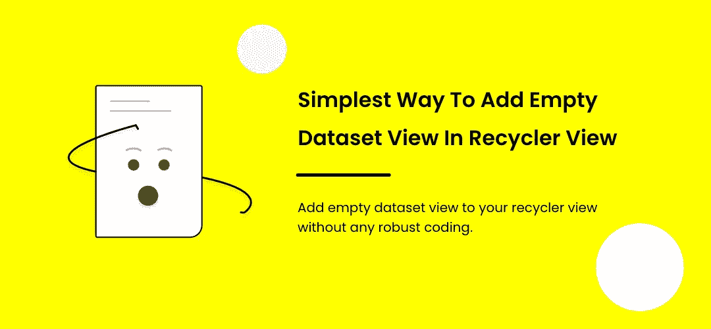
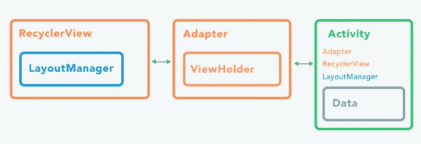
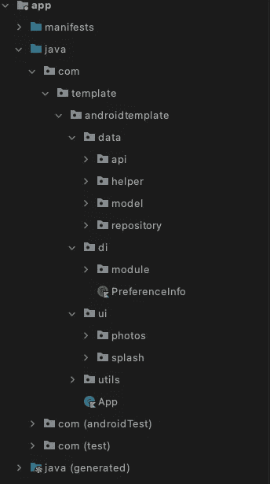
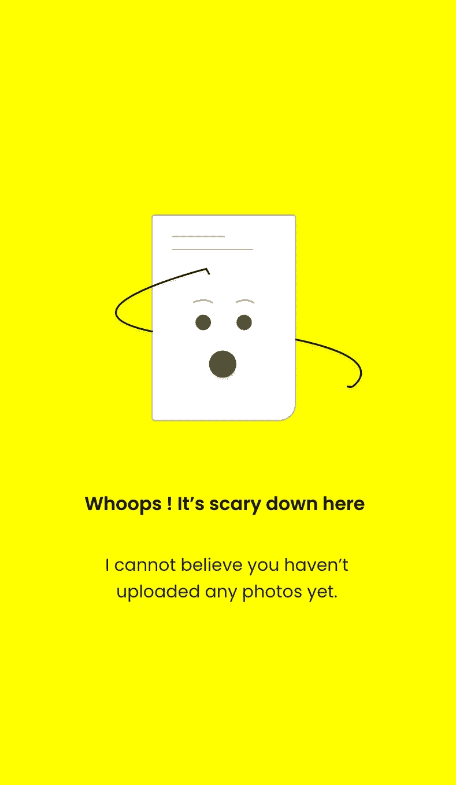

# RecyclerView 中的空数据状态

> 原文：<https://medium.com/nerd-for-tech/empty-dataset-in-recyclerview-ad86833dd5c6?source=collection_archive---------2----------------------->

简单的方法添加一个空的“哦哇！”在回收器视图中。



**简介**

RecyclerView 可以轻松高效地显示大量数据。您提供数据并定义每个项目的外观，RecyclerView 库在需要时动态创建元素。

让我们开始吧，本教程是基于 MVVM & 100%科特林与刀柄依赖注入。这里，我们从服务器请求一个数据列表，并将其填充到 recycler 视图中，然后我们将实现 recycler 视图的不同情况。

下图显示了我们的**回收审查**的组件，以及它们如何用于不同的部分。



来源。开放式教室

> 项目结构



项目结构

> 赞美诗不知道的话去看看[匕首柄和 id](https://developer.android.com/training/dependency-injection/hilt-android) 。


把密码给我？请点击下面的链接。

[](https://github.com/iamnaran/search-recycler-view) [## iam naran/搜索-回收器-查看

### 这个项目帮助你理解 Android (Kotlin)中的手柄集成，它包括改进的协程架构…

github.com](https://github.com/iamnaran/search-recycler-view) 

抬头！使用 recyclerview & searchview 查看初始项目设置。

[](https://iamnaran.medium.com/implem-search-in-recyclerview-5bc18b547f4f) [## RecyclerView 中的简单搜索

### 用 kotlin 中的搜索视图过滤回收器视图。

iamnaran.medium.com](https://iamnaran.medium.com/implem-search-in-recyclerview-5bc18b547f4f) 

现在，让我们为 **recyclerview** 集成空数据集。为了在 **recyclerview** 中实现空数据集，我们有多种方法可以实现这个特性。让我们用最简单的形式。

首先，我们需要一个空数据集的布局，它将显示为空视图。在此之前，获取一个图像显示在我们的空数据集视图中。我们只需要一个图标，标题和副标题将从**字符串. xml.** 给出

看起来像这样。



让我们为上面的设计创建一个布局。

> item_empty_dataset.xml

```
<?*xml version*="1.0" *encoding*="utf-8"?>
<androidx.constraintlayout.widget.ConstraintLayout *xmlns:android*="http://schemas.android.com/apk/res/android"
    *xmlns:app*="http://schemas.android.com/apk/res-auto"
    *xmlns:tools*="http://schemas.android.com/tools"
    *android:layout_width*="match_parent"
    *android:layout_height*="match_parent"
    *android:orientation*="vertical"
    *android:layout_gravity*="center"
    *android:gravity*="center"
    *android:paddingTop*="10dp"
    *android:paddingBottom*="10dp"
    *tools:ignore*="RtlHardcoded">

    <ImageView
        *android:id*="@+id/imageView2"
        *android:layout_width*="wrap_content"
        *android:layout_height*="wrap_content"
        *app:layout_constraintBottom_toBottomOf*="parent"
        *app:layout_constraintEnd_toEndOf*="parent"
        *app:layout_constraintHorizontal_bias*="0.498"
        *app:layout_constraintStart_toStartOf*="parent"
        *app:layout_constraintTop_toTopOf*="parent"
        *app:layout_constraintVertical_bias*="0.422"
        *android:src*="@drawable/ic_empty_dataset_1" />

    <TextView
        *android:id*="@+id/title"
        *android:layout_width*="0dp"
        *android:layout_height*="wrap_content"
        *android:text*="Title is called when title is placed"
        *android:padding*="10dp"
        *android:fontFamily*="@font/normal"
        *android:textStyle*="bold"
        *android:gravity*="center"
        *app:layout_constraintEnd_toEndOf*="parent"
        *app:layout_constraintStart_toStartOf*="parent"
        *app:layout_constraintTop_toBottomOf*="@+id/imageView2" />

    <TextView
        *android:id*="@+id/sub_title"
        *android:layout_width*="0dp"
        *android:layout_height*="wrap_content"
        *android:text*=" Subtitle is called when title is placed. Subtitle is called when title is placed"
        *android:padding*="5dp"
        *android:fontFamily*="@font/normal"
        *android:gravity*="center"
        *android:layout_marginStart*="10dp"
        *android:layout_marginEnd*="10dp"
        *app:layout_constraintEnd_toEndOf*="parent"
        *app:layout_constraintStart_toStartOf*="parent"
        *app:layout_constraintTop_toBottomOf*="@+id/title" />
</androidx.constraintlayout.widget.ConstraintLayout>
```

然后，下一步是实施 **RecyclerView。 **EmptyDataObserver.kt** 中的 AdapterDataObserver()** 类

这个类是做什么的？

它观察 recycle view 项目计数，并在我们的活动中为**recycle view&空数据集布局切换显示/隐藏功能。**


我们马上就会看到实现是多么容易。首先让我们创建新的 EmptyDataObserver 类。

> **EmptyDataObserver.kt**

```
*/*
 * Copyright (c) 2021.
 * Created by NaRan
 *
 */

package* com.template.androidtemplate.utils

*import* android.view.View
*import* androidx.recyclerview.widget.RecyclerView

*class* EmptyDataObserver *constructor*(rv: RecyclerView?, ev: View?): RecyclerView.AdapterDataObserver() {

    *private var* emptyView: View? = *null
    private var* recyclerView: RecyclerView? = *null

    init* {
        recyclerView = rv
        emptyView = ev
        checkIfEmpty()
    }

    *private fun* checkIfEmpty() {
        *if* (emptyView != *null* && recyclerView!!.*adapter* != *null*) {
            *val* emptyViewVisible = recyclerView!!.*adapter*!!.*itemCount* == 0
            emptyView!!.*visibility* = *if* (emptyViewVisible) View.*VISIBLE else* View.*GONE* recyclerView!!.*visibility* = *if* (emptyViewVisible) View.*GONE else* View.*VISIBLE* }
    }

    *override fun* onChanged() {
        *super*.onChanged()
        checkIfEmpty()
    }

    override *fun* onItemRangeChanged(positionStart: Int, itemCount: Int) {
        *super*.onItemRangeChanged(positionStart, itemCount)
    }

}
```

现在，让我们在我们的活动中包括(我们刚刚在上面制作的视图)。确保包括给出符合 **recyclerview** 的正确属性，并使其可见性消失。

> **activity_name.xml**

记住，要设置可见性**消失**。

```
<include
    *android:id*="@+id/empty_data_parent"
    *layout*="@layout/item_empty_dataset"
    *android:layout_width*="match_parent"
    *android:visibility*="gone"
    *app:layout_constraintBottom_toBottomOf*="parent"
    *app:layout_constraintTop_toBottomOf*="@+id/search_layout"
    *android:layout_height*="match_parent"
    *android:layout_gravity*="center" />
```

要将我们的 **EmptyDataObserver** 注册到 **recyclerview** ，请在您的**适配器**初始化后添加这些行，

```
*private fun* setUpViews() { search_layout.findViewById<SearchView>(R.id.*search_view*)
        .setOnQueryTextListener(*this*)
    recycler_view.*layoutManager* = LinearLayoutManager(*this*,
        LinearLayoutManager.*VERTICAL*,*false*)
    photosAdapter = PhotosAdapter()
    recycler_view.*adapter* = photosAdapter

    // Here *val* emptyDataObserver = EmptyDataObserver(recycler_view, empty_data_parent)
    photosAdapter.registerAdapterDataObserver(emptyDataObserver)}
```

这应该行得通…

请尝试并执行它。更多的想法和教程源代码支持我。

再见，保重。#安全停留

