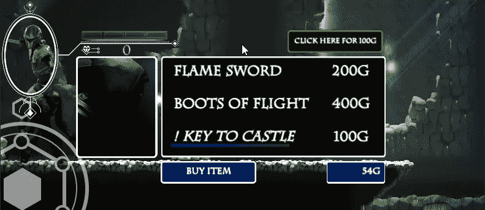

# 在手机游戏中启用 Unity 广告

> 原文：<https://medium.com/nerd-for-tech/enable-unity-ads-in-mobile-games-8eab9e1d358e?source=collection_archive---------17----------------------->

## 在 Unity 中启动移动游戏开发

## //欢迎来到黑暗面

给我们的游戏添加了终极邪恶。

首先，我不得不说，我觉得写这篇文章有点恶心。我鄙视，厌恶，绝对讨厌游戏奖励里的“点击这里看这个广告”。也就是说，这是移动游戏开发行业的标准，因此我们需要了解如何去做。