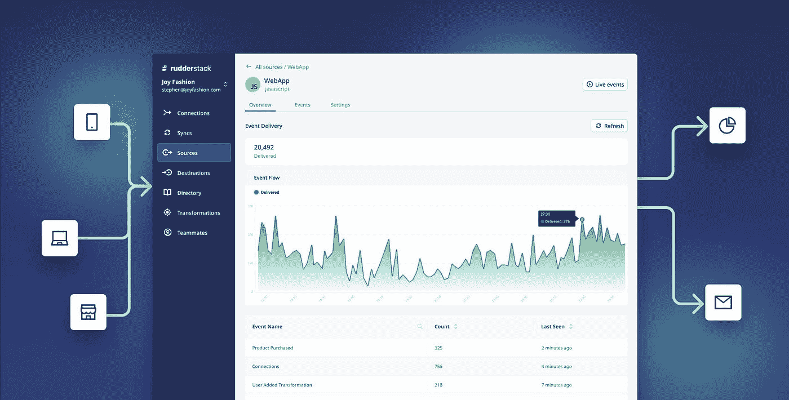

# 启用客户数据堆栈:RudderStack 系列融资

> 原文：<https://medium.com/nerd-for-tech/enabling-the-customer-data-stack-rudderstack-series-b-funding-bcf88c45f6e?source=collection_archive---------0----------------------->

今天，我很高兴地宣布 RudderStack 获得了由 Insight Ventures 领投的 5600 万美元 B 轮融资，并得到了 Kleiner Perkins 和 S28 Capital 的持续支持。这使我们的资金总额达到 8200 万美元。我们的 B 系列在帮助客户构建最佳数据堆栈方面向前迈出了一大步。

2019 年，我联合创立了 RudderStack，目标是帮助数据工程师建立所需的基础设施，以帮助他们的企业了解他们的用户并满足他们的需求。我的灵感来自于我在以前公司的经历，我在那里花了一年时间建立客户数据管道。在这个过程中，我了解到我和我的同事在企业范围内收集和处理客户数据时面临的许多挑战。这轮融资证明了我们在为客户解决这些挑战方面取得的进步。

在这一轮融资中，我们打算加快对我们产品的投资，使各地的工程师能够构建经得起未来考验的客户数据基础设施。

我为这支队伍在短短几年内取得的成就感到骄傲，并期待着未来的发展。

阅读介绍我们 B 系列的 [TechCrunch 文章](https://techcrunch.com/2022/02/02/rudderstack-raises-56m-for-its-customer-data-platform/)以了解更多信息。

*本博客原载:* [*https://www . rudder stack . com/blog/enabling-the-customer-data-stack-rudder stack-series-b-funding/*](https://www.rudderstack.com/blog/enabling-the-customer-data-stack-rudderstack-series-b-funding/)