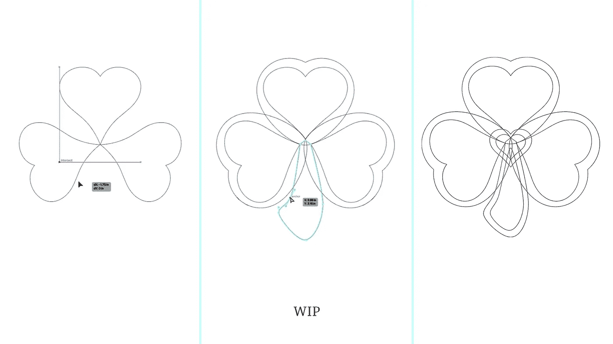
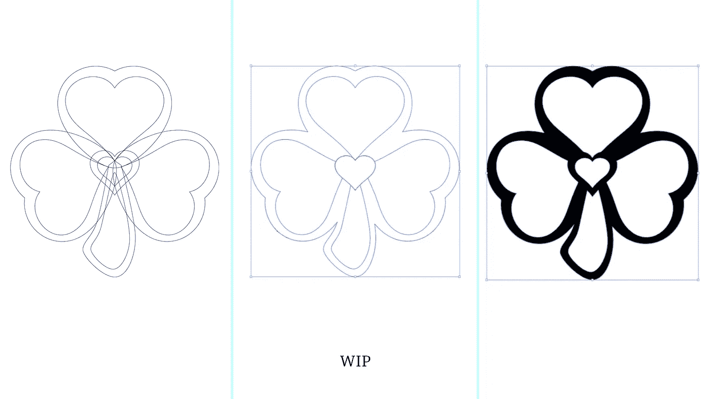
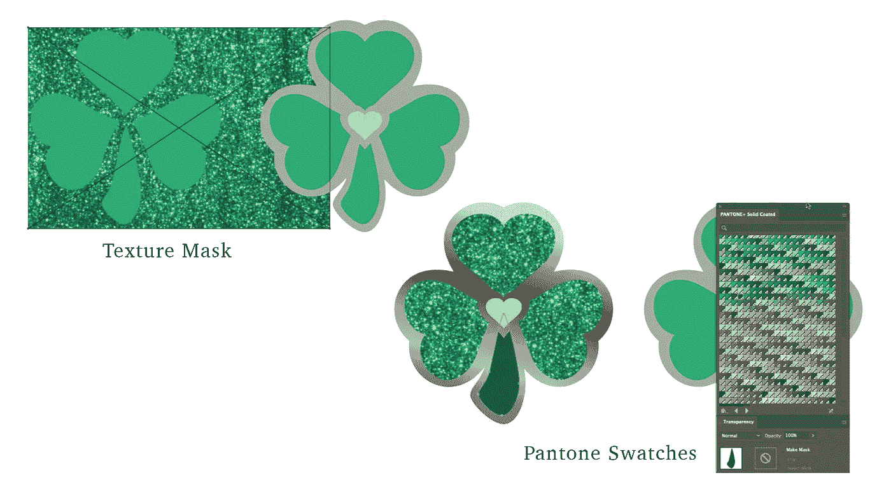

# 珐琅别针设计演示:三叶草

> 原文：<https://medium.com/nerd-for-tech/enamel-pin-design-demo-shamrock-eaf61276fca7?source=collection_archive---------13----------------------->

春天来了！没错，现在大雪覆盖了美国大片地区。但是，在几周之内，藏红花就会冒出来，新鲜的叶子会闪耀出翠绿色。就在春分之前，将是圣帕特里克节。让我们用三叶草别针演示来庆祝新的一季。

艺术品伊丽莎白·丘吉尔大师 2021

**施工**

你可能会从先前的珐琅胸针设计中认出这个胸针外部使用的柔软心形，****。为了创造三叶草的形状，我围绕中心轴旋转了心形，使其看起来像三叶草的叶子。顺便说一下，三叶草是三叶草，但不是所有的三叶草都是三叶草。这有点像正方形对长方形的情况。在爱尔兰，三叶三叶草具有文化意义。如果我们探索四叶草设计，它将在一个单独的项目。幸运的三叶草带领一个仙女是一个迷人的故事，但我们在这里建立一个三叶草。****

**使用设计集的外部，编辑内部心形，使其看起来像一片叶子。调整后的心形叶片现在具有更尖的尖端和凸起的曲线，将成为这枚胸针的珐琅口袋。一旦你在想要的位置有了三片双心形叶子，就开始画一个茎干。在选择不对称的茎之前，我画了几个不同的版本。我的设计需要改进，所以我复制了一片叶子，把它缩小，放在三叶草的中心作为焦点。**

****

**艺术品伊丽莎白·丘吉尔大师 2021**

****生产准备****

**在为生产做准备之前复制您的分层构建。当您看到设计为实心形状时，您可能希望进行一些快速编辑。**

**选择一个重复的构件，然后用 Pathfinder 合并背景形状。使用下面的“对象>路径>分割对象”功能来裁剪出底座未来的珐琅口袋。把搪瓷口袋想象成彩色玻璃。任何为珐琅预留的区域都将成为你设计中的一扇敞开的窗户。固体形态会变成金属镀层。这份文案最终会成为你的制作艺术品。**

****

**艺术品伊丽莎白·丘吉尔大师 2021**

****色彩补偿****

**好玩的部分；尝试各种颜色和特殊饰面！您可以通过选择“窗口”>“样本库”>“颜色表”>“Pantone 固体涂层”来找到正确的样本库。**

**一旦你有了总体调色板的想法，用一些特殊的纹理来掩盖，看看你对闪光或者黑暗中发光的选择有什么感觉。使用配色方案以镍、金、铜或黑色模拟您的 pin。在确定订单之前，让您的生产团队参与进来或做一点调查也无妨。你可能会惊讶粉丝最喜欢的是什么！**

****

****生产就绪艺术****

**对于这枚胸针，我选择了明亮的春绿色(374 摄氏度)作为中心色调，可爱的黄绿色(3405 摄氏度)作为叶子。后来，我觉得干应该是一个更深的阴影，所以我把它切换到 7484 C。右边的图钉艺术是一个固体形状(没有纹理遮罩或层)，颜色口袋使用实时绘画工具填充。无梯度的灰色区域是金属电镀的占位符。该文件已准备好发送！**

****你的设计****

**今年你会制作一枚独特的三叶草胸针吗？请分享你的作品！如果你把别针投入生产，我想看看最后的结果。**