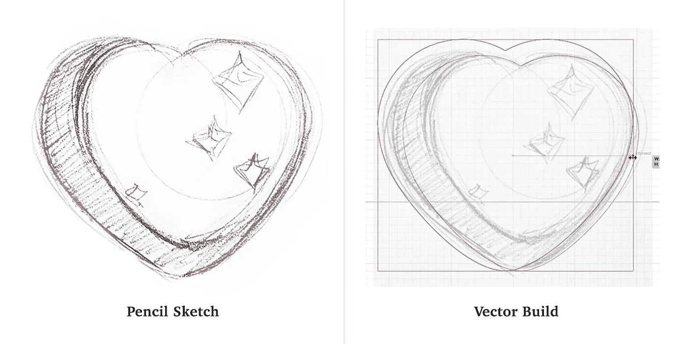
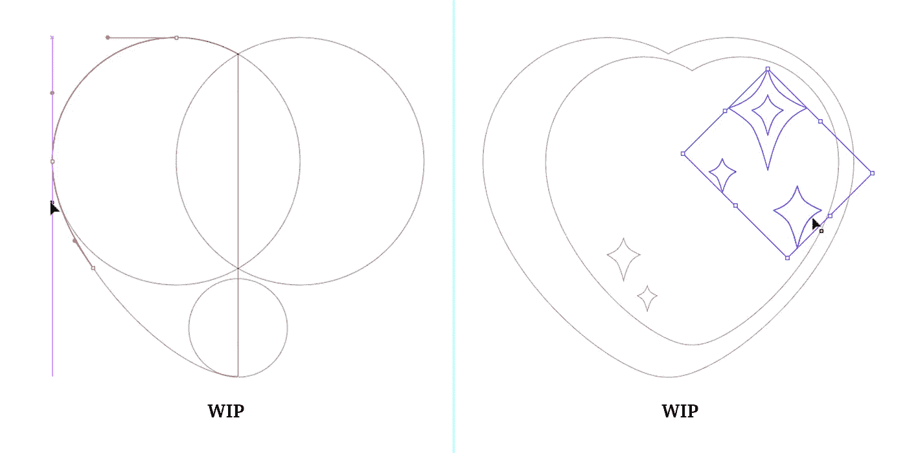
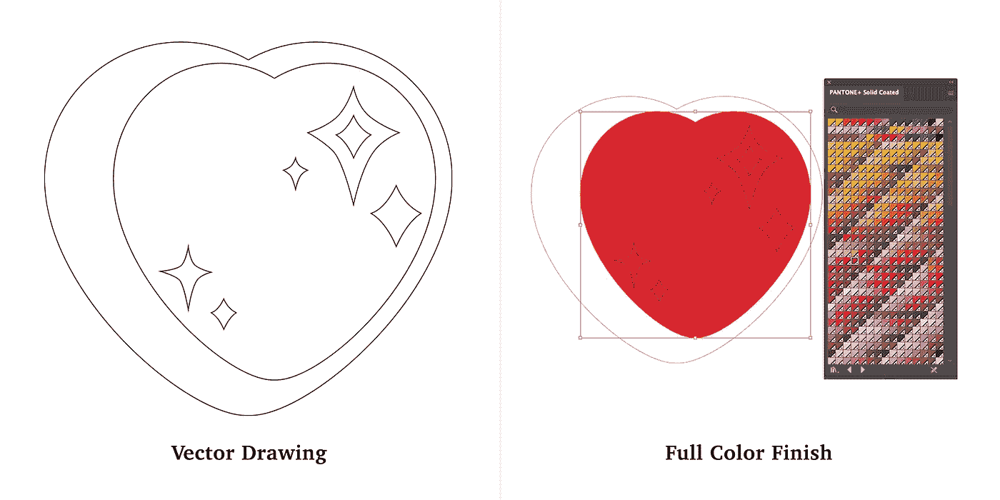
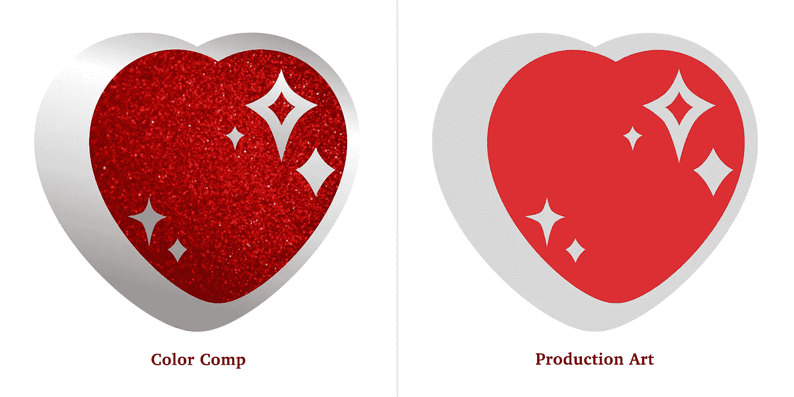

# 珐琅别针设计演示:闪亮的心

> 原文：<https://medium.com/nerd-for-tech/enamel-pin-design-demo-sparkly-heart-f27d25ecaaf3?source=collection_archive---------10----------------------->

这个快速设计演示将向您展示如何从简单的铅笔草图开始，构建一个可投入生产的闪亮心形珐琅别针设计，以及附带的全彩色概念艺术。

伊丽莎白·丘吉尔大师赛 2021

艺术品伊丽莎白·丘吉尔大师 2021

**概念**

最初的灵感来自情人节前后可以买到的樱桃红色果冻心，我设计了一个圆形的心形，没有尖点或曲线，以获得最佳的可爱效果。虽然我主要从事数字工作，但有齿的纸面可以给人的绘画增添一点活力。我用一个铅笔圆规做了最初的草图，然后很快地画出一些糖的火花。在快速拍摄草图后，我将粗略的图像导入 Adobe Illustrator 来构建矢量艺术。

艺术品伊丽莎白·丘吉尔大师 2021

**在制品(在制品)**

你可以看一个一分钟的视频，上面是我的铅笔素描到矢量图的过程。对于这个演示，在深入细节之前，我在设计过程中尽可能多地使用基本形状和极细的笔画。正是在这个阶段，我完善了形式。我根据需要参考了铅笔草图，直到我最终放弃了旧的草图层来支持改进的设计。

**色彩搭配/概念艺术**

在进一步修改设计之前，我创建了一个副本，放在一边以备后用。色彩组合让艺术家在交付前可以自由试验各种饰面。由你的制作团队来运作概念艺术是个好主意。他们可能有让你的设计防弹的技巧。

在探索阶段，我最初的想法转了几圈，最终转化成了一个分形的草莓心。草莓心 *Inception* 概念可能会成为一个单独的演示。但是现在，回到闪亮的心！

我设想 KISS 1795 C 为这个特别的心形别针的珐琅，一个闪光的表面，和金属镀层的抛光镍。

为了构建颜色组合，我将设计元素分开。我用渐变强调了注定要成为抛光镍的区域。接下来，我在红心图层下导入了一张红色闪光的照片。Adobe Illustrator 会在创建蒙版时将闭合的心形的填充、颜色和描边设置为 *none* ，所以我唯一关心的是准确放置。我选择了心层和红色闪光照片层。通过选择对象>剪辑蒙版>制作，项目被分组，闪光的照片被蒙版。对整体外观感到满意后，我准备将这幅画转化为艺术作品。

艺术品伊丽莎白·丘吉尔大师 2021

**生产就绪的作品**

这就是复制心脏设计发挥作用的时候。首先，我消除了所有的笔画，以支持可缩放的形状。使用 Pathfinder，所有元素被合并成一个没有重叠线条的实体设计。接下来，我设置样本库来显示 Pantone 固体涂层集。我利用实时上色工具，用选中的心形图案为每个口袋指定一种特定的颜色。心的红色中心被指定为 KISS 1795 C。我通过将这些区域涂成浅灰色来指示哪些区域将成为金属镀层。最终，生产就绪的作品可以交付了！

这种设计简单到足以在小尺寸下工作，甚至可能在一英寸以下。我把它看作一个可爱的小按钮！

**你的设计**

你有想要尝试的心形胸针概念吗？今年二月，你有没有画过糖果和心形图案？随意分享自己的草图和流程。同时，请继续关注更多演示！