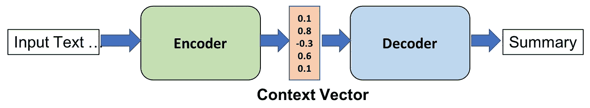
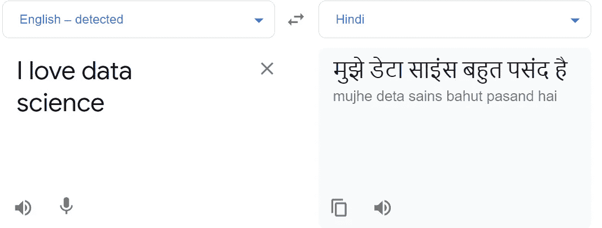
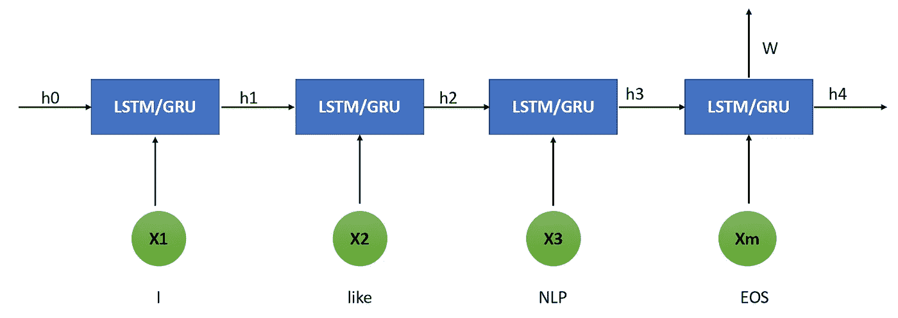
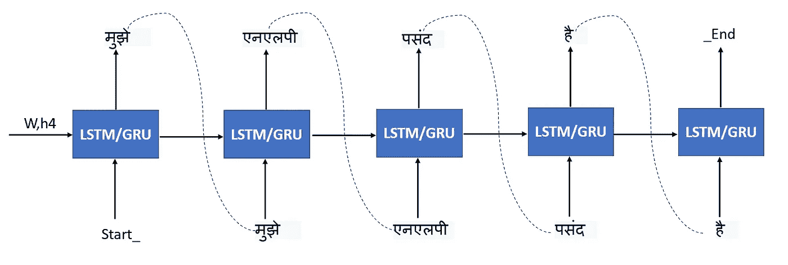

# 机器翻译的编解码模型

> 原文：<https://medium.com/nerd-for-tech/encoder-decoder-model-for-machine-translation-8a90be12ac32?source=collection_archive---------2----------------------->



在这篇文章中，我将尝试解释序列到序列模型，即编码器-解码器。最初，这个模型是为机器翻译开发的，但后来它也用于许多其他应用，如文本摘要、问答和视频字幕等。

读者应该知道神经网络，激活函数，损失函数，优化，RNN，LSTM，GRU，双向 LSTM。如果你对 [RNN](https://jaimin-ml2001.medium.com/understanding-rnn-91d548c86ac9?source=your_stories_page-------------------------------------) 、 [LSTM、GRU](https://jaimin-ml2001.medium.com/what-is-lstm-peephole-lstm-and-gru-77470d84954b?source=your_stories_page-------------------------------------) 或[双向 LSTM](https://jaimin-ml2001.medium.com/what-does-it-mean-by-bidirectional-lstm-63d6838e34d9?source=your_stories_page-------------------------------------) 不了解，可以看看我以前的文章。

序列到序列模型可用于以下应用。

1.  机器翻译:在 2016 年发布的一篇[论文](https://arxiv.org/pdf/1409.3215.pdf)中，谷歌提到了序列对序列是如何超越机器翻译中所有以前的方法的
2.  语音识别:同样的模型可以用于语音识别，谷歌在另一篇[论文](https://www.isca-speech.org/archive/Interspeech_2017/pdfs/0233.PDF)中提到过。
3.  图像字幕:-2015 年，谷歌提到了一篇研究论文在图像和视频字幕中实现了序列对序列模型。

**编解码器架构**

在 2014 年[的一篇研究论文中](https://arxiv.org/pdf/1409.3215.pdf) google 提到了序列对序列模型以及它如何用于不同大小的输入和输出数据。例如，如果我们想将英语单词转换成印地语，我们可以看到输入了 4 个单词，但输出了 6 个单词。



在这种问题中，传统的 LSTM 体系结构由于需要翻译的顺序而无法工作。这就是为解决这类问题引入序列对序列模型的原因。

编码器和解码器的结构包括三个部分。编码器、编码器矢量和解码器。


[http://www . wild ml . com/2016/04/deep-learning-for-chatbots-part-1-introduction/](http://www.wildml.com/2016/04/deep-learning-for-chatbots-part-1-introduction/)

**编码器**

编码器单元是简单的 RNN 单元(可以使用 LSTM 或 GRU 以获得更好的性能),它接受输入向量。在每一个时间戳，输入被视为单个字向量，但是输出不是在每一个状态被获取。每个编码器单元的输出被拒绝，并且内部状态被用于生成编码器向量。隐藏状态可以通过这个公式来计算。


这是应用于 t-1 处的隐藏状态 h 和 t 处的输入 x 的权重的简单计算。现在，让我们看看编码器的内部。


LSTM/GRU 细胞一次接受一个输入，通过这种方式我们接受序列作为输入。X1，X2，X3 …Xm 是输入，Y1，Y2，Y3..Ym 是架构中显示的输出。而 h0，c0…hm，cm 是将被传送到解码器的内部状态。其中 h 是隐藏状态，c 是权重，两者都可以传送到解码器。根据需要，我们还可以在该架构中采用双向或堆叠式 LSTM。这里，我们不考虑输出 Y0…Ym，但我们将 htct 作为编码器向量，并将其传递给解码器。隐藏状态可以用下面的公式计算。它是权重和先前输出以及当前输入的简单相加。


现在，让我们考虑和举例，以便更好地理解。这里我们以向量的形式传递文本(在 pic 中显示的是原始文本)。向量可以是嵌入、word2vec 或 one hot 表示的形式。



编码器的英文文本输入

在上图中，我们可以看到 X1 = I，X2 = like，X3 = NLP，X4 是句子的结尾。所有这些文本数据都以向量的形式提供给编码器输入。

**编码器矢量**

*   这是从模型的编码器部分产生的隐藏状态(h4)。如上图所示，并给出了公式。
*   这个向量按顺序存储信息。例如，根据 LSTM 的属性，它存储珍贵状态的信息，在 h4 状态，它封装所有输入元素的信息，以便帮助解码器做出准确的预测。

**解码器**

*   与编码器相同，解码器也由 RNN/LSTM 系列组成。这里我们在每个时间戳 t 取一个输出。
*   每个 RNN 单元用先前的输出 y_t-1 和隐藏状态 ht-1 产生输出 y_t。这可以用下面的公式计算


*   用 ht 和 y_t-1 计算输出 y_t。所以我们可以用下面的公式计算 y_t。此外，正如在编码器解码器的[研究论文中提到的，我们使用 softmax 函数来确定输出，因为这种预测是概率性的。](https://arxiv.org/pdf/1911.09886.pdf)


继续上面提到的例子，嵌入向量作为解码器的输入给出。为了理解句子的开始和结束，我们将在训练数据集中在句子的开始处添加 start_ 并在句子的结束处添加 _end。所以我们的训练数据会是这样的。

X = "我爱 NLP "

Y = "开始 _मुझेएनएलपीपसंदहै_ 结束"

视觉上，这可以显示如下。作为编码器向量的输入和隐藏状态被提供给解码器输入。解码器从 Start_ 开始解码句子的开头，并将句子转换成印地语。解码器将理解带有 _End 单词的句子的结尾。



在每个阶段，在实际和预测字 **y** 和 **ŷ.之间计算损失**基于计算的损失，权重在反向传播中得到更新，最终句子将被转换成印地语。

**用 Keras 实现编码器解码器**

我已经从[这里](https://www.cfilt.iitb.ac.in/~parallelcorp/iitb_en_hi_parallel/)获取了用于训练的数据集。代码可以在[这里](https://github.com/Jaiminml/Encoder-Decoder.git)找到。

导入所有需要的库

```
import numpy as npimport tensorflow as tffrom tensorflow import kerasimport pandas as pd
batch_size = 64 # Batch size for training.epochs = 100 # Number of epochs to train for.latent_dim = 256 # Latent dimensionality of the encoding space.num_samples = 10000 # Number of samples to train on.# Path to the data txt file on disk.
```

导入印地语和英语句子的数据集

```
hindi_sen = open('IITB.en-hi.hi').read().split("\n")[:-1]eng_sen = open('IITB.en-hi.en').read().split("\n")[:-1]
```

创建一组输入和目标字符，其中我们将采用在印地语和英语句子中使用独特字符。

```
# Vectorize the data.input_characters = set()target_characters = set()for char in input_text: for chars in char: if chars not in input_characters: input_characters.add(chars)for char in target_text: for chars in char: if chars not in target_characters: target_characters.add(chars)input_characters = sorted(list(input_characters))target_characters = sorted(list(target_characters))num_encoder_tokens = len(input_characters)num_decoder_tokens = len(target_characters)max_encoder_seq_length = max([len(txt) for txt in input_text])max_decoder_seq_length = max([len(txt) for txt in target_text])print(“Number of samples:”, len(input_text))print(“Number of unique input tokens:”, num_encoder_tokens)print(“Number of unique output tokens:”, num_decoder_tokens)print(“Max sequence length for inputs:”, max_encoder_seq_length)print(“Max sequence length for outputs:”, max_decoder_seq_length)
```

输出将是这样的，在这方面，我们将采取的句子数量，最大句子长度和输入/输出令牌，其中将包含唯一的字母。

```
Number of samples: 10000
Number of unique input tokens: 93
Number of unique output tokens: 154
Max sequence length for inputs: 233
Max sequence length for outputs: 346
```

现在，将数据转换成字典，字典将从独特的字符中提取数据，并给它一个数值。

```
input_token_index = dict([(char, i) for i, char in enumerate(input_characters)])target_token_index = dict([(char, i) for i, char in enumerate(target_characters)])
```

输出应该是这样的。

```
‘A’: 31, ‘B’: 32, ‘C’: 33, ‘D’: 34, ‘E’: 35, ‘F’: 36, ‘G’: 37, ‘H’: 38, ‘I’: 39, ‘J’: 40, ‘K’: 41, ‘L’: 42, ‘M’: 43, ’N’: 44,
```

下一步是嵌入数据。该步骤将获取编码器输入、解码器输入和解码器输出数据。我们将根据输入和输出序列长度来确定维度。此外，数据将被热编码，并在值不存在的地方用 0 填充。

```
encoder_input_data = np.zeros((len(input_text), max_encoder_seq_length, num_encoder_tokens), dtype="float32")decoder_input_data = np.zeros((len(input_text), max_decoder_seq_length, num_decoder_tokens), dtype="float32")decoder_target_data = np.zeros((len(input_text), max_decoder_seq_length, num_decoder_tokens), dtype="float32")for i, (input_texts, target_texts) in enumerate(zip(input_text, target_text)): for t, char in enumerate(input_texts): encoder_input_data[i, t, input_token_index[char]] = 1.0 encoder_input_data[i, t + 1 :, input_token_index[" "]] = 1.0 for t, char in enumerate(target_texts):# decoder_target_data is ahead of decoder_input_data by one timestep decoder_input_data[i, t, target_token_index[char]] = 1.0 if t > 0:# decoder_target_data will be ahead by one timestep# and will not include the start character. decoder_target_data[i, t - 1, target_token_index[char]] = 1.0 decoder_input_data[i, t + 1 :, target_token_index[" "]] = 1.0 decoder_target_data[i, t:, target_token_index[" "]] = 1.0
```

现在我们将定义编码器和解码器模型。其中包含来自前一步骤的嵌入数据、LSTM 层和密集层。在这里，根据架构，我们不会考虑编码器上的输出，我们只会从编码器获取状态 h 和 c，并将其传递给解码器。

```
# Define an input sequence and process it.encoder_inputs = keras.Input(shape=(None, num_encoder_tokens))encoder = keras.layers.LSTM(latent_dim, return_state=True)encoder_outputs, state_h, state_c = encoder(encoder_inputs)# We discard `encoder_outputs` and only keep the states.encoder_states = [state_h, state_c]# Set up the decoder, using `encoder_states` as initial state.decoder_inputs = keras.Input(shape=(None, num_decoder_tokens))# We set up our decoder to return full output sequences,# and to return internal states as well. We don't use the# return states in the training model, but we will use them in inference.decoder_lstm = keras.layers.LSTM(latent_dim, return_sequences=True, return_state=True)decoder_outputs, _, _ = decoder_lstm(decoder_inputs, initial_state=encoder_states)decoder_dense = keras.layers.Dense(num_decoder_tokens, activation="softmax")decoder_outputs = decoder_dense(decoder_outputs)# Define the model that will turn# `encoder_input_data` & `decoder_input_data` into `decoder_target_data`model = keras.Model([encoder_inputs, decoder_inputs], decoder_outputs)
```

现在我们可以训练模型了。这里的优化函数是 rmsprop，我已经训练了模型多达 100 个时期。

```
model.compile(optimizer="rmsprop", loss="categorical_crossentropy", metrics=["accuracy"])model.fit([encoder_input_data, decoder_input_data],decoder_target_data,batch_size=batch_size,epochs=epochs,validation_split=0.2,)# Save modelmodel.save("s2s")
```

训练 100 个纪元后的结果是

```
Epoch 93/100
125/125 [==============================] - 11s 86ms/step - loss: 0.0232 - accuracy: 0.9929 - val_loss: 0.0399 - val_accuracy: 0.9903
Epoch 94/100
125/125 [==============================] - 11s 87ms/step - loss: 0.0232 - accuracy: 0.9928 - val_loss: 0.0399 - val_accuracy: 0.9903
Epoch 95/100
125/125 [==============================] - 11s 87ms/step - loss: 0.0230 - accuracy: 0.9929 - val_loss: 0.0400 - val_accuracy: 0.9904
Epoch 96/100
125/125 [==============================] - 11s 86ms/step - loss: 0.0230 - accuracy: 0.9929 - val_loss: 0.0397 - val_accuracy: 0.9902
Epoch 97/100
125/125 [==============================] - 11s 86ms/step - loss: 0.0228 - accuracy: 0.9929 - val_loss: 0.0392 - val_accuracy: 0.9905
Epoch 98/100
125/125 [==============================] - 11s 86ms/step - loss: 0.0230 - accuracy: 0.9929 - val_loss: 0.0421 - val_accuracy: 0.9897
Epoch 99/100
125/125 [==============================] - 11s 86ms/step - loss: 0.0230 - accuracy: 0.9928 - val_loss: 0.0397 - val_accuracy: 0.9904
Epoch 100/100
125/125 [==============================] - 11s 87ms/step - loss: 0.0230 - accuracy: 0.9928 - val_loss: 0.0391 - val_accuracy: 0.9906WARNING:absl:Found untraced functions such as lstm_cell_layer_call_fn, lstm_cell_layer_call_and_return_conditional_losses, lstm_cell_1_layer_call_fn, lstm_cell_1_layer_call_and_return_conditional_losses, lstm_cell_layer_call_fn while saving (showing 5 of 10). These functions will not be directly callable after loading.
WARNING:absl:Found untraced functions such as lstm_cell_layer_call_fn, lstm_cell_layer_call_and_return_conditional_losses, lstm_cell_1_layer_call_fn, lstm_cell_1_layer_call_and_return_conditional_losses, lstm_cell_layer_call_fn while saving (showing 5 of 10). These functions will not be directly callable after loading.INFO:tensorflow:Assets written to: s2s/assetsINFO:tensorflow:Assets written to: s2s/assets
```

# 接下来是什么:

在本系列的下一部分，我们将把注意力用于英语到印地语的翻译。

**参考文献**

1.  [https://keras.io/examples/nlp/lstm_seq2seq/](https://keras.io/examples/nlp/lstm_seq2seq/)
2.  [https://towards data science . com/NLP-sequence-to-sequence-networks-part-1-processing-text-data-d141a 5643 b 72](https://towardsdatascience.com/nlp-sequence-to-sequence-networks-part-1-processing-text-data-d141a5643b72)
3.  [https://towards data science . com/NLP-sequence-to-sequence-networks-part-2-seq 2 seq-model-encoder decoder-model-6c 22 e 29 FD 7 e 1](https://towardsdatascience.com/nlp-sequence-to-sequence-networks-part-2-seq2seq-model-encoderdecoder-model-6c22e29fd7e1)