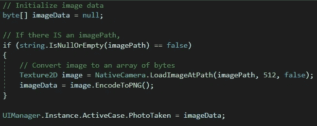
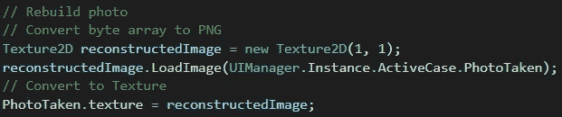

# 统一编码/解码图像

> 原文：<https://medium.com/nerd-for-tech/encoding-decoding-a-picture-in-unity-82af70b36853?source=collection_archive---------2----------------------->

**目的:**将一张图片拆分成字节数组，重新组装。

在昨天的文章中([https://lordkakabel . medium . com/taking-a-photo-in-unity-e 6e 3f 5328 da 6](https://lordkakabel.medium.com/taking-a-photo-in-unity-e6e3f5328da6))，我们允许用户用他们的设备拍照，我们将照片的路径存储在设备中。今天，我们将使用该路径，将照片分解成一个字节数组，然后重新组合成一张可以在我们的应用程序中显示的照片。

首先，我们将准备一个字节数组。如果我们有用户照片的路径，我们将把它存储为一个*纹理 2D* 。然后我们将*encode topping*将其存储在字节数组中。我们将把这个数组存储在我们的 *ActiveCase* 对象中，该对象由我们的 *UIManager* 的当前实例维护。

下面是一个例子，说明如果我们将编码图像保存在系统中，它会是什么样子:

我们照片的一小部分。dat 文件。

现在，我们必须颠倒这个过程来重新创建照片。我们将创建一个空的 *Texture2D* 来保存结果。然后我们将从 *ActiveCase* 对象中获取 *PhotoTaken* 字节数组，并使用 *LoadImage* 方法将数据分配给 *Texture2D* 。最后，我们将把 *Texture2D* 分配给我们的 *RawImage* 对象的 *texture* 属性。

这看起来是一个复杂的过程，但它只需要几行代码！