# 端到端数据分析项目:用 HarperDB 分析 Twitter 对 Taylor Swift 的反应(第 2 部分)

> 原文：<https://medium.com/nerd-for-tech/end-to-end-data-analysis-project-analyze-twitters-reaction-to-taylor-swift-with-harperdb-part-2-920e248075c7?source=collection_archive---------0----------------------->

数据可视化是通过图表、条形图、曲线图和信息等可视化形式表示复杂数据和关系的过程。这是一种更有效的交流数据发现的方式，因为它可以更容易地识别大量数据的模式、趋势和异常值。在本教程中，我们将重点关注从 HarperDB cloud 上托管的 12 万多个数据点的庞大数据库中创建漂亮的洞察驱动的可视化。

在本系列的前一次迭代中，我们执行了以下操作-

 [## 用 HarperDB 分析 Twitter 对泰勒斯威夫特的反应

### 端到端数据分析组合项目。

medium.com](/@aakriti.sharma18/analyze-twitters-reaction-to-taylor-swift-with-harperdb-6207a50aee5d) 

*   通过 Twint 从 Twitter 上搜集数据
*   对数据集执行了要素工程
*   利用 python 处理文本数据，如去除停用词、词条化和降噪
*   创建了一个 HarperDB 实例
*   建立云数据库并定义模式
*   将数据加载到云数据库

接下来，我们将通过安装驱动程序、配置数据源管理器、定位模式，然后通过信息图表执行分析，来关注将我们的云数据库连接到可视化软件。

# **安装驱动**

*   在这里从[下载并安装 ODBC 驱动。](https://studio.harperdb.io/resources/drivers)

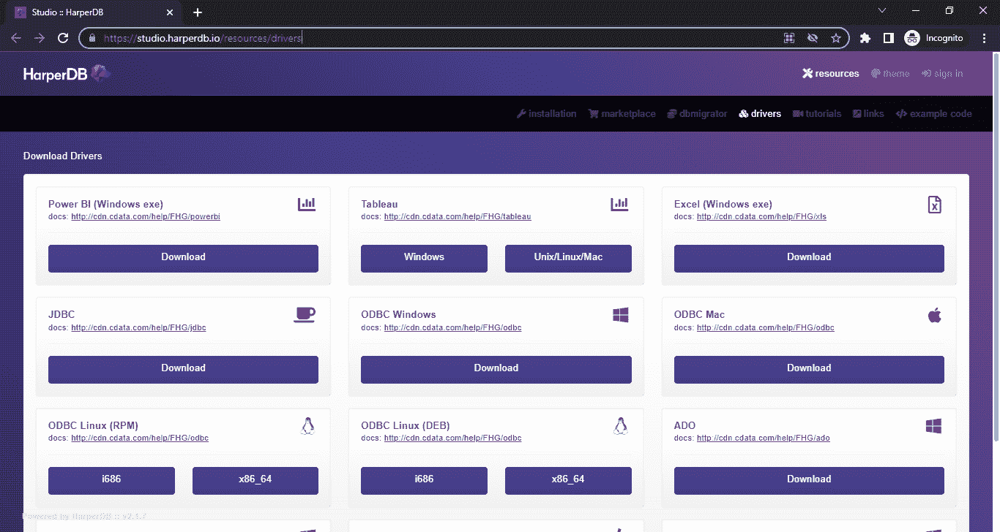

*   运行并安装。exe 文件已下载。

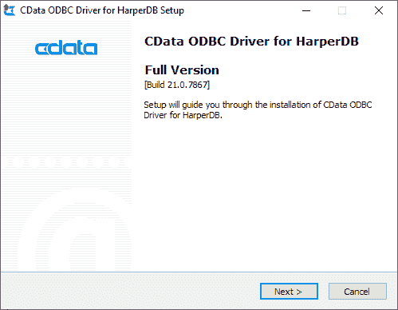

*   安装完成后，单击完成。

# **配置 DSN**

*   安装过程完成后，数据源管理器会自动启动，如果没有，您可以从搜索面板手动启动。

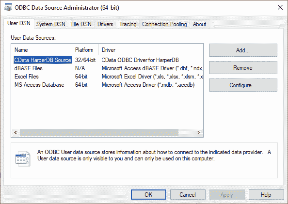

选择 CData HarperDB 信号源后，您将看到以下屏幕:

*   填写字段 Server(链接到您的实例)、User、Password(登录到实例的凭证)并单击 Test Connection。你应该得到这个-

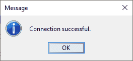

您与 HarperDB 实例的连接已成功建立。接下来，我们将通过可视化软件连接到它，并获取数据来创建仪表板。

# **连接到 Tableau 桌面**

*   启动 Tableau 桌面。转到“至服务器”部分下的*更多*，并通过 CData 搜索 **HarperDB。**

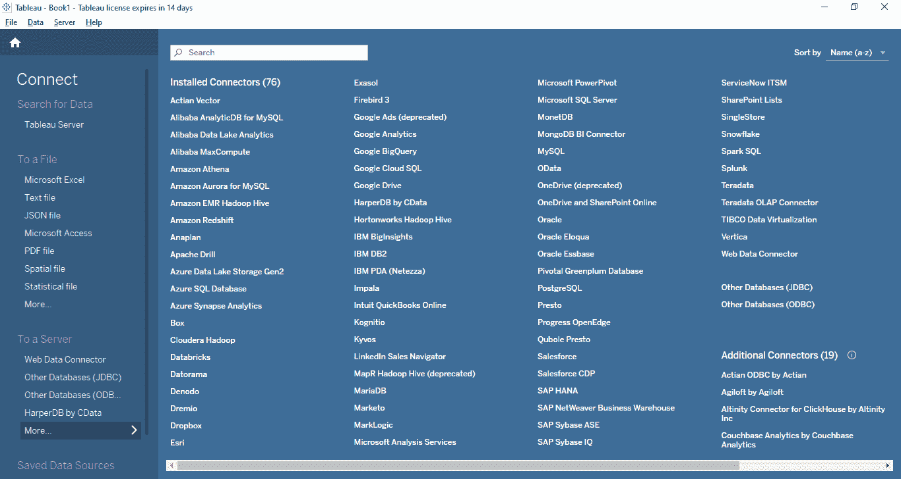

*   单击 HarperDB by CData，与云托管的 HarperDB 实例建立连接。

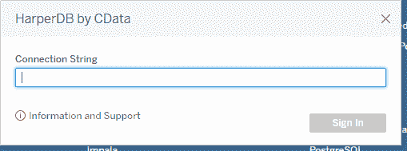

*   按照以下格式建立连接:

***Server= "链接到实例"；UseSSL = " TrueUser= "登录实例的用户名"；Password= "实例密码"；***

*   瞧啊。您已连接到托管数据库！您的屏幕应该类似如下:

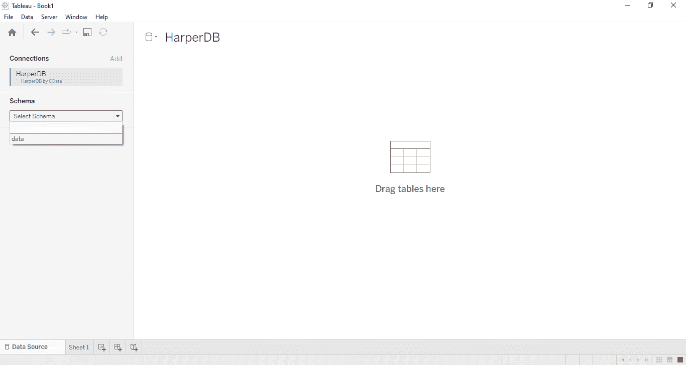

*   从*选择模式*下拉列表中，选择您在向实例添加数据之前定义的模式。在我的例子中，它被命名为*数据*。

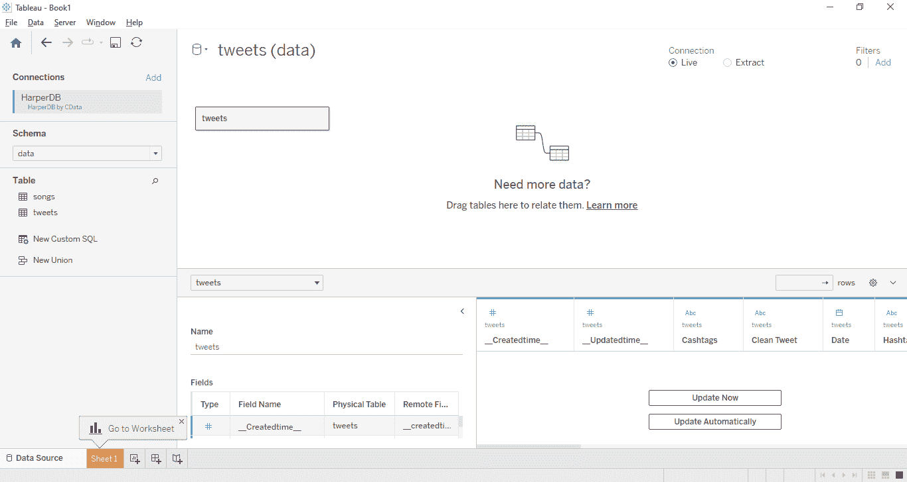

*   在*表格*部分下面的一个表格列表将是可见的，拖动你想要可视化的表格。我将从存储在名为 *tweets 的表中的数据开始。*通过点击右上角的单选按钮*提取*，您可以选择是否希望数据保持静态并存储在您的本地设备中。我选择保持连接*活动*，这样所有更新的数据都会动态地反映在仪表板上。

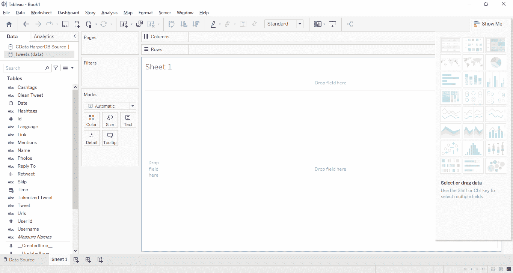

# **创建仪表板**

仪表板创建是一个多流程步骤，首先是浏览数据、决定调色板、创建视觉效果、格式化标签和工具提示以实现一致性，然后创建一个基本布局或模板，在其上放置所有图表和 KPI 元素。使模板与模板相匹配并与数据的主题产生共鸣有助于将所有数据结合在一起，同时保持美观的组合。

**探索数据**

在探索中，我们注意到以下特征，这些特征在创建仪表板以表示数据的完整故事时将是不朽的

标签——推文中使用的标签

ID-数据集的主键

语言——推文的语言

姓名—发推文的帐户名称

照片——推文中所附照片的网址

Retweet —布尔标志，表示推文是否被转发

时间——推文的时间

日期——推文的日期

推文—推文的文本

干净的推文——删除网址、提及、标签、标点符号和停用词后的推文

令牌化推文—干净推文的令牌化形式

用户名——推文作者的用户名

点赞数——推文中的点赞数

回复计数——推文中的回复数量

转发次数——推文的转发次数

视频——推文附带的视频

**决定调色板**

由于数据围绕着泰勒·斯威夫特和她的粉丝的反应，所以创建一个泰勒·斯威夫特主题的仪表板是正确的。对于本教程，我将继续使用她 2019 年专辑*的调色板。*

创造视觉效果

*   **非英语使用者分布**

创建一个图表，探索谈论美国歌手而不是她所在国家的不同地理位置，有助于了解粉丝群的多样性。

为了创建这样的图表，将*语言*拖到行架上，将*推文(数据)计数*拖到列架上。你会看到一个条形图。将 *tweets ( data ) Count* 拖到 marks shelf，并将其角色从 detail 更改为 color。编辑颜色为紫色。

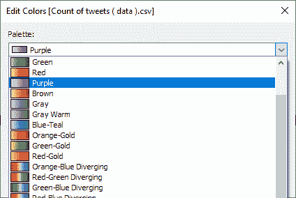

你的图表应该看起来像这样-

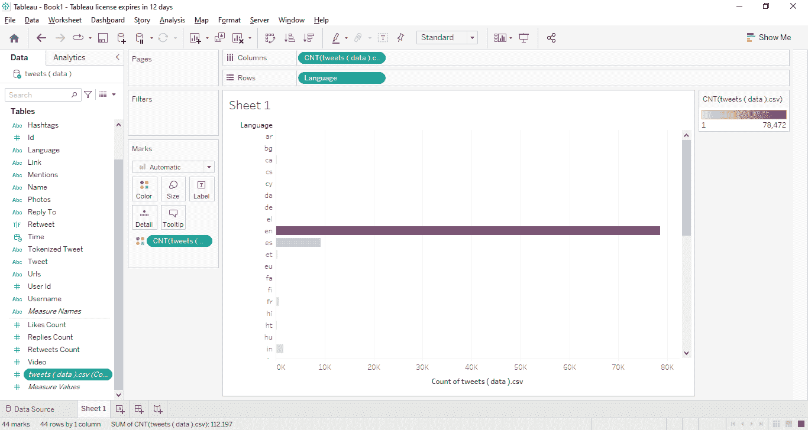

对于非英语，我们将通过右键单击并选择 exclude 来排除行名 *en* 。从“演示”部分选择树形图。

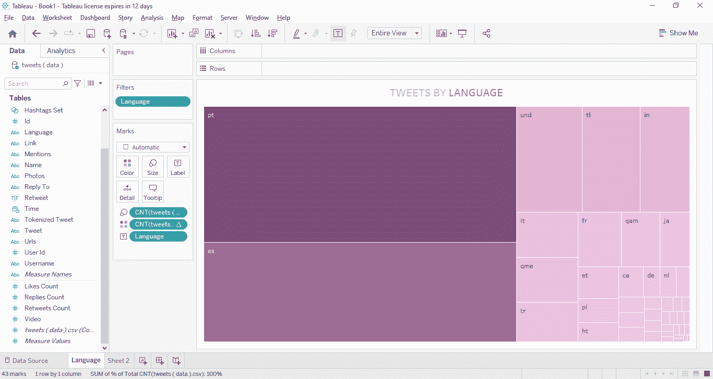

我们已经准备好了仪表板的第一个组件！您可以通过添加标签来增加信息..我加上了总数的百分比-

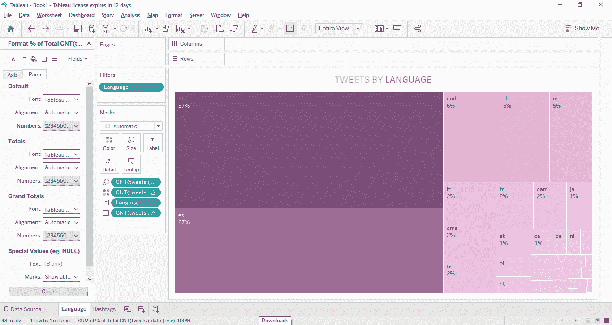

*   **十大标签**

为此，我们首先根据计数创建一组前 10 个标签。转到字段>创建>设置。

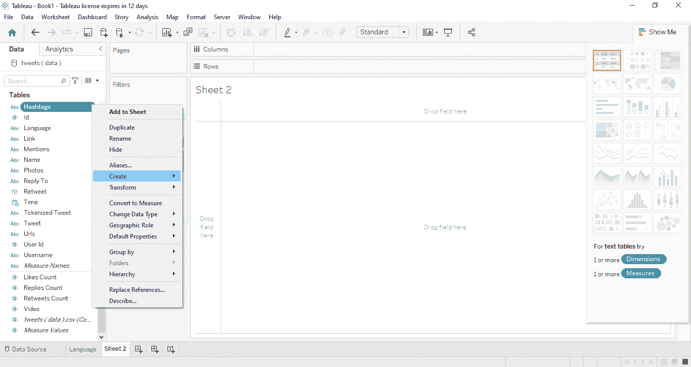

对于集合规格，首先通过从值列表中取消选中来排除空标签列表:

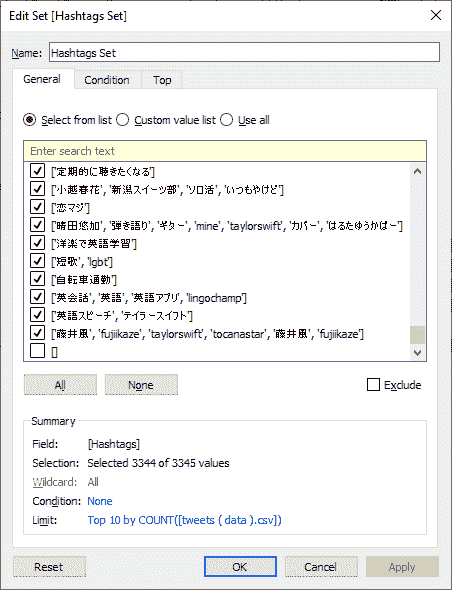

接下来转到顶部，添加以下参数-

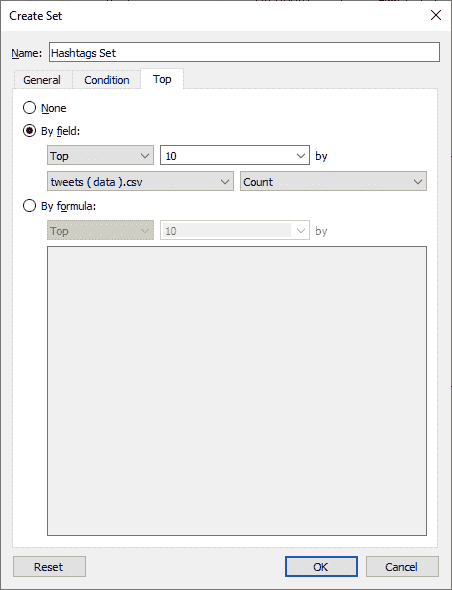

按 OK 并将其拖动到行货架，计数到列货架。我们将为这个可视化选择一个简单的条形图。

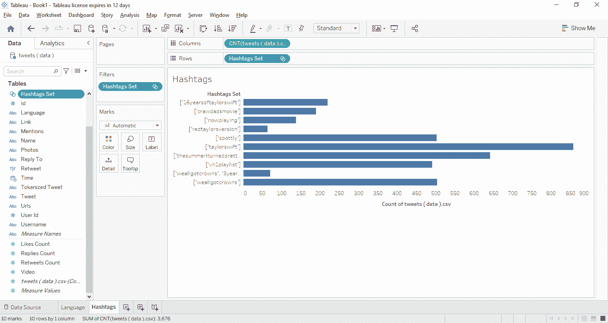

为了使图表在视觉上更具吸引力，我们将把视图从标准视图改为完整视图。接下来，将颜色编辑为紫色，并按降序对值进行排序。为了添加更多的信息，我们可以在标记卡中添加每个标签的计数。你的图表看起来会像这样-

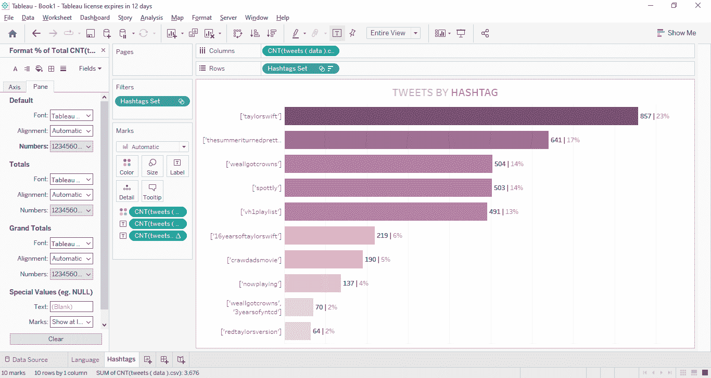

*   **推文按小时分布**

为此，我们将*时间*列拖至列架，计数至行架，并选择离散线作为可视化类型。

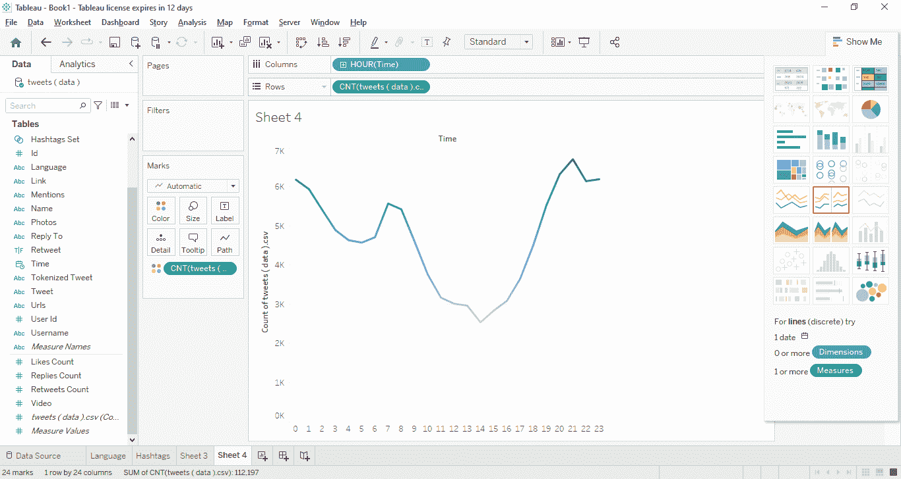

为了进一步美化它，我们增加了线条的宽度，将调色板更改为我们想要的紫色，并编辑轴来创建一个这样的图表-

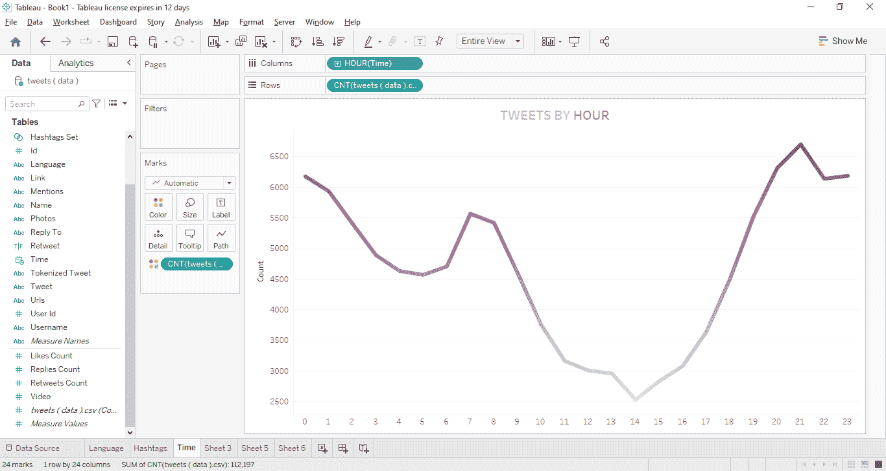

第三张图下来了！接下来，我们来看一下关键绩效指标。

*   **推文总数**

对于此 KPI，我们将 *C* 数量拖到*文本*卡片上方的标记架上。我们可以简单地编辑标记卡中的标题和标签，以创建一个与仪表板美观一致的漂亮 KPI。

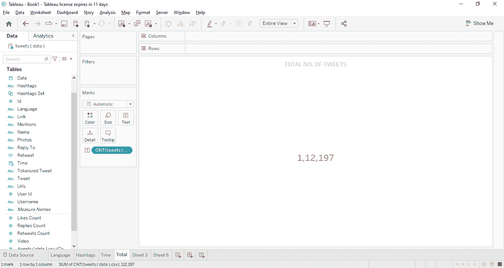

*   **平均喜欢数**

接下来，我们将*喜欢数*拖到*文本*卡片上方的标记架上。现在点击它旁边的向下箭头按钮，将*测量值*从默认的*总和*更改为*平均值*。

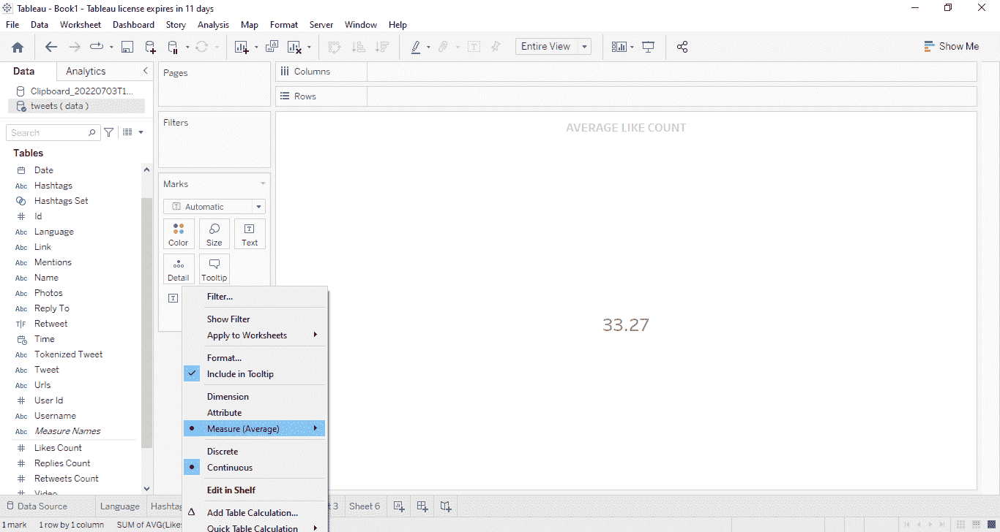

接下来，格式化该字段以仅显示四舍五入的整数，并格式化其他字段以创建类似于以下内容的内容:

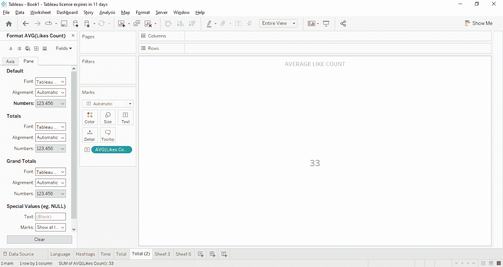

*   **涉及的独特账户总数**

最后，我们将*用户名*拖到*文本*卡片上方的标记架上。点击旁边的向下箭头按钮，将*测量值*从默认的*总和*更改为*计数(不同)*。按照与前两个类似的方式编辑格式，我们将得到第三个也是最后一个 KPI。

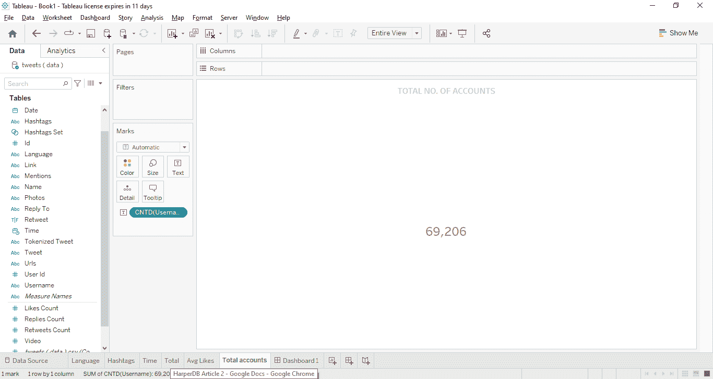

## **格式化**

转到顶部导航栏中的格式>工作簿，编辑默认字体/颜色的组合。以下是我用过的:

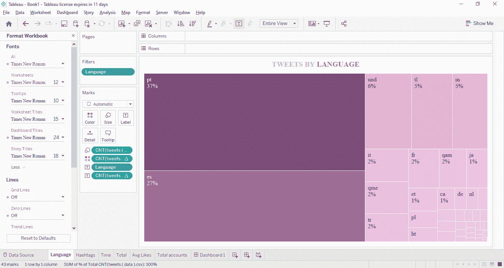

此外，我还喜欢将工作表的背景保持为空白，这样它们就可以与仪表板模板完美融合。你可以在每个工作表的阴影部分选择*无*来完成。

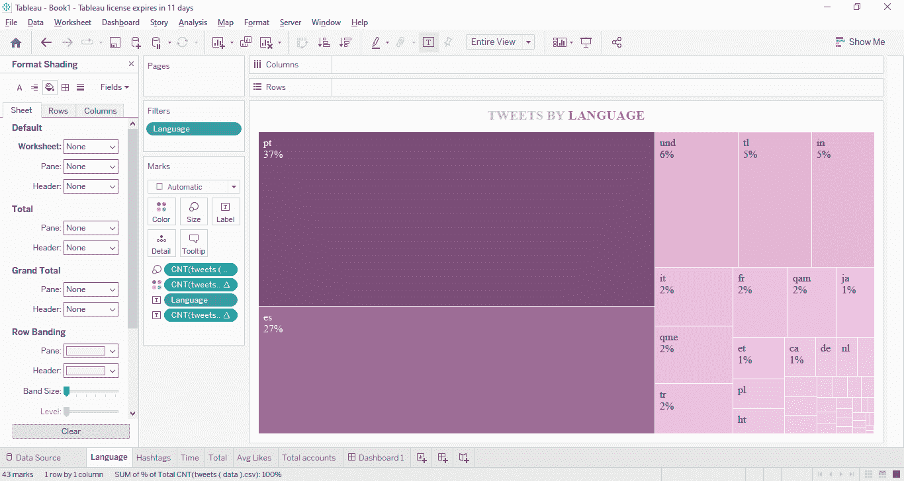

## 模板

虽然不是强制性的，但建议设计一个带有背景模板的仪表板。任何像 Figma/Canva 这样的工具都可以用来创建一个快速的背景模板，丰富仪表板的可视化组件。对于这个仪表板，你可以使用我设计的[或者自己做一个。](https://www.canva.com/design/DAFFQf_IQ9E/MKww0d9_vkuvuSGVBZeUEg/view?utm_content=DAFFQf_IQ9E&utm_campaign=designshare&utm_medium=link2&utm_source=sharebutton)

## 组装仪表板

创建新的仪表板，并按照以下方式编辑其大小，使其与模板的大小相匹配:

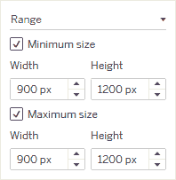

接下来拖动一个*图像*对象并选择你下载的模板。正确调整后，将对齐方式从平铺改为浮动。开始一个接一个地拖动图表和 KPI，并调整它们的大小。最后，拖动文本对象将标题添加到您的仪表板。转到电话布局部分并删除它，因为当在电话上打开时，模板仪表板会变形并失去对齐。

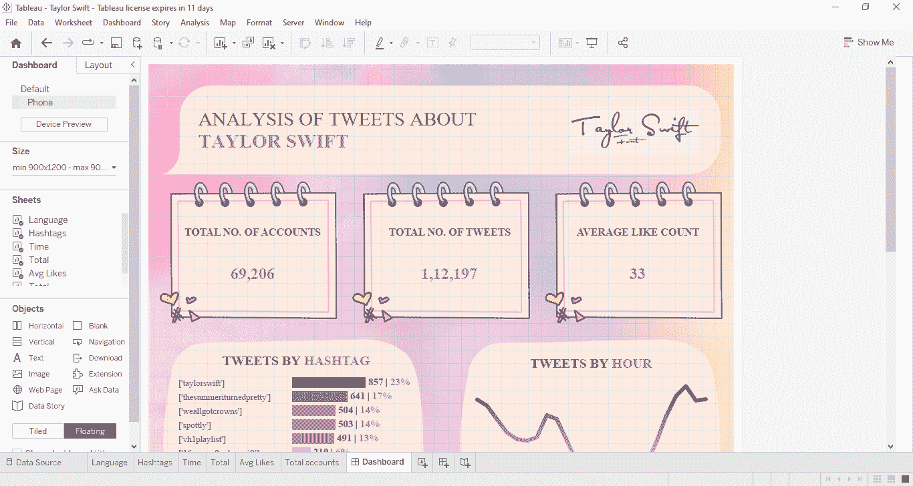

然后，您可以通过“服务器”>“Tableau 公共”>“保存到 Tableau 公共”将其发布到您的 Tableau 公共个人资料上。

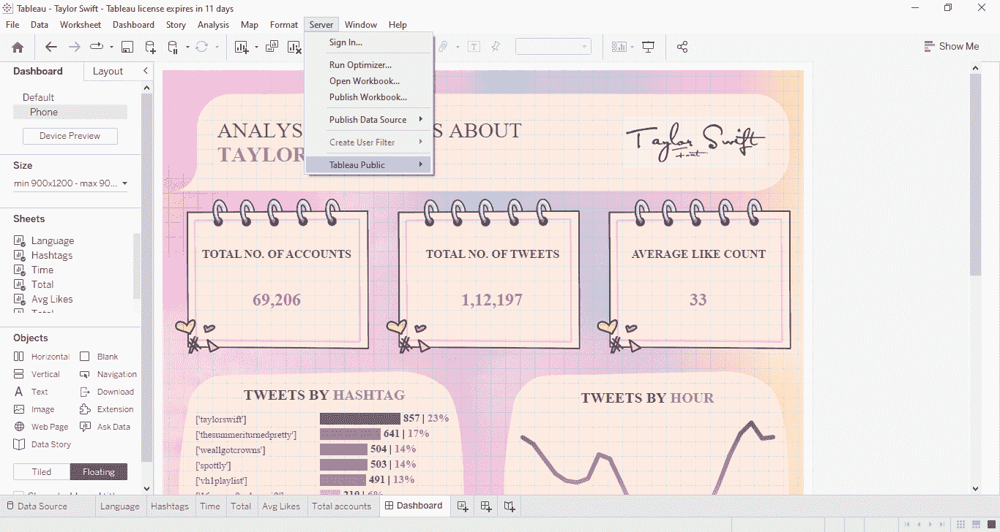

下面是[矿](https://public.tableau.com/views/TaylorSwift_16568643464880/Dashboard?:language=en-US&publish=yes&:display_count=n&:origin=viz_share_link)的样子:

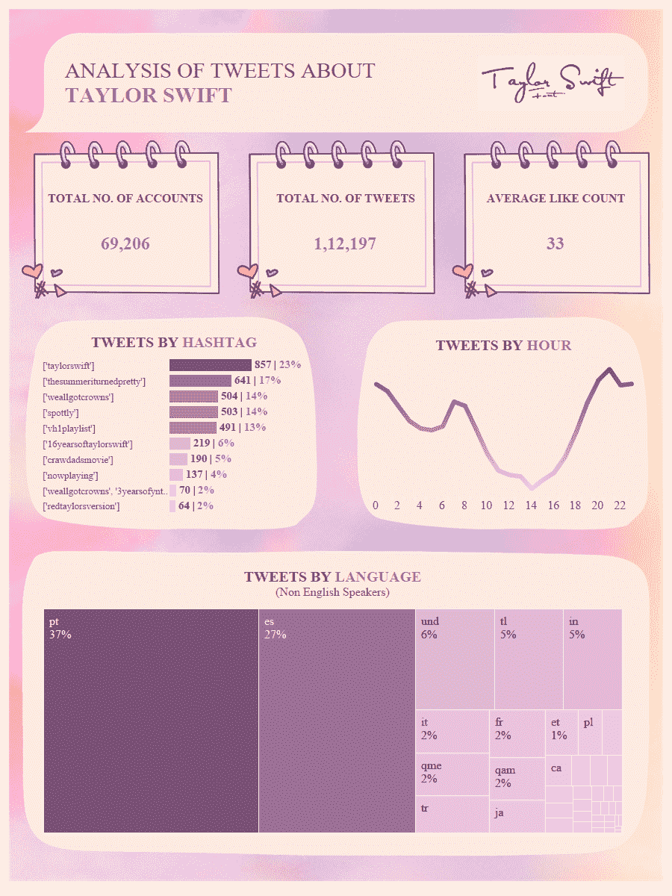

恭喜你！您已经到达本教程的结尾。在这些系列中，我们创建了一个端到端数据分析项目，帮助我们学习各种概念，如:

*   抓取数据
*   文本预处理
*   利用云数据库
*   提取数据
*   将托管数据连接到本地工具
*   从头开始创建仪表板

这次到此为止。另一边见！