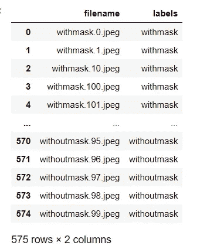
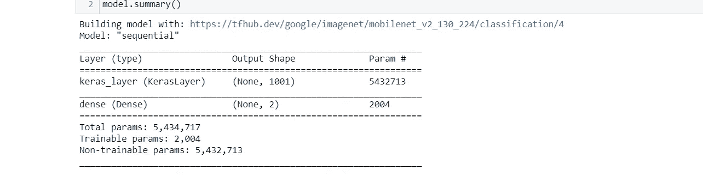
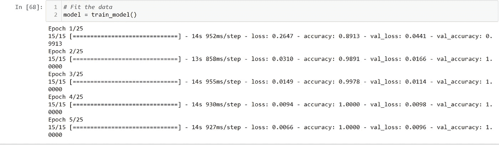
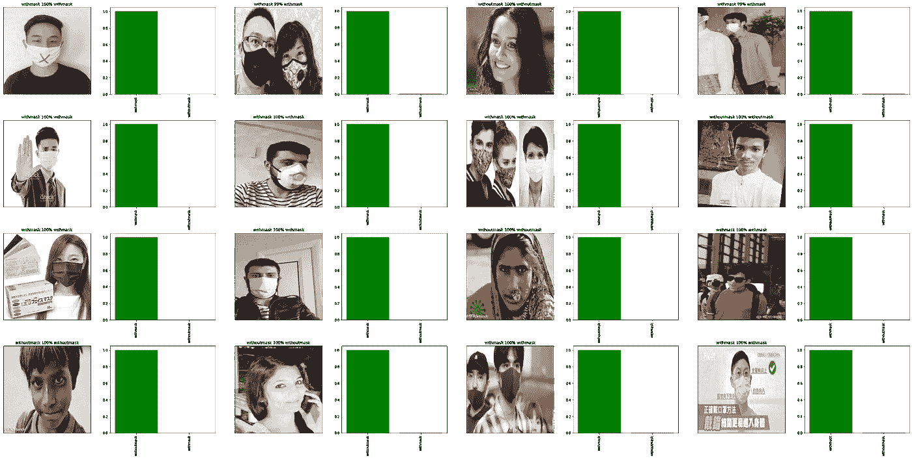
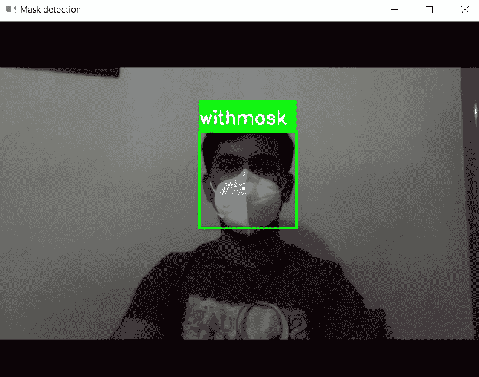

# 端到端屏蔽检测

> 原文：<https://medium.com/nerd-for-tech/end-to-end-mask-detection-24fb44a52523?source=collection_archive---------1----------------------->


亚当·尼西奥鲁克在 [Unsplash](https://unsplash.com?utm_source=medium&utm_medium=referral) 上拍摄的照片

首先，什么是端到端？

机器学习/数据科学家中的端到端解决方案是一个涵盖数据收集以构建模型并在现实生活中使用它的过程。

更多端到端阅读阅读这个惊人的博客

[](https://eugeneyan.com/writing/end-to-end-data-science/) [## 不受欢迎的观点-数据科学家应该更加端到端

### 最近，我在 Reddit 上看到一个关于数据科学和机器学习中不同角色的帖子:数据科学家…

eugeneyan.com](https://eugeneyan.com/writing/end-to-end-data-science/) 

目录

1.  收集数据
2.  数据预处理
3.  可视化数据
4.  建立模型
5.  火车模型
6.  评估训练模型
7.  保存已训练的模型
8.  根据自定义数据进行预测
9.  实时检测

# 1.收集数据

在每一个机器学习中，问题数据都很重要。但更重要的是它的形式是正确的。

这里，数据是从 [Kaggle](https://www.kaggle.com/andrewmvd/face-mask-detection) 收集的。

数据是这个数据集的子集，你可以从[这里](https://drive.google.com/drive/folders/1n8AXQ8wEKWH6nx8Vz-dxLbPQzz5qerPq?usp=sharing)下载

# 2.数据预处理

在我们处理数据之前，让我们用正确的名称将数据组织在正确的文件夹中。

为此，我们有两种选择:

*   使用 tensor flow[image _ dataset _ from _ directory](https://www.tensorflow.org/api_docs/python/tf/keras/preprocessing/image_dataset_from_directory)。
*   加载 CSV 文件。

这里我们选择从 CSV 文件加载

在这个数据集中，不包括 CSV 文件，所以我们必须通过图像数据生成。

为此，我们将图像名称改为带掩码和不带掩码。

用于带掩码

```
# importing os module 
import os 

# Function to rename multiple files 
def main():
    for count, filename in enumerate(os.listdir("DATASET/")):
        dst ="withmask." + str(count) + ".jpeg"
        src ='DATASET/'+ filename 
        dst ='DATASET/'+ dst 
        # rename() function will
        # rename all the files 
        os.rename(src, dst) 

# Driver Code 
if __name__ == '__main__':
    # Calling main() function 
    main()
```

因为没有面具

```
# importing os module 
import os 

# Function to rename multiple files 
def main():
    for count, filename in enumerate(os.listdir("New folder/")):
        dst ="withoutmask." + str(count) + ".jpeg"
        src ='New folder/'+ filename 
        dst ='New folder/'+ dst 
        # rename() function will
        # rename all the files 
        os.rename(src, dst) 

# Driver Code 
if __name__ == '__main__':
    # Calling main() function 
    main()
```

现在将所有生成的图像移动到一个文件夹中，然后创建一个熊猫数据框

```
import pandas as pd
filenames=os.listdir("FULL_DATA/")
categories=[]
for f_name in filenames:
    category=f_name.split('.')[0]
    if category=='withmask':
        categories.append('withmask')
    else:
        categories.append('withoutmask')
df=pd.DataFrame({
    'filename':filenames,
    'labels':categories
})
```



数据帧

将数据帧保存到 CSV 文件中。

**现在数据结构正确，我们可以加载数据了**

*   读取 CSV 文件

```
# Import pandasimport pandas as pdlabels_csv = pd.read_csv("PATH TO CSV FILE")
```

*   准备标签

```
import numpy as nplabels = labels_csv["labels"].to_numpy()labels
```

*   将标签转换成布尔数组

```
# Find the unique label valuesunique_category = np.unique(labels)len(unique_category)boolean_labels = [label == unique_category for label in labels]
```

*   使用 **train_test_split** 创建验证集

```
# Setup X & y variablesX = filenamesy = boolean_labels# Let's split datafrom sklearn.model_selection import train_test_split# Into train and validX_train, X_val, y_train, y_val = train_test_split(X, y, test_size=0.2, random_state=2509)len(X_train), len(X_val), len(y_train), len(y_val)
```

*   将图像转换成张量

```
# Define image size
IMG_SIZE = 224

# Function
def process_image(image_path, image_size=IMG_SIZE):
  """
  Takes an image file path and turns the image into a Tensor.
  """
  # Read in an image file
  image = tf.io.read_file(image_path)
  # Turn the jpg image into numerical Tensor with 3 colour     #channel(RGB)

  image = tf.image.decode_jpeg(image,channels=3)
  # Convert the color channel values to (0-1) values
  image = tf.image.convert_image_dtype(image,tf.float32)
  # Resize the image to (224,224)
  image = tf.image.resize(image, size=[image_size,image_size])

  return image
```

*   将数据批量化

```
# Create a function to return a tuple (image, label)
def get_image_lable(image_path,label):
  """
  Takes an image file path name and the label,
  processes the image and return a tuple (image, label).
  """
  image = process_image(image_path)

  return image, label# Define the batch size
BATCH_SIZE = 32

# Function to convert data into batches
def create_data_batches(X,y=None, batch_size=BATCH_SIZE,valid_data=False):
  """
  Creates batches of data of image (X) and label (y) pairs.
  Shuffle the data if it's training data but doesn't shuffle if it's validation data.
  """
  # If data is valid dataset (NO SHUFFLE)
  if valid_data:
    print("Creating valid data batches.........")
    data = tf.data.Dataset.from_tensor_slices((tf.constant(X),
                                               tf.constant(y)))
    data_batch = data.map(get_image_lable).batch(batch_size)
    return data_batch

  else:
    print("Creating train data batches.........")
    # Turn filepaths and labels into Tensors
    data = tf.data.Dataset.from_tensor_slices((tf.constant(X),
                                               tf.constant(y)))
    # Shuffling pathname and labels before mapping image processor fun
    data = data.shuffle(buffer_size=len(X))
    data_batch = data.map(get_image_lable).batch(batch_size)

    return data_batch
```

# 3.可视化数据

```
import matplotlib.pyplot as plt
# Create fun for viewing in a data batch
def show_images(images, labels):
  """
  Displays a plot of 25 images and their labels from a data batch.
  """
  plt.figure(figsize=(20, 20))
  for i in range(25):
    # Subplot
    ax = plt.subplot(5,5,i+1)
    plt.imshow(images[i])
    plt.title(unique_category[labels[i].argmax()])
    plt.axis("Off")
```

调用这个函数

*   对于训练数据

```
train_images, train_labels = next(train_data.as_numpy_iterator())
show_images(train_images,train_labels)
```

*   对于有效数据

```
val_images, val_labels = next(val_data.as_numpy_iterator())
show_images(val_images, val_labels)
```

# 4.建立模型

在这里，我们可以将 TensorFlow hub 用于预训练模型。

对于此任务，我们使用小型型号的 [MobileNet V2](https://tfhub.dev/google/imagenet/mobilenet_v2_130_224/classification/4) 。

1.  Set input_shape = [none，224，224，3]
2.  设置输出形状= 2
3.  使用 tf.keras 中的顺序模型
4.  使用 model.build(input_shape)

```
# Create a fun to build a keras model
def create_model(input_shape=INPUT_SHAPE,output_shape=OUTPUT_SHAPE, model_url=MODEL_URL):
  print("Building model with:", model_url)

  # Setup the model
  model = tf.keras.Sequential([
                               hub.KerasLayer(model_url),
                               tf.keras.layers.Dense(units=output_shape, 
                                                     activation="softmax")
  ])

  # Compile the model
  model.compile(
      loss = tf.keras.losses.BinaryCrossentropy(),
      optimizer = tf.keras.optimizers.Adam(),
      metrics = ["accuracy"]
  )

  # Build the model
  model.build(input_shape)

  return modelmodel = create_model()
model.summary()
```



模型 _ 摘要

# 5.训练模特

根据 25 个时期的 train_data 和 valid_data 训练模型

另外，添加一个[提前停止回调](https://www.tensorflow.org/api_docs/python/tf/keras/callbacks/EarlyStopping)

```
Model.fit(x=train_data,
          epochs=25,
          validation_data=val_data,
          callback=[early_stopping])
```



训练模型

有了这个模型，val_loss 是 ***0.0096*** 而准确度几乎是 ***99.99 %***

# 6.评估预测

对 val_data 模型使用 model.predict()返回 shape (_，2)的 NumPy 数组



有效数据的预测图像

# 7.保存并重新加载已训练模型

使用 keras 中的 save_model 保存训练好的模型。

加载模型与常规的 load_model 有点不同

这里我们要提供***custom _ objects = { " KerasLayer ":hub。模型路径旁加载模型函数中的*** 。

```
model = load_model(
    'model/model.h5', custom_objects={"KerasLayer": hub.KerasLayer})
```

# 8.根据自定义数据进行预测

在预测新数据之前，请确保它的形状和大小都正确。

```
def test_data(path):
  demo = imread(path)
  demo = tf.image.convert_image_dtype(demo,tf.float32)
  demo = tf.image.resize(demo,size=[224,224])
  demo = np.expand_dims(demo,axis=0)

  pred = model.predict(demo)
  result = unique_category[np.argmax(pred)]

  return result
```

# 9.实时检测

在这种情况下，我们可以使用 OpenCV 的预训练模型进行实时检测。



带面具

1.  导入库
2.  使用 load_model()加载模型确保使用 ***custom_objects。***
3.  使用 cv2 的网络摄像头。视频捕获()
4.  使用[Haar scade _ front alface](https://github.com/opencv/opencv/blob/master/data/haarcascades/haarcascade_frontalface_default.xml)XML 文件进行人脸检测。
5.  使用加载的模型进行预测。

你可以在这里找到代码回购

[](https://github.com/Vivek2509/End-to-end-mask-detector) [## vivek 2509/端到端面罩检测器

### 为面具检测构建深度学习模型 GitHub 是超过 5000 万开发人员的家园，他们一起工作来托管和…

github.com](https://github.com/Vivek2509/End-to-end-mask-detector) 

嘿，读者们，感谢你们的时间。如果你喜欢这个博客，别忘了鼓掌欣赏它👏。

更多关于机器学习和数据科学的博客请关注我。

动手机器学习项目参考如下

[](https://vivek2509.github.io/World_of_ML/) [## ML 的世界

### 为了让世界变得更美好，明智地使用数据和机器。

vivek2509.github.io](https://vivek2509.github.io/World_of_ML/)