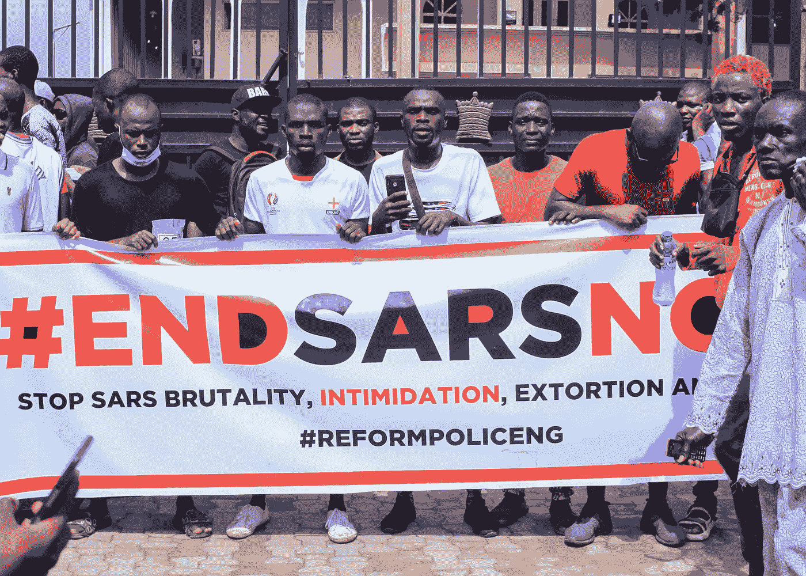
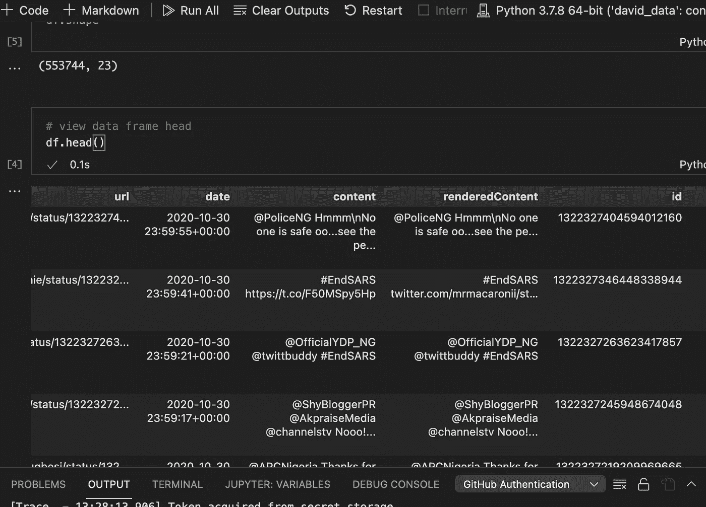
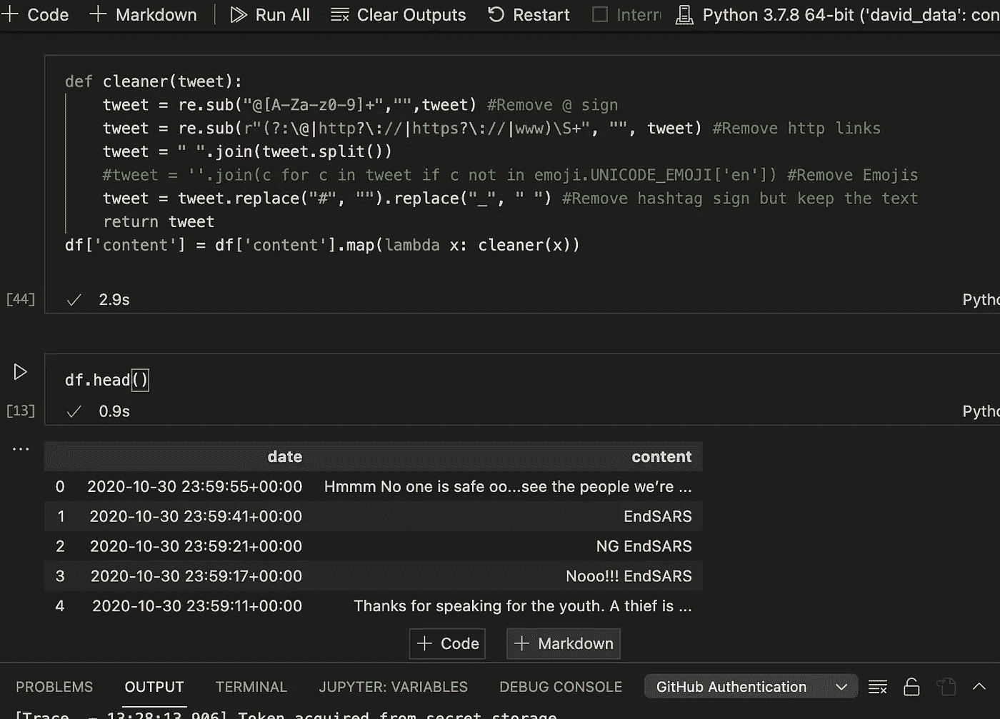
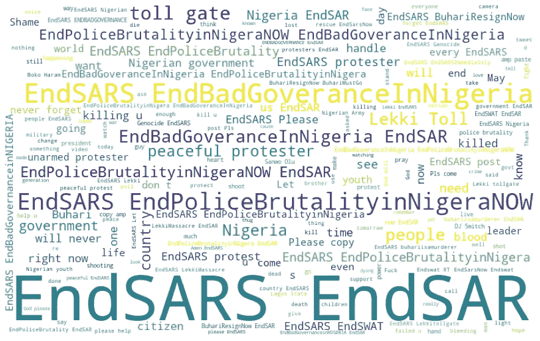
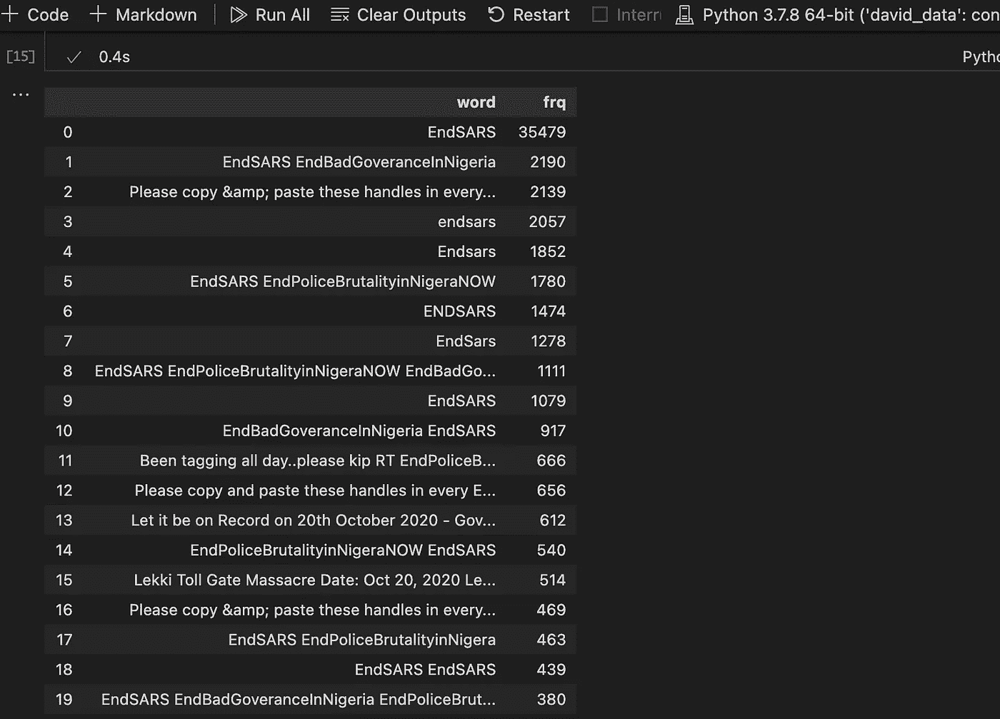
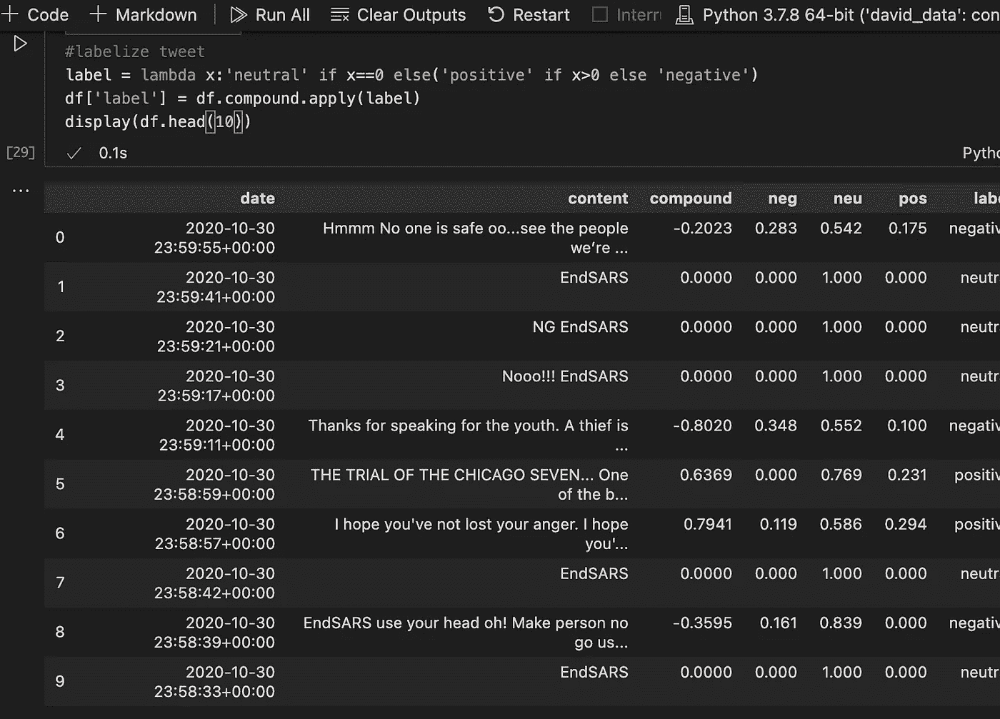
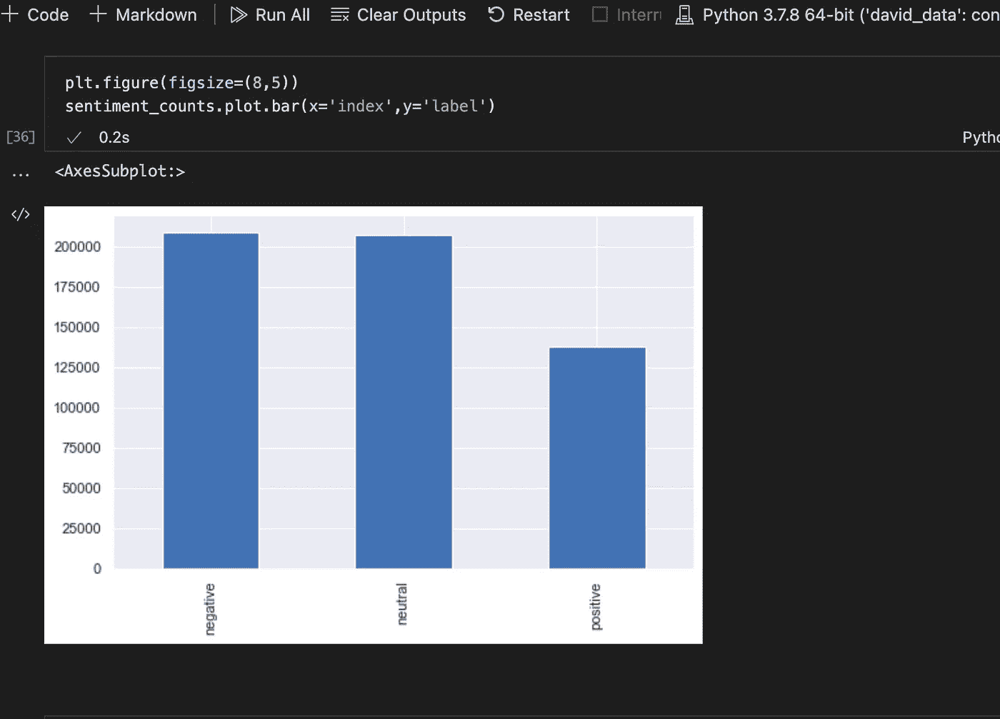

# #ENDSARS 抗议推文分析

> 原文：<https://medium.com/nerd-for-tech/endsars-protest-tweets-analysis-57f87bf7e0d7?source=collection_archive---------11----------------------->

鸢·奥辛奈克在 [Unsplash](https://unsplash.com/s/photos/nigeria-flang?utm_source=unsplash&utm_medium=referral&utm_content=creditCopyText) 上的照片

2020 年 10 月 8 日，尼日利亚爆发了一场针对反抢劫特警队的全国性抗议活动。这是在数周的愤怒和愤怒之后开始的，视频和图片显示了警察在全国不同地区的暴行。#ENDSARS 运动最初是一场由 Twitter 用户主导的社交媒体运动，后来发展成为一场全面的街头抗议，随后被暴徒劫持，随后被军事行动搁置。

就我个人而言，我有兴趣从探索的角度分析推文，并对推文进行情感分析，因此有了这个项目。这种分析纯粹是学术性的，与政治无关。

这个项目的数据是使用 SNSCRAPE python 库从 Twitter 上搜集的。感谢马丁·贝克的指导。你可以在这里查看。

抓取的数据是从 2020 年 10 月 20 日到 2020 年 10 月 30 日。总共有 553744 条独特的推文被用于分析。

数据帧和行数的图像

对于我的分析，我从数据框中提取了相关的列，即日期和 tweet 列。然后编写一个函数来清除数据中不相关的字符。请看下面的函数图像和清理后的 tweets 数据。

## **推特的文字云**

这些推文创造了一个词云。特定单词在文本中出现得越多，该单词在单词云中的位置就会越大、越粗。

WordCloud

从上面的图片中，我们可以看到一些单词和句子不断出现，这让我们了解了人们在推特上发布#ENDSARS 时真正想要的是什么。快速浏览一下单词 cloud，你会发现像 EndSars，EndPoliceBrutalityInNigeria，EndBadGovernanceInNigeria，和平抗议者这样的短语被频繁使用，这显示了整个运动的内容。所有推文中使用频率最高的 20 个词也支持了这一事实。

## 情感分析

Vader 情绪强度分析器用于获取推文的情绪，并为每条推文添加“负面”、“正面”、“中性”标签。

正如所料，如下图所示，负面推文多于正面推文。

这一分析是出于好奇，想知道社会对 endsars 抗议的看法是否与自抗议开始以来 Twitter 上实际发布的内容相符。我希望你和我一样觉得这篇文章很有见地。要了解全部细节，请查看我的 git hub 库[这里](https://github.com/uforodavid/EndSars_Analysis)。

谢谢你。