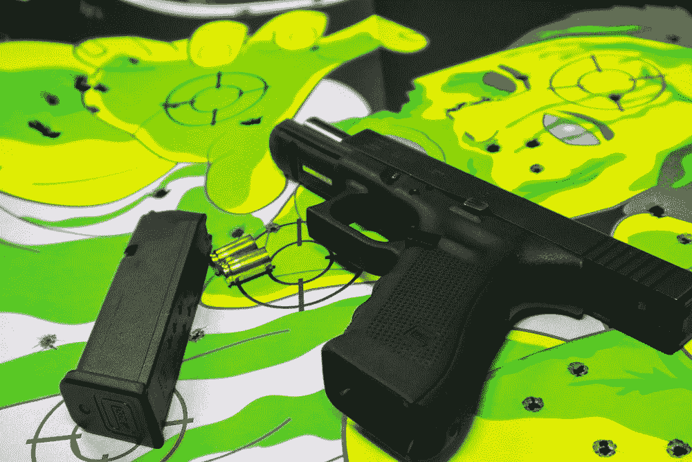
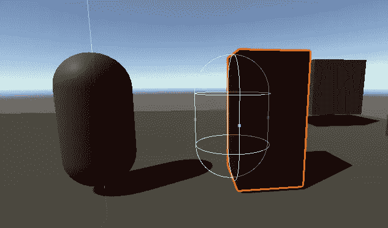
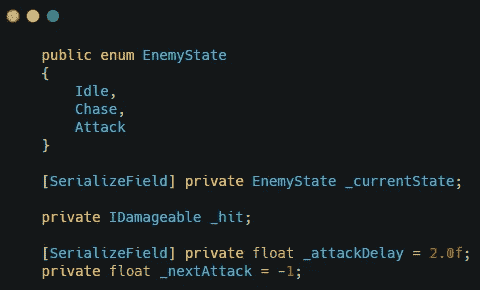
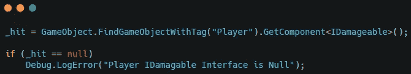
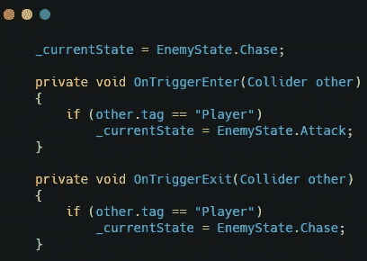
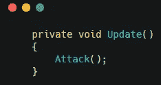
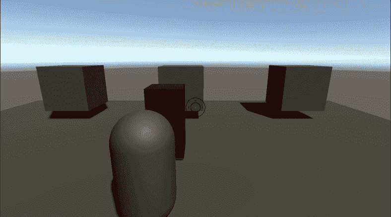

# 在 Unity 中使用状态机的敌人攻击系统

> 原文：<https://medium.com/nerd-for-tech/enemy-attack-system-using-a-state-machine-in-unity-ae1477d964cd?source=collection_archive---------2----------------------->

我一直在做一个第三人称僵尸生存游戏。我已经添加了敌人的健康系统，所以现在我将添加敌人的攻击系统。

第一步，给敌人再加一个对撞机。这个对撞机会在敌人的前方，充当敌人攻击的命中范围。

在敌方脚本中，您需要添加几个变量。首先要添加的是 enum，为敌人的行为创建一个状态机。您将需要一个用于播放器的 IDamagable 接口的变量。最后要添加的变量是攻击延迟和下一次攻击变量，以增加敌人攻击之间的时间。

确保在 start 方法中获取对播放器的 IDamageable 接口的引用。

使用 OnTrigger 方法你可以决定敌人应该处于什么状态。当玩家进入碰撞器时，敌对状态应该切换到攻击，当玩家离开碰撞器时，敌对状态应该切换到追逐。您还将在 start 方法中设置敌人状态。

现在创建一个方法来保存敌人在每个状态下应该做什么的逻辑。如果敌人处于追击状态，调用敌人移动法。如果敌人处于攻击状态，使用延迟确保攻击准备好，并调用玩家的伤害方法，然后重置攻击延迟。

现在调用 update 方法中的方法，攻击系统就建立起来了。

现在敌人可以追逐和攻击玩家了。

注意:当敌人停在玩家附近时，敌人正在攻击